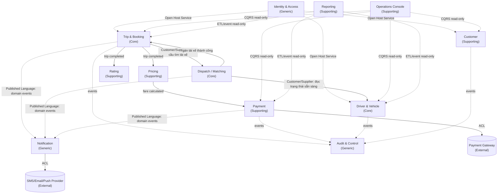

# Đặc tả Domain-Driven Design — CAB System

> Tài liệu này là phần bổ sung cho SRS gốc (`23640801_NguyenVanSang_capsystem`), phân rã hệ thống thành các **Bounded Context** theo nguyên tắc **high cohesion – low coupling**, làm cơ sở thiết kế kiến trúc microservice/module hóa cho CAB System.

---

## 1. Tổng quan phân loại Subdomain

| Loại subdomain | Bounded Context | Lý do phân loại |
|---|---|---|
| **Core** | Trip & Booking | Sở hữu aggregate trung tâm — toàn bộ vòng đời chuyến đi |
| **Core** | Dispatch / Matching | Thuật toán tìm & ưu tiên tài xế — lợi thế cạnh tranh chính (BR-05, BR-06) |
| **Core** | Driver & Vehicle | Dữ liệu tài xế/xe sẵn sàng phục vụ matching thời gian thực |
| **Supporting** | Customer | Hồ sơ khách hàng, không tạo khác biệt cạnh tranh |
| **Supporting** | Pricing | Tính cước — có thể thay đổi policy độc lập |
| **Supporting** | Payment | Thanh toán, tích hợp cổng bên ngoài |
| **Supporting** | Rating | Đánh giá sau chuyến |
| **Supporting** | Operations Console | Giám sát vận hành thời gian thực (read-model) |
| **Supporting** | Reporting | Dashboard & báo cáo tổng hợp (read-model theo kỳ) |
| **Generic** | Identity & Access | Xác thực/phân quyền — năng lực chuẩn |
| **Generic** | Notification | Gửi thông báo đa kênh — năng lực chuẩn |
| **Generic** | Audit & Control | Ghi vết thao tác — năng lực chuẩn |

---

## 2. Context Map



**Ghi chú quan hệ:**
- **Open Host Service**: Identity & Access cung cấp API xác thực chuẩn cho mọi context khác gọi vào — không context nào tự implement lại việc xác thực.
- **Customer/Supplier**: Trip & Booking là *upstream* của Dispatch (Dispatch phải phục vụ nhu cầu của Trip); Dispatch là *upstream* của Driver & Vehicle (chỉ đọc, không sửa dữ liệu Driver).
- **Published Language**: Notification và Audit không phụ thuộc trực tiếp vào mô hình nội bộ của Trip/Dispatch/Payment mà chỉ lắng nghe một tập **domain event** đã chuẩn hóa.
- **ACL (Anti-Corruption Layer)**: Payment Context và Notification Context bọc các hệ thống ngoài (Payment Gateway, nhà cung cấp SMS/Email/Push) để mô hình nội bộ không bị "nhiễm" bởi API của bên thứ ba.
- **CQRS read-only**: Operations Console và Reporting không sở hữu dữ liệu, chỉ là hình chiếu (projection) từ các context nghiệp vụ.

---

## 3. Đặc tả chi tiết từng Bounded Context

### 3.1 Trip & Booking Context *(Core)*

**Trách nhiệm:** Quản lý toàn bộ vòng đời một chuyến đi, từ khi khách hàng gửi yêu cầu đến khi hoàn thành/hủy.
**FR/UC liên quan:** FR-05, FR-07 · UC-08, UC-11, UC-12, UC-18

| Thành phần | Nội dung |
|---|---|
| **Aggregate Root** | `Trip` |
| **Entities** | `TripStatusHistory` |
| **Value Objects** | `PickupLocation`, `DropoffLocation`, `VehicleTypeOption`, `CancellationPolicy` |
| **Domain Events (phát ra)** | `TripRequested`, `TripSearchingDriver`, `TripDriverAssigned`, `TripDriverArrived`, `TripStarted`, `TripCompleted`, `TripCancelled`, `TripFailed` |
| **Domain Events (lắng nghe)** | `DriverAssigned` (từ Dispatch), `DriverAccepted`/`DriverRejected` (từ Dispatch) |
| **Bất biến (invariant)** | Trip chỉ được chuyển trạng thái theo đúng thứ tự state machine: `requested → searching → assigned → arrived → in_progress → completed` (hoặc `cancelled`/`failed` ở bất kỳ bước nào trước `completed`) |

**Ubiquitous Language:**
| Thuật ngữ | Ý nghĩa |
|---|---|
| Trip | Một chuyến đi cụ thể, từ điểm đón đến điểm đến |
| Trip status | Trạng thái hiện tại của Trip trong vòng đời |
| Cancellation policy | Quy tắc xác định điều kiện/phí khi hủy chuyến |

---

### 3.2 Dispatch / Matching Context *(Core)*

**Trách nhiệm:** Tìm và ưu tiên tài xế phù hợp, gửi yêu cầu nhận chuyến, tự động chuyển sang tài xế khác khi bị từ chối/không phản hồi.
**FR/UC liên quan:** FR-06 (toàn bộ) · UC-09, UC-10

| Thành phần | Nội dung |
|---|---|
| **Aggregate Root** | `DispatchRequest` |
| **Entities** | `MatchingAttempt` (mỗi lần đề xuất 1 tài xế) |
| **Value Objects** | `DriverCandidate` (driverId, khoảng cách, điểm ưu tiên), `MatchingCriteria` |
| **Domain Events (phát ra)** | `DispatchStarted`, `DriverProposed`, `DriverAccepted`, `DriverRejected`, `DriverTimedOut`, `DispatchSucceeded`, `DispatchFailed(NoDriverFound)` |
| **Domain Events (lắng nghe)** | `TripRequested` (từ Trip), `DriverLocationUpdated`/`DriverAvailabilityChanged` (từ Driver & Vehicle) |
| **Bất biến** | Mỗi `MatchingAttempt` chỉ gửi cho 1 tài xế tại một thời điểm; timeout không phản hồi phải tự động kích hoạt `MatchingAttempt` kế tiếp (BR-06) |

**Ubiquitous Language:**
| Thuật ngữ | Ý nghĩa |
|---|---|
| Matching attempt | Một lần hệ thống đề xuất chuyến cho một tài xế cụ thể |
| Candidate pool | Tập tài xế thỏa điều kiện (sẵn sàng, đúng loại xe, trong bán kính) |
| Priority score | Điểm ưu tiên dùng để sắp xếp candidate pool |

---

### 3.3 Driver & Vehicle Context *(Core)*

**Trách nhiệm:** Quản lý hồ sơ tài xế, trạng thái hoạt động/sẵn sàng, vị trí, thông tin phương tiện và việc gán xe cho tài xế.
**FR/UC liên quan:** FR-03, FR-04 · UC-06, UC-07

| Thành phần | Nội dung |
|---|---|
| **Aggregate Root** | `Driver` |
| **Entities** | `Vehicle`, `DriverVehicleAssignment` |
| **Value Objects** | `GeoLocation`, `DriverAvailabilityStatus` (offline/available/busy), `VehicleType` |
| **Domain Events (phát ra)** | `DriverRegistered`, `DriverStatusChanged`, `DriverAvailabilityChanged`, `DriverLocationUpdated`, `VehicleAssigned` |
| **Domain Events (lắng nghe)** | `TripDriverAssigned`, `TripCompleted` (để trả tài xế về trạng thái `available`) |
| **Bất biến** | Một `Driver` chỉ được gán tối đa 1 `Vehicle` đang hoạt động tại một thời điểm; không thể chuyển sang `available` nếu chưa có `Vehicle` hợp lệ được gán |

**Ubiquitous Language:**
| Thuật ngữ | Ý nghĩa |
|---|---|
| Availability status | Trạng thái sẵn sàng nhận chuyến của tài xế |
| Assignment | Quan hệ gán một phương tiện cụ thể cho một tài xế |

---

### 3.4 Customer Context *(Supporting)*

**FR/UC:** FR-02 · UC-05

| Thành phần | Nội dung |
|---|---|
| **Aggregate Root** | `Customer` |
| **Value Objects** | `ContactInfo`, `CustomerStatus` (active/locked) |
| **Domain Events** | `CustomerRegistered`, `CustomerUpdated`, `CustomerLocked`, `CustomerUnlocked` |
| **Ghi chú** | "Xem lịch sử chuyến đi" và "tra cứu giao dịch" (FR-02.6, FR-02.7) là **read model** — Customer Context gọi API/đọc projection từ Trip Context và Payment Context, không lưu bản sao dữ liệu nghiệp vụ của các context đó. |

---

### 3.5 Pricing Context *(Supporting)*

**FR/UC:** FR-08 · UC-13

| Thành phần | Nội dung |
|---|---|
| **Aggregate Root** | `FareCalculation` |
| **Value Objects** | `FareBreakdown`, `ServiceType`, `PricingRule` |
| **Domain Events (phát ra)** | `FareCalculated` |
| **Domain Events (lắng nghe)** | `TripCompleted` |

---

### 3.6 Payment Context *(Supporting)*

**FR/UC:** FR-09 · UC-14

| Thành phần | Nội dung |
|---|---|
| **Aggregate Root** | `Transaction` |
| **Value Objects** | `PaymentMethod` (cash/e-payment), `TransactionStatus` |
| **Domain Events (phát ra)** | `PaymentInitiated`, `PaymentSucceeded`, `PaymentFailed`, `PaymentRetried` |
| **Domain Events (lắng nghe)** | `FareCalculated` |
| **Tích hợp ngoài** | ACL bọc Payment Gateway; hệ thống **không lưu trực tiếp dữ liệu thanh toán nhạy cảm** (đúng vai trò "External System/Payment Provider" đã nêu ở mục bên liên quan của SRS) |
| **Cô lập lỗi** | Theo BR-16: `PaymentFailed` không được chặn luồng hoàn thành Trip — Trip vẫn `completed`, chỉ Transaction ở trạng thái `failed` chờ xử lý lại (FR-09.8) |

---

### 3.7 Rating Context *(Supporting)*

**FR/UC:** FR-11 · UC-16

| Thành phần | Nội dung |
|---|---|
| **Aggregate Root** | `Review` |
| **Value Objects** | `RatingScore` (1–5), `Comment` |
| **Domain Events** | `ReviewSubmitted` |
| **Domain Events lắng nghe** | `TripCompleted` (mở điều kiện cho phép đánh giá) |

---

### 3.8 Operations Console Context *(Supporting)*

**FR/UC:** FR-12 · UC-17

Không sở hữu aggregate — là **read model tổng hợp thời gian thực** từ Trip, Driver, Customer, Payment phục vụ nhân viên vận hành theo dõi chuyến đang chạy, xử lý sự cố (UC-18 Xử lý chuyến lỗi thao tác trên chính Trip Context nhưng được khởi tạo từ giao diện Operations Console).

---

### 3.9 Reporting Context *(Supporting)*

**FR/UC:** FR-13 · UC-19

Read model tổng hợp theo kỳ (batch/ETL hoặc event-sourced) từ Trip, Payment, Driver để tính: tổng số chuyến, doanh thu, tỷ lệ hoàn thành/hủy, hiệu quả tài xế — phục vụ Ban giám đốc.

---

### 3.10 Identity & Access Context *(Generic)*

**FR/UC:** FR-01 · UC-01, UC-02, UC-03, UC-04

| Thành phần | Nội dung |
|---|---|
| **Aggregate Root** | `Account` |
| **Value Objects** | `Role` (Customer/Driver/Operator/Admin), `Permission`, `AccountStatus` |
| **Domain Events** | `AccountRegistered`, `AccountLoggedIn`, `AccountLocked`, `AccountUnlocked`, `RoleAssigned` |
| **Vai trò** | Open Host Service — cung cấp xác thực/phân quyền dùng chung cho tất cả context khác |

---

### 3.11 Notification Context *(Generic)*

**FR/UC:** FR-10 · UC-15

| Thành phần | Nội dung |
|---|---|
| **Aggregate Root** | `NotificationMessage` |
| **Domain Events lắng nghe** | `TripRequested`, `DriverProposed`, `TripDriverAssigned`, `TripDriverArrived`, `TripCompleted`, `PaymentSucceeded`, `PaymentFailed` |
| **Tích hợp ngoài** | ACL bọc nhà cung cấp SMS/Email/Push — cho phép thay đổi/bổ sung nhà cung cấp ở Phase 2 mà không ảnh hưởng domain model |

---

### 3.12 Audit & Control Context *(Generic)*

**FR/UC:** FR-14 · UC-20

| Thành phần | Nội dung |
|---|---|
| **Aggregate Root** | `AuditLog` |
| **Domain Events lắng nghe** | Toàn bộ event nhạy cảm từ Identity & Access, Customer, Driver & Vehicle, Payment (ví dụ: khóa tài khoản, thay đổi quyền, thao tác quản trị) |
| **Vai trò** | Conformist — chấp nhận schema event chuẩn do các context khác phát ra, không yêu cầu các context đó đổi mô hình để phục vụ Audit |

---

## 4. Bảng tổng hợp ánh xạ FR → Bounded Context

| FR | Tên | Bounded Context |
|---|---|---|
| FR-01 | Quản lý tài khoản & phân quyền | Identity & Access |
| FR-02 | Quản lý khách hàng | Customer |
| FR-03 | Quản lý tài xế | Driver & Vehicle |
| FR-04 | Quản lý phương tiện | Driver & Vehicle |
| FR-05 | Đặt xe | Trip & Booking |
| FR-06 | Tìm kiếm & phân công tài xế | Dispatch / Matching |
| FR-07 | Quản lý & theo dõi chuyến đi | Trip & Booking |
| FR-08 | Quản lý cước | Pricing |
| FR-09 | Quản lý thanh toán | Payment |
| FR-10 | Quản lý thông báo | Notification |
| FR-11 | Đánh giá tài xế | Rating |
| FR-12 | Quản lý vận hành | Operations Console |
| FR-13 | Dashboard & báo cáo | Reporting |
| FR-14 | Audit & kiểm soát | Audit & Control |

---

## 5. Khuyến nghị triển khai cho MVP 7 tuần

1. **Ưu tiên triển khai trước** (Core, bắt buộc): Trip & Booking, Dispatch/Matching, Driver & Vehicle, Identity & Access — đây là "khung xương" cho toàn bộ luồng đặt xe.
2. **Triển khai song song** (Supporting bắt buộc): Customer, Pricing, Payment, Notification.
3. **Triển khai tối giản/basic**: Rating, Operations Console, Reporting, Audit & Control — đúng như khuyến nghị "mức tối thiểu/cơ bản" đã nêu ở mục 9 của SRS gốc.
4. **Giao tiếp giữa context**: ưu tiên **domain event bất đồng bộ** (message broker) cho Notification, Audit, Reporting để đảm bảo lỗi ở một thành phần (ví dụ Payment) không làm sập luồng chính (đúng BR-16, Hạn chế #14 trong SRS gốc).
5. **Nếu triển khai monolith trước** (do thời gian gấp): vẫn nên tách các Bounded Context này thành **module/package riêng trong cùng một codebase** (modular monolith), giữ ranh giới rõ ràng để dễ tách thành microservice ở Phase 2 khi cần mở rộng (đúng BR-18, Business Goal #9, #10).

```mermaid
flowchart TB

CAB["HỆ THỐNG CAB - DOMAIN"]

CAB --> IDENTITY
CAB --> CUSTOMER
CAB --> DRIVER
CAB --> RIDE
CAB --> PAYMENT
CAB --> NOTIFICATION
CAB --> OPERATION
CAB --> AUDIT


subgraph IDENTITY["1. MIỀN TÀI KHOẢN & PHÂN QUYỀN"]
direction TB
I1["Đăng ký tài khoản"]
I2["Đăng nhập / Đăng xuất"]
I3["Cập nhật thông tin cá nhân"]
I4["Quản lý tài khoản"]
I5["Khóa / mở khóa tài khoản"]
I6["Quản lý vai trò"]
I7["Kiểm soát quyền truy cập"]
end


subgraph CUSTOMER["2. MIỀN KHÁCH HÀNG"]
direction TB
C1["Quản lý thông tin khách hàng"]
C2["Tìm kiếm khách hàng"]
C3["Xem chi tiết khách hàng"]
C4["Khóa / mở khóa khách hàng"]
C5["Xem lịch sử chuyến đi"]
C6["Tra cứu giao dịch khách hàng"]
end


subgraph DRIVER["3. MIỀN TÀI XẾ & PHƯƠNG TIỆN"]
direction TB
D1["Quản lý hồ sơ tài xế"]
D2["Quản lý trạng thái hoạt động"]
D3["Quản lý khả năng nhận chuyến"]
D4["Theo dõi vị trí tài xế"]
D5["Quản lý phương tiện"]
D6["Gán phương tiện cho tài xế"]
D7["Quản lý loại xe"]
D8["Khóa / kích hoạt tài xế"]
end


subgraph RIDE["4. MIỀN ĐẶT XE & CHUYẾN ĐI - CORE DOMAIN"]
direction TB
R1["Nhập điểm đón / điểm đến"]
R2["Chọn loại xe"]
R3["Tạo yêu cầu đặt xe"]
R4["Tạo chuyến"]
R5["Xác nhận yêu cầu đặt xe"]
R6["Tìm tài xế phù hợp"]
R7["Ưu tiên tài xế gần khách"]
R8["Gửi yêu cầu nhận chuyến"]
R9["Tài xế nhận / từ chối chuyến"]
R10["Xử lý tài xế không phản hồi"]
R11["Tìm tài xế tiếp theo"]
R12["Gán chuyến cho tài xế"]
R13["Theo dõi vòng đời chuyến"]
R14["Cập nhật trạng thái chuyến"]
R15["Theo dõi vị trí / chuyến đi"]
R16["Hủy chuyến"]
R17["Xử lý chuyến lỗi"]
R18["Quản lý lịch sử chuyến"]
end


subgraph PAYMENT["5. MIỀN CƯỚC & THANH TOÁN"]
direction TB
P1["Xác định loại dịch vụ"]
P2["Ghi nhận thông tin chuyến"]
P3["Tính cước"]
P4["Hiển thị cước"]
P5["Thanh toán tiền mặt"]
P6["Thanh toán điện tử"]
P7["Kết nối Payment Gateway"]
P8["Tiếp nhận kết quả giao dịch"]
P9["Quản lý trạng thái thanh toán"]
P10["Xử lý thanh toán thất bại"]
P11["Thử lại giao dịch"]
P12["Tra cứu lịch sử giao dịch"]
end


subgraph NOTIFICATION["6. MIỀN THÔNG BÁO"]
direction TB
N1["Thông báo tiếp nhận yêu cầu đặt xe"]
N2["Thông báo chuyến mới cho tài xế"]
N3["Thông báo tài xế nhận chuyến"]
N4["Thông báo tài xế đến điểm đón"]
N5["Thông báo hoàn thành chuyến"]
N6["Thông báo thay đổi chuyến"]
N7["Thông báo kết quả thanh toán"]
N8["Gửi SMS / Email / Push"]
end


subgraph OPERATION["7. MIỀN VẬN HÀNH & BÁO CÁO"]
direction TB
O1["Theo dõi chuyến đang hoạt động"]
O2["Theo dõi trạng thái tài xế"]
O3["Tra cứu khách hàng"]
O4["Tra cứu tài xế"]
O5["Tra cứu phương tiện"]
O6["Tra cứu chuyến đi"]
O7["Tra cứu giao dịch"]
O8["Xử lý chuyến lỗi"]
O9["Quản lý đánh giá tài xế"]
O10["Tổng hợp đánh giá"]
O11["Thống kê số lượng chuyến"]
O12["Thống kê chuyến hoàn thành"]
O13["Thống kê chuyến hủy"]
O14["Thống kê doanh thu"]
O15["Tỷ lệ hoàn thành / hủy"]
O16["Đánh giá hiệu quả tài xế"]
end


subgraph AUDIT["8. MIỀN AUDIT & KIỂM SOÁT"]
direction TB
A1["Ghi nhận thao tác quản trị"]
A2["Ghi nhận người thực hiện"]
A3["Ghi nhận thời gian thao tác"]
A4["Tra cứu lịch sử thao tác"]
A5["Kiểm soát truy cập dữ liệu"]
end


IDENTITY ---|"Quản lý người dùng"| CUSTOMER
IDENTITY ---|"Quản lý tài khoản tài xế"| DRIVER

CUSTOMER ---|"Khách hàng đặt xe"| RIDE
DRIVER ---|"Tài xế nhận / thực hiện chuyến"| RIDE

RIDE ---|"Tính cước / thanh toán"| PAYMENT
RIDE ---|"Thông báo trạng thái"| NOTIFICATION
PAYMENT ---|"Thông báo kết quả"| NOTIFICATION

RIDE ---|"Giám sát chuyến"| OPERATION
DRIVER ---|"Giám sát tài xế"| OPERATION
CUSTOMER ---|"Tra cứu khách hàng"| OPERATION
PAYMENT ---|"Tra cứu giao dịch / doanh thu"| OPERATION

IDENTITY ---|"Kiểm soát quyền"| AUDIT
OPERATION ---|"Lưu vết vận hành"| AUDIT
PAYMENT ---|"Lưu vết giao dịch"| AUDIT


style CAB fill:#1565C0,color:#ffffff,stroke:#0D47A1,stroke-width:3px

style RIDE fill:#FFF3E0,stroke:#EF6C00,stroke-width:3px
style IDENTITY fill:#E3F2FD,stroke:#1565C0,stroke-width:2px
style CUSTOMER fill:#E8F5E9,stroke:#2E7D32,stroke-width:2px
style DRIVER fill:#E8F5E9,stroke:#388E3C,stroke-width:2px
style PAYMENT fill:#FCE4EC,stroke:#C2185B,stroke-width:2px
style NOTIFICATION fill:#F3E5F5,stroke:#7B1FA2,stroke-width:2px
style OPERATION fill:#FFF8E1,stroke:#F9A825,stroke-width:2px
style AUDIT fill:#ECEFF1,stroke:#455A64,stroke-width:2px
