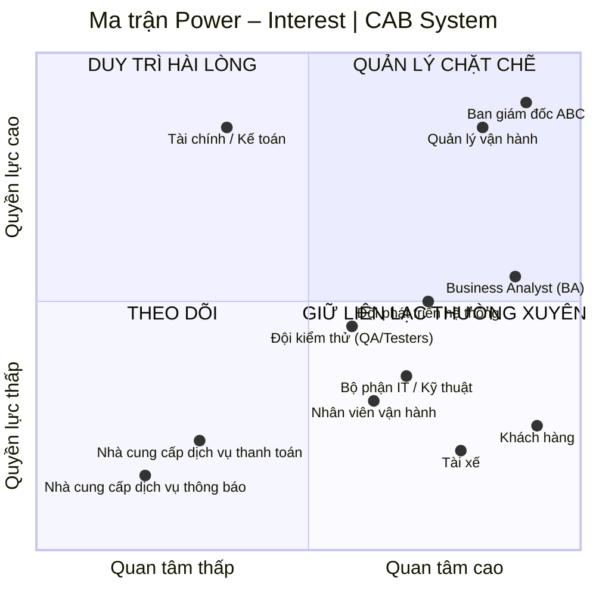

# 23640801_NguyenVanSang_capsystem
# 1. Hạn chế của hệ thống cũ
| STT | Hạn chế                                               | Mô tả                                                                                                                            |
| --: | ----------------------------------------------------- | -------------------------------------------------------------------------------------------------------------------------------- |
|   1 | **Phân công tài xế thủ công**                         | Việc tìm và phân công tài xế chủ yếu do tổng đài/nhân viên thực hiện, mất thời gian và khó đáp ứng khi số lượng chuyến tăng cao. |
|   2 | **Khó theo dõi trạng thái chuyến đi**                 | Khách hàng khó biết hệ thống đang tìm tài xế, tài xế nào nhận chuyến, tài xế đang ở đâu và chuyến đang ở trạng thái nào.         |
|   3 | **Thông tin thanh toán chưa tập trung**               | Dữ liệu thanh toán chưa được quản lý tập trung, gây khó khăn trong tra cứu giao dịch và quản lý doanh thu.                       |
|   4 | **Khó mở rộng hệ thống**                              | Kiến trúc hiện tại chưa đáp ứng tốt khi số lượng khách hàng, tài xế và chuyến đi tăng lên.                                       |
|   5 | **Phụ thuộc nhiều vào tổng đài**                      | Khách hàng vẫn phải liên hệ tổng đài trong nhiều trường hợp, làm tăng khối lượng công việc cho nhân viên vận hành.               |
|   6 | **Chưa tự động hóa việc tìm tài xế**                  | Chưa có cơ chế tự động xác định tài xế phù hợp dựa trên vị trí, trạng thái sẵn sàng và các tiêu chí vận hành.                    |
|   7 | **Khó xử lý khi tài xế từ chối/không phản hồi**       | Chưa có cơ chế tự động chuyển yêu cầu sang tài xế khác mà không yêu cầu khách hàng đặt lại chuyến.                               |
|   8 | **Quản lý thông tin chưa tập trung**                  | Thông tin khách hàng, tài xế, phương tiện, chuyến đi và giao dịch chưa được quản lý trên một nền tảng thống nhất.                |
|   9 | **Hạn chế về thông báo**                              | Chưa có hệ thống thông báo linh hoạt cho các sự kiện như tài xế nhận chuyến, đến điểm đón, hoàn thành chuyến hoặc thanh toán.    |
|  10 | **Khó quản lý và giám sát vận hành**                  | Nhân viên vận hành gặp khó khăn khi theo dõi chuyến đang chạy, trạng thái tài xế, giao dịch và các trường hợp phát sinh.         |
|  11 | **Khả năng báo cáo hạn chế**                          | Ban lãnh đạo chưa có đầy đủ dữ liệu để theo dõi doanh thu, số chuyến, tỷ lệ hoàn thành, tỷ lệ hủy và hiệu quả tài xế.            |
|  12 | **Khó mở rộng tính năng**                             | Việc bổ sung dịch vụ, phương thức thanh toán hoặc kênh thông báo mới có thể ảnh hưởng đến hệ thống hiện tại.                     |
|  13 | **Khả năng chịu tải chưa tốt**                        | Hệ thống chưa được thiết kế tối ưu cho những thời điểm nhu cầu đặt xe tăng cao.                                                  |
|  14 | **Khả năng cô lập lỗi hạn chế**                       | Lỗi ở một chức năng như thanh toán hoặc thông báo có nguy cơ ảnh hưởng đến hoạt động chung.                                      |
|  15 | **Bảo mật và kiểm soát truy cập chưa đáp ứng đầy đủ** | Hệ thống mới cần tăng cường xác thực, phân quyền, bảo vệ dữ liệu cá nhân, dữ liệu vị trí và lưu vết thao tác.                    |

## Tóm lại

Ba vấn đề lớn nhất của hệ thống cũ là:

1. **Phân công tài xế thủ công**
2. **Khó theo dõi chuyến đi**
3. **Khó mở rộng và quản lý tập trung**

Đây chính là những vấn đề mà **CAB System mới** cần giải quyết.

# # 2. Ai là người sử dụng hệ thống?

CAB System có **3 nhóm người dùng chính**, ngoài ra còn có các bên sử dụng dữ liệu hoặc quản lý hệ thống.

| Nhóm người dùng                   | Người sử dụng                     | Mục đích sử dụng chính                                                                               |
| --------------------------------- | --------------------------------- | ---------------------------------------------------------------------------------------------------- |
| **Khách hàng**                    | Người có nhu cầu đặt xe           | Đăng ký, đăng nhập, đặt xe, theo dõi chuyến, thanh toán, xem lịch sử và đánh giá tài xế.             |
| **Tài xế**                        | Tài xế của ABC                    | Quản lý hồ sơ, phương tiện, trạng thái hoạt động, nhận/từ chối chuyến và cập nhật trạng thái chuyến. |
| **Nhân viên vận hành**            | Điều phối viên/nhân viên vận hành | Theo dõi chuyến, tài xế, khách hàng, hỗ trợ xử lý sự cố và điều phối hoạt động.                      |
| **Quản trị viên**                 | Nhân viên có quyền quản trị       | Quản lý tài khoản, phân quyền, cấu hình hệ thống và thực hiện các thao tác nhạy cảm.                 |
| **Ban giám đốc**                  | Lãnh đạo ABC                      | Theo dõi báo cáo, doanh thu, số lượng chuyến, tỷ lệ hoàn thành/hủy và hiệu quả vận hành.             |
| **Bộ phận kế toán/tài chính**     | Nhân viên tài chính               | Tra cứu giao dịch, doanh thu, thanh toán và thực hiện đối soát.                                      |
| **Hệ thống thanh toán bên ngoài** | Cổng/nhà cung cấp thanh toán      | Xử lý thanh toán điện tử và trả kết quả giao dịch cho hệ thống.                                      |
| **Nhà cung cấp thông báo**        | SMS/Email/Push Notification       | Gửi thông báo đến khách hàng và tài xế.                                                              |

## 2.1. Ba tác nhân chính

Nếu bài yêu cầu xác định **Primary Actors (tác nhân chính)**, có thể xác định 3 tác nhân chính như sau:

1. **Khách hàng (Customer)**
2. **Tài xế (Driver)**
3. **Nhân viên vận hành (Operator)**

Đây là các tác nhân **trực tiếp tương tác và sử dụng các chức năng cốt lõi của CAB System**.

## 2.2. Các tác nhân và bên liên quan bổ sung

Ngoài 3 tác nhân chính, hệ thống còn có các tác nhân/bên liên quan:

* **Quản trị viên (Administrator):** quản lý tài khoản, phân quyền và cấu hình hệ thống.
* **Ban giám đốc (Management):** khai thác báo cáo và dữ liệu phục vụ quản lý, ra quyết định.
* **Bộ phận kế toán/tài chính (Finance):** quản lý và đối soát các giao dịch, doanh thu.
* **Payment Gateway:** cung cấp dịch vụ xử lý thanh toán điện tử.
* **Notification Provider:** cung cấp dịch vụ gửi SMS, Email hoặc Push Notification.

### Kết luận

Có thể phân loại tác nhân của CAB System thành:

**Primary Actors:**

> Khách hàng → Tài xế → Nhân viên vận hành

**Supporting/Secondary Actors:**

> Quản trị viên → Ban giám đốc → Kế toán/Tài chính → Payment Gateway → Notification Provider
## 3. Danh sách các bên liên quan

| STT | Bên liên quan | Vai trò |
|---:|---|---|
| 1 | **Ban giám đốc ABC** | **Sponsor / Decision Maker** – Định hướng mục tiêu dự án, phê duyệt phạm vi và các quyết định quan trọng; yêu cầu hệ thống đáp ứng mục tiêu kinh doanh, ổn định và có khả năng mở rộng. |
| 2 | **Business Analyst (BA)** | **Business Analyst / Requirement Analyst** – Thu thập, phân tích và làm rõ yêu cầu; xác định phạm vi, tác nhân, quy trình nghiệp vụ, yêu cầu chức năng, phi chức năng, quy tắc nghiệp vụ, ngoại lệ và các vấn đề cần xác nhận. |
| 3 | **Quản lý vận hành** | **Business Owner / Operations Manager** – Xác định và quản lý các quy trình vận hành, tiêu chí phân công tài xế, xử lý chuyến lỗi, chính sách hủy và theo dõi hiệu quả hoạt động. |
| 4 | **Nhân viên vận hành** | **Operational User** – Quản lý khách hàng, tài xế, phương tiện và chuyến đi; theo dõi chuyến đang diễn ra, kiểm tra trạng thái và xử lý các trường hợp bất thường. |
| 5 | **Khách hàng** | **End User** – Đăng ký/đăng nhập, đặt xe, theo dõi chuyến, xem lịch sử, thanh toán và đánh giá tài xế. |
| 6 | **Tài xế** | **End User / Service Provider** – Quản lý hồ sơ và phương tiện, cập nhật trạng thái hoạt động, nhận/từ chối chuyến, cập nhật trạng thái chuyến và vị trí. |
| 7 | **Bộ phận Tài chính / Kế toán** | **Business Stakeholder** – Quản lý và đối soát cước, thanh toán, doanh thu và lịch sử giao dịch; quan tâm đến tính chính xác của dữ liệu tài chính. |
| 8 | **Đội phát triển hệ thống** | **Development Team** – Thiết kế, xây dựng, tích hợp và triển khai các chức năng của CAB System theo yêu cầu đã được phê duyệt. |
| 9 | **Đội kiểm thử (QA/Testers)** | **Quality Assurance** – Kiểm thử chức năng, hiệu năng, bảo mật và các trường hợp ngoại lệ; đảm bảo hệ thống đáp ứng yêu cầu trước khi triển khai. |
| 10 | **Bộ phận IT / Kỹ thuật** | **Technical / Infrastructure Stakeholder** – Đảm bảo hạ tầng, triển khai, giám sát, khả năng mở rộng, tính ổn định và khả năng bảo trì của hệ thống. |
| 11 | **Nhà cung cấp dịch vụ thanh toán** | **External System / Payment Provider** – Xử lý thanh toán điện tử bên ngoài và trả kết quả giao dịch cho CAB System; hệ thống CAB không lưu trực tiếp dữ liệu thanh toán nhạy cảm. |
| 12 | **Nhà cung cấp dịch vụ thông báo** | **External System / Notification Provider** – Cung cấp các kênh gửi thông báo cho khách hàng và tài xế; có khả năng thay đổi hoặc bổ sung nhà cung cấp trong tương lai. |

# 4. Phân loại các bên liên quan theo mức độ ảnh hưởng

Có thể sử dụng **ma trận Power – Interest (Quyền lực – Mức độ quan tâm)** để phân tích và xác định chiến lược quản lý các bên liên quan.

| Mức độ                             | Bên liên quan                                                                                                             | Cách quản lý                              |
| ---------------------------------- | ------------------------------------------------------------------------------------------------------------------------- | ----------------------------------------- |
| **Quyền lực cao – Quan tâm cao**   | **Ban giám đốc ABC, Quản lý vận hành**                                                                                    | **Quản lý chặt chẽ**                      |
| **Quyền lực cao – Quan tâm thấp**  | **Bộ phận Tài chính / Kế toán**                                                                                           | **Duy trì sự hài lòng**                   |
| **Quyền lực thấp – Quan tâm cao**  | **BA, Nhân viên vận hành, Khách hàng, Tài xế, Đội phát triển hệ thống, Đội kiểm thử (QA/Testers), Bộ phận IT / Kỹ thuật** | **Giữ liên lạc và cập nhật thường xuyên** |
| **Quyền lực thấp – Quan tâm thấp** | **Nhà cung cấp dịch vụ thanh toán, Nhà cung cấp dịch vụ thông báo**                                                       | **Theo dõi**                              |


# 5. Ma trận các bên liên quan

## 5.1. Ma trận Power – Interest

|                    | **Quan tâm thấp**                                                                     | **Quan tâm cao**                                                                                                                                                                                    |
| ------------------ | ------------------------------------------------------------------------------------- | --------------------------------------------------------------------------------------------------------------------------------------------------------------------------------------------------- |
| **Quyền lực cao**  | **Duy trì hài lòng**<br>• Bộ phận Tài chính / Kế toán                                 | **Quản lý chặt chẽ**<br>• Ban giám đốc ABC / Sponsor<br>• Quản lý vận hành                                                                                                                          |
| **Quyền lực thấp** | **Theo dõi**<br>• Nhà cung cấp dịch vụ thanh toán<br>• Nhà cung cấp dịch vụ thông báo | **Giữ liên lạc thường xuyên**<br>• Business Analyst (BA)<br>• Nhân viên vận hành<br>• Khách hàng<br>• Tài xế<br>• Đội phát triển hệ thống<br>• Đội kiểm thử (QA/Testers)<br>• Bộ phận IT / Kỹ thuật |


# 6. Ma trận chi tiết: Quyền lực – Mức độ quan tâm – Chiến lược

| Bên liên quan                       | Quyền lực  | Quan tâm          | Mức độ ảnh hưởng  | Chiến lược                                                                                                                 |
| ----------------------------------- | ---------- | ----------------- | ----------------- | -------------------------------------------------------------------------------------------------------------------------- |
| **Ban giám đốc ABC**                | Cao        | Cao               | Rất cao           | Quản lý chặt chẽ, báo cáo tiến độ, phạm vi, rủi ro và các vấn đề quan trọng để ra quyết định kịp thời.                     |
| **Business Analyst (BA)**           | Trung bình | Cao               | Cao               | Tham gia thu thập, phân tích, làm rõ và quản lý yêu cầu; kết nối giữa các bên liên quan và đội phát triển.                 |
| **Quản lý vận hành**                | Cao        | Cao               | Rất cao           | Tham gia xác định nghiệp vụ, xác nhận quy trình vận hành, tiêu chí phân công tài xế, xử lý ngoại lệ và UAT.                |
| **Nhân viên vận hành**              | Thấp       | Cao               | Cao               | Thu thập phản hồi thực tế, tham gia kiểm thử các chức năng quản lý khách hàng, tài xế, phương tiện và chuyến đi.           |
| **Khách hàng**                      | Thấp       | Cao               | Cao               | Khảo sát nhu cầu, lấy phản hồi và kiểm thử trải nghiệm đặt xe, theo dõi chuyến, thanh toán và đánh giá.                    |
| **Tài xế**                          | Thấp       | Cao               | Cao               | Thu thập yêu cầu thực tế, lấy phản hồi và kiểm thử quy trình nhận/từ chối chuyến, cập nhật trạng thái và vị trí.           |
| **Bộ phận Tài chính / Kế toán**     | Cao        | Trung bình        | Cao               | Tham vấn về thanh toán, đối soát cước, doanh thu và lịch sử giao dịch; đảm bảo tính chính xác của dữ liệu tài chính.       |
| **Đội phát triển hệ thống**         | Trung bình | Cao               | Cao               | Tham gia phân tích tính khả thi, thiết kế, xây dựng, tích hợp và triển khai các chức năng của CAB System.                  |
| **Đội kiểm thử (QA/Testers)**       | Trung bình | Cao               | Cao               | Kiểm thử chức năng, hiệu năng, bảo mật và các trường hợp ngoại lệ; xác nhận hệ thống đáp ứng yêu cầu trước khi triển khai. |
| **Bộ phận IT / Kỹ thuật**           | Trung bình | Cao               | Cao               | Đảm bảo hạ tầng, triển khai, giám sát, hiệu năng, khả năng mở rộng, tính ổn định và khả năng bảo trì hệ thống.             |
| **Nhà cung cấp dịch vụ thanh toán** | Thấp       | Thấp – Trung bình | Trung bình        | Quản lý tích hợp, theo dõi trạng thái giao dịch và SLA; phối hợp xử lý các vấn đề liên quan đến thanh toán.                |
| **Nhà cung cấp dịch vụ thông báo**  | Thấp       | Thấp – Trung bình | Thấp – Trung bình | Theo dõi tích hợp và khả năng cung cấp dịch vụ; đảm bảo hệ thống có thể thay đổi hoặc bổ sung nhà cung cấp khi cần.        |


# 6.1 Ma trận Power – Interest

## 7. Business Goals – CAB System

| STT | Business Goal | Mô tả |
|---:|---|---|
| **1** | **Hiện đại hóa và số hóa quy trình đặt xe** | Xây dựng nền tảng CAB mới thay thế các quy trình thủ công và hệ thống hiện tại còn hạn chế, giúp tự động hóa quy trình từ đặt xe, tìm tài xế, thực hiện chuyến đến thanh toán và đánh giá. |
| **2** | **Nâng cao trải nghiệm khách hàng** | Giúp khách hàng đặt xe thuận tiện, theo dõi trạng thái chuyến đi, biết thông tin tài xế, thời gian dự kiến đến, lịch sử chuyến, chi phí và đánh giá sau chuyến. |
| **3** | **Tự động hóa và nâng cao hiệu quả điều phối tài xế** | Giảm phụ thuộc vào phân công thủ công bằng cơ chế tự động tìm và ưu tiên tài xế phù hợp, gần khách hàng và đang sẵn sàng nhận chuyến. |
| **4** | **Tăng tỷ lệ chuyến được phục vụ và hoàn thành** | Có cơ chế tiếp tục tìm tài xế khác khi tài xế được đề xuất từ chối hoặc không phản hồi, qua đó giảm số chuyến không được phục vụ và nâng cao tỷ lệ hoàn thành chuyến. |
| **5** | **Quản lý tập trung dữ liệu và hoạt động kinh doanh** | Tập trung dữ liệu khách hàng, tài xế, phương tiện, chuyến đi, thanh toán và giao dịch để các bộ phận vận hành, tài chính và quản lý có thể tra cứu và phối hợp hiệu quả. |
| **6** | **Nâng cao hiệu quả quản lý doanh thu và thanh toán** | Chuẩn hóa quy trình tính cước, thanh toán và đối soát; hỗ trợ tiền mặt và thanh toán điện tử thông qua nhà cung cấp bên ngoài, đồng thời hạn chế rủi ro đối với dữ liệu thanh toán nhạy cảm. |
| **7** | **Tăng khả năng giám sát và ra quyết định** | Cung cấp dữ liệu và báo cáo về số lượng chuyến, doanh thu, tỷ lệ hoàn thành, tỷ lệ hủy và hiệu quả hoạt động của tài xế để ban lãnh đạo và quản lý vận hành đưa ra quyết định. |
| **8** | **Đảm bảo hệ thống ổn định, an toàn và tin cậy** | Bảo vệ dữ liệu cá nhân, dữ liệu vị trí và giao dịch; kiểm soát quyền truy cập, lưu vết các thao tác quan trọng và hạn chế lỗi của một thành phần ảnh hưởng đến toàn bộ hệ thống. |
| **9** | **Đảm bảo khả năng mở rộng quy mô kinh doanh** | Xây dựng nền tảng có khả năng phục vụ số lượng lớn khách hàng và tài xế, đồng thời cho phép các thành phần được mở rộng độc lập khi nhu cầu tăng cao. |
| **10** | **Tạo nền tảng linh hoạt cho phát triển lâu dài** | Cho phép doanh nghiệp bổ sung loại dịch vụ, phương thức thanh toán, kênh thông báo hoặc thay đổi nhà cung cấp và thành phần kỹ thuật trong tương lai mà không phải xây dựng lại toàn bộ hệ thống. |
| **11** | **Đảm bảo triển khai sản phẩm đúng thời hạn 7 tuần** | Hoàn thành và đưa hệ thống CAB vào vận hành trong thời gian 7 tuần theo kỳ vọng của Ban giám đốc, đồng thời ưu tiên các năng lực kinh doanh quan trọng trong phạm vi dự án. |

### Business Goals cốt lõi

Nếu cần trình bày ngắn gọn trong bài BA, có thể sử dụng **6 mục tiêu kinh doanh chính** sau:

| STT | Business Goal |
|---:|---|
| **1** | **Số hóa và tự động hóa hoạt động đặt xe, điều phối và quản lý chuyến đi.** |
| **2** | **Nâng cao trải nghiệm và mức độ hài lòng của khách hàng.** |
| **3** | **Nâng cao hiệu quả vận hành và khả năng sử dụng nguồn lực tài xế.** |
| **4** | **Quản lý tập trung và minh bạch dữ liệu chuyến đi, thanh toán và doanh thu.** |
| **5** | **Đảm bảo hệ thống an toàn, ổn định và có khả năng mở rộng.** |
| **6** | **Xây dựng nền tảng CAB linh hoạt, có khả năng phát triển thêm dịch vụ và tích hợp trong tương lai.** |

# 8. Phạm vi MVP đề xuất trong 7 tuần
## MVP – Danh sách Module và Chức năng

| STT | Module | Chức năng chính trong MVP | Ưu tiên |
|---:|---|---|---|
| **1** | **Quản lý tài khoản & phân quyền** | Đăng nhập, quản lý tài khoản khách hàng/tài xế/nhân viên, phân quyền, khóa/mở khóa tài khoản | 🔴 Rất cao |
| **2** | **Quản lý khách hàng** | Xem, tìm kiếm, cập nhật, khóa/mở khóa thông tin khách hàng | 🔴 Cao |
| **3** | **Quản lý tài xế & phương tiện** | Quản lý hồ sơ tài xế, trạng thái hoạt động, thông tin xe, gán tài xế với phương tiện | 🔴 Rất cao |
| **4** | **Quản lý đặt xe & chuyến đi** | Tạo chuyến, quản lý trạng thái chuyến, xem chi tiết, hủy chuyến, xử lý chuyến lỗi | 🔴 Rất cao |
| **5** | **Tìm kiếm & phân công tài xế** | Tìm tài xế phù hợp, ưu tiên tài xế gần khách, gửi yêu cầu, chuyển sang tài xế khác khi từ chối/không phản hồi | 🔴 Rất cao |
| **6** | **Quản lý cước & thanh toán** | Tính cước, tiền mặt, thanh toán điện tử, quản lý trạng thái giao dịch, xử lý thanh toán thất bại | 🔴 Cao |
| **7** | **Quản lý thông báo** | Thông báo đặt xe, tài xế nhận chuyến, trạng thái chuyến, hoàn thành chuyến, kết quả thanh toán | 🟠 Cao |
| **8** | **Đánh giá tài xế** | Khách hàng đánh giá sau chuyến, nhân viên xem đánh giá | 🟡 Trung bình |
| **9** | **Dashboard & báo cáo** | Số chuyến, doanh thu, hoàn thành, hủy chuyến, hiệu quả tài xế | 🟠 Cao |

---

## Phạm vi giới hạn trong 7 tuần

### Bắt buộc phải làm

**Module 1 → 7**

- Quản lý tài khoản & phân quyền
- Quản lý khách hàng
- Quản lý tài xế & phương tiện
- Quản lý đặt xe & chuyến đi
- Tìm kiếm & phân công tài xế
- Quản lý cước & thanh toán
- Quản lý thông báo

### Có thể làm ở mức tối thiểu

**Module 8 → 9**

- Đánh giá tài xế
- Dashboard & báo cáo

### Đưa vào Phase 2

| STT | Tính năng Phase 2 |
|---:|---|
| 1 | Khuyến mãi / Voucher |
| 2 | Loyalty / Chương trình khách hàng thân thiết |
| 3 | Nhiều cổng thanh toán |
| 4 | Nhiều kênh thông báo |
| 5 | Thuật toán phân tài xế nâng cao |
| 6 | Bảo dưỡng xe |
| 7 | Báo cáo BI nâng cao |

---

## Core Flow

```text
Quản lý tài khoản
        ↓
Quản lý khách hàng / tài xế / phương tiện
        ↓
Đặt xe
        ↓
Phân tài xế
        ↓
Thực hiện chuyến
        ↓
Tính cước
        ↓
Thanh toán
        ↓
Thông báo
```
## Business Requirements – CAB System

| Mã | Business Requirement | Mô tả yêu cầu nghiệp vụ | Mức độ |
|---|---|---|---|
| **BR-01** | **Quản lý khách hàng tập trung** | Doanh nghiệp cần quản lý tập trung thông tin và trạng thái khách hàng để hỗ trợ quá trình đặt xe và vận hành dịch vụ. | 🔴 Cao |
| **BR-02** | **Quản lý tài xế tập trung** | Doanh nghiệp cần quản lý hồ sơ, trạng thái hoạt động và khả năng nhận chuyến của tài xế để phục vụ việc phân công xe. | 🔴 Rất cao |
| **BR-03** | **Quản lý phương tiện** | Doanh nghiệp cần quản lý thông tin phương tiện và mối quan hệ giữa tài xế với phương tiện nhằm đảm bảo xe được sử dụng đúng trong quá trình cung cấp dịch vụ. | 🔴 Cao |
| **BR-04** | **Số hóa quy trình đặt xe** | Doanh nghiệp cần số hóa quy trình từ khi khách hàng gửi yêu cầu đặt xe đến khi chuyến đi được tiếp nhận và thực hiện, thay thế các thao tác thủ công hiện tại. | 🔴 Rất cao |
| **BR-05** | **Tự động hóa phân công tài xế** | Doanh nghiệp cần tự động tìm kiếm và ưu tiên tài xế phù hợp dựa trên vị trí, trạng thái sẵn sàng và các tiêu chí vận hành đã thống nhất. | 🔴 Rất cao |
| **BR-06** | **Đảm bảo khả năng xử lý khi tài xế không nhận chuyến** | Doanh nghiệp cần có cơ chế tiếp tục tìm tài xế khác khi tài xế được đề xuất từ chối hoặc không phản hồi, tránh yêu cầu khách hàng đặt lại chuyến. | 🔴 Rất cao |
| **BR-07** | **Quản lý và theo dõi chuyến đi** | Doanh nghiệp cần quản lý tập trung toàn bộ chuyến đi và cho phép các bộ phận liên quan theo dõi trạng thái chuyến từ lúc tạo yêu cầu đến khi hoàn thành hoặc hủy. | 🔴 Rất cao |
| **BR-08** | **Minh bạch trạng thái chuyến cho khách hàng** | Doanh nghiệp cần cung cấp thông tin để khách hàng biết tình trạng yêu cầu đặt xe, tài xế được phân công, thời gian dự kiến đến và trạng thái chuyến. | 🔴 Cao |
| **BR-09** | **Quản lý tính cước** | Doanh nghiệp cần xác định số tiền khách hàng phải thanh toán dựa trên loại dịch vụ và thông tin thực tế của chuyến đi. | 🔴 Cao |
| **BR-10** | **Quản lý thanh toán** | Doanh nghiệp cần hỗ trợ thanh toán tiền mặt và thanh toán điện tử, đồng thời quản lý trạng thái giao dịch để phục vụ đối soát và vận hành. | 🔴 Cao |
| **BR-11** | **Quản lý thông báo** | Doanh nghiệp cần đảm bảo khách hàng và tài xế nhận được thông tin quan trọng trong suốt vòng đời chuyến đi và giao dịch. | 🟠 Cao |
| **BR-12** | **Quản lý đánh giá dịch vụ** | Doanh nghiệp cần thu thập đánh giá của khách hàng sau chuyến đi để theo dõi chất lượng phục vụ của tài xế. | 🟡 Trung bình |
| **BR-13** | **Quản lý vận hành tập trung** | Bộ phận vận hành cần có khả năng theo dõi khách hàng, tài xế, phương tiện, chuyến đi và giao dịch trên một nền tảng thống nhất. | 🔴 Rất cao |
| **BR-14** | **Kiểm soát quyền truy cập nghiệp vụ** | Doanh nghiệp cần phân quyền nhân viên để đảm bảo chỉ những người có thẩm quyền mới được thực hiện các thao tác quản trị hoặc thao tác nhạy cảm. | 🔴 Cao |
| **BR-15** | **Theo dõi và báo cáo hoạt động** | Ban quản lý cần có dữ liệu về số lượng chuyến, doanh thu, tỷ lệ hoàn thành, tỷ lệ hủy và hiệu quả hoạt động của tài xế để hỗ trợ ra quyết định. | 🟠 Cao |
| **BR-16** | **Đảm bảo tính liên tục của dịch vụ** | Doanh nghiệp cần đảm bảo lỗi ở một thành phần như thanh toán hoặc thông báo không làm gián đoạn toàn bộ quy trình đặt xe. | 🔴 Cao |
| **BR-17** | **Bảo vệ dữ liệu nghiệp vụ** | Doanh nghiệp cần bảo vệ thông tin khách hàng, tài xế, phương tiện, vị trí và giao dịch, đồng thời lưu vết các thao tác quan trọng để phục vụ kiểm tra. | 🔴 Cao |
| **BR-18** | **Khả năng mở rộng dịch vụ** | Doanh nghiệp cần một nền tảng có khả năng bổ sung loại dịch vụ, phương thức thanh toán và kênh thông báo mới mà không phải xây dựng lại toàn bộ hệ thống. | 🟠 Cao |

# 9. Phân rã Functional Requirements

| Mã FR     | Functional Requirement             | Các chức năng chi tiết                                                                                                                                                                                                                                                                                                                                                                                                                                                    |
| --------- | ---------------------------------- | ------------------------------------------------------------------------------------------------------------------------------------------------------------------------------------------------------------------------------------------------------------------------------------------------------------------------------------------------------------------------------------------------------------------------------------------------------------------------- |
| **FR-01** | **Quản lý tài khoản & phân quyền** | FR-01.1 Đăng ký tài khoản khách hàng<br>FR-01.2 Tạo tài khoản tài xế<br>FR-01.3 Đăng nhập/đăng xuất<br>FR-01.4 Cập nhật thông tin cá nhân<br>FR-01.5 Khóa/mở khóa tài khoản<br>FR-01.6 Phân quyền khách hàng, tài xế, nhân viên, quản lý<br>FR-01.7 Kiểm soát quyền truy cập                                                                                                                                                                                              |
| **FR-02** | **Quản lý khách hàng**             | FR-02.1 Xem danh sách khách hàng<br>FR-02.2 Tìm kiếm khách hàng<br>FR-02.3 Xem chi tiết khách hàng<br>FR-02.4 Cập nhật thông tin khách hàng<br>FR-02.5 Khóa/mở khóa khách hàng<br>FR-02.6 Xem lịch sử chuyến đi<br>FR-02.7 Tra cứu giao dịch                                                                                                                                                                                                                              |
| **FR-03** | **Quản lý tài xế**                 | FR-03.1 Tạo tài khoản tài xế<br>FR-03.2 Xem danh sách tài xế<br>FR-03.3 Tìm kiếm tài xế<br>FR-03.4 Xem/cập nhật hồ sơ tài xế<br>FR-03.5 Khóa/mở khóa tài xế<br>FR-03.6 Cập nhật trạng thái hoạt động<br>FR-03.7 Cập nhật trạng thái sẵn sàng nhận chuyến<br>FR-03.8 Theo dõi vị trí tài xế                                                                                                                                                                                |
| **FR-04** | **Quản lý phương tiện**            | FR-04.1 Thêm phương tiện<br>FR-04.2 Xem danh sách phương tiện<br>FR-04.3 Tìm kiếm phương tiện<br>FR-04.4 Xem thông tin phương tiện<br>FR-04.5 Cập nhật thông tin phương tiện<br>FR-04.6 Cập nhật trạng thái phương tiện<br>FR-04.7 Gán phương tiện cho tài xế<br>FR-04.8 Quản lý loại xe                                                                                                                                                                                  |
| **FR-05** | **Đặt xe**                         | FR-05.1 Nhập điểm đón<br>FR-05.2 Nhập điểm đến<br>FR-05.3 Chọn loại xe<br>FR-05.4 Gửi yêu cầu đặt xe<br>FR-05.5 Tạo chuyến<br>FR-05.6 Xác nhận yêu cầu đặt xe<br>FR-05.7 Chuyển chuyến sang trạng thái tìm tài xế<br>FR-05.8 Hủy chuyến theo chính sách                                                                                                                                                                                                                   |
| **FR-06** | **Tìm kiếm & phân công tài xế**    | FR-06.1 Tìm tài xế đang sẵn sàng<br>FR-06.2 Kiểm tra loại xe phù hợp<br>FR-06.3 Xác định khoảng cách đến điểm đón<br>FR-06.4 Ưu tiên tài xế phù hợp/gần khách<br>FR-06.5 Gửi yêu cầu nhận chuyến<br>FR-06.6 Tài xế chấp nhận chuyến<br>FR-06.7 Tài xế từ chối chuyến<br>FR-06.8 Xử lý tài xế không phản hồi<br>FR-06.9 Tự động tìm tài xế tiếp theo<br>FR-06.10 Gán chuyến cho tài xế<br>FR-06.11 Thông báo khi có tài xế<br>FR-06.12 Thông báo khi không tìm được tài xế |
| **FR-07** | **Quản lý & theo dõi chuyến đi**   | FR-07.1 Tài xế xác nhận nhận chuyến<br>FR-07.2 Cập nhật đã đến điểm đón<br>FR-07.3 Cập nhật đã đón khách<br>FR-07.4 Cập nhật đang di chuyển<br>FR-07.5 Cập nhật hoàn thành chuyến<br>FR-07.6 Khách hàng theo dõi trạng thái chuyến<br>FR-07.7 Xem thông tin tài xế<br>FR-07.8 Xem thời gian dự kiến tài xế đến<br>FR-07.9 Nhân viên xem chuyến đang diễn ra<br>FR-07.10 Xem chi tiết chuyến<br>FR-07.11 Xử lý chuyến lỗi<br>FR-07.12 Lưu lịch sử chuyến                   |
| **FR-08** | **Quản lý cước**                   | FR-08.1 Xác định loại dịch vụ<br>FR-08.2 Ghi nhận thông tin chuyến<br>FR-08.3 Tính số tiền phải trả<br>FR-08.4 Hiển thị cước cho khách hàng<br>FR-08.5 Lưu thông tin cước<br>FR-08.6 Nhân viên tra cứu cước                                                                                                                                                                                                                                                               |
| **FR-09** | **Quản lý thanh toán**             | FR-09.1 Thanh toán tiền mặt<br>FR-09.2 Thanh toán điện tử<br>FR-09.3 Kết nối nhà cung cấp thanh toán<br>FR-09.4 Tiếp nhận kết quả giao dịch<br>FR-09.5 Cập nhật thanh toán thành công<br>FR-09.6 Cập nhật thanh toán thất bại<br>FR-09.7 Thông báo kết quả thanh toán<br>FR-09.8 Xử lý lại giao dịch thất bại<br>FR-09.9 Tra cứu lịch sử giao dịch                                                                                                                        |
| **FR-10** | **Quản lý thông báo**              | FR-10.1 Thông báo tiếp nhận yêu cầu đặt xe<br>FR-10.2 Thông báo tài xế nhận chuyến<br>FR-10.3 Thông báo tài xế đến điểm đón<br>FR-10.4 Thông báo hoàn thành chuyến<br>FR-10.5 Thông báo kết quả thanh toán<br>FR-10.6 Thông báo chuyến mới cho tài xế<br>FR-10.7 Thông báo thay đổi chuyến                                                                                                                                                                                |
| **FR-11** | **Đánh giá tài xế**                | FR-11.1 Khách hàng đánh giá sau chuyến<br>FR-11.2 Chọn mức điểm đánh giá<br>FR-11.3 Nhập nhận xét<br>FR-11.4 Lưu đánh giá<br>FR-11.5 Nhân viên xem đánh giá                                                                                                                                                                                                                                                                                                               |
| **FR-12** | **Quản lý vận hành**               | FR-12.1 Theo dõi chuyến đang hoạt động<br>FR-12.2 Theo dõi trạng thái tài xế<br>FR-12.3 Tra cứu khách hàng<br>FR-12.4 Tra cứu tài xế<br>FR-12.5 Tra cứu phương tiện<br>FR-12.6 Tra cứu chuyến đi<br>FR-12.7 Tra cứu giao dịch<br>FR-12.8 Xử lý chuyến lỗi                                                                                                                                                                                                                 |
| **FR-13** | **Dashboard & báo cáo**            | FR-13.1 Thống kê tổng số chuyến<br>FR-13.2 Thống kê chuyến hoàn thành<br>FR-13.3 Thống kê chuyến hủy<br>FR-13.4 Thống kê doanh thu<br>FR-13.5 Tỷ lệ hoàn thành<br>FR-13.6 Tỷ lệ hủy<br>FR-13.7 Hiệu quả tài xế                                                                                                                                                                                                                                                            |
| **FR-14** | **Audit & kiểm soát**              | FR-14.1 Ghi nhận thao tác quản trị quan trọng<br>FR-14.2 Ghi nhận người thực hiện<br>FR-14.3 Ghi nhận thời gian thao tác<br>FR-14.4 Tra cứu lịch sử thao tác<br>FR-14.5 Kiểm soát truy cập dữ liệu                                                                                                                                                                                                                                                                        |

## Phạm vi MVP trong 7 tuần

| Nhóm           | Module                         | Phạm vi          |
| -------------- | ------------------------------ | ---------------- |
| **Core**       | Quản lý tài khoản & phân quyền | ✅ Bắt buộc       |
| **Core**       | Quản lý khách hàng             | ✅ Bắt buộc       |
| **Core**       | Quản lý tài xế                 | ✅ Bắt buộc       |
| **Core**       | Quản lý phương tiện            | ✅ Bắt buộc       |
| **Core**       | Đặt xe                         | ✅ Bắt buộc       |
| **Core**       | Tìm kiếm & phân công tài xế    | ✅ Bắt buộc       |
| **Core**       | Quản lý chuyến đi              | ✅ Bắt buộc       |
| **Core**       | Quản lý cước & thanh toán      | ✅ Bắt buộc       |
| **Core**       | Quản lý thông báo              | ✅ Bắt buộc       |
| **Supporting** | Đánh giá tài xế                | 🟡 Mức tối thiểu |
| **Supporting** | Dashboard & báo cáo            | 🟡 Mức cơ bản    |
| **Supporting** | Audit & kiểm soát              | 🟡 Mức cơ bản    |

### Kết luận phạm vi Functional Requirements

Với thời gian xây dựng và triển khai sản phẩm **7 tuần**, phạm vi Functional Requirements chính nên tập trung vào **FR-01 đến FR-10** nhằm bảo đảm đầy đủ luồng nghiệp vụ cốt lõi của hệ thống CAB, từ quản lý tài khoản, đặt xe, phân công tài xế, quản lý chuyến, tính cước đến thanh toán và thông báo.

Các chức năng **FR-11 đến FR-14** chỉ nên triển khai ở **mức tối thiểu/cơ bản** trong MVP, tránh mở rộng phạm vi dự án quá mức và ảnh hưởng đến tiến độ 7 tuần.

**Phạm vi MVP đề xuất:**

* **FR-01 → FR-10:** Phạm vi **bắt buộc – Core**
* **FR-11:** Triển khai **mức tối thiểu**
* **FR-12:** Có thể triển khai **mức cơ bản**, tập trung vào các chức năng hỗ trợ vận hành thiết yếu
* **FR-13:** Triển khai **Dashboard & báo cáo cơ bản**
* **FR-14:** Triển khai **Audit & kiểm soát cơ bản**, ưu tiên các thao tác quản trị quan trọng
# 10. Use Case Diagram - CAB System


# 11. Đặc tả use case 
# Danh sách Use Case – CAB System
## 11.1. Ma trận Use Case – Functional Requirements
| Use Case | Functional Requirement | Các FR chi tiết được kiểm thử |
|---|---|---|
| **UC-01 Đăng ký tài khoản** | FR-01 | FR-01.1 |
| **UC-02 Đăng nhập** | FR-01 | FR-01.3, FR-01.7 |
| **UC-03 Cập nhật thông tin cá nhân** | FR-01 | FR-01.4 |
| **UC-04 Quản lý tài khoản & phân quyền** | FR-01 | FR-01.5, FR-01.6, FR-01.7 |
| **UC-05 Quản lý khách hàng** | FR-02 | FR-02.1 → FR-02.7 |
| **UC-06 Quản lý tài xế** | FR-03 | FR-03.1 → FR-03.8 |
| **UC-07 Quản lý phương tiện** | FR-04 | FR-04.1 → FR-04.8 |
| **UC-08 Tạo yêu cầu đặt xe** | FR-05 | FR-05.1 → FR-05.8 |
| **UC-09 Tìm kiếm & phân công tài xế** | FR-06 | FR-06.1 → FR-06.12 |
| **UC-10 Tài xế nhận/từ chối chuyến** | FR-06 | FR-06.5 → FR-06.10 |
| **UC-11 Theo dõi chuyến đi** | FR-07 | FR-07.6 → FR-07.10 |
| **UC-12 Cập nhật trạng thái chuyến** | FR-07 | FR-07.1 → FR-07.5 |
| **UC-13 Tính cước chuyến đi** | FR-08 | FR-08.1 → FR-08.6 |
| **UC-14 Thanh toán chuyến đi** | FR-09 | FR-09.1 → FR-09.9 |
| **UC-15 Quản lý thông báo** | FR-10 | FR-10.1 → FR-10.7 |
| **UC-16 Đánh giá tài xế** | FR-11 | FR-11.1 → FR-11.5 |
| **UC-17 Quản lý vận hành chuyến đi** | FR-12 | FR-12.1 → FR-12.7 |
| **UC-18 Xử lý chuyến lỗi** | FR-12 | FR-12.8 |
| **UC-19 Dashboard & báo cáo** | FR-13 | FR-13.1 → FR-13.7 |
| **UC-20 Audit & kiểm soát** | FR-14 | FR-14.1 → FR-14.5 |
# UC-01 – Đăng ký tài khoản

| **Thành phần** | **Nội dung** |
|---|---|
| **Tên Use Case** | Đăng ký tài khoản |
| **Tiền điều kiện** | Người dùng chưa có tài khoản trên hệ thống |
| **Hậu điều kiện** | Nếu đăng ký thành công, thông tin tài khoản được lưu vào CSDL. Tài khoản được tạo với vai trò phù hợp, mặc định là **Khách hàng** đối với đăng ký từ phía khách hàng. |
| **Actor chính** | Khách hàng |
| **Actor phụ** | Không |

## Basic Flow

| **Khách hàng** | **Hệ thống** |
|---|---|
| **1.** Chọn chức năng **Đăng ký tài khoản**. | |
| | **2.** Hiển thị trang **Đăng ký tài khoản**. |
| **3.** Nhập thông tin đăng ký gồm họ tên, số điện thoại/email và mật khẩu. | |
| | **4.** Kiểm tra dữ liệu nhập. |
| | **5.** Kiểm tra số điện thoại/email đã tồn tại trong hệ thống hay chưa. |
| | **6.** Hiển thị thông tin xác nhận đăng ký. |
| **7.** Xác nhận đăng ký tài khoản. | |
| | **8.** Lưu thông tin tài khoản vào CSDL. |
| | **9.** Gán vai trò **Khách hàng** cho tài khoản. |
| | **10.** Thông báo đăng ký tài khoản thành công. |

## Alternative Flow

### 3.1 – Người dùng đã có tài khoản

1. **Khách hàng:** Nhập số điện thoại/email đã được đăng ký.
2. **Hệ thống:** Thông báo số điện thoại/email đã tồn tại.
3. **Khách hàng:** Chọn **Đăng nhập**.
4. **Hệ thống:** Chuyển đến trang đăng nhập.
5. Kết thúc Use Case.

### 4.1 – Họ tên không hợp lệ

1. **Hệ thống:** Phát hiện họ tên chứa ký tự không hợp lệ.
2. **Hệ thống:** Thông báo lỗi và yêu cầu nhập lại họ tên.
3. **Khách hàng:** Nhập lại họ tên.
4. Quay lại **bước 4**.

### 4.2 – Số điện thoại không hợp lệ

1. **Hệ thống:** Phát hiện số điện thoại chứa ký tự không phải số hoặc không đúng định dạng.
2. **Hệ thống:** Thông báo lỗi và yêu cầu nhập lại số điện thoại.
3. **Khách hàng:** Nhập lại số điện thoại.
4. Quay lại **bước 4**.

### 4.3 – Email không hợp lệ

1. **Hệ thống:** Phát hiện email sai cú pháp.
2. **Hệ thống:** Thông báo lỗi và yêu cầu nhập lại email.
3. **Khách hàng:** Nhập lại email.
4. Quay lại **bước 4**.

### 4.4 – Mật khẩu không hợp lệ

1. **Hệ thống:** Kiểm tra và phát hiện mật khẩu không đáp ứng quy tắc bảo mật.
2. **Hệ thống:** Thông báo lỗi.
3. **Khách hàng:** Nhập lại mật khẩu.
4. Quay lại **bước 4**.

## Exception

### 8.1 – Không thể lưu tài khoản

1. **Hệ thống:** Phát sinh lỗi khi lưu thông tin tài khoản vào CSDL.
2. **Hệ thống:** Thông báo đăng ký thất bại.
3. **Hệ thống:** Không tạo tài khoản.
4. Kết thúc Use Case.

### 7.1 – Người dùng không muốn tiếp tục đăng ký

1. **Khách hàng:** Chọn **Hủy đăng ký**.
2. **Hệ thống:** Hiển thị thông báo xác nhận hủy.
3. **Khách hàng:** Xác nhận hủy.
4. **Hệ thống:** Hủy thao tác đăng ký.
5. Kết thúc Use Case.

# UC-02 – Đăng nhập

| **Thành phần** | **Nội dung** |
|---|---|
| **Tên Use Case** | Đăng nhập |
| **Tiền điều kiện** | Người dùng đã có tài khoản trên hệ thống và tài khoản đang ở trạng thái được phép đăng nhập. |
| **Hậu điều kiện** | Nếu đăng nhập thành công, hệ thống tạo phiên đăng nhập và cho phép người dùng truy cập các chức năng theo quyền được cấp. |
| **Actor chính** | Khách hàng / Tài xế / Nhân viên vận hành / Quản trị viên |
| **Actor phụ** | Không |

### Basic Flow

| **Actor** | **Hệ thống** |
|---|---|
| **1.** Chọn chức năng **Đăng nhập**. | |
| | **2.** Hiển thị trang Đăng nhập. |
| **3.** Nhập số điện thoại/email và mật khẩu. | |
| | **4.** Kiểm tra dữ liệu đăng nhập. |
| | **5.** Kiểm tra tài khoản tồn tại và trạng thái tài khoản. |
| | **6.** Xác thực thông tin đăng nhập. |
| | **7.** Xác định vai trò và quyền của tài khoản. |
| | **8.** Tạo phiên đăng nhập. |
| | **9.** Hiển thị giao diện phù hợp với vai trò của người dùng. |

### Alternative Flow

#### 3.1 – Người dùng chọn “Quên mật khẩu”

1. **Actor:** Chọn chức năng **Quên mật khẩu**.
2. **Hệ thống:** Hiển thị giao diện khôi phục mật khẩu.
3. **Actor:** Nhập số điện thoại/email tài khoản.
4. **Hệ thống:** Kiểm tra thông tin tài khoản.
5. **Hệ thống:** Thực hiện quy trình xác minh và khôi phục mật khẩu.
6. Quay lại **bước 3** của luồng chính.

#### 4.1 – Người dùng nhập thiếu thông tin

1. **Hệ thống:** Phát hiện thiếu số điện thoại/email hoặc mật khẩu.
2. **Hệ thống:** Thông báo yêu cầu nhập đầy đủ thông tin.
3. **Actor:** Bổ sung thông tin.
4. Quay lại **bước 4**.

### Exception

#### 6.1 – Sai thông tin đăng nhập

1. **Hệ thống:** Xác định số điện thoại/email hoặc mật khẩu không chính xác.
2. **Hệ thống:** Thông báo đăng nhập thất bại.
3. **Actor:** Nhập lại thông tin đăng nhập.
4. Quay lại **bước 4**.

#### 5.1 – Tài khoản bị khóa

1. **Hệ thống:** Phát hiện tài khoản đang ở trạng thái **Bị khóa**.
2. **Hệ thống:** Từ chối đăng nhập.
3. **Hệ thống:** Thông báo tài khoản bị khóa.
4. Kết thúc Use Case.

#### 6.2 – Lỗi hệ thống

1. **Hệ thống:** Không thể xác thực tài khoản do lỗi hệ thống.
2. **Hệ thống:** Thông báo tạm thời không thể đăng nhập.
3. Kết thúc Use Case.

# UC-03 – Cập nhật thông tin cá nhân

| **Thành phần** | **Nội dung** |
|---|---|
| **Tên Use Case** | Cập nhật thông tin cá nhân |
| **Tiền điều kiện** | Người dùng đã đăng nhập thành công. |
| **Hậu điều kiện** | Nếu cập nhật thành công, thông tin cá nhân mới được lưu vào CSDL. |
| **Actor chính** | Khách hàng / Tài xế / Nhân viên vận hành |
| **Actor phụ** | Không |

### Basic Flow

| **Actor** | **Hệ thống** |
|---|---|
| **1.** Chọn chức năng **Thông tin cá nhân**. | |
| | **2.** Hiển thị thông tin cá nhân hiện tại. |
| **3.** Chọn thông tin cần cập nhật. | |
| **4.** Nhập thông tin cá nhân mới. | |
| | **5.** Kiểm tra dữ liệu nhập. |
| | **6.** Hiển thị thông tin đã thay đổi để xác nhận. |
| **7.** Xác nhận cập nhật thông tin. | |
| | **8.** Lưu thông tin mới vào CSDL. |
| | **9.** Thông báo cập nhật thông tin thành công. |
| | **10.** Hiển thị thông tin cá nhân sau khi cập nhật. |

### Alternative Flow

#### 4.1 – Cập nhật số điện thoại

1. **Actor:** Nhập số điện thoại mới.
2. **Hệ thống:** Kiểm tra định dạng số điện thoại.
3. **Hệ thống:** Kiểm tra số điện thoại đã được sử dụng bởi tài khoản khác hay chưa.
4. **Hệ thống:** Yêu cầu xác minh nếu chính sách doanh nghiệp yêu cầu.
5. **Actor:** Thực hiện xác minh.
6. **Hệ thống:** Xác minh thành công.
7. Quay lại **bước 6** của luồng chính.

#### 4.2 – Cập nhật email

1. **Actor:** Nhập email mới.
2. **Hệ thống:** Kiểm tra cú pháp email.
3. **Hệ thống:** Kiểm tra email đã tồn tại hay chưa.
4. Quay lại **bước 6**.

### Exception

#### 5.1 – Thông tin không hợp lệ

1. **Hệ thống:** Phát hiện thông tin nhập không hợp lệ.
2. **Hệ thống:** Thông báo lỗi và yêu cầu nhập lại.
3. **Actor:** Nhập lại thông tin.
4. Quay lại **bước 5**.

#### 8.1 – Không thể lưu thông tin

1. **Hệ thống:** Phát sinh lỗi khi lưu dữ liệu.
2. **Hệ thống:** Thông báo cập nhật thất bại.
3. **Hệ thống:** Giữ nguyên thông tin cũ.
4. Kết thúc Use Case.

#### 7.1 – Actor không muốn cập nhật

1. **Actor:** Chọn hủy cập nhật.
2. **Hệ thống:** Hiển thị thông báo xác nhận.
3. **Actor:** Xác nhận hủy.
4. **Hệ thống:** Hủy thao tác và không thay đổi dữ liệu.
5. Kết thúc Use Case.

UC-04 – Quản lý tài khoản & phân quyền
Thành phần	Nội dung
Tên Use Case	Quản lý tài khoản & phân quyền
Tiền điều kiện	Nhân viên vận hành hoặc quản trị viên đã đăng nhập và có quyền quản lý tài khoản.
Hậu điều kiện	Thông tin tài khoản, trạng thái hoặc quyền được cập nhật thành công và các thao tác quan trọng được lưu vết.
Actor chính	Quản trị viên hệ thống
Actor phụ	Nhân viên vận hành
Basic Flow
Actor	Hệ thống
1. Chọn chức năng Quản lý tài khoản & phân quyền.	
	2. Kiểm tra quyền truy cập của actor.
	3. Hiển thị danh sách tài khoản.
4. Tìm kiếm và chọn tài khoản cần quản lý.	
	5. Hiển thị thông tin chi tiết tài khoản.
6. Chọn thao tác quản lý tài khoản.	
	7. Hiển thị chức năng tương ứng.
8. Thực hiện thay đổi thông tin, trạng thái hoặc quyền tài khoản.	
	9. Kiểm tra dữ liệu và quyền thực hiện thao tác.
	10. Lưu thay đổi vào CSDL.
	11. Ghi nhận thao tác vào nhật ký hệ thống.
	12. Thông báo thao tác thành công.
Alternative Flow

6.1 – Khóa tài khoản

Actor: Chọn Khóa tài khoản.
Hệ thống: Hiển thị thông báo xác nhận.
Actor: Xác nhận khóa tài khoản.
Hệ thống: Cập nhật trạng thái tài khoản thành Bị khóa.
Quay lại bước 11.

6.2 – Mở khóa tài khoản

Actor: Chọn Mở khóa tài khoản.
Hệ thống: Hiển thị thông báo xác nhận.
Actor: Xác nhận mở khóa.
Hệ thống: Cập nhật trạng thái tài khoản thành Hoạt động.
Quay lại bước 11.

6.3 – Phân quyền tài khoản

Actor: Chọn chức năng Phân quyền.
Hệ thống: Hiển thị các vai trò được phép gán.
Actor: Chọn vai trò cần gán.
Hệ thống: Kiểm tra quyền của actor.
Hệ thống: Cập nhật vai trò cho tài khoản.
Quay lại bước 11.
Exception

E1 – Actor không có quyền

Hệ thống: Phát hiện actor không có quyền quản lý tài khoản.
Hệ thống: Từ chối truy cập.
Hệ thống: Ghi nhận sự kiện truy cập bị từ chối.
Kết thúc Use Case.

E2 – Không tìm thấy tài khoản

Hệ thống: Không tìm thấy tài khoản theo điều kiện tìm kiếm.
Hệ thống: Thông báo không tìm thấy tài khoản.
Actor: Thực hiện tìm kiếm lại hoặc kết thúc.
Kết thúc hoặc quay lại bước 4.

E3 – Không thể lưu thay đổi

Hệ thống: Phát sinh lỗi khi cập nhật CSDL.
Hệ thống: Thông báo thao tác thất bại.
Hệ thống: Không thay đổi dữ liệu tài khoản.
Kết thúc Use Case.
# UC-05 – Quản lý khách hàng

| **Thành phần** | **Nội dung** |
|---|---|
| **Tên Use Case** | Quản lý khách hàng |
| **Tiền điều kiện** | Nhân viên vận hành hoặc quản trị viên đã đăng nhập và có quyền quản lý khách hàng. |
| **Hậu điều kiện** | Thông tin khách hàng được xem/cập nhật thành công; các thao tác quan trọng được lưu vết. |
| **Actor chính** | Nhân viên vận hành |
| **Actor phụ** | Quản trị viên hệ thống |

### Basic Flow

| **Actor** | **Hệ thống** |
|---|---|
| **1.** Chọn chức năng **Quản lý khách hàng**. | |
| | **2.** Kiểm tra quyền truy cập. |
| | **3.** Hiển thị danh sách khách hàng. |
| **4.** Nhập điều kiện tìm kiếm khách hàng. | |
| | **5.** Kiểm tra điều kiện tìm kiếm. |
| | **6.** Hiển thị danh sách khách hàng phù hợp. |
| **7.** Chọn một khách hàng cần quản lý. | |
| | **8.** Hiển thị thông tin chi tiết khách hàng. |
| **9.** Chọn thao tác cần thực hiện. | |
| | **10.** Hiển thị giao diện tương ứng với thao tác. |
| **11.** Thực hiện cập nhật hoặc thao tác quản lý. | |
| | **12.** Kiểm tra dữ liệu và quyền thực hiện thao tác. |
| | **13.** Lưu thay đổi vào CSDL. |
| | **14.** Ghi nhận thao tác quan trọng vào nhật ký hệ thống. |
| | **15.** Thông báo kết quả thao tác. |

### Alternative Flow

#### 9.1 – Xem lịch sử chuyến đi

1. **Actor:** Chọn **Lịch sử chuyến đi**.
2. **Hệ thống:** Truy xuất lịch sử chuyến đi của khách hàng.
3. **Hệ thống:** Hiển thị danh sách các chuyến đi.
4. **Actor:** Chọn một chuyến đi.
5. **Hệ thống:** Hiển thị chi tiết chuyến đi.
6. Kết thúc luồng thay thế.

#### 9.2 – Cập nhật thông tin khách hàng

1. **Actor:** Chọn **Cập nhật thông tin**.
2. **Hệ thống:** Hiển thị thông tin có thể cập nhật.
3. **Actor:** Nhập thông tin mới.
4. **Hệ thống:** Kiểm tra dữ liệu.
5. **Hệ thống:** Lưu thông tin mới.
6. **Hệ thống:** Thông báo cập nhật thành công.
7. Quay lại **bước 14**.

#### 9.3 – Khóa tài khoản khách hàng

1. **Actor:** Chọn **Khóa tài khoản**.
2. **Hệ thống:** Hiển thị yêu cầu xác nhận.
3. **Actor:** Xác nhận khóa tài khoản.
4. **Hệ thống:** Cập nhật trạng thái khách hàng thành **Bị khóa**.
5. **Hệ thống:** Ghi nhận thao tác.
6. Kết thúc luồng thay thế.

#### 9.4 – Mở khóa tài khoản khách hàng

1. **Actor:** Chọn **Mở khóa tài khoản**.
2. **Hệ thống:** Hiển thị yêu cầu xác nhận.
3. **Actor:** Xác nhận mở khóa.
4. **Hệ thống:** Cập nhật trạng thái khách hàng thành **Hoạt động**.
5. **Hệ thống:** Ghi nhận thao tác.
6. Kết thúc luồng thay thế.

### Exception

#### E1 – Không có quyền quản lý khách hàng

1. **Hệ thống:** Phát hiện Actor không có quyền truy cập.
2. **Hệ thống:** Từ chối truy cập chức năng.
3. **Hệ thống:** Ghi nhận sự kiện truy cập bị từ chối.
4. Kết thúc Use Case.

#### E2 – Không tìm thấy khách hàng

1. **Hệ thống:** Không tìm thấy khách hàng theo điều kiện tìm kiếm.
2. **Hệ thống:** Thông báo không tìm thấy khách hàng.
3. **Actor:** Nhập lại điều kiện tìm kiếm.
4. Quay lại **bước 5**.

#### E3 – Dữ liệu cập nhật không hợp lệ

1. **Hệ thống:** Phát hiện dữ liệu khách hàng không hợp lệ.
2. **Hệ thống:** Thông báo lỗi và yêu cầu nhập lại.
3. **Actor:** Sửa lại thông tin.
4. Quay lại **bước 12**.

#### E4 – Không thể lưu dữ liệu

1. **Hệ thống:** Phát sinh lỗi khi lưu thông tin khách hàng.
2. **Hệ thống:** Thông báo thao tác thất bại.
3. **Hệ thống:** Giữ nguyên dữ liệu trước đó.
4. Kết thúc Use Case.

#### E5 – Không thể truy xuất lịch sử chuyến đi

1. **Hệ thống:** Không thể truy xuất dữ liệu lịch sử chuyến đi.
2. **Hệ thống:** Thông báo tạm thời không thể tải dữ liệu.
3. **Actor:** Chọn **Thử lại**.
4. **Hệ thống:** Thực hiện truy xuất lại dữ liệu.
# UC-06 – Quản lý tài xế

| **Thành phần** | **Nội dung** |
|---|---|
| **Tên Use Case** | Quản lý tài xế |
| **Tiền điều kiện** | Nhân viên vận hành hoặc Quản trị viên hệ thống đã đăng nhập và có quyền quản lý tài xế. |
| **Hậu điều kiện** | Thông tin tài xế được xem, thêm mới, cập nhật, khóa/mở khóa hoặc thay đổi trạng thái thành công và được lưu vào CSDL. Các thao tác quản lý quan trọng được ghi nhận vào nhật ký hệ thống. |
| **Actor chính** | Nhân viên vận hành |
| **Actor phụ** | Quản trị viên hệ thống |

### Basic Flow

| **Actor** | **Hệ thống** |
|---|---|
| **1. Nhân viên vận hành** chọn chức năng **Quản lý tài xế**. | **2. Hệ thống** kiểm tra quyền quản lý tài xế của người dùng. |
| | **3. Hệ thống** hiển thị danh sách tài xế và các chức năng quản lý. |
| **4. Nhân viên vận hành** nhập thông tin tìm kiếm tài xế hoặc chọn một tài xế trong danh sách. | **5. Hệ thống** kiểm tra và xử lý thông tin tìm kiếm. |
| | **6. Hệ thống** hiển thị thông tin chi tiết tài xế. |
| **7. Nhân viên vận hành** chọn thao tác quản lý tài xế. | **8. Hệ thống** hiển thị giao diện tương ứng với thao tác được chọn. |
| **9. Nhân viên vận hành** nhập hoặc thay đổi thông tin tài xế. | **10. Hệ thống** kiểm tra tính hợp lệ của thông tin. |
| **11. Nhân viên vận hành** xác nhận thao tác. | **12. Hệ thống** lưu thông tin tài xế vào CSDL. |
| | **13. Hệ thống** ghi nhận thao tác quản lý tài xế vào nhật ký. |
| | **14. Hệ thống** thông báo thao tác thành công và cập nhật danh sách tài xế. |

### Alternative Flow

#### 4.1 – Tìm kiếm tài xế theo thông tin

1. **Actor:** Nhập thông tin tìm kiếm tài xế.
2. **Hệ thống:** Tìm kiếm các tài xế phù hợp.
3. **Hệ thống:** Hiển thị danh sách kết quả.
4. **Actor:** Chọn tài xế cần quản lý.
5. **Hệ thống:** Hiển thị thông tin chi tiết tài xế.
6. Quay lại **bước 7**.

#### 7.1 – Thêm tài xế mới

1. **Actor:** Chọn **Thêm tài xế**.
2. **Hệ thống:** Hiển thị biểu mẫu nhập thông tin tài xế.
3. **Actor:** Nhập thông tin tài xế.
4. **Hệ thống:** Kiểm tra thông tin.
5. **Actor:** Xác nhận thêm tài xế.
6. **Hệ thống:** Tạo tài khoản và lưu thông tin tài xế vào CSDL.
7. **Hệ thống:** Thông báo thêm tài xế thành công.
8. Kết thúc luồng thay thế.

#### 7.2 – Khóa tài xế

1. **Actor:** Chọn chức năng **Khóa tài xế**.
2. **Hệ thống:** Hiển thị yêu cầu xác nhận.
3. **Actor:** Xác nhận khóa tài xế.
4. **Hệ thống:** Cập nhật trạng thái tài xế thành **Khóa**.
5. **Hệ thống:** Ghi nhận thao tác.
6. Quay lại **bước 13**.

#### 7.3 – Mở khóa tài xế

1. **Actor:** Chọn chức năng **Mở khóa tài xế**.
2. **Hệ thống:** Hiển thị yêu cầu xác nhận.
3. **Actor:** Xác nhận mở khóa.
4. **Hệ thống:** Cập nhật trạng thái tài xế thành **Hoạt động**.
5. **Hệ thống:** Ghi nhận thao tác.
6. Quay lại **bước 13**.

#### 7.4 – Cập nhật trạng thái hoạt động của tài xế

1. **Actor:** Chọn trạng thái cần cập nhật.
2. **Hệ thống:** Hiển thị các trạng thái phù hợp.
3. **Actor:** Chọn trạng thái mới.
4. **Hệ thống:** Cập nhật trạng thái tài xế.
5. Quay lại **bước 13**.

### Exception Flow

#### E1 – Không có quyền quản lý tài xế

1. **Hệ thống:** Phát hiện người dùng không có quyền thực hiện chức năng.
2. **Hệ thống:** Từ chối thao tác.
3. **Hệ thống:** Thông báo **Không có quyền thực hiện chức năng**.
4. Kết thúc Use Case.

#### E2 – Thông tin tài xế không hợp lệ

1. **Hệ thống:** Phát hiện thông tin tài xế không hợp lệ hoặc còn thiếu.
2. **Hệ thống:** Thông báo thông tin cần chỉnh sửa.
3. **Actor:** Nhập lại thông tin.
4. Quay lại **bước 10**.

#### E3 – Không thể lưu thông tin tài xế

1. **Hệ thống:** Phát hiện lỗi khi lưu dữ liệu.
2. **Hệ thống:** Thông báo thao tác thất bại.
3. **Hệ thống:** Giữ nguyên thông tin trước đó.
4. Kết thúc Use Case.
# UC-07 – Quản lý phương tiện

| **Thành phần** | **Nội dung** |
|---|---|
| **Tên Use Case** | Quản lý phương tiện |
| **Tiền điều kiện** | Nhân viên vận hành hoặc Quản trị viên hệ thống đã đăng nhập và có quyền quản lý phương tiện. |
| **Hậu điều kiện** | Thông tin phương tiện được thêm mới, xem, cập nhật hoặc thay đổi trạng thái thành công và được lưu vào CSDL. |
| **Actor chính** | Nhân viên vận hành |
| **Actor phụ** | Quản trị viên hệ thống |

### Basic Flow

| **Actor** | **Hệ thống** |
|---|---|
| **1. Nhân viên vận hành** chọn chức năng **Quản lý phương tiện**. | **2. Hệ thống** kiểm tra quyền quản lý phương tiện. |
| | **3. Hệ thống** hiển thị danh sách phương tiện. |
| **4. Nhân viên vận hành** nhập tiêu chí tìm kiếm hoặc chọn phương tiện. | **5. Hệ thống** tìm kiếm và hiển thị phương tiện phù hợp. |
| **6. Nhân viên vận hành** chọn phương tiện cần quản lý. | **7. Hệ thống** hiển thị thông tin chi tiết phương tiện và tài xế đang được liên kết nếu có. |
| **8. Nhân viên vận hành** chọn thao tác thêm mới, cập nhật hoặc thay đổi trạng thái phương tiện. | **9. Hệ thống** hiển thị giao diện tương ứng. |
| **10. Nhân viên vận hành** nhập hoặc thay đổi thông tin phương tiện. | **11. Hệ thống** kiểm tra tính hợp lệ của thông tin. |
| **12. Nhân viên vận hành** xác nhận thao tác. | **13. Hệ thống** lưu thông tin phương tiện vào CSDL. |
| | **14. Hệ thống** ghi nhận thao tác quản lý. |
| | **15. Hệ thống** thông báo thao tác thành công. |

### Alternative Flow

#### 8.1 – Thêm phương tiện

1. **Actor:** Chọn **Thêm phương tiện**.
2. **Hệ thống:** Hiển thị biểu mẫu thông tin phương tiện.
3. **Actor:** Nhập thông tin phương tiện.
4. **Hệ thống:** Kiểm tra thông tin.
5. **Actor:** Xác nhận thêm.
6. **Hệ thống:** Lưu phương tiện vào CSDL.
7. **Hệ thống:** Thông báo thêm phương tiện thành công.
8. Kết thúc luồng thay thế.

#### 8.2 – Cập nhật phương tiện

1. **Actor:** Chọn **Cập nhật phương tiện**.
2. **Hệ thống:** Hiển thị thông tin hiện tại.
3. **Actor:** Thay đổi thông tin.
4. **Hệ thống:** Kiểm tra thông tin.
5. **Actor:** Xác nhận cập nhật.
6. **Hệ thống:** Cập nhật dữ liệu phương tiện.
7. Quay lại **bước 14**.

#### 8.3 – Thay đổi trạng thái phương tiện

1. **Actor:** Chọn trạng thái mới cho phương tiện.
2. **Hệ thống:** Hiển thị yêu cầu xác nhận.
3. **Actor:** Xác nhận thay đổi.
4. **Hệ thống:** Cập nhật trạng thái phương tiện.
5. Quay lại **bước 14**.

#### 8.4 – Gán phương tiện cho tài xế

1. **Actor:** Chọn chức năng **Gán tài xế**.
2. **Hệ thống:** Hiển thị danh sách tài xế phù hợp.
3. **Actor:** Chọn tài xế.
4. **Hệ thống:** Kiểm tra thông tin liên kết.
5. **Hệ thống:** Cập nhật quan hệ tài xế – phương tiện.
6. Quay lại **bước 14**.

### Exception Flow

#### E1 – Thông tin phương tiện không hợp lệ

1. **Hệ thống:** Phát hiện thông tin phương tiện không hợp lệ.
2. **Hệ thống:** Thông báo lỗi.
3. **Actor:** Chỉnh sửa thông tin.
4. Quay lại **bước 11**.

#### E2 – Phương tiện đã tồn tại

1. **Hệ thống:** Phát hiện phương tiện đã tồn tại trong CSDL.
2. **Hệ thống:** Thông báo phương tiện đã tồn tại.
3. **Actor:** Nhập lại thông tin hoặc hủy thao tác.
4. Quay lại **bước 10** hoặc kết thúc Use Case.

#### E3 – Không thể lưu dữ liệu

1. **Hệ thống:** Phát hiện lỗi CSDL.
2. **Hệ thống:** Thông báo không thể thực hiện thao tác.
3. Kết thúc Use Case.
# UC-08 – Tạo yêu cầu đặt xe

| **Thành phần** | **Nội dung** |
|---|---|
| **Tên Use Case** | Tạo yêu cầu đặt xe |
| **Tiền điều kiện** | Khách hàng đã đăng nhập và tài khoản đang được phép sử dụng dịch vụ. |
| **Hậu điều kiện** | Yêu cầu đặt xe được tạo và lưu vào CSDL với trạng thái **Đang tìm tài xế**. |
| **Actor chính** | Khách hàng |
| **Actor phụ** | Không |

### Basic Flow

| **Actor** | **Hệ thống** |
|---|---|
| **1. Khách hàng** chọn chức năng **Đặt xe**. | **2. Hệ thống** hiển thị giao diện tạo yêu cầu đặt xe. |
| **3. Khách hàng** nhập điểm đón và điểm đến. | **4. Hệ thống** kiểm tra thông tin địa điểm. |
| **5. Khách hàng** chọn loại hình/phương tiện cần sử dụng. | **6. Hệ thống** ghi nhận loại phương tiện được chọn. |
| **7. Khách hàng** kiểm tra thông tin chuyến đi. | **8. Hệ thống** hiển thị thông tin yêu cầu đặt xe để khách hàng xác nhận. |
| **9. Khách hàng** xác nhận đặt xe. | **10. Hệ thống** tạo yêu cầu đặt xe. |
| | **11. Hệ thống** lưu thông tin yêu cầu vào CSDL. |
| | **12. Hệ thống** đặt trạng thái yêu cầu là **Đang tìm tài xế**. |
| | **13. Hệ thống** chuyển yêu cầu sang chức năng **Tìm kiếm & phân công tài xế**. |
| | **14. Hệ thống** thông báo yêu cầu đặt xe đã được tiếp nhận. |

### Alternative Flow

#### 3.1 – Khách hàng chọn vị trí hiện tại làm điểm đón

1. **Actor:** Chọn sử dụng vị trí hiện tại.
2. **Hệ thống:** Lấy thông tin vị trí hiện tại của khách hàng.
3. **Hệ thống:** Hiển thị điểm đón trên giao diện.
4. Quay lại **bước 5**.

#### 7.1 – Khách hàng thay đổi thông tin chuyến đi

1. **Actor:** Chọn thông tin cần thay đổi.
2. **Hệ thống:** Cho phép chỉnh sửa thông tin.
3. **Actor:** Nhập thông tin mới.
4. **Hệ thống:** Kiểm tra thông tin.
5. Quay lại **bước 7**.

#### 9.1 – Khách hàng hủy tạo yêu cầu

1. **Actor:** Chọn **Hủy**.
2. **Hệ thống:** Hiển thị yêu cầu xác nhận hủy.
3. **Actor:** Xác nhận hủy.
4. **Hệ thống:** Hủy thao tác tạo yêu cầu.
5. Kết thúc Use Case.

### Exception Flow

#### E1 – Điểm đón hoặc điểm đến không hợp lệ

1. **Hệ thống:** Phát hiện địa điểm không hợp lệ.
2. **Hệ thống:** Thông báo cho khách hàng.
3. **Actor:** Nhập lại địa điểm.
4. Quay lại **bước 4**.

#### E2 – Không thể tạo yêu cầu đặt xe

1. **Hệ thống:** Phát hiện lỗi khi tạo yêu cầu.
2. **Hệ thống:** Thông báo yêu cầu đặt xe chưa được tạo.
3. **Hệ thống:** Không tạo bản ghi yêu cầu không hoàn chỉnh.
4. Kết thúc Use Case.

#### E3 – Mất kết nối trong quá trình đặt xe

1. **Hệ thống:** Phát hiện mất kết nối.
2. **Hệ thống:** Thông báo khách hàng kiểm tra kết nối.
3. **Actor:** Thực hiện lại thao tác.
4. Quay lại **bước 9**.
# UC-09 – Tìm kiếm & phân công tài xế

| **Thành phần** | **Nội dung** |
|---|---|
| **Tên Use Case** | Tìm kiếm & phân công tài xế |
| **Tiền điều kiện** | Có yêu cầu đặt xe hợp lệ với trạng thái **Đang tìm tài xế**. Thông tin vị trí và trạng thái hoạt động của tài xế có sẵn trên hệ thống. |
| **Hậu điều kiện** | Nếu tìm được tài xế phù hợp, yêu cầu đặt xe được gán cho tài xế và trạng thái yêu cầu được cập nhật. Nếu không có tài xế phù hợp, khách hàng được thông báo. |
| **Actor chính** | Hệ thống |
| **Actor phụ** | Khách hàng, Tài xế |

### Basic Flow

| **Actor** | **Hệ thống** |
|---|---|
| | **1. Hệ thống** tiếp nhận yêu cầu đặt xe ở trạng thái **Đang tìm tài xế**. |
| | **2. Hệ thống** lấy thông tin điểm đón, loại phương tiện và các thông tin liên quan của yêu cầu. |
| | **3. Hệ thống** tìm các tài xế đang hoạt động và phù hợp với yêu cầu. |
| | **4. Hệ thống** xác định các tài xế phù hợp dựa trên vị trí, trạng thái sẵn sàng và tiêu chí điều phối. |
| | **5. Hệ thống** lựa chọn tài xế phù hợp để gửi yêu cầu chuyến đi. |
| | **6. Hệ thống** gửi thông báo chuyến đi đến tài xế được lựa chọn. |
| | **7. Hệ thống** cập nhật trạng thái yêu cầu thành **Chờ tài xế phản hồi**. |
| **8. Tài xế** phản hồi yêu cầu chuyến đi. | |
| | **9. Hệ thống** tiếp nhận phản hồi của tài xế. |
| | **10. Hệ thống** cập nhật kết quả phân công và trạng thái chuyến đi. |
| | **11. Hệ thống** thông báo thông tin tài xế cho khách hàng nếu tài xế nhận chuyến. |

### Alternative Flow

#### 5.1 – Có nhiều tài xế phù hợp

1. **Hệ thống:** Xác định có nhiều tài xế đáp ứng yêu cầu.
2. **Hệ thống:** Sắp xếp tài xế theo các tiêu chí điều phối của hệ thống.
3. **Hệ thống:** Chọn tài xế phù hợp để gửi yêu cầu.
4. Quay lại **bước 6**.

#### 9.1 – Tài xế từ chối hoặc không phản hồi

1. **Hệ thống:** Nhận kết quả tài xế từ chối hoặc không phản hồi.
2. **Hệ thống:** Cập nhật tài xế hiện tại không nhận chuyến.
3. **Hệ thống:** Tiếp tục tìm tài xế phù hợp khác.
4. **Hệ thống:** Gửi yêu cầu đến tài xế tiếp theo.
5. Quay lại **bước 7**.

#### 3.1 – Tiếp tục tìm tài xế khác

1. **Hệ thống:** Xác định tài xế trước đó không thể nhận chuyến.
2. **Hệ thống:** Loại tài xế đó khỏi danh sách đang xét cho yêu cầu hiện tại.
3. **Hệ thống:** Tìm tài xế phù hợp tiếp theo.
4. Quay lại **bước 4**.

### Exception Flow

#### E1 – Không tìm thấy tài xế phù hợp

1. **Hệ thống:** Xác định không có tài xế phù hợp.
2. **Hệ thống:** Cập nhật trạng thái yêu cầu theo trạng thái không tìm được tài xế.
3. **Hệ thống:** Thông báo cho khách hàng rằng hiện chưa tìm được tài xế.
4. Kết thúc Use Case.

#### E2 – Không thể gửi thông báo cho tài xế

1. **Hệ thống:** Phát hiện lỗi khi gửi yêu cầu chuyến đi.
2. **Hệ thống:** Ghi nhận lỗi.
3. **Hệ thống:** Tiếp tục xử lý theo cơ chế tìm tài xế khác.
4. Quay lại **bước 5**.

#### E3 – Không thể cập nhật trạng thái phân công

1. **Hệ thống:** Phát hiện lỗi khi lưu kết quả phân công.
2. **Hệ thống:** Thông báo lỗi xử lý.
3. **Hệ thống:** Không xác nhận phân công thành công.
4. Kết thúc Use Case.
# UC-10 – Tài xế nhận/từ chối chuyến

| **Thành phần** | **Nội dung** |
|---|---|
| **Tên Use Case** | Tài xế nhận/từ chối chuyến |
| **Tiền điều kiện** | Tài xế đã đăng nhập, đang ở trạng thái có thể nhận chuyến và hệ thống đã gửi yêu cầu chuyến đi đến tài xế. |
| **Hậu điều kiện** | Nếu tài xế nhận chuyến, chuyến đi được gán cho tài xế và khách hàng được thông báo. Nếu tài xế từ chối, yêu cầu tiếp tục được tìm kiếm tài xế khác. |
| **Actor chính** | Tài xế |
| **Actor phụ** | Hệ thống, Khách hàng |

### Basic Flow

| **Actor** | **Hệ thống** |
|---|---|
| **1. Tài xế** nhận thông báo có chuyến đi mới. | **2. Hệ thống** hiển thị thông tin chuyến đi gồm điểm đón, điểm đến, loại phương tiện và các thông tin liên quan. |
| **3. Tài xế** xem thông tin chuyến đi. | **4. Hệ thống** cho phép tài xế lựa chọn **Nhận chuyến** hoặc **Từ chối chuyến**. |
| **5. Tài xế** chọn **Nhận chuyến**. | **6. Hệ thống** kiểm tra trạng thái chuyến đi và trạng thái tài xế. |
| | **7. Hệ thống** cập nhật tài xế là tài xế được phân công cho chuyến đi. |
| | **8. Hệ thống** cập nhật trạng thái chuyến đi thành **Đã có tài xế**. |
| | **9. Hệ thống** thông báo cho khách hàng thông tin tài xế và trạng thái chuyến đi. |
| | **10. Hệ thống** cập nhật trạng thái tài xế phù hợp với việc đang thực hiện chuyến. |

### Alternative Flow

#### 5.1 – Tài xế từ chối chuyến

1. **Tài xế:** Chọn **Từ chối chuyến**.
2. **Hệ thống:** Hiển thị yêu cầu xác nhận từ chối chuyến.
3. **Tài xế:** Xác nhận từ chối.
4. **Hệ thống:** Ghi nhận tài xế từ chối chuyến.
5. **Hệ thống:** Không gán chuyến đi cho tài xế hiện tại.
6. **Hệ thống:** Chuyển yêu cầu về trạng thái **Tiếp tục tìm tài xế**.
7. **Hệ thống:** Tiếp tục tìm tài xế phù hợp khác.
8. Kết thúc Alternative Flow.

#### 5.2 – Tài xế hủy thao tác phản hồi

1. **Tài xế:** Chọn **Hủy**.
2. **Hệ thống:** Đóng giao diện phản hồi.
3. **Hệ thống:** Giữ yêu cầu chuyến đi ở trạng thái **Chờ tài xế phản hồi**.
4. Kết thúc Alternative Flow.

### Exception Flow

#### E1 – Chuyến đi đã được tài xế khác nhận

1. **Tài xế:** Chọn **Nhận chuyến**.
2. **Hệ thống:** Kiểm tra và phát hiện chuyến đi đã được tài xế khác nhận.
3. **Hệ thống:** Thông báo chuyến đi không còn khả dụng.
4. **Hệ thống:** Không gán chuyến cho tài xế hiện tại.
5. Kết thúc Use Case.

#### E2 – Tài xế không còn ở trạng thái có thể nhận chuyến

1. **Tài xế:** Chọn **Nhận chuyến**.
2. **Hệ thống:** Kiểm tra trạng thái tài xế.
3. **Hệ thống:** Phát hiện tài xế không còn đủ điều kiện nhận chuyến.
4. **Hệ thống:** Thông báo chuyến đi không thể được nhận.
5. Kết thúc Use Case.

#### E3 – Lỗi cập nhật phân công

1. **Hệ thống:** Phát hiện lỗi khi cập nhật thông tin phân công.
2. **Hệ thống:** Thông báo nhận chuyến chưa thành công.
3. **Hệ thống:** Không xác nhận chuyến đi cho tài xế.
4. Kết thúc Use Case.

# UC-11 – Theo dõi chuyến đi

| **Thành phần**     | **Nội dung**                                                                |
| ------------------ | --------------------------------------------------------------------------- |
| **Tên Use Case**   | Theo dõi chuyến đi                                                          |
| **Tiền điều kiện** | Khách hàng đã đăng nhập và có chuyến đi đang được xử lý hoặc đang thực hiện |
| **Hậu điều kiện**  | Khách hàng xem được thông tin và trạng thái hiện tại của chuyến đi          |
| **Actor chính**    | Khách hàng                                                                  |
| **Actor phụ**      | Không                                                                       |

## Basic Flow

| **Khách hàng**                                     | **Hệ thống**                                                  |
| -------------------------------------------------- | ------------------------------------------------------------- |
| **1.** Chọn chức năng **Theo dõi chuyến đi**.      |                                                               |
|                                                    | **2.** Hiển thị thông tin chuyến đi hiện tại.                 |
|                                                    | **3.** Hiển thị trạng thái chuyến đi.                         |
|                                                    | **4.** Hiển thị thông tin tài xế đã nhận chuyến nếu có.       |
|                                                    | **5.** Hiển thị thời gian dự kiến tài xế đến điểm đón nếu có. |
|                                                    | **6.** Cập nhật thông tin chuyến đi theo trạng thái mới nhất. |
| **7.** Theo dõi thông tin chuyến đi trên hệ thống. |                                                               |

## Alternative Flow

### 3.1 – Chưa tìm được tài xế

1. **Hệ thống:** Xác định chuyến đi chưa có tài xế nhận.
2. **Hệ thống:** Hiển thị trạng thái **Đang tìm tài xế**.
3. **Hệ thống:** Tiếp tục cập nhật trạng thái khi có tài xế nhận chuyến.
4. Kết thúc Alternative Flow.

### 4.1 – Đã có tài xế nhận chuyến

1. **Hệ thống:** Nhận thông tin tài xế được phân công.
2. **Hệ thống:** Hiển thị thông tin tài xế cho khách hàng.
3. **Hệ thống:** Hiển thị thời gian dự kiến tài xế đến.
4. Tiếp tục **bước 6**.

### 6.1 – Chuyến đi đã hoàn thành

1. **Hệ thống:** Cập nhật trạng thái chuyến đi thành **Hoàn thành**.
2. **Hệ thống:** Hiển thị thông tin chuyến đi hoàn thành.
3. Kết thúc Use Case.

## Exception

### 2.1 – Không thể tải thông tin chuyến đi

1. **Hệ thống:** Phát hiện lỗi khi tải thông tin chuyến đi.
2. **Hệ thống:** Thông báo không thể tải thông tin chuyến đi.
3. **Khách hàng:** Thực hiện tải lại thông tin.
4. **Hệ thống:** Thực hiện tải lại thông tin chuyến đi.
5. Kết thúc Use Case nếu tải lại thành công.

# UC-12 – Cập nhật trạng thái chuyến

| **Thành phần**     | **Nội dung**                                                          |
| ------------------ | --------------------------------------------------------------------- |
| **Tên Use Case**   | Cập nhật trạng thái chuyến                                            |
| **Tiền điều kiện** | Tài xế đã đăng nhập và đang có chuyến đi được phân công               |
| **Hậu điều kiện**  | Trạng thái chuyến đi được cập nhật và thông báo đến các bên liên quan |
| **Actor chính**    | Tài xế                                                                |
| **Actor phụ**      | Khách hàng                                                            |

## Basic Flow

| **Tài xế**                                 | **Hệ thống**                                                                       |
| ------------------------------------------ | ---------------------------------------------------------------------------------- |
| **1.** Chọn chuyến đi đang được phân công. |                                                                                    |
|                                            | **2.** Hiển thị thông tin và trạng thái hiện tại của chuyến đi.                    |
| **3.** Chọn trạng thái cần cập nhật.       |                                                                                    |
|                                            | **4.** Kiểm tra trạng thái được chọn có phù hợp với trạng thái hiện tại hay không. |
|                                            | **5.** Cập nhật trạng thái chuyến đi.                                              |
|                                            | **6.** Lưu thông tin trạng thái vào hệ thống.                                      |
|                                            | **7.** Gửi thông báo trạng thái mới cho khách hàng.                                |
|                                            | **8.** Hiển thị kết quả cập nhật thành công.                                       |

## Alternative Flow

### 3.1 – Đã đến điểm đón

1. **Tài xế:** Chọn trạng thái **Đã đến điểm đón**.
2. **Hệ thống:** Cập nhật trạng thái chuyến đi.
3. **Hệ thống:** Thông báo cho khách hàng tài xế đã đến điểm đón.
4. Tiếp tục **bước 8**.

### 3.2 – Đã đón khách

1. **Tài xế:** Chọn trạng thái **Đã đón khách**.
2. **Hệ thống:** Cập nhật trạng thái chuyến đi.
3. **Hệ thống:** Thông báo cho khách hàng.
4. Tiếp tục **bước 8**.

### 3.3 – Đang di chuyển

1. **Tài xế:** Chọn trạng thái **Đang di chuyển**.
2. **Hệ thống:** Cập nhật trạng thái chuyến đi.
3. **Hệ thống:** Thông báo cho khách hàng.
4. Tiếp tục **bước 8**.

### 3.4 – Hoàn thành chuyến

1. **Tài xế:** Chọn trạng thái **Hoàn thành**.
2. **Hệ thống:** Cập nhật chuyến đi thành **Hoàn thành**.
3. **Hệ thống:** Thông báo cho khách hàng.
4. **Hệ thống:** Chuyển chuyến đi sang bước tính cước.
5. Kết thúc Use Case.

## Exception

### 4.1 – Trạng thái không hợp lệ

1. **Hệ thống:** Phát hiện trạng thái được chọn không phù hợp với trạng thái hiện tại.
2. **Hệ thống:** Thông báo không thể cập nhật trạng thái.
3. **Tài xế:** Chọn lại trạng thái phù hợp.
4. Quay lại **bước 3**.

### 6.1 – Không thể lưu trạng thái

1. **Hệ thống:** Phát sinh lỗi khi lưu trạng thái chuyến đi.
2. **Hệ thống:** Thông báo cập nhật thất bại.
3. **Hệ thống:** Giữ nguyên trạng thái hiện tại.
4. Kết thúc Use Case.

# UC-13 – Tính cước chuyến đi

| **Thành phần**     | **Nội dung**                                                          |
| ------------------ | --------------------------------------------------------------------- |
| **Tên Use Case**   | Tính cước chuyến đi                                                   |
| **Tiền điều kiện** | Chuyến đi đã hoàn thành và có đầy đủ thông tin cần thiết để tính cước |
| **Hậu điều kiện**  | Số tiền khách hàng phải trả được xác định và lưu vào hệ thống         |
| **Actor chính**    | Hệ thống                                                              |
| **Actor phụ**      | Không                                                                 |

## Basic Flow

| **Hệ thống**                                   | **Actor**                            |
| ---------------------------------------------- | ------------------------------------ |
| **1.** Nhận thông tin chuyến đi đã hoàn thành. |                                      |
| **2.** Xác định loại dịch vụ của chuyến đi.    |                                      |
| **3.** Lấy thông tin cần thiết để tính cước.   |                                      |
| **4.** Áp dụng quy tắc tính cước tương ứng.    |                                      |
| **5.** Tính số tiền khách hàng phải trả.       |                                      |
| **6.** Lưu thông tin cước chuyến đi.           |                                      |
| **7.** Hiển thị số tiền phải trả.              |                                      |
|                                                | **8.** Xem thông tin cước chuyến đi. |

## Alternative Flow

### 4.1 – Áp dụng loại dịch vụ khác

1. **Hệ thống:** Xác định loại dịch vụ của chuyến đi.
2. **Hệ thống:** Áp dụng quy tắc tính cước tương ứng với loại dịch vụ.
3. Tiếp tục **bước 5**.

### 7.1 – Hiển thị cước cho khách hàng

1. **Hệ thống:** Gửi thông tin số tiền phải trả cho khách hàng.
2. **Khách hàng:** Xem số tiền phải trả.
3. Kết thúc Use Case.

## Exception

### 3.1 – Thiếu thông tin tính cước

1. **Hệ thống:** Phát hiện thiếu thông tin cần thiết để tính cước.
2. **Hệ thống:** Không thực hiện tính cước.
3. **Hệ thống:** Ghi nhận lỗi để xử lý.
4. Kết thúc Use Case.

### 5.1 – Không thể tính cước

1. **Hệ thống:** Phát sinh lỗi trong quá trình tính cước.
2. **Hệ thống:** Thông báo không thể xác định số tiền phải trả.
3. **Hệ thống:** Không lưu kết quả tính cước không hợp lệ.
4. Kết thúc Use Case.

# UC-14 – Thanh toán chuyến đi

| **Thành phần**     | **Nội dung**                                                                |
| ------------------ | --------------------------------------------------------------------------- |
| **Tên Use Case**   | Thanh toán chuyến đi                                                        |
| **Tiền điều kiện** | Chuyến đi đã hoàn thành và hệ thống đã xác định số tiền khách hàng phải trả |
| **Hậu điều kiện**  | Giao dịch thanh toán được ghi nhận với trạng thái tương ứng                 |
| **Actor chính**    | Khách hàng                                                                  |
| **Actor phụ**      | Nhà cung cấp thanh toán                                                     |

## Basic Flow

| **Khách hàng**                      | **Hệ thống**                                          |
| ----------------------------------- | ----------------------------------------------------- |
| **1.** Chọn phương thức thanh toán. |                                                       |
|                                     | **2.** Hiển thị số tiền cần thanh toán.               |
| **3.** Xác nhận thanh toán.         |                                                       |
|                                     | **4.** Kiểm tra phương thức thanh toán được chọn.     |
|                                     | **5.** Thực hiện thanh toán theo phương thức đã chọn. |
|                                     | **6.** Ghi nhận kết quả giao dịch.                    |
|                                     | **7.** Cập nhật trạng thái thanh toán.                |
|                                     | **8.** Thông báo kết quả thanh toán cho khách hàng.   |

## Alternative Flow

### 1.1 – Thanh toán bằng tiền mặt

1. **Khách hàng:** Chọn phương thức **Tiền mặt**.
2. **Hệ thống:** Ghi nhận phương thức thanh toán là tiền mặt.
3. **Hệ thống:** Cập nhật trạng thái thanh toán theo quy trình của doanh nghiệp.
4. Tiếp tục **bước 8**.

### 1.2 – Thanh toán điện tử

1. **Khách hàng:** Chọn phương thức **Thanh toán điện tử**.
2. **Hệ thống:** Chuyển yêu cầu thanh toán đến nhà cung cấp thanh toán.
3. **Nhà cung cấp thanh toán:** Xử lý giao dịch.
4. **Hệ thống:** Nhận kết quả giao dịch.
5. Tiếp tục **bước 6**.

### 6.1 – Thanh toán thành công

1. **Hệ thống:** Nhận kết quả giao dịch thành công.
2. **Hệ thống:** Cập nhật trạng thái thanh toán thành **Đã thanh toán**.
3. **Hệ thống:** Thông báo thanh toán thành công cho khách hàng.
4. Kết thúc Use Case.

## Exception

### 5.1 – Thanh toán điện tử thất bại

1. **Nhà cung cấp thanh toán:** Trả về kết quả giao dịch thất bại.
2. **Hệ thống:** Ghi nhận giao dịch thất bại.
3. **Hệ thống:** Thông báo thanh toán không thành công cho khách hàng.
4. **Khách hàng:** Chọn thực hiện thanh toán lại.
5. Quay lại **bước 3**.

### 5.2 – Không thể kết nối nhà cung cấp thanh toán

1. **Hệ thống:** Phát hiện không thể kết nối với nhà cung cấp thanh toán.
2. **Hệ thống:** Thông báo tạm thời không thể thực hiện thanh toán.
3. **Hệ thống:** Ghi nhận trạng thái giao dịch phù hợp.
4. Kết thúc Use Case.

# UC-15 – Quản lý thông báo

| **Thành phần**     | **Nội dung**                                                                                                                          |
| ------------------ | ------------------------------------------------------------------------------------------------------------------------------------- |
| **Tên Use Case**   | Quản lý thông báo                                                                                                                     |
| **Tiền điều kiện** | Người dùng đã đăng nhập đối với chức năng xem thông báo; hệ thống phát sinh sự kiện cần gửi thông báo đối với chức năng gửi thông báo |
| **Hậu điều kiện**  | Thông báo được gửi đến người nhận và được lưu lại với trạng thái tương ứng                                                            |
| **Actor chính**    | Hệ thống                                                                                                                              |
| **Actor phụ**      | Khách hàng, Tài xế                                                                                                                    |

## Basic Flow

| **Hệ thống**                                      | **Actor**              |
| ------------------------------------------------- | ---------------------- |
| **1.** Phát sinh sự kiện cần gửi thông báo.       |                        |
| **2.** Xác định người nhận thông báo.             |                        |
| **3.** Xác định nội dung thông báo.               |                        |
| **4.** Xác định kênh gửi thông báo.               |                        |
| **5.** Gửi thông báo đến người nhận.              |                        |
|                                                   | **6.** Nhận thông báo. |
| **7.** Lưu thông tin và trạng thái gửi thông báo. |                        |

## Alternative Flow

### 1.1 – Thông báo đặt xe

1. **Hệ thống:** Ghi nhận yêu cầu đặt xe của khách hàng.
2. **Hệ thống:** Gửi thông báo xác nhận đã tiếp nhận yêu cầu.
3. **Khách hàng:** Nhận thông báo.
4. Tiếp tục **bước 7**.

### 1.2 – Thông báo tài xế nhận chuyến

1. **Hệ thống:** Ghi nhận tài xế đã nhận chuyến.
2. **Hệ thống:** Gửi thông báo cho khách hàng.
3. **Khách hàng:** Nhận thông tin tài xế.
4. Tiếp tục **bước 7**.

### 1.3 – Thông báo tài xế đến điểm đón

1. **Hệ thống:** Ghi nhận tài xế đã đến điểm đón.
2. **Hệ thống:** Gửi thông báo cho khách hàng.
3. **Khách hàng:** Nhận thông báo.
4. Tiếp tục **bước 7**.

### 1.4 – Thông báo hoàn thành chuyến

1. **Hệ thống:** Ghi nhận chuyến đi đã hoàn thành.
2. **Hệ thống:** Gửi thông báo cho khách hàng.
3. **Khách hàng:** Nhận thông báo.
4. Tiếp tục **bước 7**.

### 1.5 – Thông báo kết quả thanh toán

1. **Hệ thống:** Nhận kết quả thanh toán.
2. **Hệ thống:** Gửi thông báo kết quả thanh toán cho khách hàng.
3. **Khách hàng:** Nhận thông báo.
4. Tiếp tục **bước 7**.

### 1.6 – Thông báo chuyến mới cho tài xế

1. **Hệ thống:** Xác định tài xế phù hợp với yêu cầu chuyến đi.
2. **Hệ thống:** Gửi thông báo chuyến mới cho tài xế.
3. **Tài xế:** Nhận thông báo chuyến mới.
4. Tiếp tục **bước 7**.

### 1.7 – Thông báo thay đổi chuyến đi

1. **Hệ thống:** Ghi nhận thay đổi liên quan đến chuyến đi.
2. **Hệ thống:** Xác định người cần nhận thông báo.
3. **Hệ thống:** Gửi thông báo đến người nhận.
4. Tiếp tục **bước 7**.

## Exception

### 5.1 – Không gửi được thông báo

1. **Hệ thống:** Phát hiện lỗi khi gửi thông báo.
2. **Hệ thống:** Ghi nhận trạng thái gửi thất bại.
3. **Hệ thống:** Thực hiện xử lý lại theo cơ chế của hệ thống.
4. Kết thúc Use Case.

### 5.2 – Kênh thông báo không khả dụng

1. **Hệ thống:** Phát hiện kênh thông báo hiện tại không khả dụng.
2. **Hệ thống:** Xác định kênh thông báo thay thế nếu có.
3. **Hệ thống:** Gửi thông báo qua kênh thay thế.
4. Kết thúc Use Case nếu gửi thành công.

# UC-16 – Đánh giá tài xế

| **Thành phần**     | **Nội dung**                                  |
| ------------------ | --------------------------------------------- |
| **Tên Use Case**   | Đánh giá tài xế                               |
| **Tiền điều kiện** | Khách hàng đã hoàn thành chuyến đi            |
| **Hậu điều kiện**  | Đánh giá của khách hàng được lưu vào hệ thống |
| **Actor chính**    | Khách hàng                                    |
| **Actor phụ**      | Không                                         |

## Basic Flow

| **Khách hàng**                                    | **Hệ thống**                                                  |
| ------------------------------------------------- | ------------------------------------------------------------- |
| **1.** Chọn chuyến đi đã hoàn thành.              |                                                               |
|                                                   | **2.** Kiểm tra chuyến đi có đủ điều kiện đánh giá hay không. |
|                                                   | **3.** Hiển thị chức năng đánh giá tài xế.                    |
| **4.** Chọn mức đánh giá và nhập nhận xét nếu có. |                                                               |
|                                                   | **5.** Kiểm tra thông tin đánh giá.                           |
| **6.** Xác nhận gửi đánh giá.                     |                                                               |
|                                                   | **7.** Lưu đánh giá vào hệ thống.                             |
|                                                   | **8.** Thông báo đánh giá thành công.                         |

## Alternative Flow

### 4.1 – Chỉ đánh giá mức điểm

1. **Khách hàng:** Chọn mức đánh giá.
2. **Khách hàng:** Không nhập nhận xét.
3. **Hệ thống:** Lưu mức đánh giá.
4. Tiếp tục **bước 8**.

### 4.2 – Đánh giá kèm nhận xét

1. **Khách hàng:** Chọn mức đánh giá và nhập nhận xét.
2. **Hệ thống:** Kiểm tra nội dung nhận xét.
3. **Hệ thống:** Lưu mức đánh giá và nhận xét.
4. Tiếp tục **bước 8**.

## Exception

### 5.1 – Thông tin đánh giá không hợp lệ

1. **Hệ thống:** Phát hiện thông tin đánh giá không hợp lệ.
2. **Hệ thống:** Thông báo lỗi.
3. **Khách hàng:** Nhập lại thông tin đánh giá.
4. Quay lại **bước 4**.

### 7.1 – Không thể lưu đánh giá

1. **Hệ thống:** Phát sinh lỗi khi lưu đánh giá.
2. **Hệ thống:** Thông báo đánh giá thất bại.
3. **Hệ thống:** Không ghi nhận đánh giá.
4. Kết thúc Use Case.

# UC-17 – Quản lý vận hành chuyến đi

| **Thành phần**     | **Nội dung**                                                              |
| ------------------ | ------------------------------------------------------------------------- |
| **Tên Use Case**   | Quản lý vận hành chuyến đi                                                |
| **Tiền điều kiện** | Nhân viên vận hành đã đăng nhập và có quyền quản lý chuyến đi             |
| **Hậu điều kiện**  | Thông tin và trạng thái chuyến đi được theo dõi hoặc xử lý theo nghiệp vụ |
| **Actor chính**    | Nhân viên vận hành                                                        |
| **Actor phụ**      | Không                                                                     |

## Basic Flow

| **Nhân viên vận hành**                                | **Hệ thống**                                                 |
| ----------------------------------------------------- | ------------------------------------------------------------ |
| **1.** Chọn chức năng **Quản lý vận hành chuyến đi**. |                                                              |
|                                                       | **2.** Hiển thị danh sách các chuyến đi.                     |
| **3.** Chọn chuyến đi cần theo dõi hoặc xử lý.        |                                                              |
|                                                       | **4.** Hiển thị thông tin chi tiết chuyến đi.                |
|                                                       | **5.** Hiển thị trạng thái hiện tại của chuyến đi và tài xế. |
| **6.** Thực hiện thao tác xử lý phù hợp.              |                                                              |
|                                                       | **7.** Kiểm tra quyền và thông tin thao tác.                 |
|                                                       | **8.** Cập nhật thông tin chuyến đi.                         |
|                                                       | **9.** Ghi nhận thao tác vận hành.                           |
|                                                       | **10.** Hiển thị kết quả xử lý.                              |

## Alternative Flow

### 3.1 – Theo dõi chuyến đang diễn ra

1. **Nhân viên vận hành:** Chọn chuyến đang diễn ra.
2. **Hệ thống:** Hiển thị trạng thái chuyến đi.
3. **Hệ thống:** Hiển thị thông tin tài xế và vị trí nếu có.
4. Kết thúc Alternative Flow.

### 3.2 – Tra cứu chuyến đi

1. **Nhân viên vận hành:** Nhập thông tin tìm kiếm.
2. **Hệ thống:** Tìm kiếm chuyến đi phù hợp.
3. **Hệ thống:** Hiển thị kết quả tìm kiếm.
4. Tiếp tục **bước 3**.

### 3.3 – Xử lý chuyến đi cần hỗ trợ

1. **Nhân viên vận hành:** Chọn chuyến đi cần hỗ trợ.
2. **Hệ thống:** Hiển thị thông tin và trạng thái chuyến.
3. **Nhân viên vận hành:** Thực hiện thao tác xử lý.
4. **Hệ thống:** Cập nhật thông tin chuyến đi.
5. Tiếp tục **bước 9**.

## Exception

### 4.1 – Không tìm thấy chuyến đi

1. **Hệ thống:** Không tìm thấy chuyến đi phù hợp.
2. **Hệ thống:** Thông báo không tìm thấy dữ liệu.
3. Kết thúc Use Case.

### 7.1 – Không có quyền thực hiện thao tác

1. **Hệ thống:** Kiểm tra và phát hiện nhân viên không có quyền thực hiện thao tác.
2. **Hệ thống:** Từ chối thao tác.
3. **Hệ thống:** Thông báo không đủ quyền truy cập.
4. Kết thúc Use Case.

# UC-18 – Xử lý chuyến lỗi

| **Thành phần**     | **Nội dung**                                                 |
| ------------------ | ------------------------------------------------------------ |
| **Tên Use Case**   | Xử lý chuyến lỗi                                             |
| **Tiền điều kiện** | Nhân viên vận hành đã đăng nhập và có quyền xử lý chuyến lỗi |
| **Hậu điều kiện**  | Chuyến lỗi được ghi nhận và xử lý theo tình trạng thực tế    |
| **Actor chính**    | Nhân viên vận hành                                           |
| **Actor phụ**      | Khách hàng, Tài xế                                           |

## Basic Flow

| **Nhân viên vận hành**                      | **Hệ thống**                                                 |
| ------------------------------------------- | ------------------------------------------------------------ |
| **1.** Chọn chức năng **Xử lý chuyến lỗi**. |                                                              |
|                                             | **2.** Hiển thị danh sách các chuyến có lỗi hoặc cần hỗ trợ. |
| **3.** Chọn chuyến cần xử lý.               |                                                              |
|                                             | **4.** Hiển thị thông tin chi tiết và tình trạng lỗi.        |
|                                             | **5.** Kiểm tra trạng thái chuyến và thông tin liên quan.    |
| **6.** Chọn phương án xử lý.                |                                                              |
|                                             | **7.** Kiểm tra quyền thực hiện thao tác.                    |
|                                             | **8.** Cập nhật kết quả xử lý.                               |
|                                             | **9.** Lưu thông tin xử lý.                                  |
|                                             | **10.** Ghi nhận thao tác vào lịch sử hệ thống.              |
|                                             | **11.** Thông báo kết quả xử lý đến bên liên quan nếu cần.   |

## Alternative Flow

### 2.1 – Chuyến lỗi do không tìm được tài xế

1. **Hệ thống:** Xác định chuyến không tìm được tài xế.
2. **Nhân viên vận hành:** Kiểm tra thông tin chuyến.
3. **Nhân viên vận hành:** Thực hiện phương án xử lý phù hợp.
4. **Hệ thống:** Cập nhật kết quả xử lý.
5. Tiếp tục **bước 9**.

### 2.2 – Chuyến lỗi trong quá trình thực hiện

1. **Hệ thống:** Hiển thị thông tin lỗi của chuyến.
2. **Nhân viên vận hành:** Kiểm tra trạng thái chuyến và tài xế.
3. **Nhân viên vận hành:** Thực hiện phương án xử lý.
4. **Hệ thống:** Cập nhật kết quả xử lý.
5. Tiếp tục **bước 9**.

### 6.1 – Chuyển chuyến sang trạng thái cần xử lý khác

1. **Nhân viên vận hành:** Chọn phương án xử lý khác.
2. **Hệ thống:** Kiểm tra điều kiện xử lý.
3. **Hệ thống:** Cập nhật trạng thái chuyến.
4. Tiếp tục **bước 9**.

## Exception

### 5.1 – Không đủ thông tin xử lý

1. **Hệ thống:** Phát hiện thiếu thông tin cần thiết.
2. **Hệ thống:** Thông báo không thể tiếp tục xử lý.
3. **Nhân viên vận hành:** Bổ sung hoặc kiểm tra thông tin.
4. Quay lại **bước 5**.

### 7.1 – Không có quyền xử lý

1. **Hệ thống:** Phát hiện nhân viên không có quyền xử lý chuyến.
2. **Hệ thống:** Từ chối thao tác.
3. **Hệ thống:** Ghi nhận thao tác bị từ chối nếu cần.
4. Kết thúc Use Case.

# UC-19 – Dashboard & báo cáo

| **Thành phần**     | **Nội dung**                                                |
| ------------------ | ----------------------------------------------------------- |
| **Tên Use Case**   | Dashboard & báo cáo                                         |
| **Tiền điều kiện** | Nhân viên vận hành hoặc người có quyền báo cáo đã đăng nhập |
| **Hậu điều kiện**  | Dữ liệu thống kê và báo cáo được hiển thị theo yêu cầu      |
| **Actor chính**    | Nhân viên vận hành                                          |
| **Actor phụ**      | Không                                                       |

## Basic Flow

| **Nhân viên vận hành**                              | **Hệ thống**                                             |
| --------------------------------------------------- | -------------------------------------------------------- |
| **1.** Chọn chức năng **Dashboard & báo cáo**.      |                                                          |
|                                                     | **2.** Hiển thị Dashboard tổng quan.                     |
|                                                     | **3.** Tổng hợp dữ liệu hoạt động của hệ thống.          |
|                                                     | **4.** Hiển thị số lượng chuyến đi.                      |
|                                                     | **5.** Hiển thị doanh thu.                               |
|                                                     | **6.** Hiển thị tỷ lệ chuyến hoàn thành và tỷ lệ hủy.    |
|                                                     | **7.** Hiển thị thông tin hiệu quả hoạt động của tài xế. |
| **8.** Chọn khoảng thời gian hoặc tiêu chí báo cáo. |                                                          |
|                                                     | **9.** Lọc và tổng hợp dữ liệu theo tiêu chí đã chọn.    |
|                                                     | **10.** Hiển thị kết quả báo cáo.                        |

## Alternative Flow

### 8.1 – Xem báo cáo theo khoảng thời gian

1. **Nhân viên vận hành:** Chọn khoảng thời gian cần xem.
2. **Hệ thống:** Lọc dữ liệu theo khoảng thời gian.
3. **Hệ thống:** Tổng hợp và hiển thị kết quả.
4. Kết thúc Alternative Flow.

### 8.2 – Xem báo cáo theo tiêu chí

1. **Nhân viên vận hành:** Chọn tiêu chí báo cáo.
2. **Hệ thống:** Lọc dữ liệu theo tiêu chí.
3. **Hệ thống:** Hiển thị kết quả báo cáo.
4. Kết thúc Alternative Flow.

## Exception

### 3.1 – Không có dữ liệu báo cáo

1. **Hệ thống:** Không tìm thấy dữ liệu phù hợp.
2. **Hệ thống:** Hiển thị thông báo không có dữ liệu.
3. Kết thúc Use Case.

### 9.1 – Không thể tổng hợp dữ liệu

1. **Hệ thống:** Phát sinh lỗi khi tổng hợp dữ liệu.
2. **Hệ thống:** Thông báo không thể tạo báo cáo.
3. Kết thúc Use Case.

# UC-20 – Audit & kiểm soát

| **Thành phần**     | **Nội dung**                                                                 |
| ------------------ | ---------------------------------------------------------------------------- |
| **Tên Use Case**   | Audit & kiểm soát                                                            |
| **Tiền điều kiện** | Người dùng đã đăng nhập và có quyền xem hoặc kiểm tra nhật ký hệ thống       |
| **Hậu điều kiện**  | Các thao tác quan trọng được lưu vết và thông tin audit được tra cứu khi cần |
| **Actor chính**    | Nhân viên vận hành                                                           |
| **Actor phụ**      | Quản trị viên hệ thống                                                       |

## Basic Flow

| **Nhân viên vận hành / Quản trị viên**                    | **Hệ thống**                                              |
| --------------------------------------------------------- | --------------------------------------------------------- |
| **1.** Chọn chức năng **Audit & kiểm soát**.              |                                                           |
|                                                           | **2.** Kiểm tra quyền truy cập.                           |
|                                                           | **3.** Hiển thị giao diện tra cứu nhật ký.                |
| **4.** Nhập tiêu chí tìm kiếm hoặc chọn khoảng thời gian. |                                                           |
|                                                           | **5.** Tìm kiếm các bản ghi audit phù hợp.                |
|                                                           | **6.** Hiển thị thông tin nhật ký thao tác.               |
| **7.** Chọn bản ghi cần kiểm tra.                         |                                                           |
|                                                           | **8.** Hiển thị chi tiết thao tác và thông tin liên quan. |

## Alternative Flow

### 4.1 – Tra cứu theo người thực hiện

1. **Nhân viên vận hành / Quản trị viên:** Chọn người thực hiện thao tác.
2. **Hệ thống:** Tìm kiếm các bản ghi tương ứng.
3. **Hệ thống:** Hiển thị kết quả.
4. Tiếp tục **bước 7**.

### 4.2 – Tra cứu theo thời gian

1. **Nhân viên vận hành / Quản trị viên:** Chọn khoảng thời gian cần kiểm tra.
2. **Hệ thống:** Lọc các bản ghi theo thời gian.
3. **Hệ thống:** Hiển thị kết quả.
4. Tiếp tục **bước 7**.

### 4.3 – Kiểm tra thao tác nhạy cảm

1. **Quản trị viên:** Chọn bản ghi thao tác nhạy cảm.
2. **Hệ thống:** Hiển thị thông tin chi tiết của thao tác.
3. **Quản trị viên:** Kiểm tra thông tin thao tác.
4. Kết thúc Alternative Flow.

## Exception

### 2.1 – Không có quyền truy cập

1. **Hệ thống:** Phát hiện người dùng không có quyền truy cập chức năng.
2. **Hệ thống:** Từ chối truy cập.
3. **Hệ thống:** Thông báo không đủ quyền.
4. Kết thúc Use Case.

### 5.1 – Không tìm thấy bản ghi

1. **Hệ thống:** Không tìm thấy bản ghi phù hợp với tiêu chí.
2. **Hệ thống:** Thông báo không có dữ liệu.
3. Kết thúc Use Case.

### 6.1 – Không thể tải nhật ký

1. **Hệ thống:** Phát sinh lỗi khi truy xuất nhật ký.
2. **Hệ thống:** Thông báo không thể tải dữ liệu audit.
3. Kết thúc Use Case.

# 12. Phân tích quy trình nghiệp vụ (business project)
# Phân tích quy trình nghiệp vụ – CAB System
Quy trình nghiệp vụ cốt lõi của **CAB System** bắt đầu khi **khách hàng tạo yêu cầu đặt xe**, sau đó hệ thống tiếp nhận và tìm tài xế phù hợp. Hệ thống gửi yêu cầu đến tài xế, xử lý trường hợp tài xế chấp nhận, từ chối hoặc không phản hồi. Khi tài xế nhận chuyến, khách hàng có thể theo dõi trạng thái chuyến đi trong suốt quá trình thực hiện.

Sau khi chuyến hoàn thành, hệ thống thực hiện tính cước, xử lý thanh toán, gửi kết quả thanh toán và cho phép khách hàng đánh giá tài xế.

Song song với đó:

* **Nhân viên vận hành** theo dõi các chuyến đang diễn ra, xử lý các trường hợp bất thường và tra cứu giao dịch.
* **Quản trị viên** quản lý tài khoản, phân quyền, cấu hình và theo dõi log.
* Dữ liệu vận hành được tổng hợp thành các báo cáo phục vụ quản lý và ra quyết định.

### Luồng nghiệp vụ tổng quát

```text
Khách hàng
    │
    ▼
Đăng nhập / Đăng ký
    │
    ▼
Tạo yêu cầu đặt xe
    │
    ▼
Hệ thống tiếp nhận yêu cầu
    │
    ▼
Tìm tài xế phù hợp
    │
    ├── Không tìm được ──► Thông báo khách hàng
    │
    ▼
Gửi yêu cầu cho tài xế
    │
    ├── Từ chối / Không phản hồi
    │          │
    │          ▼
    │    Tìm tài xế khác
    │
    ▼
Tài xế chấp nhận
    │
    ▼
Theo dõi chuyến đi
    │
    ▼
Hoàn thành chuyến
    │
    ▼
Tính cước
    │
    ▼
Thanh toán
    │
    ├── Thất bại ──► Xử lý thanh toán lại
    │
    ▼
Thanh toán thành công
    │
    ▼
Đánh giá tài xế
    │
    ▼
Lưu lịch sử & dữ liệu báo cáo
```

---

# 2. Các quy trình nghiệp vụ chính

## BP01 – Quản lý tài khoản và người dùng

### Mục tiêu

Đảm bảo khách hàng, tài xế và nhân viên có tài khoản phù hợp để sử dụng hệ thống và được kiểm soát quyền truy cập.

### Tác nhân

* Khách hàng
* Tài xế
* Nhân viên vận hành
* Quản trị viên
* Hệ thống CAB

### Quy trình

| Bước | Hoạt động                                         | Actor thực hiện        |
| ---: | ------------------------------------------------- | ---------------------- |
|    1 | Người dùng đăng ký hoặc được tạo tài khoản        | Khách hàng / Nhân viên |
|    2 | Hệ thống kiểm tra thông tin                       | Hệ thống               |
|    3 | Hệ thống tạo tài khoản                            | Hệ thống               |
|    4 | Người dùng đăng nhập                              | Người dùng             |
|    5 | Hệ thống xác thực tài khoản                       | Hệ thống               |
|    6 | Kiểm tra quyền truy cập                           | Hệ thống               |
|    7 | Cho phép sử dụng chức năng tương ứng              | Hệ thống               |
|    8 | Quản trị viên có thể khóa/mở khóa hoặc phân quyền | Quản trị viên          |

### Use Case liên quan

**UC01, UC02, UC03, UC41, UC48, UC49, UC50, UC51, UC52**

### Business Requirement liên quan

**BR-01, BR-02, BR-14, BR-17**

---

# 3. BP02 – Quy trình đặt xe

### Mục tiêu

Số hóa quy trình đặt xe, giúp khách hàng tạo yêu cầu nhanh chóng và hệ thống có thể tự động xử lý yêu cầu.

### Tác nhân

* Khách hàng
* Hệ thống CAB

### Quy trình

| Bước | Hoạt động                                |
| ---: | ---------------------------------------- |
|    1 | Khách hàng đăng nhập                     |
|    2 | Nhập điểm đón                            |
|    3 | Nhập điểm đến                            |
|    4 | Chọn loại xe/dịch vụ                     |
|    5 | Gửi yêu cầu đặt xe                       |
|    6 | Hệ thống kiểm tra thông tin              |
|    7 | Hệ thống tạo yêu cầu chuyến              |
|    8 | Hệ thống thông báo đã tiếp nhận yêu cầu  |
|    9 | Chuyển yêu cầu sang quy trình tìm tài xế |

### Use Case

**UC04 – Đặt xe**

Kết hợp với:

**UC17–UC25 – Tìm và phân công tài xế**

### Business Requirement

**BR-04 – Số hóa quy trình đặt xe**

### Business Goal

**BG01 – Hiện đại hóa và số hóa quy trình đặt xe**

---

# 4. BP03 – Quy trình tìm và phân công tài xế

Đây là **quy trình nghiệp vụ quan trọng nhất của CAB System** vì đề bài nhấn mạnh việc thay thế phân công tài xế thủ công bằng cơ chế tự động.

### Mục tiêu

Tự động tìm tài xế phù hợp và giảm thời gian chờ của khách hàng.

### Tác nhân

* Hệ thống CAB
* Tài xế
* Khách hàng

### Quy trình

| Bước | Hoạt động                                           |
| ---: | --------------------------------------------------- |
|    1 | Hệ thống nhận yêu cầu đặt xe                        |
|    2 | Xác định vị trí khách hàng                          |
|    3 | Tìm các tài xế đang hoạt động                       |
|    4 | Kiểm tra trạng thái sẵn sàng                        |
|    5 | Xác định tài xế gần khách                           |
|    6 | Áp dụng tiêu chí ưu tiên                            |
|    7 | Chọn tài xế phù hợp                                 |
|    8 | Gửi yêu cầu đến tài xế                              |
|    9 | Chờ tài xế phản hồi                                 |
|   10 | Nếu tài xế chấp nhận → xác nhận chuyến              |
|   11 | Nếu tài xế từ chối → tìm tài xế khác                |
|   12 | Nếu tài xế không phản hồi → tìm tài xế khác         |
|   13 | Nếu không còn tài xế phù hợp → thông báo khách hàng |

### Use Case

**UC17–UC25**

### Business Requirements

* **BR-05 – Tự động hóa phân công tài xế**
* **BR-06 – Xử lý khi tài xế không nhận chuyến**

### Business Goals

* **BG03 – Tự động hóa điều phối tài xế**
* **BG04 – Tăng tỷ lệ chuyến được phục vụ và hoàn thành**

---

# 5. BP04 – Quy trình thực hiện và theo dõi chuyến đi

### Mục tiêu

Cho phép hệ thống quản lý toàn bộ vòng đời của chuyến đi và cung cấp thông tin trạng thái cho khách hàng, tài xế và nhân viên vận hành.

### Quy trình

| Bước | Hoạt động                            | Actor    |
| ---: | ------------------------------------ | -------- |
|    1 | Tài xế nhận chuyến                   | Tài xế   |
|    2 | Hệ thống xác nhận tài xế             | Hệ thống |
|    3 | Thông báo thông tin tài xế cho khách | Hệ thống |
|    4 | Tài xế di chuyển đến điểm đón        | Tài xế   |
|    5 | Tài xế cập nhật vị trí               | Tài xế   |
|    6 | Tài xế cập nhật trạng thái "Đã đến"  | Tài xế   |
|    7 | Đón khách                            | Tài xế   |
|    8 | Cập nhật trạng thái đang di chuyển   | Tài xế   |
|    9 | Hoàn thành chuyến                    | Tài xế   |
|   10 | Hệ thống cập nhật trạng thái chuyến  | Hệ thống |
|   11 | Thông báo hoàn thành cho khách hàng  | Hệ thống |

### Use Case

**UC05, UC11, UC12, UC13, UC15, UC16, UC35, UC36, UC37, UC43, UC44, UC45**

### Business Requirements

* **BR-07 – Quản lý và theo dõi chuyến đi**
* **BR-08 – Minh bạch trạng thái chuyến**

---

# 6. BP05 – Quy trình tính cước và thanh toán

### Mục tiêu

Đảm bảo số tiền chuyến đi được xác định và thanh toán chính xác, đồng thời quản lý được trạng thái giao dịch.

### Luồng nghiệp vụ

```text
Chuyến đi hoàn thành
        │
        ▼
   Tính cước
        │
        ▼
Xác định số tiền phải trả
        │
        ▼
  Khách chọn phương thức
      /           \
     /             \
Tiền mặt       Điện tử
   │               │
   │               ▼
   │        Nhà cung cấp thanh toán
   │               │
   │        ┌──────┴──────┐
   │        ▼             ▼
   │     Thành công     Thất bại
   │        │             │
   │        │        Thanh toán lại
   │        │             │
   └────────┴─────────────┘
                │
                ▼
        Lưu giao dịch
                │
                ▼
       Thông báo kết quả
```

### Use Case

**UC26–UC32, UC38, UC47**

### Business Requirements

* **BR-09 – Quản lý tính cước**
* **BR-10 – Quản lý thanh toán**

### Business Goal

**BG06 – Nâng cao hiệu quả quản lý doanh thu và thanh toán**

---

# 7. BP06 – Quy trình thông báo

### Mục tiêu

Đảm bảo các bên liên quan nhận được thông tin kịp thời trong suốt vòng đời chuyến đi.

### Các sự kiện cần thông báo

| Sự kiện                       | Người nhận          |
| ----------------------------- | ------------------- |
| Yêu cầu đặt xe được tiếp nhận | Khách hàng          |
| Có tài xế nhận chuyến         | Khách hàng          |
| Có chuyến mới                 | Tài xế              |
| Tài xế đến điểm đón           | Khách hàng          |
| Chuyến hoàn thành             | Khách hàng          |
| Thanh toán thành công         | Khách hàng          |
| Thanh toán thất bại           | Khách hàng          |
| Thay đổi liên quan chuyến     | Khách hàng / Tài xế |

### Use Case

**UC33–UC38**

### Business Requirement

**BR-11 – Quản lý thông báo**

---

# 8. BP07 – Quy trình vận hành và xử lý sự cố

### Mục tiêu

Giúp nhân viên vận hành giám sát và xử lý các tình huống bất thường trong hệ thống.

### Quy trình

| Bước | Hoạt động                              |
| ---: | -------------------------------------- |
|    1 | Nhân viên đăng nhập hệ thống           |
|    2 | Kiểm tra danh sách chuyến đang diễn ra |
|    3 | Kiểm tra trạng thái tài xế             |
|    4 | Theo dõi chuyến có vấn đề              |
|    5 | Xác định nguyên nhân                   |
|    6 | Thực hiện xử lý                        |
|    7 | Cập nhật trạng thái                    |
|    8 | Lưu lịch sử xử lý                      |
|    9 | Tra cứu giao dịch nếu cần              |

### Use Case

**UC39–UC47**

### Business Requirement

**BR-13 – Quản lý vận hành tập trung**

### Business Goal

**BG05 – Quản lý tập trung dữ liệu và hoạt động kinh doanh**

---

# 9. BP08 – Quy trình quản trị và bảo mật

### Mục tiêu

Kiểm soát người dùng, quyền truy cập và các thao tác quan trọng trong hệ thống.

### Quy trình

```text
Quản trị viên
      │
      ▼
Quản lý tài khoản
      │
      ▼
Phân quyền
      │
      ▼
Kiểm soát truy cập
      │
      ▼
Thực hiện thao tác
      │
      ▼
Kiểm tra thao tác nhạy cảm
      │
      ▼
Ghi log
```

### Use Case

**UC48–UC52**

### Business Requirements

* **BR-14 – Kiểm soát quyền truy cập**
* **BR-17 – Bảo vệ dữ liệu nghiệp vụ**

### Business Goal

**BG08 – Đảm bảo hệ thống ổn định, an toàn và tin cậy**

---

# 10. BP09 – Quy trình báo cáo và ra quyết định

### Mục tiêu

Cung cấp dữ liệu cho ban lãnh đạo và bộ phận vận hành để đánh giá hiệu quả kinh doanh.

### Quy trình

| Bước | Hoạt động                        |
| ---: | -------------------------------- |
|    1 | Hệ thống thu thập dữ liệu        |
|    2 | Tổng hợp dữ liệu chuyến đi       |
|    3 | Tổng hợp dữ liệu doanh thu       |
|    4 | Tính tỷ lệ hoàn thành            |
|    5 | Tính tỷ lệ hủy                   |
|    6 | Đánh giá hiệu quả tài xế         |
|    7 | Tạo báo cáo                      |
|    8 | Quản lý xem báo cáo              |
|    9 | Sử dụng dữ liệu để ra quyết định |

### Use Case

**UC53–UC58**

### Business Requirement

**BR-15 – Theo dõi và báo cáo hoạt động**

### Business Goal

**BG07 – Tăng khả năng giám sát và ra quyết định**

---

# 11. Mối quan hệ giữa Business Process và Use Case

| Business Process                   | Use Case liên quan                    |
| ---------------------------------- | ------------------------------------- |
| BP01 – Quản lý tài khoản           | UC01–UC03, UC41, UC48–UC52            |
| BP02 – Đặt xe                      | UC04                                  |
| BP03 – Tìm & phân công tài xế      | UC17–UC25                             |
| BP04 – Thực hiện & theo dõi chuyến | UC05, UC09–UC16, UC35–UC37, UC43–UC45 |
| BP05 – Tính cước & thanh toán      | UC06, UC26–UC32, UC38, UC47           |
| BP06 – Thông báo                   | UC33–UC38                             |
| BP07 – Vận hành & xử lý sự cố      | UC39–UC47                             |
| BP08 – Quản trị & bảo mật          | UC48–UC52                             |
| BP09 – Báo cáo                     | UC53–UC58                             |

---

# 12. Các Business Rules cần làm rõ

Đề bài có một số vấn đề **chưa được khách hàng chốt**, Business Analyst cần xác nhận trước khi phát triển.

| Mã         | Business Rule cần xác nhận | Nội dung cần làm rõ                                          |
| ---------- | -------------------------- | ------------------------------------------------------------ |
| **BRL-01** | Cách tính cước             | Tính theo km, thời gian, loại xe hay kết hợp?                |
| **BRL-02** | Tiêu chí ưu tiên tài xế    | Ưu tiên khoảng cách, thời gian chờ, đánh giá hay trạng thái? |
| **BRL-03** | Thời gian phản hồi         | Tài xế có bao nhiêu giây/phút để chấp nhận?                  |
| **BRL-04** | Chính sách từ chối         | Tài xế từ chối bao nhiêu lần thì bị giới hạn?                |
| **BRL-05** | Chính sách hủy chuyến      | Ai được hủy và có phát sinh phí hay không?                   |
| **BRL-06** | Mất kết nối                | Xử lý thế nào khi khách hàng/tài xế mất mạng?                |
| **BRL-07** | Thanh toán thất bại        | Cho phép thanh toán lại bao nhiêu lần?                       |
| **BRL-08** | Dữ liệu giao dịch          | Lưu dữ liệu giao dịch trong bao lâu?                         |
| **BRL-09** | Dữ liệu vị trí             | Tần suất cập nhật vị trí tài xế là bao nhiêu?                |
| **BRL-10** | Phân quyền                 | Những chức năng nào chỉ quản trị viên được thực hiện?        |

---

# 13. Các trường hợp ngoại lệ chính

| Trường hợp                  | Cách xử lý nghiệp vụ                            |
| --------------------------- | ----------------------------------------------- |
| Không tìm được tài xế       | Thông báo khách hàng và kết thúc yêu cầu        |
| Tài xế từ chối              | Tự động tìm tài xế khác                         |
| Tài xế không phản hồi       | Hết thời gian → chuyển tài xế khác              |
| Thanh toán điện tử thất bại | Thông báo và cho phép xử lý lại theo chính sách |
| Mất kết nối                 | Lưu trạng thái cuối và đồng bộ lại khi kết nối  |
| Chuyến bị lỗi               | Nhân viên vận hành kiểm tra và xử lý            |
| Tài khoản không có quyền    | Từ chối thao tác                                |
| Dịch vụ quá tải             | Hệ thống phải có khả năng mở rộng               |
| Nhà cung cấp thanh toán lỗi | Không làm dừng toàn bộ hệ thống đặt xe          |
| Kênh thông báo lỗi          | Không làm ảnh hưởng đến quy trình chính         |

---

# 14. Đối chiếu với MVP 7 tuần

Vì dự án chỉ có **7 tuần**, các quy trình nên được ưu tiên theo giá trị nghiệp vụ.

## 14.1. Ưu tiên 1 – Core Business

**Bắt buộc phải có:**

* BP01 – Quản lý tài khoản
* BP02 – Đặt xe
* BP03 – Tìm và phân công tài xế
* BP04 – Thực hiện và theo dõi chuyến
* BP05 – Tính cước và thanh toán
* BP07 – Vận hành

Đây chính là **xương sống của CAB System**.

## 14.2. Ưu tiên 2 – Hỗ trợ vận hành

* BP06 – Thông báo
* BP08 – Quản trị và bảo mật
* BP09 – Báo cáo

## 14.3. Ưu tiên 3 – Có thể hoàn thiện sau

* Đánh giá nâng cao
* Báo cáo nâng cao
* Các kênh thông báo mới
* Các phương thức thanh toán mới
* Các thuật toán ưu tiên tài xế phức tạp

---

# 15. Kết luận phân tích nghiệp vụ

CAB System có thể được mô hình hóa thành **9 quy trình nghiệp vụ chính**, trong đó quy trình quan trọng nhất là:

> **Đặt xe → Tìm tài xế → Phân công → Thực hiện chuyến → Tính cước → Thanh toán → Đánh giá**

Các quy trình còn lại như **quản lý tài khoản, thông báo, vận hành, quản trị và báo cáo** đóng vai trò hỗ trợ và kiểm soát toàn bộ vòng đời dịch vụ.

# 13. Phân tích quy tắc nghiệp vụ (business rules)
# 13. Quy tắc nghiệp vụ – CAB System

Quy tắc nghiệp vụ là các **quy định, điều kiện và ràng buộc mà CAB System phải tuân thủ** trong quá trình vận hành. Các quy tắc này được suy ra trực tiếp từ yêu cầu của khách hàng và dùng làm cơ sở để xây dựng Use Case, thiết kế hệ thống và xử lý các trường hợp ngoại lệ.

---

## 13.1. Quy tắc quản lý tài khoản và phân quyền

| Mã        | Quy tắc nghiệp vụ           | Mô tả                                                                                                       |
| --------- | --------------------------- | ----------------------------------------------------------------------------------------------------------- |
| **BR-01** | Xác thực người dùng         | Khách hàng, tài xế và nhân viên phải đăng nhập trước khi sử dụng các chức năng yêu cầu tài khoản.           |
| **BR-02** | Phân quyền người dùng       | Người dùng chỉ được thực hiện các chức năng phù hợp với vai trò được cấp.                                   |
| **BR-03** | Kiểm soát thao tác nhạy cảm | Các thao tác quản trị hoặc thao tác có ảnh hưởng đến dữ liệu quan trọng phải được kiểm soát quyền truy cập. |
| **BR-04** | Khóa tài khoản              | Tài khoản có dấu hiệu vi phạm hoặc không còn được phép sử dụng có thể bị khóa bởi người có thẩm quyền.      |
| **BR-05** | Ghi log                     | Các thao tác quản trị và thao tác quan trọng phải được ghi lại để phục vụ kiểm tra và xử lý sự cố.          |

**Use Case liên quan:** UC01, UC02, UC03, UC39, UC40, UC41, UC48, UC49, UC51, UC52.

---

## 13.2. Quy tắc đặt xe

| Mã        | Quy tắc nghiệp vụ         | Mô tả                                                                                                                     |
| --------- | ------------------------- | ------------------------------------------------------------------------------------------------------------------------- |
| **BR-06** | Yêu cầu thông tin đặt xe  | Khách hàng phải cung cấp điểm đón, điểm đến và loại dịch vụ/loại xe trước khi gửi yêu cầu.                                |
| **BR-07** | Xác nhận yêu cầu          | Hệ thống phải kiểm tra thông tin hợp lệ trước khi tạo chuyến.                                                             |
| **BR-08** | Mỗi yêu cầu có trạng thái | Yêu cầu đặt xe phải được quản lý bằng các trạng thái tương ứng trong vòng đời chuyến.                                     |
| **BR-09** | Không yêu cầu đặt lại     | Khi tài xế từ chối hoặc không phản hồi, hệ thống phải tiếp tục tìm tài xế khác thay vì yêu cầu khách hàng tạo lại chuyến. |
| **BR-10** | Không tìm được tài xế     | Nếu không còn tài xế phù hợp, hệ thống phải thông báo rõ ràng cho khách hàng.                                             |

**Use Case liên quan:** UC04, UC17–UC25.

---

## 13.3. Quy tắc tìm và phân công tài xế

Đây là nhóm **quy tắc nghiệp vụ cốt lõi** của CAB System.

| Mã        | Quy tắc nghiệp vụ        | Mô tả                                                                                      |
| --------- | ------------------------ | ------------------------------------------------------------------------------------------ |
| **BR-11** | Chỉ tìm tài xế phù hợp   | Hệ thống chỉ xem xét tài xế đáp ứng điều kiện hoạt động và loại dịch vụ phù hợp.           |
| **BR-12** | Tài xế phải sẵn sàng     | Tài xế phải ở trạng thái sẵn sàng nhận chuyến mới được đưa vào danh sách phân công.        |
| **BR-13** | Ưu tiên tài xế gần khách | Hệ thống ưu tiên các tài xế có vị trí phù hợp và gần điểm đón.                             |
| **BR-14** | Áp dụng tiêu chí ưu tiên | Hệ thống có thể áp dụng thêm các tiêu chí vận hành khác đã được doanh nghiệp thống nhất.   |
| **BR-15** | Gửi yêu cầu cho tài xế   | Sau khi xác định tài xế phù hợp, hệ thống gửi yêu cầu nhận chuyến đến tài xế.              |
| **BR-16** | Tài xế chấp nhận         | Khi tài xế chấp nhận, chuyến được xác nhận cho tài xế đó.                                  |
| **BR-17** | Tài xế từ chối           | Khi tài xế từ chối, hệ thống phải tiếp tục tìm tài xế khác.                                |
| **BR-18** | Tài xế không phản hồi    | Khi tài xế không phản hồi trong thời gian quy định, hệ thống phải chuyển sang tài xế khác. |
| **BR-19** | Không phân công trùng    | Một chuyến chỉ được xác nhận cho một tài xế tại một thời điểm.                             |
| **BR-20** | Kết thúc tìm kiếm        | Quá trình tìm kiếm kết thúc khi có tài xế chấp nhận hoặc không còn tài xế phù hợp.         |

**Use Case liên quan:** UC17–UC25.

> **Lưu ý:** Đề bài hiện chưa xác định cụ thể **thời gian tài xế phải phản hồi** và **cách tính điểm ưu tiên tài xế**. Đây là các Business Rules cần BA xác nhận với khách hàng trước khi triển khai.

---

## 13.4. Quy tắc thực hiện chuyến đi

| Mã        | Quy tắc nghiệp vụ          | Mô tả                                                                                            |
| --------- | -------------------------- | ------------------------------------------------------------------------------------------------ |
| **BR-21** | Chuyến có vòng đời rõ ràng | Chuyến phải được quản lý theo các trạng thái từ lúc tạo đến khi hoàn thành hoặc hủy.             |
| **BR-22** | Cập nhật trạng thái        | Tài xế phải cập nhật trạng thái chuyến trong quá trình thực hiện.                                |
| **BR-23** | Cập nhật vị trí            | Hệ thống lưu thông tin vị trí tài xế để hỗ trợ theo dõi và điều phối.                            |
| **BR-24** | Theo dõi chuyến            | Khách hàng có quyền xem trạng thái hiện tại của chuyến.                                          |
| **BR-25** | Hoàn thành chuyến          | Chuyến chỉ được chuyển sang trạng thái hoàn thành khi quá trình vận chuyển kết thúc.             |
| **BR-26** | Không sửa trạng thái tùy ý | Người dùng chỉ được thực hiện các chuyển đổi trạng thái mà vai trò của mình được phép thực hiện. |

**Use Case liên quan:** UC05, UC11–UC16, UC35–UC37, UC43–UC46.

---

## 13.5. Quy tắc tính cước

| Mã        | Quy tắc nghiệp vụ               | Mô tả                                                                        |
| --------- | ------------------------------- | ---------------------------------------------------------------------------- |
| **BR-27** | Chỉ tính cước cho chuyến hợp lệ | Hệ thống chỉ thực hiện tính cước dựa trên chuyến có thông tin hợp lệ.        |
| **BR-28** | Cước phụ thuộc dịch vụ          | Số tiền phải trả được xác định dựa trên loại dịch vụ và thông tin chuyến đi. |
| **BR-29** | Lưu kết quả tính cước           | Số tiền phải trả phải được lưu để phục vụ thanh toán và tra cứu.             |
| **BR-30** | Minh bạch số tiền               | Khách hàng phải được biết số tiền cần thanh toán.                            |

**Use Case liên quan:** UC06, UC26, UC27.

> **Điểm cần xác nhận:** Đề bài chưa chốt công thức tính cước cụ thể như **giá mở cửa, giá/km, giá theo thời gian, phụ phí, giờ cao điểm...** BA cần làm rõ với khách hàng.

---

## 13.6. Quy tắc thanh toán

| Mã        | Quy tắc nghiệp vụ                     | Mô tả                                                                                           |
| --------- | ------------------------------------- | ----------------------------------------------------------------------------------------------- |
| **BR-31** | Hỗ trợ tiền mặt                       | Khách hàng có thể thanh toán bằng tiền mặt.                                                     |
| **BR-32** | Hỗ trợ thanh toán điện tử             | Khách hàng có thể sử dụng phương thức thanh toán điện tử được hệ thống hỗ trợ.                  |
| **BR-33** | Không lưu dữ liệu thanh toán nhạy cảm | Thông tin nhạy cảm của thẻ hoặc tài khoản thanh toán không được lưu trực tiếp trong CAB System. |
| **BR-34** | Sử dụng nhà cung cấp bên ngoài        | Thanh toán điện tử được thực hiện thông qua nhà cung cấp thanh toán bên ngoài.                  |
| **BR-35** | Theo dõi trạng thái giao dịch         | Mỗi giao dịch phải có trạng thái để phục vụ đối soát và vận hành.                               |
| **BR-36** | Xử lý thanh toán thất bại             | Khi thanh toán điện tử thất bại, hệ thống phải thông báo cho khách hàng.                        |
| **BR-37** | Cho phép thanh toán lại               | Hệ thống phải hỗ trợ xử lý lại giao dịch theo chính sách doanh nghiệp.                          |

**Use Case liên quan:** UC27–UC32, UC38, UC47.

---

## 13.7. Quy tắc thông báo

| Mã        | Quy tắc nghiệp vụ        | Mô tả                                                                             |
| --------- | ------------------------ | --------------------------------------------------------------------------------- |
| **BR-38** | Thông báo tiếp nhận      | Khách hàng phải được thông báo khi yêu cầu đặt xe được hệ thống tiếp nhận.        |
| **BR-39** | Thông báo nhận chuyến    | Khách hàng phải được thông báo khi tài xế nhận chuyến.                            |
| **BR-40** | Thông báo tài xế đến     | Khách hàng phải được thông báo khi tài xế đến điểm đón.                           |
| **BR-41** | Thông báo hoàn thành     | Khách hàng phải được thông báo khi chuyến hoàn thành.                             |
| **BR-42** | Thông báo thanh toán     | Khách hàng phải nhận được kết quả thanh toán.                                     |
| **BR-43** | Thông báo cho tài xế     | Tài xế phải nhận được thông tin về chuyến mới hoặc thay đổi liên quan đến chuyến. |
| **BR-44** | Có khả năng mở rộng kênh | Kiến trúc thông báo phải cho phép bổ sung kênh mới trong tương lai.               |

**Use Case liên quan:** UC33–UC38.

---

## 13.8. Quy tắc đánh giá

| Mã        | Quy tắc nghiệp vụ       | Mô tả                                                              |
| --------- | ----------------------- | ------------------------------------------------------------------ |
| **BR-45** | Chỉ đánh giá sau chuyến | Khách hàng chỉ được đánh giá tài xế sau khi chuyến đã hoàn thành.  |
| **BR-46** | Đánh giá gắn với chuyến | Đánh giá phải được liên kết với chuyến đi và tài xế tương ứng.     |
| **BR-47** | Lưu kết quả đánh giá    | Hệ thống phải lưu đánh giá để phục vụ theo dõi chất lượng dịch vụ. |

**Use Case liên quan:** UC08.

---

## 13.9. Quy tắc vận hành

| Mã        | Quy tắc nghiệp vụ            | Mô tả                                                                    |
| --------- | ---------------------------- | ------------------------------------------------------------------------ |
| **BR-48** | Nhân viên được phân quyền    | Nhân viên chỉ được truy cập các chức năng phù hợp với quyền được cấp.    |
| **BR-49** | Theo dõi chuyến đang diễn ra | Nhân viên vận hành có thể xem các chuyến đang thực hiện.                 |
| **BR-50** | Kiểm tra trạng thái tài xế   | Nhân viên có thể kiểm tra trạng thái hoạt động của tài xế.               |
| **BR-51** | Xử lý chuyến lỗi             | Các chuyến gặp lỗi phải được nhân viên vận hành kiểm tra và xử lý.       |
| **BR-52** | Tra cứu giao dịch            | Nhân viên có thể tra cứu lịch sử giao dịch phục vụ vận hành và đối soát. |

**Use Case liên quan:** UC39–UC47.

---

## 13.10. Quy tắc báo cáo

| Mã        | Quy tắc nghiệp vụ              | Mô tả                                                                        |
| --------- | ------------------------------ | ---------------------------------------------------------------------------- |
| **BR-53** | Báo cáo số lượng chuyến        | Hệ thống phải cung cấp dữ liệu về số lượng chuyến.                           |
| **BR-54** | Báo cáo doanh thu              | Hệ thống phải cung cấp dữ liệu doanh thu.                                    |
| **BR-55** | Báo cáo tỷ lệ hoàn thành       | Hệ thống phải tính và cung cấp tỷ lệ chuyến hoàn thành.                      |
| **BR-56** | Báo cáo tỷ lệ hủy              | Hệ thống phải tính và cung cấp tỷ lệ chuyến bị hủy.                          |
| **BR-57** | Báo cáo hiệu quả tài xế        | Hệ thống phải cung cấp dữ liệu phục vụ đánh giá hiệu quả tài xế.             |
| **BR-58** | Dữ liệu báo cáo phải nhất quán | Báo cáo phải sử dụng dữ liệu được lưu từ các hoạt động thực tế của hệ thống. |

**Use Case liên quan:** UC53–UC58.

---

## 13.11. Các Business Rules chưa được khách hàng xác định

Đây là phần **rất quan trọng đối với Business Analyst**, vì đề bài nói rõ một số quy tắc vẫn cần được làm rõ.

| Mã         | Nội dung cần xác nhận   | Câu hỏi BA cần đặt ra                                                               |
| ---------- | ----------------------- | ----------------------------------------------------------------------------------- |
| **BRQ-01** | Công thức tính cước     | Giá được tính theo km, thời gian, loại xe hay kết hợp?                              |
| **BRQ-02** | Tiêu chí ưu tiên tài xế | Khoảng cách có phải tiêu chí chính không? Có xét đánh giá hoặc thời gian chờ không? |
| **BRQ-03** | Thời gian phản hồi      | Tài xế có bao nhiêu thời gian để chấp nhận/từ chối?                                 |
| **BRQ-04** | Số lần tìm tài xế       | Hệ thống tìm tối đa bao nhiêu tài xế trước khi báo không tìm được?                  |
| **BRQ-05** | Chính sách hủy chuyến   | Khách hàng và tài xế được hủy trong trường hợp nào? Có phí hủy không?               |
| **BRQ-06** | Thanh toán thất bại     | Cho phép thanh toán lại bao nhiêu lần?                                              |
| **BRQ-07** | Mất kết nối             | Nếu khách hoặc tài xế mất mạng trong chuyến thì hệ thống xử lý thế nào?             |
| **BRQ-08** | Lưu dữ liệu             | Dữ liệu chuyến đi, giao dịch, vị trí và log được lưu trong bao lâu?                 |
| **BRQ-09** | Tần suất vị trí         | Bao lâu hệ thống cập nhật vị trí tài xế một lần?                                    |
| **BRQ-10** | Phân quyền              | Những thao tác nào chỉ quản trị viên mới được thực hiện?                            |

---

## 13.12. Tổng hợp Business Rules

| Nhóm                   |            Số quy tắc |
| ---------------------- | --------------------: |
| Tài khoản & phân quyền |                     5 |
| Đặt xe                 |                     5 |
| Tìm & phân công tài xế |                    10 |
| Thực hiện chuyến       |                     6 |
| Tính cước              |                     4 |
| Thanh toán             |                     7 |
| Thông báo              |                     7 |
| Đánh giá               |                     3 |
| Vận hành               |                     5 |
| Báo cáo                |                     6 |
| **Tổng cộng**          | **58 Business Rules** |

### Kết luận

Các Business Rules trên tạo thành **các ràng buộc nghiệp vụ cho CAB System**, giúp đảm bảo hệ thống không chỉ thực hiện đúng chức năng mà còn tuân thủ quy định vận hành của doanh nghiệp.

Đặc biệt, **BR-11 đến BR-20 (tìm và phân công tài xế)** là nhóm quy tắc quan trọng nhất vì đây là điểm khác biệt cốt lõi mà đề bài yêu cầu CAB System phải tự động hóa thay cho việc phân công thủ công.
