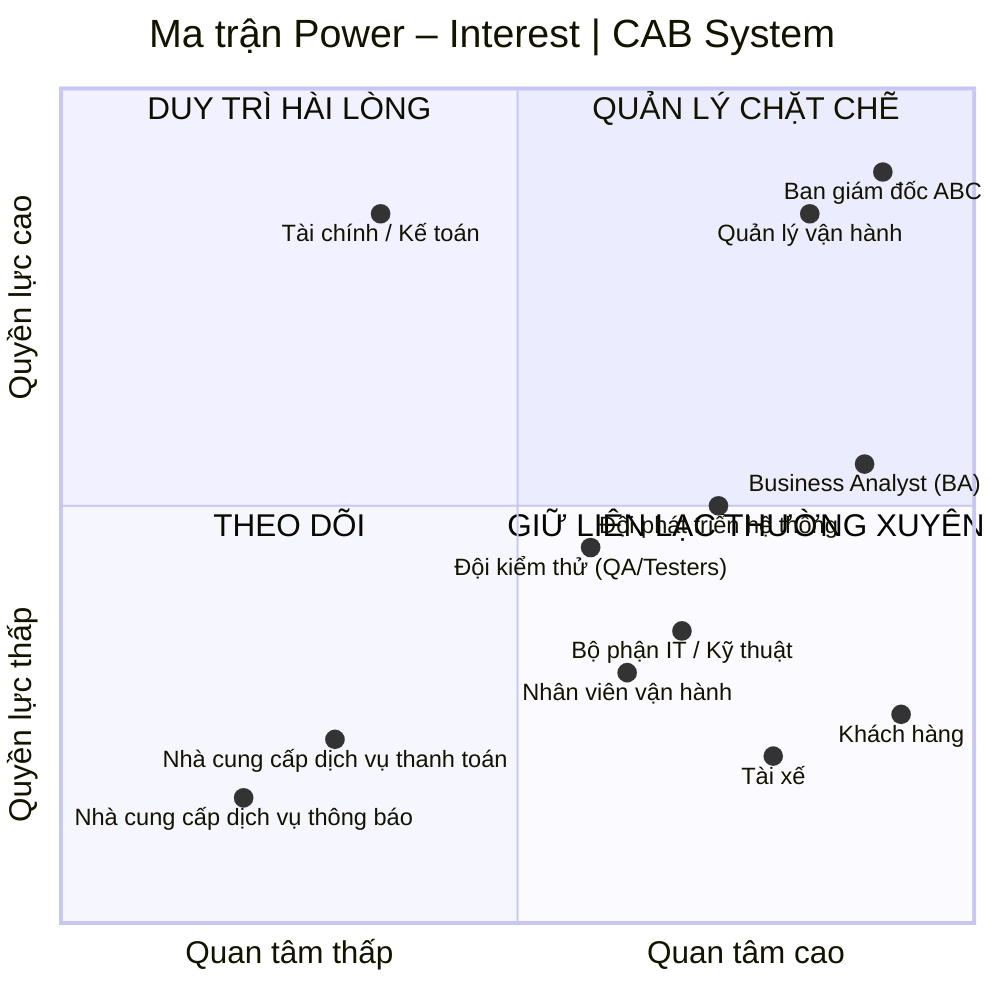

# 23640801_NguyenVanSang_capsystem
# 1. Hạn chế của hệ thống cũ
| STT | Hạn chế                                               | Mô tả                                                                                                                            |
| --: | ----------------------------------------------------- | -------------------------------------------------------------------------------------------------------------------------------- |
|   1 | **Phân công tài xế thủ công**                         | Việc tìm và phân công tài xế chủ yếu do tổng đài/nhân viên thực hiện, mất thời gian và khó đáp ứng khi số lượng chuyến tăng cao. |
|   2 | **Khó theo dõi trạng thái chuyến đi**                 | Khách hàng khó biết hệ thống đang tìm tài xế, tài xế nào nhận chuyến, tài xế đang ở đâu và chuyến đang ở trạng thái nào.         |
|   3 | **Thông tin thanh toán chưa tập trung**               | Dữ liệu thanh toán chưa được quản lý tập trung, gây khó khăn trong tra cứu giao dịch và quản lý doanh thu.                       |
|   4 | **Khó mở rộng hệ thống**                              | Kiến trúc hiện tại chưa đáp ứng tốt khi số lượng khách hàng, tài xế và chuyến đi tăng lên.                                       |
|   5 | **Phụ thuộc nhiều vào tổng đài**                      | Khách hàng vẫn phải liên hệ tổng đài trong nhiều trường hợp, làm tăng khối lượng công việc cho nhân viên vận hành.               |
|   6 | **Chưa tự động hóa việc tìm tài xế**                  | Chưa có cơ chế tự động xác định tài xế phù hợp dựa trên vị trí, trạng thái sẵn sàng và các tiêu chí vận hành.                    |
|   7 | **Khó xử lý khi tài xế từ chối/không phản hồi**       | Chưa có cơ chế tự động chuyển yêu cầu sang tài xế khác mà không yêu cầu khách hàng đặt lại chuyến.                               |
|   8 | **Quản lý thông tin chưa tập trung**                  | Thông tin khách hàng, tài xế, phương tiện, chuyến đi và giao dịch chưa được quản lý trên một nền tảng thống nhất.                |
|   9 | **Hạn chế về thông báo**                              | Chưa có hệ thống thông báo linh hoạt cho các sự kiện như tài xế nhận chuyến, đến điểm đón, hoàn thành chuyến hoặc thanh toán.    |
|  10 | **Khó quản lý và giám sát vận hành**                  | Nhân viên vận hành gặp khó khăn khi theo dõi chuyến đang chạy, trạng thái tài xế, giao dịch và các trường hợp phát sinh.         |
|  11 | **Khả năng báo cáo hạn chế**                          | Ban lãnh đạo chưa có đầy đủ dữ liệu để theo dõi doanh thu, số chuyến, tỷ lệ hoàn thành, tỷ lệ hủy và hiệu quả tài xế.            |
|  12 | **Khó mở rộng tính năng**                             | Việc bổ sung dịch vụ, phương thức thanh toán hoặc kênh thông báo mới có thể ảnh hưởng đến hệ thống hiện tại.                     |
|  13 | **Khả năng chịu tải chưa tốt**                        | Hệ thống chưa được thiết kế tối ưu cho những thời điểm nhu cầu đặt xe tăng cao.                                                  |
|  14 | **Khả năng cô lập lỗi hạn chế**                       | Lỗi ở một chức năng như thanh toán hoặc thông báo có nguy cơ ảnh hưởng đến hoạt động chung.                                      |
|  15 | **Bảo mật và kiểm soát truy cập chưa đáp ứng đầy đủ** | Hệ thống mới cần tăng cường xác thực, phân quyền, bảo vệ dữ liệu cá nhân, dữ liệu vị trí và lưu vết thao tác.                    |

## Tóm lại

Ba vấn đề lớn nhất của hệ thống cũ là:

1. **Phân công tài xế thủ công**
2. **Khó theo dõi chuyến đi**
3. **Khó mở rộng và quản lý tập trung**

Đây chính là những vấn đề mà **CAB System mới** cần giải quyết.

# # 2. Ai là người sử dụng hệ thống?

CAB System có **3 nhóm người dùng chính**, ngoài ra còn có các bên sử dụng dữ liệu hoặc quản lý hệ thống.

| Nhóm người dùng                   | Người sử dụng                     | Mục đích sử dụng chính                                                                               |
| --------------------------------- | --------------------------------- | ---------------------------------------------------------------------------------------------------- |
| **Khách hàng**                    | Người có nhu cầu đặt xe           | Đăng ký, đăng nhập, đặt xe, theo dõi chuyến, thanh toán, xem lịch sử và đánh giá tài xế.             |
| **Tài xế**                        | Tài xế của ABC                    | Quản lý hồ sơ, phương tiện, trạng thái hoạt động, nhận/từ chối chuyến và cập nhật trạng thái chuyến. |
| **Nhân viên vận hành**            | Điều phối viên/nhân viên vận hành | Theo dõi chuyến, tài xế, khách hàng, hỗ trợ xử lý sự cố và điều phối hoạt động.                      |
| **Quản trị viên**                 | Nhân viên có quyền quản trị       | Quản lý tài khoản, phân quyền, cấu hình hệ thống và thực hiện các thao tác nhạy cảm.                 |
| **Ban giám đốc**                  | Lãnh đạo ABC                      | Theo dõi báo cáo, doanh thu, số lượng chuyến, tỷ lệ hoàn thành/hủy và hiệu quả vận hành.             |
| **Bộ phận kế toán/tài chính**     | Nhân viên tài chính               | Tra cứu giao dịch, doanh thu, thanh toán và thực hiện đối soát.                                      |
| **Hệ thống thanh toán bên ngoài** | Cổng/nhà cung cấp thanh toán      | Xử lý thanh toán điện tử và trả kết quả giao dịch cho hệ thống.                                      |
| **Nhà cung cấp thông báo**        | SMS/Email/Push Notification       | Gửi thông báo đến khách hàng và tài xế.                                                              |

## 2.1. Ba tác nhân chính

Nếu bài yêu cầu xác định **Primary Actors (tác nhân chính)**, có thể xác định 3 tác nhân chính như sau:

1. **Khách hàng (Customer)**
2. **Tài xế (Driver)**
3. **Nhân viên vận hành (Operator)**

Đây là các tác nhân **trực tiếp tương tác và sử dụng các chức năng cốt lõi của CAB System**.

## 2.2. Các tác nhân và bên liên quan bổ sung

Ngoài 3 tác nhân chính, hệ thống còn có các tác nhân/bên liên quan:

* **Quản trị viên (Administrator):** quản lý tài khoản, phân quyền và cấu hình hệ thống.
* **Ban giám đốc (Management):** khai thác báo cáo và dữ liệu phục vụ quản lý, ra quyết định.
* **Bộ phận kế toán/tài chính (Finance):** quản lý và đối soát các giao dịch, doanh thu.
* **Payment Gateway:** cung cấp dịch vụ xử lý thanh toán điện tử.
* **Notification Provider:** cung cấp dịch vụ gửi SMS, Email hoặc Push Notification.

### Kết luận

Có thể phân loại tác nhân của CAB System thành:

**Primary Actors:**

> Khách hàng → Tài xế → Nhân viên vận hành

**Supporting/Secondary Actors:**

> Quản trị viên → Ban giám đốc → Kế toán/Tài chính → Payment Gateway → Notification Provider
## 3. Danh sách các bên liên quan

| STT | Bên liên quan | Vai trò |
|---:|---|---|
| 1 | **Ban giám đốc ABC** | **Sponsor / Decision Maker** – Định hướng mục tiêu dự án, phê duyệt phạm vi và các quyết định quan trọng; yêu cầu hệ thống đáp ứng mục tiêu kinh doanh, ổn định và có khả năng mở rộng. |
| 2 | **Business Analyst (BA)** | **Business Analyst / Requirement Analyst** – Thu thập, phân tích và làm rõ yêu cầu; xác định phạm vi, tác nhân, quy trình nghiệp vụ, yêu cầu chức năng, phi chức năng, quy tắc nghiệp vụ, ngoại lệ và các vấn đề cần xác nhận. |
| 3 | **Quản lý vận hành** | **Business Owner / Operations Manager** – Xác định và quản lý các quy trình vận hành, tiêu chí phân công tài xế, xử lý chuyến lỗi, chính sách hủy và theo dõi hiệu quả hoạt động. |
| 4 | **Nhân viên vận hành** | **Operational User** – Quản lý khách hàng, tài xế, phương tiện và chuyến đi; theo dõi chuyến đang diễn ra, kiểm tra trạng thái và xử lý các trường hợp bất thường. |
| 5 | **Khách hàng** | **End User** – Đăng ký/đăng nhập, đặt xe, theo dõi chuyến, xem lịch sử, thanh toán và đánh giá tài xế. |
| 6 | **Tài xế** | **End User / Service Provider** – Quản lý hồ sơ và phương tiện, cập nhật trạng thái hoạt động, nhận/từ chối chuyến, cập nhật trạng thái chuyến và vị trí. |
| 7 | **Bộ phận Tài chính / Kế toán** | **Business Stakeholder** – Quản lý và đối soát cước, thanh toán, doanh thu và lịch sử giao dịch; quan tâm đến tính chính xác của dữ liệu tài chính. |
| 8 | **Đội phát triển hệ thống** | **Development Team** – Thiết kế, xây dựng, tích hợp và triển khai các chức năng của CAB System theo yêu cầu đã được phê duyệt. |
| 9 | **Đội kiểm thử (QA/Testers)** | **Quality Assurance** – Kiểm thử chức năng, hiệu năng, bảo mật và các trường hợp ngoại lệ; đảm bảo hệ thống đáp ứng yêu cầu trước khi triển khai. |
| 10 | **Bộ phận IT / Kỹ thuật** | **Technical / Infrastructure Stakeholder** – Đảm bảo hạ tầng, triển khai, giám sát, khả năng mở rộng, tính ổn định và khả năng bảo trì của hệ thống. |
| 11 | **Nhà cung cấp dịch vụ thanh toán** | **External System / Payment Provider** – Xử lý thanh toán điện tử bên ngoài và trả kết quả giao dịch cho CAB System; hệ thống CAB không lưu trực tiếp dữ liệu thanh toán nhạy cảm. |
| 12 | **Nhà cung cấp dịch vụ thông báo** | **External System / Notification Provider** – Cung cấp các kênh gửi thông báo cho khách hàng và tài xế; có khả năng thay đổi hoặc bổ sung nhà cung cấp trong tương lai. |

# 4. Phân loại các bên liên quan theo mức độ ảnh hưởng

Có thể sử dụng **ma trận Power – Interest (Quyền lực – Mức độ quan tâm)** để phân tích và xác định chiến lược quản lý các bên liên quan.

| Mức độ                             | Bên liên quan                                                                                                             | Cách quản lý                              |
| ---------------------------------- | ------------------------------------------------------------------------------------------------------------------------- | ----------------------------------------- |
| **Quyền lực cao – Quan tâm cao**   | **Ban giám đốc ABC, Quản lý vận hành**                                                                                    | **Quản lý chặt chẽ**                      |
| **Quyền lực cao – Quan tâm thấp**  | **Bộ phận Tài chính / Kế toán**                                                                                           | **Duy trì sự hài lòng**                   |
| **Quyền lực thấp – Quan tâm cao**  | **BA, Nhân viên vận hành, Khách hàng, Tài xế, Đội phát triển hệ thống, Đội kiểm thử (QA/Testers), Bộ phận IT / Kỹ thuật** | **Giữ liên lạc và cập nhật thường xuyên** |
| **Quyền lực thấp – Quan tâm thấp** | **Nhà cung cấp dịch vụ thanh toán, Nhà cung cấp dịch vụ thông báo**                                                       | **Theo dõi**                              |


# 5. Ma trận các bên liên quan

## 5.1. Ma trận Power – Interest

|                    | **Quan tâm thấp**                                                                     | **Quan tâm cao**                                                                                                                                                                                    |
| ------------------ | ------------------------------------------------------------------------------------- | --------------------------------------------------------------------------------------------------------------------------------------------------------------------------------------------------- |
| **Quyền lực cao**  | **Duy trì hài lòng**<br>• Bộ phận Tài chính / Kế toán                                 | **Quản lý chặt chẽ**<br>• Ban giám đốc ABC / Sponsor<br>• Quản lý vận hành                                                                                                                          |
| **Quyền lực thấp** | **Theo dõi**<br>• Nhà cung cấp dịch vụ thanh toán<br>• Nhà cung cấp dịch vụ thông báo | **Giữ liên lạc thường xuyên**<br>• Business Analyst (BA)<br>• Nhân viên vận hành<br>• Khách hàng<br>• Tài xế<br>• Đội phát triển hệ thống<br>• Đội kiểm thử (QA/Testers)<br>• Bộ phận IT / Kỹ thuật |


# 6. Ma trận chi tiết: Quyền lực – Mức độ quan tâm – Chiến lược

| Bên liên quan                       | Quyền lực  | Quan tâm          | Mức độ ảnh hưởng  | Chiến lược                                                                                                                 |
| ----------------------------------- | ---------- | ----------------- | ----------------- | -------------------------------------------------------------------------------------------------------------------------- |
| **Ban giám đốc ABC**                | Cao        | Cao               | Rất cao           | Quản lý chặt chẽ, báo cáo tiến độ, phạm vi, rủi ro và các vấn đề quan trọng để ra quyết định kịp thời.                     |
| **Business Analyst (BA)**           | Trung bình | Cao               | Cao               | Tham gia thu thập, phân tích, làm rõ và quản lý yêu cầu; kết nối giữa các bên liên quan và đội phát triển.                 |
| **Quản lý vận hành**                | Cao        | Cao               | Rất cao           | Tham gia xác định nghiệp vụ, xác nhận quy trình vận hành, tiêu chí phân công tài xế, xử lý ngoại lệ và UAT.                |
| **Nhân viên vận hành**              | Thấp       | Cao               | Cao               | Thu thập phản hồi thực tế, tham gia kiểm thử các chức năng quản lý khách hàng, tài xế, phương tiện và chuyến đi.           |
| **Khách hàng**                      | Thấp       | Cao               | Cao               | Khảo sát nhu cầu, lấy phản hồi và kiểm thử trải nghiệm đặt xe, theo dõi chuyến, thanh toán và đánh giá.                    |
| **Tài xế**                          | Thấp       | Cao               | Cao               | Thu thập yêu cầu thực tế, lấy phản hồi và kiểm thử quy trình nhận/từ chối chuyến, cập nhật trạng thái và vị trí.           |
| **Bộ phận Tài chính / Kế toán**     | Cao        | Trung bình        | Cao               | Tham vấn về thanh toán, đối soát cước, doanh thu và lịch sử giao dịch; đảm bảo tính chính xác của dữ liệu tài chính.       |
| **Đội phát triển hệ thống**         | Trung bình | Cao               | Cao               | Tham gia phân tích tính khả thi, thiết kế, xây dựng, tích hợp và triển khai các chức năng của CAB System.                  |
| **Đội kiểm thử (QA/Testers)**       | Trung bình | Cao               | Cao               | Kiểm thử chức năng, hiệu năng, bảo mật và các trường hợp ngoại lệ; xác nhận hệ thống đáp ứng yêu cầu trước khi triển khai. |
| **Bộ phận IT / Kỹ thuật**           | Trung bình | Cao               | Cao               | Đảm bảo hạ tầng, triển khai, giám sát, hiệu năng, khả năng mở rộng, tính ổn định và khả năng bảo trì hệ thống.             |
| **Nhà cung cấp dịch vụ thanh toán** | Thấp       | Thấp – Trung bình | Trung bình        | Quản lý tích hợp, theo dõi trạng thái giao dịch và SLA; phối hợp xử lý các vấn đề liên quan đến thanh toán.                |
| **Nhà cung cấp dịch vụ thông báo**  | Thấp       | Thấp – Trung bình | Thấp – Trung bình | Theo dõi tích hợp và khả năng cung cấp dịch vụ; đảm bảo hệ thống có thể thay đổi hoặc bổ sung nhà cung cấp khi cần.        |


# 6.1 Ma trận Power – Interest

## 7. Business Goals – CAB System

| STT | Business Goal | Mô tả |
|---:|---|---|
| **1** | **Hiện đại hóa và số hóa quy trình đặt xe** | Xây dựng nền tảng CAB mới thay thế các quy trình thủ công và hệ thống hiện tại còn hạn chế, giúp tự động hóa quy trình từ đặt xe, tìm tài xế, thực hiện chuyến đến thanh toán và đánh giá. |
| **2** | **Nâng cao trải nghiệm khách hàng** | Giúp khách hàng đặt xe thuận tiện, theo dõi trạng thái chuyến đi, biết thông tin tài xế, thời gian dự kiến đến, lịch sử chuyến, chi phí và đánh giá sau chuyến. |
| **3** | **Tự động hóa và nâng cao hiệu quả điều phối tài xế** | Giảm phụ thuộc vào phân công thủ công bằng cơ chế tự động tìm và ưu tiên tài xế phù hợp, gần khách hàng và đang sẵn sàng nhận chuyến. |
| **4** | **Tăng tỷ lệ chuyến được phục vụ và hoàn thành** | Có cơ chế tiếp tục tìm tài xế khác khi tài xế được đề xuất từ chối hoặc không phản hồi, qua đó giảm số chuyến không được phục vụ và nâng cao tỷ lệ hoàn thành chuyến. |
| **5** | **Quản lý tập trung dữ liệu và hoạt động kinh doanh** | Tập trung dữ liệu khách hàng, tài xế, phương tiện, chuyến đi, thanh toán và giao dịch để các bộ phận vận hành, tài chính và quản lý có thể tra cứu và phối hợp hiệu quả. |
| **6** | **Nâng cao hiệu quả quản lý doanh thu và thanh toán** | Chuẩn hóa quy trình tính cước, thanh toán và đối soát; hỗ trợ tiền mặt và thanh toán điện tử thông qua nhà cung cấp bên ngoài, đồng thời hạn chế rủi ro đối với dữ liệu thanh toán nhạy cảm. |
| **7** | **Tăng khả năng giám sát và ra quyết định** | Cung cấp dữ liệu và báo cáo về số lượng chuyến, doanh thu, tỷ lệ hoàn thành, tỷ lệ hủy và hiệu quả hoạt động của tài xế để ban lãnh đạo và quản lý vận hành đưa ra quyết định. |
| **8** | **Đảm bảo hệ thống ổn định, an toàn và tin cậy** | Bảo vệ dữ liệu cá nhân, dữ liệu vị trí và giao dịch; kiểm soát quyền truy cập, lưu vết các thao tác quan trọng và hạn chế lỗi của một thành phần ảnh hưởng đến toàn bộ hệ thống. |
| **9** | **Đảm bảo khả năng mở rộng quy mô kinh doanh** | Xây dựng nền tảng có khả năng phục vụ số lượng lớn khách hàng và tài xế, đồng thời cho phép các thành phần được mở rộng độc lập khi nhu cầu tăng cao. |
| **10** | **Tạo nền tảng linh hoạt cho phát triển lâu dài** | Cho phép doanh nghiệp bổ sung loại dịch vụ, phương thức thanh toán, kênh thông báo hoặc thay đổi nhà cung cấp và thành phần kỹ thuật trong tương lai mà không phải xây dựng lại toàn bộ hệ thống. |
| **11** | **Đảm bảo triển khai sản phẩm đúng thời hạn 7 tuần** | Hoàn thành và đưa hệ thống CAB vào vận hành trong thời gian 7 tuần theo kỳ vọng của Ban giám đốc, đồng thời ưu tiên các năng lực kinh doanh quan trọng trong phạm vi dự án. |

### Business Goals cốt lõi

Nếu cần trình bày ngắn gọn trong bài BA, có thể sử dụng **6 mục tiêu kinh doanh chính** sau:

| STT | Business Goal |
|---:|---|
| **1** | **Số hóa và tự động hóa hoạt động đặt xe, điều phối và quản lý chuyến đi.** |
| **2** | **Nâng cao trải nghiệm và mức độ hài lòng của khách hàng.** |
| **3** | **Nâng cao hiệu quả vận hành và khả năng sử dụng nguồn lực tài xế.** |
| **4** | **Quản lý tập trung và minh bạch dữ liệu chuyến đi, thanh toán và doanh thu.** |
| **5** | **Đảm bảo hệ thống an toàn, ổn định và có khả năng mở rộng.** |
| **6** | **Xây dựng nền tảng CAB linh hoạt, có khả năng phát triển thêm dịch vụ và tích hợp trong tương lai.** |

# 8. Phạm vi MVP đề xuất trong 7 tuần
## MVP – Danh sách Module và Chức năng

| STT | Module | Chức năng chính trong MVP | Ưu tiên |
|---:|---|---|---|
| **1** | **Quản lý tài khoản & phân quyền** | Đăng nhập, quản lý tài khoản khách hàng/tài xế/nhân viên, phân quyền, khóa/mở khóa tài khoản | 🔴 Rất cao |
| **2** | **Quản lý khách hàng** | Xem, tìm kiếm, cập nhật, khóa/mở khóa thông tin khách hàng | 🔴 Cao |
| **3** | **Quản lý tài xế & phương tiện** | Quản lý hồ sơ tài xế, trạng thái hoạt động, thông tin xe, gán tài xế với phương tiện | 🔴 Rất cao |
| **4** | **Quản lý đặt xe & chuyến đi** | Tạo chuyến, quản lý trạng thái chuyến, xem chi tiết, hủy chuyến, xử lý chuyến lỗi | 🔴 Rất cao |
| **5** | **Tìm kiếm & phân công tài xế** | Tìm tài xế phù hợp, ưu tiên tài xế gần khách, gửi yêu cầu, chuyển sang tài xế khác khi từ chối/không phản hồi | 🔴 Rất cao |
| **6** | **Quản lý cước & thanh toán** | Tính cước, tiền mặt, thanh toán điện tử, quản lý trạng thái giao dịch, xử lý thanh toán thất bại | 🔴 Cao |
| **7** | **Quản lý thông báo** | Thông báo đặt xe, tài xế nhận chuyến, trạng thái chuyến, hoàn thành chuyến, kết quả thanh toán | 🟠 Cao |
| **8** | **Đánh giá tài xế** | Khách hàng đánh giá sau chuyến, nhân viên xem đánh giá | 🟡 Trung bình |
| **9** | **Dashboard & báo cáo** | Số chuyến, doanh thu, hoàn thành, hủy chuyến, hiệu quả tài xế | 🟠 Cao |

---

## Phạm vi giới hạn trong 7 tuần

### Bắt buộc phải làm

**Module 1 → 7**

- Quản lý tài khoản & phân quyền
- Quản lý khách hàng
- Quản lý tài xế & phương tiện
- Quản lý đặt xe & chuyến đi
- Tìm kiếm & phân công tài xế
- Quản lý cước & thanh toán
- Quản lý thông báo

### Có thể làm ở mức tối thiểu

**Module 8 → 9**

- Đánh giá tài xế
- Dashboard & báo cáo

### Đưa vào Phase 2

| STT | Tính năng Phase 2 |
|---:|---|
| 1 | Khuyến mãi / Voucher |
| 2 | Loyalty / Chương trình khách hàng thân thiết |
| 3 | Nhiều cổng thanh toán |
| 4 | Nhiều kênh thông báo |
| 5 | Thuật toán phân tài xế nâng cao |
| 6 | Bảo dưỡng xe |
| 7 | Báo cáo BI nâng cao |

---

## Core Flow

```text
Quản lý tài khoản
        ↓
Quản lý khách hàng / tài xế / phương tiện
        ↓
Đặt xe
        ↓
Phân tài xế
        ↓
Thực hiện chuyến
        ↓
Tính cước
        ↓
Thanh toán
        ↓
Thông báo
```
## Business Requirements – CAB System

| Mã | Business Requirement | Mô tả yêu cầu nghiệp vụ | Mức độ |
|---|---|---|---|
| **BR-01** | **Quản lý khách hàng tập trung** | Doanh nghiệp cần quản lý tập trung thông tin và trạng thái khách hàng để hỗ trợ quá trình đặt xe và vận hành dịch vụ. | 🔴 Cao |
| **BR-02** | **Quản lý tài xế tập trung** | Doanh nghiệp cần quản lý hồ sơ, trạng thái hoạt động và khả năng nhận chuyến của tài xế để phục vụ việc phân công xe. | 🔴 Rất cao |
| **BR-03** | **Quản lý phương tiện** | Doanh nghiệp cần quản lý thông tin phương tiện và mối quan hệ giữa tài xế với phương tiện nhằm đảm bảo xe được sử dụng đúng trong quá trình cung cấp dịch vụ. | 🔴 Cao |
| **BR-04** | **Số hóa quy trình đặt xe** | Doanh nghiệp cần số hóa quy trình từ khi khách hàng gửi yêu cầu đặt xe đến khi chuyến đi được tiếp nhận và thực hiện, thay thế các thao tác thủ công hiện tại. | 🔴 Rất cao |
| **BR-05** | **Tự động hóa phân công tài xế** | Doanh nghiệp cần tự động tìm kiếm và ưu tiên tài xế phù hợp dựa trên vị trí, trạng thái sẵn sàng và các tiêu chí vận hành đã thống nhất. | 🔴 Rất cao |
| **BR-06** | **Đảm bảo khả năng xử lý khi tài xế không nhận chuyến** | Doanh nghiệp cần có cơ chế tiếp tục tìm tài xế khác khi tài xế được đề xuất từ chối hoặc không phản hồi, tránh yêu cầu khách hàng đặt lại chuyến. | 🔴 Rất cao |
| **BR-07** | **Quản lý và theo dõi chuyến đi** | Doanh nghiệp cần quản lý tập trung toàn bộ chuyến đi và cho phép các bộ phận liên quan theo dõi trạng thái chuyến từ lúc tạo yêu cầu đến khi hoàn thành hoặc hủy. | 🔴 Rất cao |
| **BR-08** | **Minh bạch trạng thái chuyến cho khách hàng** | Doanh nghiệp cần cung cấp thông tin để khách hàng biết tình trạng yêu cầu đặt xe, tài xế được phân công, thời gian dự kiến đến và trạng thái chuyến. | 🔴 Cao |
| **BR-09** | **Quản lý tính cước** | Doanh nghiệp cần xác định số tiền khách hàng phải thanh toán dựa trên loại dịch vụ và thông tin thực tế của chuyến đi. | 🔴 Cao |
| **BR-10** | **Quản lý thanh toán** | Doanh nghiệp cần hỗ trợ thanh toán tiền mặt và thanh toán điện tử, đồng thời quản lý trạng thái giao dịch để phục vụ đối soát và vận hành. | 🔴 Cao |
| **BR-11** | **Quản lý thông báo** | Doanh nghiệp cần đảm bảo khách hàng và tài xế nhận được thông tin quan trọng trong suốt vòng đời chuyến đi và giao dịch. | 🟠 Cao |
| **BR-12** | **Quản lý đánh giá dịch vụ** | Doanh nghiệp cần thu thập đánh giá của khách hàng sau chuyến đi để theo dõi chất lượng phục vụ của tài xế. | 🟡 Trung bình |
| **BR-13** | **Quản lý vận hành tập trung** | Bộ phận vận hành cần có khả năng theo dõi khách hàng, tài xế, phương tiện, chuyến đi và giao dịch trên một nền tảng thống nhất. | 🔴 Rất cao |
| **BR-14** | **Kiểm soát quyền truy cập nghiệp vụ** | Doanh nghiệp cần phân quyền nhân viên để đảm bảo chỉ những người có thẩm quyền mới được thực hiện các thao tác quản trị hoặc thao tác nhạy cảm. | 🔴 Cao |
| **BR-15** | **Theo dõi và báo cáo hoạt động** | Ban quản lý cần có dữ liệu về số lượng chuyến, doanh thu, tỷ lệ hoàn thành, tỷ lệ hủy và hiệu quả hoạt động của tài xế để hỗ trợ ra quyết định. | 🟠 Cao |
| **BR-16** | **Đảm bảo tính liên tục của dịch vụ** | Doanh nghiệp cần đảm bảo lỗi ở một thành phần như thanh toán hoặc thông báo không làm gián đoạn toàn bộ quy trình đặt xe. | 🔴 Cao |
| **BR-17** | **Bảo vệ dữ liệu nghiệp vụ** | Doanh nghiệp cần bảo vệ thông tin khách hàng, tài xế, phương tiện, vị trí và giao dịch, đồng thời lưu vết các thao tác quan trọng để phục vụ kiểm tra. | 🔴 Cao |
| **BR-18** | **Khả năng mở rộng dịch vụ** | Doanh nghiệp cần một nền tảng có khả năng bổ sung loại dịch vụ, phương thức thanh toán và kênh thông báo mới mà không phải xây dựng lại toàn bộ hệ thống. | 🟠 Cao |

# 9. Phân rã Functional Requirements

| Mã FR     | Functional Requirement             | Các chức năng chi tiết                                                                                                                                                                                                                                                                                                                                                                                                                                                    |
| --------- | ---------------------------------- | ------------------------------------------------------------------------------------------------------------------------------------------------------------------------------------------------------------------------------------------------------------------------------------------------------------------------------------------------------------------------------------------------------------------------------------------------------------------------- |
| **FR-01** | **Quản lý tài khoản & phân quyền** | FR-01.1 Đăng ký tài khoản khách hàng<br>FR-01.2 Tạo tài khoản tài xế<br>FR-01.3 Đăng nhập/đăng xuất<br>FR-01.4 Cập nhật thông tin cá nhân<br>FR-01.5 Khóa/mở khóa tài khoản<br>FR-01.6 Phân quyền khách hàng, tài xế, nhân viên, quản lý<br>FR-01.7 Kiểm soát quyền truy cập                                                                                                                                                                                              |
| **FR-02** | **Quản lý khách hàng**             | FR-02.1 Xem danh sách khách hàng<br>FR-02.2 Tìm kiếm khách hàng<br>FR-02.3 Xem chi tiết khách hàng<br>FR-02.4 Cập nhật thông tin khách hàng<br>FR-02.5 Khóa/mở khóa khách hàng<br>FR-02.6 Xem lịch sử chuyến đi<br>FR-02.7 Tra cứu giao dịch                                                                                                                                                                                                                              |
| **FR-03** | **Quản lý tài xế**                 | FR-03.1 Tạo tài khoản tài xế<br>FR-03.2 Xem danh sách tài xế<br>FR-03.3 Tìm kiếm tài xế<br>FR-03.4 Xem/cập nhật hồ sơ tài xế<br>FR-03.5 Khóa/mở khóa tài xế<br>FR-03.6 Cập nhật trạng thái hoạt động<br>FR-03.7 Cập nhật trạng thái sẵn sàng nhận chuyến<br>FR-03.8 Theo dõi vị trí tài xế                                                                                                                                                                                |
| **FR-04** | **Quản lý phương tiện**            | FR-04.1 Thêm phương tiện<br>FR-04.2 Xem danh sách phương tiện<br>FR-04.3 Tìm kiếm phương tiện<br>FR-04.4 Xem thông tin phương tiện<br>FR-04.5 Cập nhật thông tin phương tiện<br>FR-04.6 Cập nhật trạng thái phương tiện<br>FR-04.7 Gán phương tiện cho tài xế<br>FR-04.8 Quản lý loại xe                                                                                                                                                                                  |
| **FR-05** | **Đặt xe**                         | FR-05.1 Nhập điểm đón<br>FR-05.2 Nhập điểm đến<br>FR-05.3 Chọn loại xe<br>FR-05.4 Gửi yêu cầu đặt xe<br>FR-05.5 Tạo chuyến<br>FR-05.6 Xác nhận yêu cầu đặt xe<br>FR-05.7 Chuyển chuyến sang trạng thái tìm tài xế<br>FR-05.8 Hủy chuyến theo chính sách                                                                                                                                                                                                                   |
| **FR-06** | **Tìm kiếm & phân công tài xế**    | FR-06.1 Tìm tài xế đang sẵn sàng<br>FR-06.2 Kiểm tra loại xe phù hợp<br>FR-06.3 Xác định khoảng cách đến điểm đón<br>FR-06.4 Ưu tiên tài xế phù hợp/gần khách<br>FR-06.5 Gửi yêu cầu nhận chuyến<br>FR-06.6 Tài xế chấp nhận chuyến<br>FR-06.7 Tài xế từ chối chuyến<br>FR-06.8 Xử lý tài xế không phản hồi<br>FR-06.9 Tự động tìm tài xế tiếp theo<br>FR-06.10 Gán chuyến cho tài xế<br>FR-06.11 Thông báo khi có tài xế<br>FR-06.12 Thông báo khi không tìm được tài xế |
| **FR-07** | **Quản lý & theo dõi chuyến đi**   | FR-07.1 Tài xế xác nhận nhận chuyến<br>FR-07.2 Cập nhật đã đến điểm đón<br>FR-07.3 Cập nhật đã đón khách<br>FR-07.4 Cập nhật đang di chuyển<br>FR-07.5 Cập nhật hoàn thành chuyến<br>FR-07.6 Khách hàng theo dõi trạng thái chuyến<br>FR-07.7 Xem thông tin tài xế<br>FR-07.8 Xem thời gian dự kiến tài xế đến<br>FR-07.9 Nhân viên xem chuyến đang diễn ra<br>FR-07.10 Xem chi tiết chuyến<br>FR-07.11 Xử lý chuyến lỗi<br>FR-07.12 Lưu lịch sử chuyến                   |
| **FR-08** | **Quản lý cước**                   | FR-08.1 Xác định loại dịch vụ<br>FR-08.2 Ghi nhận thông tin chuyến<br>FR-08.3 Tính số tiền phải trả<br>FR-08.4 Hiển thị cước cho khách hàng<br>FR-08.5 Lưu thông tin cước<br>FR-08.6 Nhân viên tra cứu cước                                                                                                                                                                                                                                                               |
| **FR-09** | **Quản lý thanh toán**             | FR-09.1 Thanh toán tiền mặt<br>FR-09.2 Thanh toán điện tử<br>FR-09.3 Kết nối nhà cung cấp thanh toán<br>FR-09.4 Tiếp nhận kết quả giao dịch<br>FR-09.5 Cập nhật thanh toán thành công<br>FR-09.6 Cập nhật thanh toán thất bại<br>FR-09.7 Thông báo kết quả thanh toán<br>FR-09.8 Xử lý lại giao dịch thất bại<br>FR-09.9 Tra cứu lịch sử giao dịch                                                                                                                        |
| **FR-10** | **Quản lý thông báo**              | FR-10.1 Thông báo tiếp nhận yêu cầu đặt xe<br>FR-10.2 Thông báo tài xế nhận chuyến<br>FR-10.3 Thông báo tài xế đến điểm đón<br>FR-10.4 Thông báo hoàn thành chuyến<br>FR-10.5 Thông báo kết quả thanh toán<br>FR-10.6 Thông báo chuyến mới cho tài xế<br>FR-10.7 Thông báo thay đổi chuyến                                                                                                                                                                                |
| **FR-11** | **Đánh giá tài xế**                | FR-11.1 Khách hàng đánh giá sau chuyến<br>FR-11.2 Chọn mức điểm đánh giá<br>FR-11.3 Nhập nhận xét<br>FR-11.4 Lưu đánh giá<br>FR-11.5 Nhân viên xem đánh giá                                                                                                                                                                                                                                                                                                               |
| **FR-12** | **Quản lý vận hành**               | FR-12.1 Theo dõi chuyến đang hoạt động<br>FR-12.2 Theo dõi trạng thái tài xế<br>FR-12.3 Tra cứu khách hàng<br>FR-12.4 Tra cứu tài xế<br>FR-12.5 Tra cứu phương tiện<br>FR-12.6 Tra cứu chuyến đi<br>FR-12.7 Tra cứu giao dịch<br>FR-12.8 Xử lý chuyến lỗi                                                                                                                                                                                                                 |
| **FR-13** | **Dashboard & báo cáo**            | FR-13.1 Thống kê tổng số chuyến<br>FR-13.2 Thống kê chuyến hoàn thành<br>FR-13.3 Thống kê chuyến hủy<br>FR-13.4 Thống kê doanh thu<br>FR-13.5 Tỷ lệ hoàn thành<br>FR-13.6 Tỷ lệ hủy<br>FR-13.7 Hiệu quả tài xế                                                                                                                                                                                                                                                            |
| **FR-14** | **Audit & kiểm soát**              | FR-14.1 Ghi nhận thao tác quản trị quan trọng<br>FR-14.2 Ghi nhận người thực hiện<br>FR-14.3 Ghi nhận thời gian thao tác<br>FR-14.4 Tra cứu lịch sử thao tác<br>FR-14.5 Kiểm soát truy cập dữ liệu                                                                                                                                                                                                                                                                        |

## Phạm vi MVP trong 7 tuần

| Nhóm           | Module                         | Phạm vi          |
| -------------- | ------------------------------ | ---------------- |
| **Core**       | Quản lý tài khoản & phân quyền | ✅ Bắt buộc       |
| **Core**       | Quản lý khách hàng             | ✅ Bắt buộc       |
| **Core**       | Quản lý tài xế                 | ✅ Bắt buộc       |
| **Core**       | Quản lý phương tiện            | ✅ Bắt buộc       |
| **Core**       | Đặt xe                         | ✅ Bắt buộc       |
| **Core**       | Tìm kiếm & phân công tài xế    | ✅ Bắt buộc       |
| **Core**       | Quản lý chuyến đi              | ✅ Bắt buộc       |
| **Core**       | Quản lý cước & thanh toán      | ✅ Bắt buộc       |
| **Core**       | Quản lý thông báo              | ✅ Bắt buộc       |
| **Supporting** | Đánh giá tài xế                | 🟡 Mức tối thiểu |
| **Supporting** | Dashboard & báo cáo            | 🟡 Mức cơ bản    |
| **Supporting** | Audit & kiểm soát              | 🟡 Mức cơ bản    |

### Kết luận phạm vi Functional Requirements

Với thời gian xây dựng và triển khai sản phẩm **7 tuần**, phạm vi Functional Requirements chính nên tập trung vào **FR-01 đến FR-10** nhằm bảo đảm đầy đủ luồng nghiệp vụ cốt lõi của hệ thống CAB, từ quản lý tài khoản, đặt xe, phân công tài xế, quản lý chuyến, tính cước đến thanh toán và thông báo.

Các chức năng **FR-11 đến FR-14** chỉ nên triển khai ở **mức tối thiểu/cơ bản** trong MVP, tránh mở rộng phạm vi dự án quá mức và ảnh hưởng đến tiến độ 7 tuần.

**Phạm vi MVP đề xuất:**

* **FR-01 → FR-10:** Phạm vi **bắt buộc – Core**
* **FR-11:** Triển khai **mức tối thiểu**
* **FR-12:** Có thể triển khai **mức cơ bản**, tập trung vào các chức năng hỗ trợ vận hành thiết yếu
* **FR-13:** Triển khai **Dashboard & báo cáo cơ bản**
* **FR-14:** Triển khai **Audit & kiểm soát cơ bản**, ưu tiên các thao tác quản trị quan trọng
# 10. use case diagram
# 11. Đặc tả use case 
# 12. Phân tích quy trình nghiệp vụ (business project )
# 13. Phân tích quy tắc nghiệp vụ (business rules )
