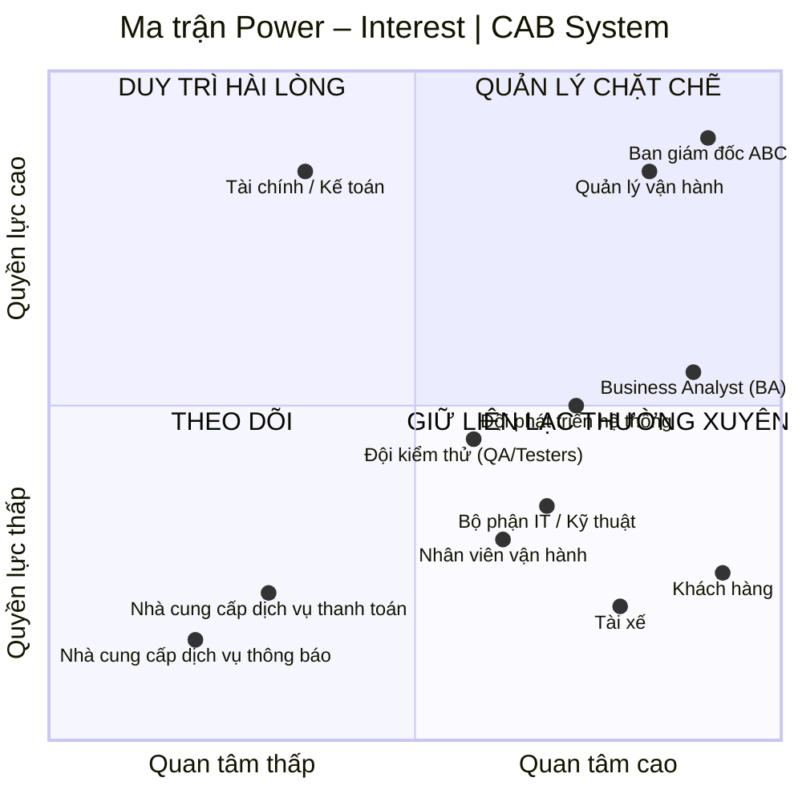

# 23640801_NguyenVanSang_capsystem
# 1. Hạn chế của hệ thống cũ
| STT | Hạn chế                                               | Mô tả                                                                                                                            |
| --: | ----------------------------------------------------- | -------------------------------------------------------------------------------------------------------------------------------- |
|   1 | **Phân công tài xế thủ công**                         | Việc tìm và phân công tài xế chủ yếu do tổng đài/nhân viên thực hiện, mất thời gian và khó đáp ứng khi số lượng chuyến tăng cao. |
|   2 | **Khó theo dõi trạng thái chuyến đi**                 | Khách hàng khó biết hệ thống đang tìm tài xế, tài xế nào nhận chuyến, tài xế đang ở đâu và chuyến đang ở trạng thái nào.         |
|   3 | **Thông tin thanh toán chưa tập trung**               | Dữ liệu thanh toán chưa được quản lý tập trung, gây khó khăn trong tra cứu giao dịch và quản lý doanh thu.                       |
|   4 | **Khó mở rộng hệ thống**                              | Kiến trúc hiện tại chưa đáp ứng tốt khi số lượng khách hàng, tài xế và chuyến đi tăng lên.                                       |
|   5 | **Phụ thuộc nhiều vào tổng đài**                      | Khách hàng vẫn phải liên hệ tổng đài trong nhiều trường hợp, làm tăng khối lượng công việc cho nhân viên vận hành.               |
|   6 | **Chưa tự động hóa việc tìm tài xế**                  | Chưa có cơ chế tự động xác định tài xế phù hợp dựa trên vị trí, trạng thái sẵn sàng và các tiêu chí vận hành.                    |
|   7 | **Khó xử lý khi tài xế từ chối/không phản hồi**       | Chưa có cơ chế tự động chuyển yêu cầu sang tài xế khác mà không yêu cầu khách hàng đặt lại chuyến.                               |
|   8 | **Quản lý thông tin chưa tập trung**                  | Thông tin khách hàng, tài xế, phương tiện, chuyến đi và giao dịch chưa được quản lý trên một nền tảng thống nhất.                |
|   9 | **Hạn chế về thông báo**                              | Chưa có hệ thống thông báo linh hoạt cho các sự kiện như tài xế nhận chuyến, đến điểm đón, hoàn thành chuyến hoặc thanh toán.    |
|  10 | **Khó quản lý và giám sát vận hành**                  | Nhân viên vận hành gặp khó khăn khi theo dõi chuyến đang chạy, trạng thái tài xế, giao dịch và các trường hợp phát sinh.         |
|  11 | **Khả năng báo cáo hạn chế**                          | Ban lãnh đạo chưa có đầy đủ dữ liệu để theo dõi doanh thu, số chuyến, tỷ lệ hoàn thành, tỷ lệ hủy và hiệu quả tài xế.            |
|  12 | **Khó mở rộng tính năng**                             | Việc bổ sung dịch vụ, phương thức thanh toán hoặc kênh thông báo mới có thể ảnh hưởng đến hệ thống hiện tại.                     |
|  13 | **Khả năng chịu tải chưa tốt**                        | Hệ thống chưa được thiết kế tối ưu cho những thời điểm nhu cầu đặt xe tăng cao.                                                  |
|  14 | **Khả năng cô lập lỗi hạn chế**                       | Lỗi ở một chức năng như thanh toán hoặc thông báo có nguy cơ ảnh hưởng đến hoạt động chung.                                      |
|  15 | **Bảo mật và kiểm soát truy cập chưa đáp ứng đầy đủ** | Hệ thống mới cần tăng cường xác thực, phân quyền, bảo vệ dữ liệu cá nhân, dữ liệu vị trí và lưu vết thao tác.                    |

## Tóm lại

Ba vấn đề lớn nhất của hệ thống cũ là:

1. **Phân công tài xế thủ công**
2. **Khó theo dõi chuyến đi**
3. **Khó mở rộng và quản lý tập trung**

Đây chính là những vấn đề mà **CAB System mới** cần giải quyết.

# # 2. Ai là người sử dụng hệ thống?

CAB System có **3 nhóm người dùng chính**, ngoài ra còn có các bên sử dụng dữ liệu hoặc quản lý hệ thống.

| Nhóm người dùng                   | Người sử dụng                     | Mục đích sử dụng chính                                                                               |
| --------------------------------- | --------------------------------- | ---------------------------------------------------------------------------------------------------- |
| **Khách hàng**                    | Người có nhu cầu đặt xe           | Đăng ký, đăng nhập, đặt xe, theo dõi chuyến, thanh toán, xem lịch sử và đánh giá tài xế.             |
| **Tài xế**                        | Tài xế của ABC                    | Quản lý hồ sơ, phương tiện, trạng thái hoạt động, nhận/từ chối chuyến và cập nhật trạng thái chuyến. |
| **Nhân viên vận hành**            | Điều phối viên/nhân viên vận hành | Theo dõi chuyến, tài xế, khách hàng, hỗ trợ xử lý sự cố và điều phối hoạt động.                      |
| **Quản trị viên**                 | Nhân viên có quyền quản trị       | Quản lý tài khoản, phân quyền, cấu hình hệ thống và thực hiện các thao tác nhạy cảm.                 |
| **Ban giám đốc**                  | Lãnh đạo ABC                      | Theo dõi báo cáo, doanh thu, số lượng chuyến, tỷ lệ hoàn thành/hủy và hiệu quả vận hành.             |
| **Bộ phận kế toán/tài chính**     | Nhân viên tài chính               | Tra cứu giao dịch, doanh thu, thanh toán và thực hiện đối soát.                                      |
| **Hệ thống thanh toán bên ngoài** | Cổng/nhà cung cấp thanh toán      | Xử lý thanh toán điện tử và trả kết quả giao dịch cho hệ thống.                                      |
| **Nhà cung cấp thông báo**        | SMS/Email/Push Notification       | Gửi thông báo đến khách hàng và tài xế.                                                              |

## 2.1. Ba tác nhân chính

Nếu bài yêu cầu xác định **Primary Actors (tác nhân chính)**, có thể xác định 3 tác nhân chính như sau:

1. **Khách hàng (Customer)**
2. **Tài xế (Driver)**
3. **Nhân viên vận hành (Operator)**

Đây là các tác nhân **trực tiếp tương tác và sử dụng các chức năng cốt lõi của CAB System**.

## 2.2. Các tác nhân và bên liên quan bổ sung

Ngoài 3 tác nhân chính, hệ thống còn có các tác nhân/bên liên quan:

* **Quản trị viên (Administrator):** quản lý tài khoản, phân quyền và cấu hình hệ thống.
* **Ban giám đốc (Management):** khai thác báo cáo và dữ liệu phục vụ quản lý, ra quyết định.
* **Bộ phận kế toán/tài chính (Finance):** quản lý và đối soát các giao dịch, doanh thu.
* **Payment Gateway:** cung cấp dịch vụ xử lý thanh toán điện tử.
* **Notification Provider:** cung cấp dịch vụ gửi SMS, Email hoặc Push Notification.

### Kết luận

Có thể phân loại tác nhân của CAB System thành:

**Primary Actors:**

> Khách hàng → Tài xế → Nhân viên vận hành

**Supporting/Secondary Actors:**

> Quản trị viên → Ban giám đốc → Kế toán/Tài chính → Payment Gateway → Notification Provider
## 3. Danh sách các bên liên quan

| STT | Bên liên quan | Vai trò |
|---:|---|---|
| 1 | **Ban giám đốc ABC** | **Sponsor / Decision Maker** – Định hướng mục tiêu dự án, phê duyệt phạm vi và các quyết định quan trọng; yêu cầu hệ thống đáp ứng mục tiêu kinh doanh, ổn định và có khả năng mở rộng. |
| 2 | **Business Analyst (BA)** | **Business Analyst / Requirement Analyst** – Thu thập, phân tích và làm rõ yêu cầu; xác định phạm vi, tác nhân, quy trình nghiệp vụ, yêu cầu chức năng, phi chức năng, quy tắc nghiệp vụ, ngoại lệ và các vấn đề cần xác nhận. |
| 3 | **Quản lý vận hành** | **Business Owner / Operations Manager** – Xác định và quản lý các quy trình vận hành, tiêu chí phân công tài xế, xử lý chuyến lỗi, chính sách hủy và theo dõi hiệu quả hoạt động. |
| 4 | **Nhân viên vận hành** | **Operational User** – Quản lý khách hàng, tài xế, phương tiện và chuyến đi; theo dõi chuyến đang diễn ra, kiểm tra trạng thái và xử lý các trường hợp bất thường. |
| 5 | **Khách hàng** | **End User** – Đăng ký/đăng nhập, đặt xe, theo dõi chuyến, xem lịch sử, thanh toán và đánh giá tài xế. |
| 6 | **Tài xế** | **End User / Service Provider** – Quản lý hồ sơ và phương tiện, cập nhật trạng thái hoạt động, nhận/từ chối chuyến, cập nhật trạng thái chuyến và vị trí. |
| 7 | **Bộ phận Tài chính / Kế toán** | **Business Stakeholder** – Quản lý và đối soát cước, thanh toán, doanh thu và lịch sử giao dịch; quan tâm đến tính chính xác của dữ liệu tài chính. |
| 8 | **Đội phát triển hệ thống** | **Development Team** – Thiết kế, xây dựng, tích hợp và triển khai các chức năng của CAB System theo yêu cầu đã được phê duyệt. |
| 9 | **Đội kiểm thử (QA/Testers)** | **Quality Assurance** – Kiểm thử chức năng, hiệu năng, bảo mật và các trường hợp ngoại lệ; đảm bảo hệ thống đáp ứng yêu cầu trước khi triển khai. |
| 10 | **Bộ phận IT / Kỹ thuật** | **Technical / Infrastructure Stakeholder** – Đảm bảo hạ tầng, triển khai, giám sát, khả năng mở rộng, tính ổn định và khả năng bảo trì của hệ thống. |
| 11 | **Nhà cung cấp dịch vụ thanh toán** | **External System / Payment Provider** – Xử lý thanh toán điện tử bên ngoài và trả kết quả giao dịch cho CAB System; hệ thống CAB không lưu trực tiếp dữ liệu thanh toán nhạy cảm. |
| 12 | **Nhà cung cấp dịch vụ thông báo** | **External System / Notification Provider** – Cung cấp các kênh gửi thông báo cho khách hàng và tài xế; có khả năng thay đổi hoặc bổ sung nhà cung cấp trong tương lai. |

# 4. Phân loại các bên liên quan theo mức độ ảnh hưởng

Có thể sử dụng **ma trận Power – Interest (Quyền lực – Mức độ quan tâm)** để phân tích và xác định chiến lược quản lý các bên liên quan.

| Mức độ                             | Bên liên quan                                                                                                             | Cách quản lý                              |
| ---------------------------------- | ------------------------------------------------------------------------------------------------------------------------- | ----------------------------------------- |
| **Quyền lực cao – Quan tâm cao**   | **Ban giám đốc ABC, Quản lý vận hành**                                                                                    | **Quản lý chặt chẽ**                      |
| **Quyền lực cao – Quan tâm thấp**  | **Bộ phận Tài chính / Kế toán**                                                                                           | **Duy trì sự hài lòng**                   |
| **Quyền lực thấp – Quan tâm cao**  | **BA, Nhân viên vận hành, Khách hàng, Tài xế, Đội phát triển hệ thống, Đội kiểm thử (QA/Testers), Bộ phận IT / Kỹ thuật** | **Giữ liên lạc và cập nhật thường xuyên** |
| **Quyền lực thấp – Quan tâm thấp** | **Nhà cung cấp dịch vụ thanh toán, Nhà cung cấp dịch vụ thông báo**                                                       | **Theo dõi**                              |


# 5. Ma trận các bên liên quan

## 5.1. Ma trận Power – Interest

|                    | **Quan tâm thấp**                                                                     | **Quan tâm cao**                                                                                                                                                                                    |
| ------------------ | ------------------------------------------------------------------------------------- | --------------------------------------------------------------------------------------------------------------------------------------------------------------------------------------------------- |
| **Quyền lực cao**  | **Duy trì hài lòng**<br>• Bộ phận Tài chính / Kế toán                                 | **Quản lý chặt chẽ**<br>• Ban giám đốc ABC / Sponsor<br>• Quản lý vận hành                                                                                                                          |
| **Quyền lực thấp** | **Theo dõi**<br>• Nhà cung cấp dịch vụ thanh toán<br>• Nhà cung cấp dịch vụ thông báo | **Giữ liên lạc thường xuyên**<br>• Business Analyst (BA)<br>• Nhân viên vận hành<br>• Khách hàng<br>• Tài xế<br>• Đội phát triển hệ thống<br>• Đội kiểm thử (QA/Testers)<br>• Bộ phận IT / Kỹ thuật |


# 6. Ma trận chi tiết: Quyền lực – Mức độ quan tâm – Chiến lược

| Bên liên quan                       | Quyền lực  | Quan tâm          | Mức độ ảnh hưởng  | Chiến lược                                                                                                                 |
| ----------------------------------- | ---------- | ----------------- | ----------------- | -------------------------------------------------------------------------------------------------------------------------- |
| **Ban giám đốc ABC**                | Cao        | Cao               | Rất cao           | Quản lý chặt chẽ, báo cáo tiến độ, phạm vi, rủi ro và các vấn đề quan trọng để ra quyết định kịp thời.                     |
| **Business Analyst (BA)**           | Trung bình | Cao               | Cao               | Tham gia thu thập, phân tích, làm rõ và quản lý yêu cầu; kết nối giữa các bên liên quan và đội phát triển.                 |
| **Quản lý vận hành**                | Cao        | Cao               | Rất cao           | Tham gia xác định nghiệp vụ, xác nhận quy trình vận hành, tiêu chí phân công tài xế, xử lý ngoại lệ và UAT.                |
| **Nhân viên vận hành**              | Thấp       | Cao               | Cao               | Thu thập phản hồi thực tế, tham gia kiểm thử các chức năng quản lý khách hàng, tài xế, phương tiện và chuyến đi.           |
| **Khách hàng**                      | Thấp       | Cao               | Cao               | Khảo sát nhu cầu, lấy phản hồi và kiểm thử trải nghiệm đặt xe, theo dõi chuyến, thanh toán và đánh giá.                    |
| **Tài xế**                          | Thấp       | Cao               | Cao               | Thu thập yêu cầu thực tế, lấy phản hồi và kiểm thử quy trình nhận/từ chối chuyến, cập nhật trạng thái và vị trí.           |
| **Bộ phận Tài chính / Kế toán**     | Cao        | Trung bình        | Cao               | Tham vấn về thanh toán, đối soát cước, doanh thu và lịch sử giao dịch; đảm bảo tính chính xác của dữ liệu tài chính.       |
| **Đội phát triển hệ thống**         | Trung bình | Cao               | Cao               | Tham gia phân tích tính khả thi, thiết kế, xây dựng, tích hợp và triển khai các chức năng của CAB System.                  |
| **Đội kiểm thử (QA/Testers)**       | Trung bình | Cao               | Cao               | Kiểm thử chức năng, hiệu năng, bảo mật và các trường hợp ngoại lệ; xác nhận hệ thống đáp ứng yêu cầu trước khi triển khai. |
| **Bộ phận IT / Kỹ thuật**           | Trung bình | Cao               | Cao               | Đảm bảo hạ tầng, triển khai, giám sát, hiệu năng, khả năng mở rộng, tính ổn định và khả năng bảo trì hệ thống.             |
| **Nhà cung cấp dịch vụ thanh toán** | Thấp       | Thấp – Trung bình | Trung bình        | Quản lý tích hợp, theo dõi trạng thái giao dịch và SLA; phối hợp xử lý các vấn đề liên quan đến thanh toán.                |
| **Nhà cung cấp dịch vụ thông báo**  | Thấp       | Thấp – Trung bình | Thấp – Trung bình | Theo dõi tích hợp và khả năng cung cấp dịch vụ; đảm bảo hệ thống có thể thay đổi hoặc bổ sung nhà cung cấp khi cần.        |


# 6.1 Ma trận Power – Interest

## 7. Business Goals – CAB System

| STT | Business Goal | Mô tả |
|---:|---|---|
| **1** | **Hiện đại hóa và số hóa quy trình đặt xe** | Xây dựng nền tảng CAB mới thay thế các quy trình thủ công và hệ thống hiện tại còn hạn chế, giúp tự động hóa quy trình từ đặt xe, tìm tài xế, thực hiện chuyến đến thanh toán và đánh giá. |
| **2** | **Nâng cao trải nghiệm khách hàng** | Giúp khách hàng đặt xe thuận tiện, theo dõi trạng thái chuyến đi, biết thông tin tài xế, thời gian dự kiến đến, lịch sử chuyến, chi phí và đánh giá sau chuyến. |
| **3** | **Tự động hóa và nâng cao hiệu quả điều phối tài xế** | Giảm phụ thuộc vào phân công thủ công bằng cơ chế tự động tìm và ưu tiên tài xế phù hợp, gần khách hàng và đang sẵn sàng nhận chuyến. |
| **4** | **Tăng tỷ lệ chuyến được phục vụ và hoàn thành** | Có cơ chế tiếp tục tìm tài xế khác khi tài xế được đề xuất từ chối hoặc không phản hồi, qua đó giảm số chuyến không được phục vụ và nâng cao tỷ lệ hoàn thành chuyến. |
| **5** | **Quản lý tập trung dữ liệu và hoạt động kinh doanh** | Tập trung dữ liệu khách hàng, tài xế, phương tiện, chuyến đi, thanh toán và giao dịch để các bộ phận vận hành, tài chính và quản lý có thể tra cứu và phối hợp hiệu quả. |
| **6** | **Nâng cao hiệu quả quản lý doanh thu và thanh toán** | Chuẩn hóa quy trình tính cước, thanh toán và đối soát; hỗ trợ tiền mặt và thanh toán điện tử thông qua nhà cung cấp bên ngoài, đồng thời hạn chế rủi ro đối với dữ liệu thanh toán nhạy cảm. |
| **7** | **Tăng khả năng giám sát và ra quyết định** | Cung cấp dữ liệu và báo cáo về số lượng chuyến, doanh thu, tỷ lệ hoàn thành, tỷ lệ hủy và hiệu quả hoạt động của tài xế để ban lãnh đạo và quản lý vận hành đưa ra quyết định. |
| **8** | **Đảm bảo hệ thống ổn định, an toàn và tin cậy** | Bảo vệ dữ liệu cá nhân, dữ liệu vị trí và giao dịch; kiểm soát quyền truy cập, lưu vết các thao tác quan trọng và hạn chế lỗi của một thành phần ảnh hưởng đến toàn bộ hệ thống. |
| **9** | **Đảm bảo khả năng mở rộng quy mô kinh doanh** | Xây dựng nền tảng có khả năng phục vụ số lượng lớn khách hàng và tài xế, đồng thời cho phép các thành phần được mở rộng độc lập khi nhu cầu tăng cao. |
| **10** | **Tạo nền tảng linh hoạt cho phát triển lâu dài** | Cho phép doanh nghiệp bổ sung loại dịch vụ, phương thức thanh toán, kênh thông báo hoặc thay đổi nhà cung cấp và thành phần kỹ thuật trong tương lai mà không phải xây dựng lại toàn bộ hệ thống. |
| **11** | **Đảm bảo triển khai sản phẩm đúng thời hạn 7 tuần** | Hoàn thành và đưa hệ thống CAB vào vận hành trong thời gian 7 tuần theo kỳ vọng của Ban giám đốc, đồng thời ưu tiên các năng lực kinh doanh quan trọng trong phạm vi dự án. |

### Business Goals cốt lõi

Nếu cần trình bày ngắn gọn trong bài BA, có thể sử dụng **6 mục tiêu kinh doanh chính** sau:

| STT | Business Goal |
|---:|---|
| **1** | **Số hóa và tự động hóa hoạt động đặt xe, điều phối và quản lý chuyến đi.** |
| **2** | **Nâng cao trải nghiệm và mức độ hài lòng của khách hàng.** |
| **3** | **Nâng cao hiệu quả vận hành và khả năng sử dụng nguồn lực tài xế.** |
| **4** | **Quản lý tập trung và minh bạch dữ liệu chuyến đi, thanh toán và doanh thu.** |
| **5** | **Đảm bảo hệ thống an toàn, ổn định và có khả năng mở rộng.** |
| **6** | **Xây dựng nền tảng CAB linh hoạt, có khả năng phát triển thêm dịch vụ và tích hợp trong tương lai.** |

# 8. Phạm vi MVP đề xuất trong 7 tuần
## MVP – Danh sách Module và Chức năng

| STT | Module | Chức năng chính trong MVP | Ưu tiên |
|---:|---|---|---|
| **1** | **Quản lý tài khoản & phân quyền** | Đăng nhập, quản lý tài khoản khách hàng/tài xế/nhân viên, phân quyền, khóa/mở khóa tài khoản | 🔴 Rất cao |
| **2** | **Quản lý khách hàng** | Xem, tìm kiếm, cập nhật, khóa/mở khóa thông tin khách hàng | 🔴 Cao |
| **3** | **Quản lý tài xế & phương tiện** | Quản lý hồ sơ tài xế, trạng thái hoạt động, thông tin xe, gán tài xế với phương tiện | 🔴 Rất cao |
| **4** | **Quản lý đặt xe & chuyến đi** | Tạo chuyến, quản lý trạng thái chuyến, xem chi tiết, hủy chuyến, xử lý chuyến lỗi | 🔴 Rất cao |
| **5** | **Tìm kiếm & phân công tài xế** | Tìm tài xế phù hợp, ưu tiên tài xế gần khách, gửi yêu cầu, chuyển sang tài xế khác khi từ chối/không phản hồi | 🔴 Rất cao |
| **6** | **Quản lý cước & thanh toán** | Tính cước, tiền mặt, thanh toán điện tử, quản lý trạng thái giao dịch, xử lý thanh toán thất bại | 🔴 Cao |
| **7** | **Quản lý thông báo** | Thông báo đặt xe, tài xế nhận chuyến, trạng thái chuyến, hoàn thành chuyến, kết quả thanh toán | 🟠 Cao |
| **8** | **Đánh giá tài xế** | Khách hàng đánh giá sau chuyến, nhân viên xem đánh giá | 🟡 Trung bình |
| **9** | **Dashboard & báo cáo** | Số chuyến, doanh thu, hoàn thành, hủy chuyến, hiệu quả tài xế | 🟠 Cao |

---

## Phạm vi giới hạn trong 7 tuần

### Bắt buộc phải làm

**Module 1 → 7**

- Quản lý tài khoản & phân quyền
- Quản lý khách hàng
- Quản lý tài xế & phương tiện
- Quản lý đặt xe & chuyến đi
- Tìm kiếm & phân công tài xế
- Quản lý cước & thanh toán
- Quản lý thông báo

### Có thể làm ở mức tối thiểu

**Module 8 → 9**

- Đánh giá tài xế
- Dashboard & báo cáo

### Đưa vào Phase 2

| STT | Tính năng Phase 2 |
|---:|---|
| 1 | Khuyến mãi / Voucher |
| 2 | Loyalty / Chương trình khách hàng thân thiết |
| 3 | Nhiều cổng thanh toán |
| 4 | Nhiều kênh thông báo |
| 5 | Thuật toán phân tài xế nâng cao |
| 6 | Bảo dưỡng xe |
| 7 | Báo cáo BI nâng cao |

---

## Core Flow

```text
Quản lý tài khoản
        ↓
Quản lý khách hàng / tài xế / phương tiện
        ↓
Đặt xe
        ↓
Phân tài xế
        ↓
Thực hiện chuyến
        ↓
Tính cước
        ↓
Thanh toán
        ↓
Thông báo
```
## Business Requirements – CAB System

| Mã | Business Requirement | Mô tả yêu cầu nghiệp vụ | Mức độ |
|---|---|---|---|
| **BR-01** | **Quản lý khách hàng tập trung** | Doanh nghiệp cần quản lý tập trung thông tin và trạng thái khách hàng để hỗ trợ quá trình đặt xe và vận hành dịch vụ. | 🔴 Cao |
| **BR-02** | **Quản lý tài xế tập trung** | Doanh nghiệp cần quản lý hồ sơ, trạng thái hoạt động và khả năng nhận chuyến của tài xế để phục vụ việc phân công xe. | 🔴 Rất cao |
| **BR-03** | **Quản lý phương tiện** | Doanh nghiệp cần quản lý thông tin phương tiện và mối quan hệ giữa tài xế với phương tiện nhằm đảm bảo xe được sử dụng đúng trong quá trình cung cấp dịch vụ. | 🔴 Cao |
| **BR-04** | **Số hóa quy trình đặt xe** | Doanh nghiệp cần số hóa quy trình từ khi khách hàng gửi yêu cầu đặt xe đến khi chuyến đi được tiếp nhận và thực hiện, thay thế các thao tác thủ công hiện tại. | 🔴 Rất cao |
| **BR-05** | **Tự động hóa phân công tài xế** | Doanh nghiệp cần tự động tìm kiếm và ưu tiên tài xế phù hợp dựa trên vị trí, trạng thái sẵn sàng và các tiêu chí vận hành đã thống nhất. | 🔴 Rất cao |
| **BR-06** | **Đảm bảo khả năng xử lý khi tài xế không nhận chuyến** | Doanh nghiệp cần có cơ chế tiếp tục tìm tài xế khác khi tài xế được đề xuất từ chối hoặc không phản hồi, tránh yêu cầu khách hàng đặt lại chuyến. | 🔴 Rất cao |
| **BR-07** | **Quản lý và theo dõi chuyến đi** | Doanh nghiệp cần quản lý tập trung toàn bộ chuyến đi và cho phép các bộ phận liên quan theo dõi trạng thái chuyến từ lúc tạo yêu cầu đến khi hoàn thành hoặc hủy. | 🔴 Rất cao |
| **BR-08** | **Minh bạch trạng thái chuyến cho khách hàng** | Doanh nghiệp cần cung cấp thông tin để khách hàng biết tình trạng yêu cầu đặt xe, tài xế được phân công, thời gian dự kiến đến và trạng thái chuyến. | 🔴 Cao |
| **BR-09** | **Quản lý tính cước** | Doanh nghiệp cần xác định số tiền khách hàng phải thanh toán dựa trên loại dịch vụ và thông tin thực tế của chuyến đi. | 🔴 Cao |
| **BR-10** | **Quản lý thanh toán** | Doanh nghiệp cần hỗ trợ thanh toán tiền mặt và thanh toán điện tử, đồng thời quản lý trạng thái giao dịch để phục vụ đối soát và vận hành. | 🔴 Cao |
| **BR-11** | **Quản lý thông báo** | Doanh nghiệp cần đảm bảo khách hàng và tài xế nhận được thông tin quan trọng trong suốt vòng đời chuyến đi và giao dịch. | 🟠 Cao |
| **BR-12** | **Quản lý đánh giá dịch vụ** | Doanh nghiệp cần thu thập đánh giá của khách hàng sau chuyến đi để theo dõi chất lượng phục vụ của tài xế. | 🟡 Trung bình |
| **BR-13** | **Quản lý vận hành tập trung** | Bộ phận vận hành cần có khả năng theo dõi khách hàng, tài xế, phương tiện, chuyến đi và giao dịch trên một nền tảng thống nhất. | 🔴 Rất cao |
| **BR-14** | **Kiểm soát quyền truy cập nghiệp vụ** | Doanh nghiệp cần phân quyền nhân viên để đảm bảo chỉ những người có thẩm quyền mới được thực hiện các thao tác quản trị hoặc thao tác nhạy cảm. | 🔴 Cao |
| **BR-15** | **Theo dõi và báo cáo hoạt động** | Ban quản lý cần có dữ liệu về số lượng chuyến, doanh thu, tỷ lệ hoàn thành, tỷ lệ hủy và hiệu quả hoạt động của tài xế để hỗ trợ ra quyết định. | 🟠 Cao |
| **BR-16** | **Đảm bảo tính liên tục của dịch vụ** | Doanh nghiệp cần đảm bảo lỗi ở một thành phần như thanh toán hoặc thông báo không làm gián đoạn toàn bộ quy trình đặt xe. | 🔴 Cao |
| **BR-17** | **Bảo vệ dữ liệu nghiệp vụ** | Doanh nghiệp cần bảo vệ thông tin khách hàng, tài xế, phương tiện, vị trí và giao dịch, đồng thời lưu vết các thao tác quan trọng để phục vụ kiểm tra. | 🔴 Cao |
| **BR-18** | **Khả năng mở rộng dịch vụ** | Doanh nghiệp cần một nền tảng có khả năng bổ sung loại dịch vụ, phương thức thanh toán và kênh thông báo mới mà không phải xây dựng lại toàn bộ hệ thống. | 🟠 Cao |

# 9. Phân rã Functional Requirements

| Mã FR     | Functional Requirement             | Các chức năng chi tiết                                                                                                                                                                                                                                                                                                                                                                                                                                                    |
| --------- | ---------------------------------- | ------------------------------------------------------------------------------------------------------------------------------------------------------------------------------------------------------------------------------------------------------------------------------------------------------------------------------------------------------------------------------------------------------------------------------------------------------------------------- |
| **FR-01** | **Quản lý tài khoản & phân quyền** | FR-01.1 Đăng ký tài khoản khách hàng<br>FR-01.2 Tạo tài khoản tài xế<br>FR-01.3 Đăng nhập/đăng xuất<br>FR-01.4 Cập nhật thông tin cá nhân<br>FR-01.5 Khóa/mở khóa tài khoản<br>FR-01.6 Phân quyền khách hàng, tài xế, nhân viên, quản lý<br>FR-01.7 Kiểm soát quyền truy cập                                                                                                                                                                                              |
| **FR-02** | **Quản lý khách hàng**             | FR-02.1 Xem danh sách khách hàng<br>FR-02.2 Tìm kiếm khách hàng<br>FR-02.3 Xem chi tiết khách hàng<br>FR-02.4 Cập nhật thông tin khách hàng<br>FR-02.5 Khóa/mở khóa khách hàng<br>FR-02.6 Xem lịch sử chuyến đi<br>FR-02.7 Tra cứu giao dịch                                                                                                                                                                                                                              |
| **FR-03** | **Quản lý tài xế**                 | FR-03.1 Tạo tài khoản tài xế<br>FR-03.2 Xem danh sách tài xế<br>FR-03.3 Tìm kiếm tài xế<br>FR-03.4 Xem/cập nhật hồ sơ tài xế<br>FR-03.5 Khóa/mở khóa tài xế<br>FR-03.6 Cập nhật trạng thái hoạt động<br>FR-03.7 Cập nhật trạng thái sẵn sàng nhận chuyến<br>FR-03.8 Theo dõi vị trí tài xế                                                                                                                                                                                |
| **FR-04** | **Quản lý phương tiện**            | FR-04.1 Thêm phương tiện<br>FR-04.2 Xem danh sách phương tiện<br>FR-04.3 Tìm kiếm phương tiện<br>FR-04.4 Xem thông tin phương tiện<br>FR-04.5 Cập nhật thông tin phương tiện<br>FR-04.6 Cập nhật trạng thái phương tiện<br>FR-04.7 Gán phương tiện cho tài xế<br>FR-04.8 Quản lý loại xe                                                                                                                                                                                  |
| **FR-05** | **Đặt xe**                         | FR-05.1 Nhập điểm đón<br>FR-05.2 Nhập điểm đến<br>FR-05.3 Chọn loại xe<br>FR-05.4 Gửi yêu cầu đặt xe<br>FR-05.5 Tạo chuyến<br>FR-05.6 Xác nhận yêu cầu đặt xe<br>FR-05.7 Chuyển chuyến sang trạng thái tìm tài xế<br>FR-05.8 Hủy chuyến theo chính sách                                                                                                                                                                                                                   |
| **FR-06** | **Tìm kiếm & phân công tài xế**    | FR-06.1 Tìm tài xế đang sẵn sàng<br>FR-06.2 Kiểm tra loại xe phù hợp<br>FR-06.3 Xác định khoảng cách đến điểm đón<br>FR-06.4 Ưu tiên tài xế phù hợp/gần khách<br>FR-06.5 Gửi yêu cầu nhận chuyến<br>FR-06.6 Tài xế chấp nhận chuyến<br>FR-06.7 Tài xế từ chối chuyến<br>FR-06.8 Xử lý tài xế không phản hồi<br>FR-06.9 Tự động tìm tài xế tiếp theo<br>FR-06.10 Gán chuyến cho tài xế<br>FR-06.11 Thông báo khi có tài xế<br>FR-06.12 Thông báo khi không tìm được tài xế |
| **FR-07** | **Quản lý & theo dõi chuyến đi**   | FR-07.1 Tài xế xác nhận nhận chuyến<br>FR-07.2 Cập nhật đã đến điểm đón<br>FR-07.3 Cập nhật đã đón khách<br>FR-07.4 Cập nhật đang di chuyển<br>FR-07.5 Cập nhật hoàn thành chuyến<br>FR-07.6 Khách hàng theo dõi trạng thái chuyến<br>FR-07.7 Xem thông tin tài xế<br>FR-07.8 Xem thời gian dự kiến tài xế đến<br>FR-07.9 Nhân viên xem chuyến đang diễn ra<br>FR-07.10 Xem chi tiết chuyến<br>FR-07.11 Xử lý chuyến lỗi<br>FR-07.12 Lưu lịch sử chuyến                   |
| **FR-08** | **Quản lý cước**                   | FR-08.1 Xác định loại dịch vụ<br>FR-08.2 Ghi nhận thông tin chuyến<br>FR-08.3 Tính số tiền phải trả<br>FR-08.4 Hiển thị cước cho khách hàng<br>FR-08.5 Lưu thông tin cước<br>FR-08.6 Nhân viên tra cứu cước                                                                                                                                                                                                                                                               |
| **FR-09** | **Quản lý thanh toán**             | FR-09.1 Thanh toán tiền mặt<br>FR-09.2 Thanh toán điện tử<br>FR-09.3 Kết nối nhà cung cấp thanh toán<br>FR-09.4 Tiếp nhận kết quả giao dịch<br>FR-09.5 Cập nhật thanh toán thành công<br>FR-09.6 Cập nhật thanh toán thất bại<br>FR-09.7 Thông báo kết quả thanh toán<br>FR-09.8 Xử lý lại giao dịch thất bại<br>FR-09.9 Tra cứu lịch sử giao dịch                                                                                                                        |
| **FR-10** | **Quản lý thông báo**              | FR-10.1 Thông báo tiếp nhận yêu cầu đặt xe<br>FR-10.2 Thông báo tài xế nhận chuyến<br>FR-10.3 Thông báo tài xế đến điểm đón<br>FR-10.4 Thông báo hoàn thành chuyến<br>FR-10.5 Thông báo kết quả thanh toán<br>FR-10.6 Thông báo chuyến mới cho tài xế<br>FR-10.7 Thông báo thay đổi chuyến                                                                                                                                                                                |
| **FR-11** | **Đánh giá tài xế**                | FR-11.1 Khách hàng đánh giá sau chuyến<br>FR-11.2 Chọn mức điểm đánh giá<br>FR-11.3 Nhập nhận xét<br>FR-11.4 Lưu đánh giá<br>FR-11.5 Nhân viên xem đánh giá                                                                                                                                                                                                                                                                                                               |
| **FR-12** | **Quản lý vận hành**               | FR-12.1 Theo dõi chuyến đang hoạt động<br>FR-12.2 Theo dõi trạng thái tài xế<br>FR-12.3 Tra cứu khách hàng<br>FR-12.4 Tra cứu tài xế<br>FR-12.5 Tra cứu phương tiện<br>FR-12.6 Tra cứu chuyến đi<br>FR-12.7 Tra cứu giao dịch<br>FR-12.8 Xử lý chuyến lỗi                                                                                                                                                                                                                 |
| **FR-13** | **Dashboard & báo cáo**            | FR-13.1 Thống kê tổng số chuyến<br>FR-13.2 Thống kê chuyến hoàn thành<br>FR-13.3 Thống kê chuyến hủy<br>FR-13.4 Thống kê doanh thu<br>FR-13.5 Tỷ lệ hoàn thành<br>FR-13.6 Tỷ lệ hủy<br>FR-13.7 Hiệu quả tài xế                                                                                                                                                                                                                                                            |
| **FR-14** | **Audit & kiểm soát**              | FR-14.1 Ghi nhận thao tác quản trị quan trọng<br>FR-14.2 Ghi nhận người thực hiện<br>FR-14.3 Ghi nhận thời gian thao tác<br>FR-14.4 Tra cứu lịch sử thao tác<br>FR-14.5 Kiểm soát truy cập dữ liệu                                                                                                                                                                                                                                                                        |

## Phạm vi MVP trong 7 tuần

| Nhóm           | Module                         | Phạm vi          |
| -------------- | ------------------------------ | ---------------- |
| **Core**       | Quản lý tài khoản & phân quyền | ✅ Bắt buộc       |
| **Core**       | Quản lý khách hàng             | ✅ Bắt buộc       |
| **Core**       | Quản lý tài xế                 | ✅ Bắt buộc       |
| **Core**       | Quản lý phương tiện            | ✅ Bắt buộc       |
| **Core**       | Đặt xe                         | ✅ Bắt buộc       |
| **Core**       | Tìm kiếm & phân công tài xế    | ✅ Bắt buộc       |
| **Core**       | Quản lý chuyến đi              | ✅ Bắt buộc       |
| **Core**       | Quản lý cước & thanh toán      | ✅ Bắt buộc       |
| **Core**       | Quản lý thông báo              | ✅ Bắt buộc       |
| **Supporting** | Đánh giá tài xế                | 🟡 Mức tối thiểu |
| **Supporting** | Dashboard & báo cáo            | 🟡 Mức cơ bản    |
| **Supporting** | Audit & kiểm soát              | 🟡 Mức cơ bản    |

### Kết luận phạm vi Functional Requirements

Với thời gian xây dựng và triển khai sản phẩm **7 tuần**, phạm vi Functional Requirements chính nên tập trung vào **FR-01 đến FR-10** nhằm bảo đảm đầy đủ luồng nghiệp vụ cốt lõi của hệ thống CAB, từ quản lý tài khoản, đặt xe, phân công tài xế, quản lý chuyến, tính cước đến thanh toán và thông báo.

Các chức năng **FR-11 đến FR-14** chỉ nên triển khai ở **mức tối thiểu/cơ bản** trong MVP, tránh mở rộng phạm vi dự án quá mức và ảnh hưởng đến tiến độ 7 tuần.

**Phạm vi MVP đề xuất:**

* **FR-01 → FR-10:** Phạm vi **bắt buộc – Core**
* **FR-11:** Triển khai **mức tối thiểu**
* **FR-12:** Có thể triển khai **mức cơ bản**, tập trung vào các chức năng hỗ trợ vận hành thiết yếu
* **FR-13:** Triển khai **Dashboard & báo cáo cơ bản**
* **FR-14:** Triển khai **Audit & kiểm soát cơ bản**, ưu tiên các thao tác quản trị quan trọng
# 10. Use Case Diagram - CAB System

```mermaid
flowchart LR

%% =========================================================
%% ACTORS
%% =========================================================

KH([Khách hàng])
TX([Tài xế])
NV([Nhân viên vận hành])
QT([Quản trị viên])
BGD([Ban giám đốc])
KT([Bộ phận kế toán / tài chính])
PAY([Hệ thống thanh toán bên ngoài])
NOTI([Nhà cung cấp thông báo])

%% =========================================================
%% CAB SYSTEM
%% =========================================================

subgraph CAB["CAB SYSTEM - NỀN TẢNG ĐẶT XE"]

    %% 1. TÀI KHOẢN
    UC1(["Đăng ký tài khoản"])
    UC2(["Đăng nhập"])
    UC3(["Cập nhật thông tin cá nhân"])
    UC4(["Xác thực người dùng"])

    %% 2. ĐẶT XE
    UC5(["Tạo yêu cầu đặt xe"])
    UC6(["Nhập điểm đón"])
    UC7(["Nhập điểm đến"])
    UC8(["Lựa chọn loại xe"])
    UC9(["Xác nhận yêu cầu đặt xe"])
    UC10(["Tìm tài xế phù hợp"])
    UC11(["Xác định tài xế gần khách"])
    UC12(["Kiểm tra trạng thái sẵn sàng"])
    UC13(["Ưu tiên tài xế phù hợp"])
    UC14(["Gửi yêu cầu cho tài xế"])
    UC15(["Xử lý tài xế không phản hồi"])
    UC16(["Xử lý tài xế từ chối"])
    UC17(["Tiếp tục tìm tài xế khác"])
    UC18(["Thông báo không tìm được tài xế"])

    %% 3. THEO DÕI CHUYẾN ĐI
    UC19(["Theo dõi chuyến đi"])
    UC20(["Xem tài xế nhận chuyến"])
    UC21(["Xem thời gian dự kiến tài xế đến"])
    UC22(["Xem trạng thái chuyến đi"])
    UC23(["Theo dõi vị trí tài xế"])

    %% 4. TÀI XẾ
    UC24(["Quản lý hồ sơ tài xế"])
    UC25(["Quản lý thông tin phương tiện"])
    UC26(["Cập nhật trạng thái hoạt động"])
    UC27(["Sẵn sàng nhận chuyến"])
    UC28(["Nhận thông báo chuyến mới"])
    UC29(["Chấp nhận chuyến"])
    UC30(["Từ chối chuyến"])
    UC31(["Cập nhật vị trí"])
    UC32(["Cập nhật trạng thái chuyến"])
    UC33(["Đã đến điểm đón"])
    UC34(["Đã đón khách"])
    UC35(["Đang di chuyển"])
    UC36(["Hoàn thành chuyến"])

    %% 5. TÍNH CƯỚC
    UC37(["Tính cước chuyến đi"])
    UC38(["Xác định số tiền phải trả"])
    UC39(["Xác định loại dịch vụ"])
    UC40(["Xác định thông tin chuyến đi"])

    %% 6. THANH TOÁN
    UC41(["Thanh toán chuyến đi"])
    UC42(["Thanh toán tiền mặt"])
    UC43(["Thanh toán điện tử"])
    UC44(["Xử lý thanh toán"])
    UC45(["Nhận kết quả giao dịch"])
    UC46(["Thông báo thanh toán thất bại"])
    UC47(["Xử lý thanh toán lại"])

    %% 7. LỊCH SỬ VÀ ĐÁNH GIÁ
    UC48(["Xem lịch sử chuyến đi"])
    UC49(["Xem số tiền phải trả"])
    UC50(["Đánh giá tài xế"])

    %% 8. THÔNG BÁO
    UC51(["Quản lý thông báo"])
    UC52(["Thông báo tiếp nhận yêu cầu"])
    UC53(["Thông báo tài xế nhận chuyến"])
    UC54(["Thông báo tài xế đến điểm đón"])
    UC55(["Thông báo hoàn thành chuyến"])
    UC56(["Thông báo kết quả thanh toán"])
    UC57(["Thông báo chuyến mới cho tài xế"])
    UC58(["Thông báo thay đổi chuyến"])

    %% 9. VẬN HÀNH
    UC59(["Quản lý khách hàng"])
    UC60(["Quản lý tài xế"])
    UC61(["Tạo tài khoản tài xế"])
    UC62(["Quản lý phương tiện"])
    UC63(["Quản lý chuyến đi"])
    UC64(["Theo dõi chuyến đang diễn ra"])
    UC65(["Kiểm tra trạng thái tài xế"])
    UC66(["Hỗ trợ xử lý chuyến lỗi"])
    UC67(["Tra cứu lịch sử giao dịch"])

    %% 10. QUẢN TRỊ
    UC68(["Quản lý tài khoản"])
    UC69(["Phân quyền người dùng"])
    UC70(["Cấu hình hệ thống"])
    UC71(["Quản lý thao tác nhạy cảm"])
    UC72(["Ghi log thao tác"])

    %% 11. BÁO CÁO
    UC73(["Xem báo cáo hoạt động"])
    UC74(["Báo cáo số lượng chuyến"])
    UC75(["Báo cáo doanh thu"])
    UC76(["Báo cáo tỷ lệ hoàn thành"])
    UC77(["Báo cáo tỷ lệ hủy"])
    UC78(["Báo cáo hiệu quả tài xế"])

end

%% =========================================================
%% ACTOR -> USE CASE
%% =========================================================

KH --> UC1
KH --> UC2
KH --> UC3
KH --> UC5
KH --> UC19
KH --> UC41
KH --> UC48
KH --> UC50

TX --> UC2
TX --> UC24
TX --> UC25
TX --> UC26
TX --> UC28
TX --> UC29
TX --> UC30
TX --> UC31
TX --> UC32

NV --> UC2
NV --> UC59
NV --> UC60
NV --> UC61
NV --> UC62
NV --> UC63
NV --> UC64
NV --> UC65
NV --> UC66
NV --> UC67

QT --> UC2
QT --> UC68
QT --> UC69
QT --> UC70
QT --> UC71
QT --> UC72

BGD --> UC73

KT --> UC67
KT --> UC75

PAY --> UC44
PAY --> UC45

NOTI --> UC51

%% =========================================================
%% INCLUDE - TÀI KHOẢN
%% =========================================================

UC2 -.->|"<<include>>"| UC4
UC3 -.->|"<<include>>"| UC4
UC5 -.->|"<<include>>"| UC4
UC19 -.->|"<<include>>"| UC4
UC48 -.->|"<<include>>"| UC4
UC41 -.->|"<<include>>"| UC4
UC50 -.->|"<<include>>"| UC4

%% =========================================================
%% INCLUDE - ĐẶT XE
%% =========================================================

UC5 -.->|"<<include>>"| UC6
UC5 -.->|"<<include>>"| UC7
UC5 -.->|"<<include>>"| UC8
UC5 -.->|"<<include>>"| UC9
UC5 -.->|"<<include>>"| UC10

UC10 -.->|"<<include>>"| UC11
UC10 -.->|"<<include>>"| UC12
UC10 -.->|"<<include>>"| UC13
UC10 -.->|"<<include>>"| UC14

%% =========================================================
%% EXTEND - TÌM TÀI XẾ
%% =========================================================

UC15 -.->|"<<extend>>"| UC10
UC16 -.->|"<<extend>>"| UC10
UC17 -.->|"<<extend>>"| UC15
UC17 -.->|"<<extend>>"| UC16
UC18 -.->|"<<extend>>"| UC10

%% =========================================================
%% INCLUDE - THEO DÕI CHUYẾN
%% =========================================================

UC19 -.->|"<<include>>"| UC20
UC19 -.->|"<<include>>"| UC21
UC19 -.->|"<<include>>"| UC22
UC19 -.->|"<<include>>"| UC23

%% =========================================================
%% INCLUDE - TÀI XẾ
%% =========================================================

UC27 -.->|"<<include>>"| UC26
UC29 -.->|"<<include>>"| UC32

UC32 -.->|"<<include>>"| UC33
UC32 -.->|"<<include>>"| UC34
UC32 -.->|"<<include>>"| UC35
UC32 -.->|"<<include>>"| UC36

UC31 -.->|"<<include>>"| UC23

%% =========================================================
%% INCLUDE - TÍNH CƯỚC
%% =========================================================

UC37 -.->|"<<include>>"| UC38
UC37 -.->|"<<include>>"| UC39
UC37 -.->|"<<include>>"| UC40

UC41 -.->|"<<include>>"| UC37

%% =========================================================
%% INCLUDE - THANH TOÁN
%% =========================================================

UC41 -.->|"<<include>>"| UC44
UC44 -.->|"<<include>>"| UC45

%% =========================================================
%% EXTEND - THANH TOÁN
%% =========================================================

UC42 -.->|"<<extend>>"| UC41
UC43 -.->|"<<extend>>"| UC41
UC46 -.->|"<<extend>>"| UC44
UC47 -.->|"<<extend>>"| UC46

%% =========================================================
%% INCLUDE / EXTEND - LỊCH SỬ
%% =========================================================

UC48 -.->|"<<include>>"| UC49
UC50 -.->|"<<extend>>"| UC48

%% =========================================================
%% EXTEND - THÔNG BÁO
%% =========================================================

UC52 -.->|"<<extend>>"| UC5
UC53 -.->|"<<extend>>"| UC29
UC54 -.->|"<<extend>>"| UC33
UC55 -.->|"<<extend>>"| UC36
UC56 -.->|"<<extend>>"| UC45
UC58 -.->|"<<extend>>"| UC32

%% =========================================================
%% INCLUDE / EXTEND - VẬN HÀNH
%% =========================================================

UC61 -.->|"<<include>>"| UC60
UC62 -.->|"<<include>>"| UC60

UC63 -.->|"<<include>>"| UC64
UC63 -.->|"<<include>>"| UC65

UC66 -.->|"<<extend>>"| UC63

%% =========================================================
%% INCLUDE - QUẢN TRỊ
%% =========================================================

UC68 -.->|"<<include>>"| UC69
UC70 -.->|"<<include>>"| UC72
UC71 -.->|"<<include>>"| UC72

%% =========================================================
%% INCLUDE - BÁO CÁO
%% =========================================================

UC73 -.->|"<<include>>"| UC74
UC73 -.->|"<<include>>"| UC75
UC73 -.->|"<<include>>"| UC76
UC73 -.->|"<<include>>"| UC77
UC73 -.->|"<<include>>"| UC78

%% =========================================================
%% INCLUDE - GHI LOG
%% =========================================================

UC5 -.->|"<<include>>"| UC72
UC29 -.->|"<<include>>"| UC72
UC30 -.->|"<<include>>"| UC72
UC36 -.->|"<<include>>"| UC72
UC44 -.->|"<<include>>"| UC72
UC66 -.->|"<<include>>"| UC72
```



# 11. Đặc tả use case 
# Danh sách Use Case – CAB System

## 1. Nhóm khách hàng

| Mã | Use Case | Mức độ |
|---|---|---|
| UC01 | Đăng ký tài khoản | Chính |
| UC02 | Đăng nhập | Chính |
| UC03 | Cập nhật thông tin cá nhân | Chính |
| UC04 | Đặt xe | Rất quan trọng |
| UC05 | Theo dõi chuyến đi | Rất quan trọng |
| UC06 | Thanh toán chuyến đi | Rất quan trọng |
| UC07 | Xem lịch sử chuyến đi | Chính |
| UC08 | Đánh giá tài xế | Chính |

# ĐẶC TẢ USE CASE – NHÓM KHÁCH HÀNG

---

# UC01 – Đăng ký tài khoản

| Thành phần | Nội dung |
|---|---|
| **Tên Use Case** | Đăng ký tài khoản |
| **Mã** | UC01 |
| **Actor chính** | Khách hàng |
| **Mục tiêu** | Cho phép khách hàng tạo tài khoản để sử dụng các chức năng yêu cầu xác thực |
| **Điều kiện trước** | Khách hàng chưa có tài khoản |
| **Điều kiện sau** | Tài khoản khách hàng được tạo thành công |
| **Kích hoạt** | Khách hàng chọn chức năng "Đăng ký" |

## Luồng chính

| STT | Actor | Hệ thống |
|---:|---|---|
| 1 | Khách hàng chọn **Đăng ký tài khoản**. | |
| 2 | | Hệ thống hiển thị biểu mẫu đăng ký. |
| 3 | Khách hàng nhập thông tin cá nhân cần thiết. | |
| 4 | | Hệ thống kiểm tra tính hợp lệ của thông tin. |
| 5 | | Hệ thống kiểm tra tài khoản đã tồn tại hay chưa. |
| 6 | | Hệ thống tạo tài khoản mới. |
| 7 | | Hệ thống thông báo đăng ký thành công. |
| 8 | Khách hàng có thể sử dụng tài khoản để đăng nhập. | |

## Luồng thay thế / ngoại lệ

| Mã | Trường hợp | Xử lý |
|---|---|---|
| A1 | Thông tin nhập không hợp lệ | Hệ thống thông báo lỗi và yêu cầu nhập lại. |
| A2 | Tài khoản đã tồn tại | Hệ thống thông báo tài khoản đã tồn tại. |
| A3 | Lỗi hệ thống | Hệ thống thông báo không thể đăng ký và không tạo tài khoản. |

---

# UC02 – Đăng nhập

| Thành phần | Nội dung |
|---|---|
| **Tên Use Case** | Đăng nhập |
| **Mã** | UC02 |
| **Actor chính** | Khách hàng |
| **Mục tiêu** | Cho phép khách hàng xác thực và truy cập hệ thống |
| **Điều kiện trước** | Khách hàng đã có tài khoản |
| **Điều kiện sau** | Khách hàng đăng nhập thành công |
| **Kích hoạt** | Khách hàng chọn "Đăng nhập" |

## Luồng chính

| STT | Actor | Hệ thống |
|---:|---|---|
| 1 | Khách hàng nhập thông tin đăng nhập. | |
| 2 | | Hệ thống tiếp nhận thông tin. |
| 3 | | Hệ thống kiểm tra thông tin tài khoản. |
| 4 | | Hệ thống xác thực người dùng. |
| 5 | | Hệ thống tạo phiên đăng nhập. |
| 6 | | Hệ thống chuyển khách hàng vào giao diện chính. |

## Luồng thay thế / ngoại lệ

| Mã | Trường hợp | Xử lý |
|---|---|---|
| A1 | Sai thông tin đăng nhập | Thông báo tài khoản hoặc mật khẩu không chính xác. |
| A2 | Tài khoản bị khóa | Thông báo tài khoản không thể đăng nhập. |
| A3 | Lỗi hệ thống | Thông báo đăng nhập thất bại. |

---

# UC03 – Cập nhật thông tin cá nhân

| Thành phần | Nội dung |
|---|---|
| **Tên Use Case** | Cập nhật thông tin cá nhân |
| **Mã** | UC03 |
| **Actor chính** | Khách hàng |
| **Mục tiêu** | Cho phép khách hàng cập nhật thông tin cá nhân |
| **Điều kiện trước** | Khách hàng đã đăng nhập |
| **Điều kiện sau** | Thông tin cá nhân được cập nhật |
| **Kích hoạt** | Khách hàng chọn chức năng quản lý thông tin cá nhân |

## Luồng chính

| STT | Actor | Hệ thống |
|---:|---|---|
| 1 | Khách hàng đăng nhập hệ thống. | |
| 2 | Khách hàng mở thông tin cá nhân. | |
| 3 | | Hệ thống hiển thị thông tin hiện tại. |
| 4 | Khách hàng chỉnh sửa thông tin. | |
| 5 | Khách hàng xác nhận cập nhật. | |
| 6 | | Hệ thống kiểm tra dữ liệu. |
| 7 | | Hệ thống lưu thông tin mới. |
| 8 | | Hệ thống thông báo cập nhật thành công. |

## Luồng thay thế / ngoại lệ

| Mã | Trường hợp | Xử lý |
|---|---|---|
| A1 | Dữ liệu không hợp lệ | Hệ thống yêu cầu nhập lại. |
| A2 | Khách hàng hủy cập nhật | Hệ thống giữ nguyên dữ liệu cũ. |
| A3 | Lỗi lưu dữ liệu | Hệ thống thông báo cập nhật thất bại. |

---

# UC04 – Đặt xe

| Thành phần | Nội dung |
|---|---|
| **Tên Use Case** | Đặt xe |
| **Mã** | UC04 |
| **Actor chính** | Khách hàng |
| **Actor phụ** | Hệ thống thông báo |
| **Mục tiêu** | Cho phép khách hàng tạo yêu cầu đặt xe và hệ thống tìm tài xế phù hợp |
| **Điều kiện trước** | Khách hàng đã đăng nhập |
| **Điều kiện sau** | Yêu cầu được tiếp nhận và tài xế được phân công hoặc khách hàng được thông báo không tìm được tài xế |
| **Kích hoạt** | Khách hàng yêu cầu đặt xe |

## Luồng chính

| STT | Actor | Hệ thống |
|---:|---|---|
| 1 | Khách hàng chọn **Đặt xe**. | |
| 2 | | Hệ thống yêu cầu nhập điểm đón. |
| 3 | Khách hàng nhập điểm đón. | |
| 4 | | Hệ thống yêu cầu nhập điểm đến. |
| 5 | Khách hàng nhập điểm đến. | |
| 6 | Khách hàng lựa chọn loại xe/dịch vụ. | |
| 7 | | Hệ thống hiển thị thông tin yêu cầu đặt xe. |
| 8 | Khách hàng xác nhận yêu cầu. | |
| 9 | | Hệ thống tiếp nhận yêu cầu. |
| 10 | | Hệ thống tìm các tài xế phù hợp. |
| 11 | | Hệ thống xác định tài xế gần khách hàng. |
| 12 | | Hệ thống kiểm tra trạng thái sẵn sàng của tài xế. |
| 13 | | Hệ thống ưu tiên tài xế phù hợp. |
| 14 | | Hệ thống gửi yêu cầu chuyến đến tài xế. |
| 15 | Tài xế chấp nhận chuyến. | |
| 16 | | Hệ thống xác nhận tài xế cho khách hàng. |
| 17 | | Hệ thống gửi thông báo cho khách hàng. |

## Luồng thay thế / ngoại lệ

### A1 – Không tìm thấy tài xế

| Bước | Actor/Hệ thống | Nội dung |
|---:|---|---|
| 1 | Hệ thống | Không tìm được tài xế phù hợp. |
| 2 | Hệ thống | Tiếp tục tìm tài xế khác. |
| 3 | Hệ thống | Nếu vẫn không có tài xế, thông báo cho khách hàng. |
| 4 | Hệ thống | Kết thúc yêu cầu đặt xe. |

### A2 – Tài xế từ chối

| Bước | Actor/Hệ thống | Nội dung |
|---:|---|---|
| 1 | Tài xế | Từ chối yêu cầu. |
| 2 | Hệ thống | Ghi nhận việc từ chối. |
| 3 | Hệ thống | Tiếp tục tìm tài xế khác. |
| 4 | Hệ thống | Khách hàng không cần tạo lại yêu cầu. |

### A3 – Tài xế không phản hồi

| Bước | Actor/Hệ thống | Nội dung |
|---:|---|---|
| 1 | Hệ thống | Gửi yêu cầu cho tài xế. |
| 2 | Hệ thống | Xác định tài xế không phản hồi trong thời gian quy định. |
| 3 | Hệ thống | Chuyển sang tài xế khác. |
| 4 | Hệ thống | Tiếp tục quá trình tìm kiếm. |

### A4 – Thông tin đặt xe không hợp lệ

| Trường hợp | Xử lý |
|---|---|
| Thông tin đặt xe không hợp lệ | Hệ thống thông báo lỗi và yêu cầu khách hàng nhập lại. |

---

# UC05 – Theo dõi chuyến đi

| Thành phần | Nội dung |
|---|---|
| **Tên Use Case** | Theo dõi chuyến đi |
| **Mã** | UC05 |
| **Actor chính** | Khách hàng |
| **Mục tiêu** | Cho phép khách hàng theo dõi trạng thái và vị trí chuyến đi |
| **Điều kiện trước** | Khách hàng đã đăng nhập và có chuyến đang hoạt động |
| **Điều kiện sau** | Khách hàng xem được thông tin mới nhất của chuyến |
| **Kích hoạt** | Khách hàng mở chuyến đang thực hiện |

## Luồng chính

| STT | Actor | Hệ thống |
|---:|---|---|
| 1 | Khách hàng chọn chuyến đang thực hiện. | |
| 2 | | Hệ thống xác định chuyến tương ứng. |
| 3 | | Hệ thống hiển thị tài xế đã nhận chuyến. |
| 4 | | Hệ thống hiển thị thông tin tài xế. |
| 5 | | Hệ thống hiển thị thời gian dự kiến tài xế đến. |
| 6 | | Hệ thống hiển thị trạng thái hiện tại của chuyến. |
| 7 | | Hệ thống cập nhật vị trí tài xế. |
| 8 | Khách hàng theo dõi chuyến cho đến khi hoàn thành. | |

## Luồng thay thế / ngoại lệ

| Mã | Trường hợp | Xử lý |
|---|---|---|
| A1 | Không nhận được vị trí tài xế | Hiển thị vị trí gần nhất và thông báo dữ liệu vị trí chưa được cập nhật. |
| A2 | Mất kết nối mạng | Hệ thống hiển thị dữ liệu gần nhất. |
| A3 | Chuyến đã hoàn thành | Hệ thống chuyển sang thông tin chuyến đã hoàn thành. |

---

# UC06 – Thanh toán chuyến đi

| Thành phần | Nội dung |
|---|---|
| **Tên Use Case** | Thanh toán chuyến đi |
| **Mã** | UC06 |
| **Actor chính** | Khách hàng |
| **Actor phụ** | Hệ thống thanh toán bên ngoài |
| **Mục tiêu** | Cho phép khách hàng thanh toán số tiền của chuyến đi |
| **Điều kiện trước** | Chuyến đi đã hoàn thành và hệ thống đã tính cước |
| **Điều kiện sau** | Giao dịch được ghi nhận thành công hoặc thất bại |
| **Kích hoạt** | Chuyến đi hoàn thành |

## Luồng chính

| STT | Actor | Hệ thống |
|---:|---|---|
| 1 | | Hệ thống xác định chuyến đã hoàn thành. |
| 2 | | Hệ thống tính cước chuyến đi. |
| 3 | | Hệ thống xác định số tiền khách hàng phải trả. |
| 4 | | Hệ thống hiển thị số tiền. |
| 5 | Khách hàng lựa chọn phương thức thanh toán. | |
| 6 | Khách hàng xác nhận thanh toán. | |
| 7 | | Hệ thống xử lý thanh toán. |
| 8 | | Nếu thanh toán điện tử, hệ thống gửi yêu cầu đến nhà cung cấp thanh toán. |
| 9 | | Nhà cung cấp trả kết quả giao dịch. |
| 10 | | Hệ thống ghi nhận kết quả. |
| 11 | | Hệ thống thông báo kết quả thanh toán cho khách hàng. |

## Luồng thay thế / ngoại lệ

### A1 – Thanh toán tiền mặt

| Bước | Actor/Hệ thống | Nội dung |
|---:|---|---|
| 1 | Hệ thống | Ghi nhận phương thức thanh toán là tiền mặt. |
| 2 | Hệ thống | Cập nhật trạng thái thanh toán theo quy trình doanh nghiệp. |

### A2 – Thanh toán điện tử thất bại

| Bước | Actor/Hệ thống | Nội dung |
|---:|---|---|
| 1 | Nhà cung cấp thanh toán | Trả kết quả giao dịch thất bại. |
| 2 | Hệ thống | Thông báo cho khách hàng. |
| 3 | Hệ thống | Ghi nhận giao dịch thất bại. |
| 4 | Khách hàng | Có thể thực hiện thanh toán lại theo chính sách. |

### A3 – Nhà cung cấp thanh toán không phản hồi

| Trường hợp | Xử lý |
|---|---|
| Nhà cung cấp thanh toán không phản hồi | Hệ thống thông báo giao dịch chưa xác định và xử lý theo chính sách đối soát. |

> **Lưu ý:** CAB System không lưu thông tin nhạy cảm của thẻ/tài khoản thanh toán; thông tin này được xử lý bởi nhà cung cấp thanh toán bên ngoài.

---

# UC07 – Xem lịch sử chuyến đi

| Thành phần | Nội dung |
|---|---|
| **Tên Use Case** | Xem lịch sử chuyến đi |
| **Mã** | UC07 |
| **Actor chính** | Khách hàng |
| **Mục tiêu** | Cho phép khách hàng tra cứu các chuyến đã thực hiện |
| **Điều kiện trước** | Khách hàng đã đăng nhập |
| **Điều kiện sau** | Danh sách lịch sử chuyến được hiển thị |
| **Kích hoạt** | Khách hàng chọn "Lịch sử chuyến đi" |

## Luồng chính

| STT | Actor | Hệ thống |
|---:|---|---|
| 1 | Khách hàng chọn **Lịch sử chuyến đi**. | |
| 2 | | Hệ thống xác thực khách hàng. |
| 3 | | Hệ thống lấy danh sách chuyến của khách hàng. |
| 4 | | Hệ thống hiển thị danh sách chuyến. |
| 5 | Khách hàng chọn một chuyến. | |
| 6 | | Hệ thống hiển thị thông tin chi tiết. |
| 7 | | Hệ thống hiển thị số tiền phải trả. |
| 8 | Khách hàng xem thông tin chuyến. | |

## Luồng thay thế / ngoại lệ

| Mã | Trường hợp | Xử lý |
|---|---|---|
| A1 | Không có lịch sử chuyến | Hệ thống thông báo chưa có chuyến nào. |
| A2 | Không tìm thấy chuyến | Hệ thống thông báo dữ liệu không tồn tại. |
| A3 | Lỗi hệ thống | Hệ thống thông báo không thể tải lịch sử. |

---

# UC08 – Đánh giá tài xế

| Thành phần | Nội dung |
|---|---|
| **Tên Use Case** | Đánh giá tài xế |
| **Mã** | UC08 |
| **Actor chính** | Khách hàng |
| **Mục tiêu** | Cho phép khách hàng đánh giá tài xế sau khi hoàn thành chuyến |
| **Điều kiện trước** | Khách hàng đã đăng nhập và chuyến đi đã hoàn thành |
| **Điều kiện sau** | Đánh giá được lưu vào hệ thống |
| **Kích hoạt** | Khách hàng chọn đánh giá tài xế |

## Luồng chính

| STT | Actor | Hệ thống |
|---:|---|---|
| 1 | Khách hàng mở chuyến đã hoàn thành. | |
| 2 | | Hệ thống kiểm tra chuyến đã hoàn thành. |
| 3 | | Hệ thống hiển thị chức năng đánh giá. |
| 4 | Khách hàng chọn mức đánh giá. | |
| 5 | Khách hàng có thể nhập nhận xét. | |
| 6 | Khách hàng gửi đánh giá. | |
| 7 | | Hệ thống kiểm tra dữ liệu đánh giá. |
| 8 | | Hệ thống lưu đánh giá. |
| 9 | | Hệ thống thông báo đánh giá thành công. |

## Luồng thay thế / ngoại lệ

| Mã | Trường hợp | Xử lý |
|---|---|---|
| A1 | Chuyến chưa hoàn thành | Không cho phép đánh giá. |
| A2 | Khách hàng đã đánh giá | Không cho phép đánh giá lại hoặc xử lý theo chính sách. |
| A3 | Dữ liệu đánh giá không hợp lệ | Yêu cầu khách hàng nhập lại. |
| A4 | Lỗi hệ thống | Thông báo không thể lưu đánh giá. |

---

## 2. Nhóm tài xế

| Mã | Use Case | Mức độ |
|---|---|---|
| UC09 | Quản lý hồ sơ tài xế | Chính |
| UC10 | Quản lý thông tin phương tiện | Chính |
| UC11 | Cập nhật trạng thái hoạt động | Chính |
| UC12 | Nhận chuyến | Rất quan trọng |
| UC13 | Chấp nhận chuyến | Rất quan trọng |
| UC14 | Từ chối chuyến | Rất quan trọng |
| UC15 | Cập nhật vị trí | Chính |
| UC16 | Cập nhật trạng thái chuyến | Rất quan trọng |

# ĐẶC TẢ USE CASE – NHÓM TÀI XẾ

---

# UC09 – Quản lý hồ sơ tài xế

| Thành phần | Nội dung |
|---|---|
| **Tên Use Case** | Quản lý hồ sơ tài xế |
| **Mã** | UC09 |
| **Actor chính** | Tài xế |
| **Mục tiêu** | Cho phép tài xế xem và cập nhật thông tin hồ sơ cá nhân |
| **Điều kiện trước** | Tài xế đã đăng nhập |
| **Điều kiện sau** | Hồ sơ tài xế được cập nhật thành công |
| **Kích hoạt** | Tài xế chọn chức năng quản lý hồ sơ |

## Luồng chính

| STT | Actor | Hệ thống |
|---:|---|---|
| 1 | Tài xế đăng nhập vào hệ thống. | |
| 2 | Tài xế chọn **Quản lý hồ sơ**. | |
| 3 | | Hệ thống xác thực tài xế. |
| 4 | | Hệ thống hiển thị thông tin hồ sơ hiện tại. |
| 5 | Tài xế chỉnh sửa các thông tin được phép cập nhật. | |
| 6 | Tài xế chọn **Lưu**. | |
| 7 | | Hệ thống kiểm tra tính hợp lệ của dữ liệu. |
| 8 | | Hệ thống cập nhật hồ sơ. |
| 9 | | Hệ thống thông báo cập nhật thành công. |

## Luồng thay thế / ngoại lệ

| Mã | Trường hợp | Xử lý |
|---|---|---|
| A1 | Thông tin không hợp lệ | Hệ thống thông báo lỗi và yêu cầu nhập lại. |
| A2 | Tài xế hủy cập nhật | Hệ thống không thay đổi dữ liệu. |
| A3 | Lỗi hệ thống | Hệ thống thông báo cập nhật thất bại. |

---

# UC10 – Quản lý thông tin phương tiện

| Thành phần | Nội dung |
|---|---|
| **Tên Use Case** | Quản lý thông tin phương tiện |
| **Mã** | UC10 |
| **Actor chính** | Tài xế |
| **Actor phụ** | Nhân viên vận hành |
| **Mục tiêu** | Cho phép quản lý thông tin phương tiện mà tài xế sử dụng |
| **Điều kiện trước** | Tài xế đã đăng nhập |
| **Điều kiện sau** | Thông tin phương tiện được cập nhật |
| **Kích hoạt** | Tài xế chọn quản lý phương tiện |

## Luồng chính

| STT | Actor | Hệ thống |
|---:|---|---|
| 1 | Tài xế chọn **Thông tin phương tiện**. | |
| 2 | | Hệ thống hiển thị thông tin phương tiện hiện tại. |
| 3 | Tài xế nhập hoặc chỉnh sửa thông tin phương tiện. | |
| 4 | Tài xế gửi thông tin. | |
| 5 | | Hệ thống kiểm tra tính hợp lệ. |
| 6 | | Hệ thống lưu thông tin phương tiện. |
| 7 | | Hệ thống thông báo cập nhật thành công. |

## Luồng thay thế / ngoại lệ

| Mã | Trường hợp | Xử lý |
|---|---|---|
| A1 | Thông tin phương tiện không hợp lệ | Hệ thống yêu cầu nhập lại. |
| A2 | Phương tiện không thuộc tài xế | Hệ thống từ chối cập nhật. |
| A3 | Lỗi hệ thống | Hệ thống không lưu dữ liệu. |

---

# UC11 – Cập nhật trạng thái hoạt động

| Thành phần | Nội dung |
|---|---|
| **Tên Use Case** | Cập nhật trạng thái hoạt động |
| **Mã** | UC11 |
| **Actor chính** | Tài xế |
| **Mục tiêu** | Cho phép tài xế thay đổi trạng thái sẵn sàng nhận chuyến |
| **Điều kiện trước** | Tài xế đã đăng nhập và đủ điều kiện hoạt động |
| **Điều kiện sau** | Trạng thái hoạt động mới được lưu |
| **Kích hoạt** | Tài xế bật/tắt trạng thái hoạt động |

## Luồng chính

| STT | Actor | Hệ thống |
|---:|---|---|
| 1 | Tài xế đăng nhập. | |
| 2 | Tài xế mở trạng thái hoạt động. | |
| 3 | | Hệ thống hiển thị trạng thái hiện tại. |
| 4 | Tài xế chọn **Sẵn sàng nhận chuyến**. | |
| 5 | | Hệ thống kiểm tra điều kiện hoạt động. |
| 6 | | Hệ thống cập nhật trạng thái tài xế thành **Sẵn sàng**. |
| 7 | | Hệ thống cho phép tài xế nhận các yêu cầu chuyến phù hợp. |

## Luồng thay thế / ngoại lệ

| Mã | Trường hợp | Xử lý |
|---|---|---|
| A1 | Tài xế chưa đủ điều kiện | Hệ thống thông báo tài xế chưa thể chuyển sang trạng thái sẵn sàng. |
| A2 | Tài xế đang có chuyến | Hệ thống không cho chuyển sang trạng thái nhận chuyến mới. |
| A3 | Tài xế tắt trạng thái | Hệ thống chuyển tài xế về trạng thái không sẵn sàng. |

---

# UC12 – Nhận chuyến

| Thành phần | Nội dung |
|---|---|
| **Tên Use Case** | Nhận chuyến |
| **Mã** | UC12 |
| **Actor chính** | Tài xế |
| **Actor phụ** | Hệ thống thông báo |
| **Mục tiêu** | Cho phép tài xế nhận và xem các yêu cầu chuyến phù hợp |
| **Điều kiện trước** | Tài xế đang ở trạng thái sẵn sàng |
| **Điều kiện sau** | Yêu cầu chuyến được hiển thị cho tài xế |
| **Kích hoạt** | Hệ thống tìm được tài xế phù hợp |

## Luồng chính

| STT | Actor | Hệ thống |
|---:|---|---|
| 1 | | Hệ thống xác định tài xế phù hợp. |
| 2 | | Hệ thống gửi thông báo chuyến mới. |
| 3 | Tài xế nhận thông báo. | |
| 4 | | Hệ thống hiển thị thông tin chuyến. |
| 5 | Tài xế xem điểm đón, điểm đến và thông tin liên quan. | |
| 6 | Tài xế lựa chọn **Chấp nhận** hoặc **Từ chối**. | |

## Luồng thay thế / ngoại lệ

| Mã | Trường hợp | Xử lý |
|---|---|---|
| A1 | Tài xế không phản hồi | Hết thời gian phản hồi, hệ thống xem như tài xế không nhận chuyến và tiếp tục tìm tài xế khác. |
| A2 | Chuyến đã được tài xế khác nhận | Hệ thống thông báo chuyến không còn khả dụng. |

---

# UC13 – Chấp nhận chuyến

| Thành phần | Nội dung |
|---|---|
| **Tên Use Case** | Chấp nhận chuyến |
| **Mã** | UC13 |
| **Actor chính** | Tài xế |
| **Mục tiêu** | Cho phép tài xế nhận một yêu cầu đặt xe |
| **Điều kiện trước** | Tài xế nhận được yêu cầu và chuyến vẫn còn khả dụng |
| **Điều kiện sau** | Tài xế được phân công cho chuyến |
| **Kích hoạt** | Tài xế chọn **Chấp nhận chuyến** |

## Luồng chính

| STT | Actor | Hệ thống |
|---:|---|---|
| 1 | Tài xế nhận yêu cầu chuyến. | |
| 2 | Tài xế xem thông tin chuyến. | |
| 3 | Tài xế chọn **Chấp nhận**. | |
| 4 | | Hệ thống kiểm tra chuyến còn khả dụng. |
| 5 | | Hệ thống phân công chuyến cho tài xế. |
| 6 | | Hệ thống cập nhật trạng thái chuyến. |
| 7 | | Hệ thống thông báo cho khách hàng tài xế đã nhận chuyến. |
| 8 | | Hệ thống ngừng gửi yêu cầu chuyến này cho tài xế khác. |

## Luồng thay thế / ngoại lệ

| Mã | Trường hợp | Xử lý |
|---|---|---|
| A1 | Chuyến đã được tài xế khác nhận | Hệ thống thông báo chuyến không còn khả dụng. |
| A2 | Tài xế không còn ở trạng thái sẵn sàng | Hệ thống không cho phép nhận chuyến. |
| A3 | Lỗi hệ thống | Hệ thống không phân công chuyến và thông báo lỗi. |

---

# UC14 – Từ chối chuyến

| Thành phần | Nội dung |
|---|---|
| **Tên Use Case** | Từ chối chuyến |
| **Mã** | UC14 |
| **Actor chính** | Tài xế |
| **Mục tiêu** | Cho phép tài xế từ chối yêu cầu chuyến không phù hợp |
| **Điều kiện trước** | Tài xế đã nhận được yêu cầu chuyến |
| **Điều kiện sau** | Yêu cầu được ghi nhận là bị từ chối và hệ thống tiếp tục tìm tài xế khác |
| **Kích hoạt** | Tài xế chọn **Từ chối chuyến** |

## Luồng chính

| STT | Actor | Hệ thống |
|---:|---|---|
| 1 | Tài xế nhận yêu cầu chuyến. | |
| 2 | Tài xế xem thông tin chuyến. | |
| 3 | Tài xế chọn **Từ chối**. | |
| 4 | | Hệ thống ghi nhận việc từ chối. |
| 5 | | Hệ thống cập nhật trạng thái yêu cầu. |
| 6 | | Hệ thống tiếp tục tìm tài xế khác. |
| 7 | | Khách hàng không cần tạo lại yêu cầu. |

## Luồng thay thế / ngoại lệ

| Mã | Trường hợp | Xử lý |
|---|---|---|
| A1 | Yêu cầu đã hết hạn | Hệ thống thông báo chuyến không còn khả dụng. |
| A2 | Lỗi hệ thống | Hệ thống ghi nhận lỗi và xử lý theo cơ chế dự phòng. |

---

# UC15 – Cập nhật vị trí

| Thành phần | Nội dung |
|---|---|
| **Tên Use Case** | Cập nhật vị trí |
| **Mã** | UC15 |
| **Actor chính** | Tài xế |
| **Mục tiêu** | Cập nhật vị trí hiện tại của tài xế cho hệ thống |
| **Điều kiện trước** | Tài xế đã đăng nhập và cho phép hệ thống truy cập vị trí |
| **Điều kiện sau** | Vị trí mới được cập nhật |
| **Kích hoạt** | Tài xế di chuyển hoặc hệ thống yêu cầu cập nhật vị trí |

## Luồng chính

| STT | Actor | Hệ thống |
|---:|---|---|
| 1 | Tài xế đăng nhập. | |
| 2 | | Hệ thống xác định quyền truy cập vị trí. |
| 3 | Tài xế cho phép chia sẻ vị trí. | |
| 4 | | Hệ thống nhận dữ liệu vị trí. |
| 5 | | Hệ thống kiểm tra dữ liệu. |
| 6 | | Hệ thống lưu/cập nhật vị trí mới. |
| 7 | | Vị trí được sử dụng để hỗ trợ tìm tài xế và dự kiến thời gian đến. |

## Luồng thay thế / ngoại lệ

| Mã | Trường hợp | Xử lý |
|---|---|---|
| A1 | Không cấp quyền vị trí | Hệ thống thông báo cần cấp quyền vị trí. |
| A2 | Mất kết nối mạng | Hệ thống giữ vị trí gần nhất và cập nhật lại khi có kết nối. |
| A3 | Dữ liệu vị trí không hợp lệ | Hệ thống bỏ qua dữ liệu và chờ lần cập nhật tiếp theo. |

---

# UC16 – Cập nhật trạng thái chuyến

| Thành phần | Nội dung |
|---|---|
| **Tên Use Case** | Cập nhật trạng thái chuyến |
| **Mã** | UC16 |
| **Actor chính** | Tài xế |
| **Actor phụ** | Khách hàng |
| **Mục tiêu** | Cho phép tài xế cập nhật tiến trình thực hiện chuyến |
| **Điều kiện trước** | Tài xế đã được phân công chuyến |
| **Điều kiện sau** | Trạng thái chuyến được cập nhật |
| **Kích hoạt** | Tài xế thực hiện một bước trong chuyến |

## Các trạng thái chính

| STT | Trạng thái |
|---:|---|
| 1 | Đã nhận chuyến |
| 2 | Đã đến điểm đón |
| 3 | Đã đón khách |
| 4 | Đang di chuyển |
| 5 | Hoàn thành chuyến |

## Luồng chính

| STT | Actor | Hệ thống |
|---:|---|---|
| 1 | Tài xế mở chuyến đang thực hiện. | |
| 2 | | Hệ thống hiển thị trạng thái hiện tại. |
| 3 | Tài xế cập nhật trạng thái **Đã đến điểm đón**. | |
| 4 | | Hệ thống lưu trạng thái. |
| 5 | | Hệ thống thông báo cho khách hàng. |
| 6 | Tài xế cập nhật **Đã đón khách**. | |
| 7 | | Hệ thống lưu trạng thái. |
| 8 | Tài xế cập nhật **Đang di chuyển**. | |
| 9 | | Hệ thống lưu trạng thái. |
| 10 | Khi đến điểm trả, tài xế chọn **Hoàn thành chuyến**. | |
| 11 | | Hệ thống cập nhật chuyến thành **Hoàn thành**. |
| 12 | | Hệ thống kích hoạt quy trình tính cước/thanh toán. |

## Luồng thay thế / ngoại lệ

| Mã | Trường hợp | Xử lý |
|---|---|---|
| A1 | Cập nhật trạng thái không đúng thứ tự | Hệ thống từ chối cập nhật và yêu cầu thực hiện đúng trình tự. |
| A2 | Mất kết nối mạng | Hệ thống lưu trạng thái tạm thời trên thiết bị và đồng bộ khi có mạng theo chính sách doanh nghiệp. |
| A3 | Tài xế cố hoàn thành chuyến khi chưa đủ điều kiện | Hệ thống từ chối và thông báo lý do. |
| A4 | Lỗi hệ thống | Hệ thống ghi log và thông báo cho bộ phận vận hành xử lý. |

---
## 3. Nhóm tìm và phân công tài xế

> Đây là nhóm quan trọng của hệ thống vì CAB System yêu cầu tự động tìm và phân công tài xế phù hợp cho khách hàng.

| Mã | Use Case | Mức độ |
|---|---|---|
| UC17 | Tìm tài xế phù hợp | Rất quan trọng |
| UC18 | Xác định tài xế gần khách | Chính |
| UC19 | Kiểm tra trạng thái tài xế | Chính |
| UC20 | Ưu tiên tài xế phù hợp | Chính |
| UC21 | Gửi yêu cầu cho tài xế | Chính |
| UC22 | Xử lý tài xế không phản hồi | Quan trọng |
| UC23 | Xử lý tài xế từ chối | Quan trọng |
| UC24 | Tiếp tục tìm tài xế khác | Quan trọng |
| UC25 | Thông báo không tìm được tài xế | Chính |

# ĐẶC TẢ USE CASE – NHÓM TÌM VÀ PHÂN CÔNG TÀI XẾ

---

# UC17 – Tìm tài xế phù hợp

| Thành phần | Nội dung |
|---|---|
| **Tên Use Case** | Tìm tài xế phù hợp |
| **Mã** | UC17 |
| **Actor chính** | Hệ thống CAB |
| **Actor liên quan** | Khách hàng, Tài xế |
| **Mục tiêu** | Tự động tìm và lựa chọn tài xế phù hợp cho yêu cầu đặt xe |
| **Điều kiện trước** | Khách hàng đã tạo và xác nhận yêu cầu đặt xe |
| **Điều kiện sau** | Một tài xế được phân công hoặc hệ thống xác định không tìm được tài xế |
| **Kích hoạt** | Yêu cầu đặt xe được hệ thống tiếp nhận |

## Luồng chính

| STT | Actor | Hệ thống |
|---:|---|---|
| 1 | | Hệ thống tiếp nhận yêu cầu đặt xe. |
| 2 | | Hệ thống lấy thông tin điểm đón, điểm đến và loại xe. |
| 3 | | Hệ thống xác định các tài xế đang hoạt động. |
| 4 | | Hệ thống xác định các tài xế ở gần điểm đón. |
| 5 | | Hệ thống kiểm tra trạng thái sẵn sàng của tài xế. |
| 6 | | Hệ thống áp dụng các tiêu chí ưu tiên tài xế. |
| 7 | | Hệ thống lựa chọn tài xế phù hợp nhất. |
| 8 | | Hệ thống gửi yêu cầu chuyến cho tài xế. |
| 9 | | Hệ thống chờ phản hồi. |
| 10 | Tài xế chấp nhận chuyến. | Hệ thống phân công tài xế cho chuyến. |
| 11 | | Hệ thống thông báo cho khách hàng. |

## Luồng thay thế / ngoại lệ

| Mã | Trường hợp | Xử lý |
|---|---|---|
| A1 | Không có tài xế phù hợp | Hệ thống thông báo không tìm được tài xế cho khách hàng. |
| A2 | Tài xế không phản hồi | Hệ thống xử lý tài xế không phản hồi và tiếp tục tìm tài xế khác. |
| A3 | Tài xế từ chối | Hệ thống ghi nhận từ chối và tiếp tục tìm tài xế khác. |
| A4 | Không tìm được tài xế sau nhiều lần thử | Hệ thống kết thúc việc tìm kiếm và thông báo cho khách hàng. |

---

# UC18 – Xác định tài xế gần khách

| Thành phần | Nội dung |
|---|---|
| **Tên Use Case** | Xác định tài xế gần khách |
| **Mã** | UC18 |
| **Actor chính** | Hệ thống CAB |
| **Actor liên quan** | Tài xế |
| **Mục tiêu** | Xác định các tài xế có vị trí phù hợp với điểm đón |
| **Điều kiện trước** | Có yêu cầu đặt xe và thông tin vị trí tài xế |
| **Điều kiện sau** | Danh sách tài xế gần điểm đón được xác định |
| **Kích hoạt** | Hệ thống yêu cầu tìm tài xế |

## Luồng chính

| STT | Actor | Hệ thống |
|---:|---|---|
| 1 | | Hệ thống lấy tọa độ điểm đón. |
| 2 | | Hệ thống lấy vị trí gần nhất của các tài xế. |
| 3 | | Hệ thống tính khoảng cách giữa tài xế và điểm đón. |
| 4 | | Hệ thống lọc các tài xế nằm trong phạm vi phù hợp. |
| 5 | | Hệ thống trả danh sách tài xế cho quá trình tìm tài xế. |

## Luồng thay thế / ngoại lệ

| Mã | Trường hợp | Xử lý |
|---|---|---|
| A1 | Không có dữ liệu vị trí tài xế | Hệ thống bỏ qua tài xế đó. |
| A2 | Vị trí đã quá cũ | Hệ thống không sử dụng vị trí hoặc xử lý theo chính sách doanh nghiệp. |
| A3 | Không có tài xế trong phạm vi | Hệ thống trả về danh sách rỗng. |

---

# UC19 – Kiểm tra trạng thái tài xế

| Thành phần | Nội dung |
|---|---|
| **Tên Use Case** | Kiểm tra trạng thái tài xế |
| **Mã** | UC19 |
| **Actor chính** | Hệ thống CAB |
| **Mục tiêu** | Xác định tài xế có đang sẵn sàng nhận chuyến hay không |
| **Điều kiện trước** | Có danh sách tài xế tiềm năng |
| **Điều kiện sau** | Danh sách tài xế sẵn sàng được xác định |
| **Kích hoạt** | Hệ thống yêu cầu kiểm tra trạng thái tài xế |

## Luồng chính

| STT | Actor | Hệ thống |
|---:|---|---|
| 1 | | Hệ thống lấy trạng thái của các tài xế. |
| 2 | | Hệ thống kiểm tra trạng thái hoạt động. |
| 3 | | Hệ thống kiểm tra tài xế có đang thực hiện chuyến hay không. |
| 4 | | Hệ thống loại bỏ tài xế không sẵn sàng. |
| 5 | | Hệ thống trả danh sách tài xế đủ điều kiện. |

## Luồng thay thế / ngoại lệ

| Mã | Trường hợp | Xử lý |
|---|---|---|
| A1 | Tài xế đang thực hiện chuyến | Không đưa tài xế vào danh sách. |
| A2 | Tài xế offline | Không đưa tài xế vào danh sách. |
| A3 | Tài xế bị khóa/tạm ngưng | Không đưa tài xế vào danh sách. |

---

# UC20 – Ưu tiên tài xế phù hợp

| Thành phần | Nội dung |
|---|---|
| **Tên Use Case** | Ưu tiên tài xế phù hợp |
| **Mã** | UC20 |
| **Actor chính** | Hệ thống CAB |
| **Mục tiêu** | Xếp hạng tài xế dựa trên các tiêu chí vận hành |
| **Điều kiện trước** | Có danh sách tài xế đủ điều kiện |
| **Điều kiện sau** | Danh sách tài xế được sắp xếp theo mức độ phù hợp |
| **Kích hoạt** | Sau khi hệ thống kiểm tra tài xế |

## Luồng chính

| STT | Actor | Hệ thống |
|---:|---|---|
| 1 | | Hệ thống nhận danh sách tài xế. |
| 2 | | Hệ thống lấy các tiêu chí ưu tiên đã được cấu hình. |
| 3 | | Hệ thống đánh giá mức độ phù hợp. |
| 4 | | Hệ thống tính thứ tự ưu tiên. |
| 5 | | Hệ thống sắp xếp tài xế. |
| 6 | | Hệ thống chọn tài xế có mức ưu tiên cao nhất. |

## Các tiêu chí có thể sử dụng

| STT | Tiêu chí |
|---:|---|
| 1 | Khoảng cách đến khách hàng |
| 2 | Trạng thái sẵn sàng |
| 3 | Loại phương tiện |
| 4 | Khu vực hoạt động |
| 5 | Các tiêu chí vận hành khác |

> **Business Rule:** Doanh nghiệp chưa chốt tiêu chí ưu tiên tài xế. Các tiêu chí và thuật toán xếp hạng cần được xác nhận với khách hàng trước khi triển khai.

## Luồng thay thế / ngoại lệ

| Mã | Trường hợp | Xử lý |
|---|---|---|
| A1 | Không có tiêu chí ưu tiên được cấu hình | Hệ thống sử dụng quy tắc mặc định đã được doanh nghiệp phê duyệt. |
| A2 | Các tài xế có mức độ phù hợp tương đương | Hệ thống áp dụng quy tắc phân hạng tiếp theo hoặc quy tắc mặc định. |

---

# UC21 – Gửi yêu cầu cho tài xế

| Thành phần | Nội dung |
|---|---|
| **Tên Use Case** | Gửi yêu cầu cho tài xế |
| **Mã** | UC21 |
| **Actor chính** | Hệ thống CAB |
| **Actor phụ** | Tài xế |
| **Mục tiêu** | Gửi thông tin yêu cầu chuyến đến tài xế được lựa chọn |
| **Điều kiện trước** | Đã xác định tài xế phù hợp |
| **Điều kiện sau** | Tài xế nhận được yêu cầu hoặc hệ thống xác định gửi thất bại |
| **Kích hoạt** | Hệ thống chọn được tài xế |

## Luồng chính

| STT | Actor | Hệ thống |
|---:|---|---|
| 1 | | Hệ thống chọn tài xế có mức ưu tiên cao nhất. |
| 2 | | Hệ thống tạo yêu cầu chuyến. |
| 3 | | Hệ thống gửi thông tin chuyến đến tài xế. |
| 4 | Tài xế nhận thông báo. | |
| 5 | | Hệ thống bắt đầu thời gian chờ phản hồi. |
| 6 | Tài xế phản hồi. | |
| 7 | | Hệ thống xử lý kết quả phản hồi. |

## Luồng thay thế / ngoại lệ

| Mã | Trường hợp | Xử lý |
|---|---|---|
| A1 | Không gửi được thông báo | Hệ thống thực hiện gửi lại theo cơ chế dự phòng. |
| A2 | Tài xế không phản hồi | Hệ thống xử lý trường hợp tài xế không phản hồi. |
| A3 | Tài xế từ chối | Hệ thống ghi nhận từ chối và tiếp tục tìm tài xế khác. |

---

# UC22 – Xử lý tài xế không phản hồi

| Thành phần | Nội dung |
|---|---|
| **Tên Use Case** | Xử lý tài xế không phản hồi |
| **Mã** | UC22 |
| **Actor chính** | Hệ thống CAB |
| **Mục tiêu** | Xử lý trường hợp tài xế không phản hồi yêu cầu trong thời gian quy định |
| **Điều kiện trước** | Yêu cầu đã được gửi cho tài xế |
| **Điều kiện sau** | Hệ thống chuyển sang tìm tài xế khác |
| **Kích hoạt** | Tài xế không phản hồi trong thời gian quy định |

## Luồng chính

| STT | Actor | Hệ thống |
|---:|---|---|
| 1 | | Hệ thống gửi yêu cầu chuyến. |
| 2 | | Hệ thống bắt đầu bộ đếm thời gian phản hồi. |
| 3 | | Hệ thống chờ phản hồi. |
| 4 | | Hết thời gian nhưng không nhận được phản hồi. |
| 5 | | Hệ thống đánh dấu yêu cầu là **Không phản hồi**. |
| 6 | | Hệ thống giải phóng tài xế khỏi yêu cầu. |
| 7 | | Hệ thống chuyển sang tìm tài xế khác. |

## Luồng thay thế / ngoại lệ

| Mã | Trường hợp | Xử lý |
|---|---|---|
| A1 | Tài xế phản hồi trước thời hạn | Hệ thống tiếp tục xử lý chấp nhận hoặc từ chối. |
| A2 | Lỗi hệ thống | Hệ thống ghi nhận lỗi và xử lý theo chính sách dự phòng. |

---

# UC23 – Xử lý tài xế từ chối

| Thành phần | Nội dung |
|---|---|
| **Tên Use Case** | Xử lý tài xế từ chối |
| **Mã** | UC23 |
| **Actor chính** | Hệ thống CAB |
| **Actor liên quan** | Tài xế |
| **Mục tiêu** | Xử lý việc tài xế từ chối chuyến và tìm tài xế khác |
| **Điều kiện trước** | Yêu cầu đã được gửi cho tài xế |
| **Điều kiện sau** | Yêu cầu được chuyển sang tài xế khác hoặc kết thúc nếu không còn tài xế |
| **Kích hoạt** | Tài xế chọn từ chối |

## Luồng chính

| STT | Actor | Hệ thống |
|---:|---|---|
| 1 | Tài xế từ chối yêu cầu. | |
| 2 | | Hệ thống nhận kết quả từ chối. |
| 3 | | Hệ thống ghi nhận lý do từ chối nếu có. |
| 4 | | Hệ thống cập nhật trạng thái yêu cầu. |
| 5 | | Hệ thống loại tài xế khỏi vòng tìm kiếm hiện tại. |
| 6 | | Hệ thống tiếp tục tìm tài xế khác. |
| 7 | | Khách hàng không phải tạo lại yêu cầu. |

## Luồng thay thế / ngoại lệ

| Mã | Trường hợp | Xử lý |
|---|---|---|
| A1 | Không còn tài xế phù hợp | Hệ thống thông báo cho khách hàng không tìm được tài xế. |
| A2 | Lỗi hệ thống | Hệ thống ghi log và thông báo cho bộ phận vận hành. |

---

# UC24 – Tiếp tục tìm tài xế khác

| Thành phần | Nội dung |
|---|---|
| **Tên Use Case** | Tiếp tục tìm tài xế khác |
| **Mã** | UC24 |
| **Actor chính** | Hệ thống CAB |
| **Mục tiêu** | Tìm tài xế mới khi tài xế trước không phản hồi hoặc từ chối |
| **Điều kiện trước** | Tài xế trước đã từ chối hoặc không phản hồi |
| **Điều kiện sau** | Tài xế mới được gửi yêu cầu hoặc hệ thống kết luận không có tài xế |
| **Kích hoạt** | Hệ thống xác định tài xế hiện tại không nhận chuyến |

## Luồng chính

| STT | Actor | Hệ thống |
|---:|---|---|
| 1 | | Hệ thống xác định tài xế hiện tại không nhận chuyến. |
| 2 | | Hệ thống loại tài xế đó khỏi danh sách hiện tại. |
| 3 | | Hệ thống lấy danh sách tài xế còn lại. |
| 4 | | Hệ thống kiểm tra trạng thái tài xế. |
| 5 | | Hệ thống xác định tài xế gần khách. |
| 6 | | Hệ thống áp dụng tiêu chí ưu tiên. |
| 7 | | Hệ thống chọn tài xế tiếp theo. |
| 8 | | Hệ thống gửi yêu cầu cho tài xế mới. |
| 9 | | Hệ thống chờ phản hồi. |
| 10 | | Nếu tài xế tiếp tục không phản hồi hoặc từ chối, hệ thống lặp lại quá trình tìm kiếm. |

## Luồng thay thế / ngoại lệ

| Mã | Trường hợp | Xử lý |
|---|---|---|
| A1 | Không còn tài xế | Hệ thống chuyển sang thông báo không tìm được tài xế. |
| A2 | Danh sách tài xế không còn hợp lệ | Hệ thống thực hiện tìm kiếm lại theo dữ liệu hiện tại. |

---

# UC25 – Thông báo không tìm được tài xế

| Thành phần | Nội dung |
|---|---|
| **Tên Use Case** | Thông báo không tìm được tài xế |
| **Mã** | UC25 |
| **Actor chính** | Hệ thống CAB |
| **Actor phụ** | Khách hàng, Nhà cung cấp thông báo |
| **Mục tiêu** | Thông báo rõ ràng cho khách hàng khi hệ thống không tìm được tài xế |
| **Điều kiện trước** | Hệ thống đã thử tìm tài xế nhưng không có tài xế phù hợp |
| **Điều kiện sau** | Khách hàng nhận được thông báo |
| **Kích hoạt** | Không còn tài xế phù hợp |

## Luồng chính

| STT | Actor | Hệ thống |
|---:|---|---|
| 1 | | Hệ thống xác định không còn tài xế phù hợp. |
| 2 | | Hệ thống cập nhật trạng thái yêu cầu. |
| 3 | | Hệ thống tạo thông báo. |
| 4 | | Hệ thống gửi thông báo cho khách hàng. |
| 5 | Khách hàng nhận thông báo. | |
| 6 | | Hệ thống kết thúc yêu cầu tìm tài xế. |

## Luồng thay thế / ngoại lệ

| Mã | Trường hợp | Xử lý |
|---|---|---|
| A1 | Không gửi được thông báo | Hệ thống ghi nhận lỗi và thử gửi lại theo chính sách. |
| A2 | Khách hàng không nhận được thông báo | Hệ thống hiển thị thông báo trực tiếp trên ứng dụng khi có thể. |

---
## 4. Nhóm tính cước và thanh toán

| Mã | Use Case | Mức độ |
|---|---|---|
| UC26 | Tính cước chuyến đi | Rất quan trọng |
| UC27 | Thanh toán chuyến đi | Rất quan trọng |
| UC28 | Thanh toán tiền mặt | Chính |
| UC29 | Thanh toán điện tử | Chính |
| UC30 | Xử lý thanh toán | Rất quan trọng |
| UC31 | Xử lý thanh toán thất bại | Quan trọng |
| UC32 | Xử lý thanh toán lại | Chính |

# 4. NHÓM TÍNH CƯỚC VÀ THANH TOÁN

---

# UC26 – Tính cước chuyến đi ⭐⭐⭐

| Thành phần          | Nội dung                                                          |
| ------------------- | ----------------------------------------------------------------- |
| **Tên Use Case**    | Tính cước chuyến đi                                               |
| **Mã**              | UC26                                                              |
| **Actor chính**     | Hệ thống CAB                                                      |
| **Actor phụ**       | Khách hàng                                                        |
| **Mục tiêu**        | Xác định số tiền khách hàng phải trả sau khi chuyến đi hoàn thành |
| **Điều kiện trước** | Chuyến đi đã hoàn thành                                           |
| **Điều kiện sau**   | Hệ thống xác định và lưu số tiền phải thanh toán                  |
| **Kích hoạt**       | Chuyến đi chuyển sang trạng thái hoàn thành                       |

## Luồng chính

| STT | Actor      | Hệ thống                                         |
| --: | ---------- | ------------------------------------------------ |
|   1 |            | Hệ thống nhận thông tin chuyến đi đã hoàn thành. |
|   2 |            | Hệ thống xác định loại dịch vụ/loại xe.          |
|   3 |            | Hệ thống lấy thông tin cần thiết của chuyến đi.  |
|   4 |            | Hệ thống áp dụng quy tắc tính cước.              |
|   5 |            | Hệ thống tính tổng số tiền khách hàng phải trả.  |
|   6 |            | Hệ thống lưu kết quả tính cước.                  |
|   7 | Khách hàng | Khách hàng xem số tiền phải thanh toán.          |
|   8 |            | Hệ thống chuyển sang bước thanh toán.            |

## Luồng thay thế / ngoại lệ

| Mã | Trường hợp                       | Xử lý                                                         |
| -- | -------------------------------- | ------------------------------------------------------------- |
| A1 | Thiếu thông tin chuyến đi        | Hệ thống không thể tính cước và thông báo lỗi.                |
| A2 | Không xác định được loại dịch vụ | Hệ thống yêu cầu xử lý/xác nhận theo chính sách doanh nghiệp. |
| A3 | Lỗi tính cước                    | Hệ thống ghi log lỗi và chuyển cho bộ phận vận hành xử lý.    |

> **Business Rule:** Cách tính cước cụ thể chưa được khách hàng chốt, cần BA xác nhận với khách hàng trước khi triển khai.

---

# UC27 – Thanh toán chuyến đi ⭐⭐⭐

| Thành phần          | Nội dung                                             |
| ------------------- | ---------------------------------------------------- |
| **Tên Use Case**    | Thanh toán chuyến đi                                 |
| **Mã**              | UC27                                                 |
| **Actor chính**     | Khách hàng                                           |
| **Actor phụ**       | Hệ thống CAB                                         |
| **Mục tiêu**        | Cho phép khách hàng thanh toán số tiền của chuyến đi |
| **Điều kiện trước** | Chuyến đi đã hoàn thành và đã có số tiền phải trả    |
| **Điều kiện sau**   | Thanh toán thành công hoặc được ghi nhận thất bại    |
| **Kích hoạt**       | Khách hàng thực hiện thanh toán                      |

## Luồng chính

| STT | Actor      | Hệ thống                                                              |
| --: | ---------- | --------------------------------------------------------------------- |
|   1 |            | Hệ thống hiển thị số tiền khách hàng phải trả.                        |
|   2 | Khách hàng | Khách hàng chọn phương thức thanh toán.                               |
|   3 |            | Hệ thống xác định phương thức thanh toán.                             |
|   4 | Khách hàng | Nếu chọn tiền mặt, khách hàng thực hiện thanh toán tiền mặt.          |
|   5 | Khách hàng | Nếu chọn thanh toán điện tử, khách hàng thực hiện thanh toán điện tử. |
|   6 |            | Hệ thống xử lý giao dịch.                                             |
|   7 |            | Hệ thống nhận kết quả thanh toán.                                     |
|   8 |            | Hệ thống cập nhật trạng thái thanh toán.                              |
|   9 | Khách hàng | Khách hàng nhận thông báo kết quả thanh toán.                         |

## Luồng thay thế / ngoại lệ

| Mã | Trường hợp                               | Xử lý                                                                         |
| -- | ---------------------------------------- | ----------------------------------------------------------------------------- |
| A1 | Thanh toán điện tử thất bại              | Hệ thống ghi nhận giao dịch thất bại và thông báo cho khách hàng.             |
| A2 | Khách hàng muốn thanh toán lại           | Hệ thống kiểm tra giao dịch trước và cho phép thanh toán lại theo chính sách. |
| A3 | Không xác định được trạng thái giao dịch | Hệ thống kiểm tra lại giao dịch trước khi cho phép thanh toán mới.            |

---

# UC28 – Thanh toán tiền mặt

| Thành phần          | Nội dung                                          |
| ------------------- | ------------------------------------------------- |
| **Tên Use Case**    | Thanh toán tiền mặt                               |
| **Mã**              | UC28                                              |
| **Actor chính**     | Khách hàng                                        |
| **Actor phụ**       | Tài xế                                            |
| **Mục tiêu**        | Ghi nhận việc khách hàng thanh toán bằng tiền mặt |
| **Điều kiện trước** | Chuyến đi hoàn thành và có số tiền phải trả       |
| **Điều kiện sau**   | Hệ thống ghi nhận thanh toán tiền mặt             |
| **Kích hoạt**       | Khách hàng chọn phương thức tiền mặt              |

## Luồng chính

| STT | Actor      | Hệ thống                                         |
| --: | ---------- | ------------------------------------------------ |
|   1 | Khách hàng | Khách hàng chọn phương thức **tiền mặt**.        |
|   2 |            | Hệ thống hiển thị số tiền cần thanh toán.        |
|   3 | Khách hàng | Khách hàng thanh toán tiền mặt cho tài xế.       |
|   4 | Tài xế     | Tài xế xác nhận đã nhận tiền.                    |
|   5 |            | Hệ thống ghi nhận giao dịch.                     |
|   6 |            | Hệ thống cập nhật trạng thái thanh toán.         |
|   7 | Khách hàng | Khách hàng nhận thông báo thanh toán thành công. |

## Luồng thay thế / ngoại lệ

| Mã | Trường hợp                 | Xử lý                                                          |
| -- | -------------------------- | -------------------------------------------------------------- |
| A1 | Khách hàng chưa thanh toán | Hệ thống giữ giao dịch ở trạng thái chưa hoàn tất.             |
| A2 | Tài xế không xác nhận      | Hệ thống ghi nhận vấn đề và chuyển cho bộ phận vận hành xử lý. |
| A3 | Lỗi hệ thống               | Hệ thống ghi nhận lỗi và xử lý theo cơ chế dự phòng.           |

---

# UC29 – Thanh toán điện tử

| Thành phần          | Nội dung                                                     |
| ------------------- | ------------------------------------------------------------ |
| **Tên Use Case**    | Thanh toán điện tử                                           |
| **Mã**              | UC29                                                         |
| **Actor chính**     | Khách hàng                                                   |
| **Actor phụ**       | Hệ thống thanh toán bên ngoài                                |
| **Mục tiêu**        | Cho phép khách hàng thanh toán thông qua phương thức điện tử |
| **Điều kiện trước** | Có số tiền phải thanh toán                                   |
| **Điều kiện sau**   | Giao dịch được gửi đến hệ thống thanh toán                   |
| **Kích hoạt**       | Khách hàng chọn thanh toán điện tử                           |

## Luồng chính

| STT | Actor                         | Hệ thống                                                        |
| --: | ----------------------------- | --------------------------------------------------------------- |
|   1 | Khách hàng                    | Khách hàng chọn **Thanh toán điện tử**.                         |
|   2 |                               | Hệ thống CAB tạo yêu cầu thanh toán.                            |
|   3 |                               | Hệ thống kết nối/chuyển khách hàng đến nhà cung cấp thanh toán. |
|   4 | Khách hàng                    | Khách hàng thực hiện thanh toán.                                |
|   5 | Hệ thống thanh toán bên ngoài | Nhà cung cấp thanh toán xử lý giao dịch.                        |
|   6 | Hệ thống thanh toán bên ngoài | Nhà cung cấp trả kết quả về CAB.                                |
|   7 |                               | CAB cập nhật trạng thái giao dịch.                              |
|   8 | Khách hàng                    | Khách hàng nhận thông báo kết quả thanh toán.                   |

## Luồng thay thế / ngoại lệ

| Mã | Trường hợp                             | Xử lý                                                                        |
| -- | -------------------------------------- | ---------------------------------------------------------------------------- |
| A1 | Giao dịch thất bại                     | Hệ thống chuyển sang quy trình xử lý thanh toán thất bại.                    |
| A2 | Mất kết nối                            | Hệ thống kiểm tra trạng thái giao dịch trước khi cho phép thực hiện lại.     |
| A3 | Nhà cung cấp thanh toán không khả dụng | Hệ thống thông báo lỗi và cho phép khách hàng thực hiện lại theo chính sách. |

> **Bảo mật:** CAB không lưu trực tiếp thông tin nhạy cảm của thẻ/tài khoản thanh toán. Các thông tin này được xử lý bởi nhà cung cấp thanh toán bên ngoài.

---

# UC30 – Xử lý thanh toán ⭐⭐⭐

| Thành phần          | Nội dung                                                 |
| ------------------- | -------------------------------------------------------- |
| **Tên Use Case**    | Xử lý thanh toán                                         |
| **Mã**              | UC30                                                     |
| **Actor chính**     | Hệ thống CAB                                             |
| **Actor phụ**       | Hệ thống thanh toán bên ngoài                            |
| **Mục tiêu**        | Thực hiện và kiểm tra giao dịch thanh toán               |
| **Điều kiện trước** | Có yêu cầu thanh toán                                    |
| **Điều kiện sau**   | Giao dịch có kết quả thành công, thất bại hoặc chờ xử lý |
| **Kích hoạt**       | Hệ thống yêu cầu xử lý thanh toán                        |

## Luồng chính

| STT | Actor                         | Hệ thống                                       |
| --: | ----------------------------- | ---------------------------------------------- |
|   1 |                               | CAB tạo yêu cầu giao dịch.                     |
|   2 |                               | CAB gửi yêu cầu đến nhà cung cấp thanh toán.   |
|   3 | Hệ thống thanh toán bên ngoài | Nhà cung cấp tiếp nhận giao dịch.              |
|   4 | Hệ thống thanh toán bên ngoài | Nhà cung cấp xử lý giao dịch.                  |
|   5 | Hệ thống thanh toán bên ngoài | Nhà cung cấp trả kết quả về CAB.               |
|   6 |                               | CAB xác thực kết quả giao dịch.                |
|   7 |                               | CAB cập nhật trạng thái giao dịch.             |
|   8 |                               | CAB lưu thông tin giao dịch cần thiết.         |
|   9 |                               | CAB thông báo kết quả cho hệ thống/khách hàng. |

## Luồng thay thế / ngoại lệ

| Mã | Trường hợp                               | Xử lý                                                       |
| -- | ---------------------------------------- | ----------------------------------------------------------- |
| A1 | Giao dịch thất bại                       | Chuyển sang quy trình xử lý thanh toán thất bại.            |
| A2 | Không nhận được phản hồi                 | Hệ thống kiểm tra trạng thái giao dịch trước khi xử lý lại. |
| A3 | Nhà cung cấp thanh toán không khả dụng   | Hệ thống thông báo lỗi và xử lý theo chính sách.            |
| A4 | Không xác định được trạng thái giao dịch | Giao dịch được giữ ở trạng thái chờ xử lý để đối soát.      |

> **Bảo mật:** CAB không lưu trực tiếp thông tin nhạy cảm của thẻ/tài khoản thanh toán.

---

# UC31 – Xử lý thanh toán thất bại

| Thành phần          | Nội dung                                            |
| ------------------- | --------------------------------------------------- |
| **Tên Use Case**    | Xử lý thanh toán thất bại                           |
| **Mã**              | UC31                                                |
| **Actor chính**     | Hệ thống CAB                                        |
| **Actor phụ**       | Khách hàng                                          |
| **Mục tiêu**        | Xử lý trường hợp giao dịch điện tử không thành công |
| **Điều kiện trước** | Hệ thống nhận kết quả thanh toán thất bại           |
| **Điều kiện sau**   | Khách hàng được thông báo và có thể thanh toán lại  |
| **Kích hoạt**       | Giao dịch thanh toán thất bại                       |

## Luồng chính

| STT | Actor      | Hệ thống                                                 |
| --: | ---------- | -------------------------------------------------------- |
|   1 |            | Hệ thống nhận kết quả thanh toán thất bại.               |
|   2 |            | Hệ thống xác định trạng thái giao dịch.                  |
|   3 |            | Hệ thống ghi nhận giao dịch thất bại.                    |
|   4 | Khách hàng | Khách hàng nhận thông báo thanh toán thất bại.           |
|   5 |            | Hệ thống hiển thị nguyên nhân nếu nhà cung cấp cung cấp. |
|   6 | Khách hàng | Khách hàng có thể chọn thực hiện thanh toán lại.         |
|   7 |            | Hệ thống cho phép thanh toán lại theo chính sách.        |

## Luồng thay thế / ngoại lệ

| Mã | Trường hợp                               | Xử lý                                                                            |
| -- | ---------------------------------------- | -------------------------------------------------------------------------------- |
| A1 | Không xác định được trạng thái giao dịch | Hệ thống không cho phép tạo giao dịch mới ngay và thực hiện kiểm tra trạng thái. |
| A2 | Nhà cung cấp không phản hồi              | Hệ thống ghi nhận giao dịch ở trạng thái chờ xử lý.                              |
| A3 | Lỗi hệ thống                             | Hệ thống ghi log và chuyển cho bộ phận vận hành xử lý.                           |

---

# UC32 – Xử lý thanh toán lại

| Thành phần          | Nội dung                                                                |
| ------------------- | ----------------------------------------------------------------------- |
| **Tên Use Case**    | Xử lý thanh toán lại                                                    |
| **Mã**              | UC32                                                                    |
| **Actor chính**     | Khách hàng                                                              |
| **Actor phụ**       | Hệ thống CAB                                                            |
| **Mục tiêu**        | Cho phép khách hàng thực hiện lại thanh toán sau khi giao dịch thất bại |
| **Điều kiện trước** | Giao dịch trước đó thất bại hoặc chưa hoàn tất                          |
| **Điều kiện sau**   | Giao dịch mới thành công hoặc tiếp tục thất bại                         |
| **Kích hoạt**       | Khách hàng chọn **Thanh toán lại**                                      |

## Luồng chính

| STT | Actor      | Hệ thống                                                                   |
| --: | ---------- | -------------------------------------------------------------------------- |
|   1 | Khách hàng | Khách hàng nhận thông báo thanh toán thất bại.                             |
|   2 | Khách hàng | Khách hàng chọn **Thanh toán lại**.                                        |
|   3 |            | Hệ thống kiểm tra trạng thái giao dịch trước.                              |
|   4 |            | Nếu giao dịch trước thực sự thất bại, hệ thống tạo yêu cầu thanh toán mới. |
|   5 | Khách hàng | Khách hàng chọn/thực hiện phương thức thanh toán.                          |
|   6 |            | Hệ thống xử lý giao dịch.                                                  |
|   7 |            | Hệ thống nhận kết quả thanh toán.                                          |
|   8 |            | Nếu thành công, hệ thống cập nhật trạng thái thanh toán.                   |
|   9 | Khách hàng | Khách hàng nhận thông báo kết quả thanh toán.                              |

## Luồng thay thế / ngoại lệ

| Mã | Trường hợp                       | Xử lý                                                                            |
| -- | -------------------------------- | -------------------------------------------------------------------------------- |
| A1 | Giao dịch cũ đang chờ            | Hệ thống không tạo giao dịch mới và chờ xác nhận trạng thái.                     |
| A2 | Thanh toán lại tiếp tục thất bại | Hệ thống giữ trạng thái thất bại và cho phép xử lý theo chính sách doanh nghiệp. |
| A3 | Vượt quá số lần thanh toán lại   | Hệ thống không cho phép tiếp tục và chuyển cho bộ phận vận hành xử lý.           |
| A4 | Lỗi hệ thống                     | Hệ thống ghi log và thông báo cho khách hàng.                                    |

## 5. Nhóm thông báo

| Mã | Use Case | Mức độ |
|---|---|---|
| UC33 | Gửi thông báo | Quan trọng |
| UC34 | Thông báo tiếp nhận yêu cầu | Chính |
| UC35 | Thông báo tài xế nhận chuyến | Chính |
| UC36 | Thông báo tài xế đến | Chính |
| UC37 | Thông báo hoàn thành chuyến | Chính |
| UC38 | Thông báo kết quả thanh toán | Chính |

# 5. NHÓM THÔNG BÁO

# UC33 – Gửi thông báo

| Thành phần          | Nội dung                                                                |
| ------------------- | ----------------------------------------------------------------------- |
| **Tên Use Case**    | Gửi thông báo                                                           |
| **Mã**              | UC33                                                                    |
| **Actor chính**     | Hệ thống CAB                                                            |
| **Actor phụ**       | Nhà cung cấp thông báo                                                  |
| **Đối tượng nhận**  | Khách hàng, Tài xế                                                      |
| **Mục tiêu**        | Gửi thông báo đến đúng người dùng khi xảy ra các sự kiện trong hệ thống |
| **Điều kiện trước** | Có sự kiện cần gửi thông báo                                            |
| **Điều kiện sau**   | Thông báo được gửi thành công hoặc hệ thống ghi nhận lỗi                |
| **Kích hoạt**       | Một sự kiện nghiệp vụ yêu cầu gửi thông báo                             |

## Luồng chính

| STT | Actor                  | Hệ thống                                         |
| --: | ---------------------- | ------------------------------------------------ |
|   1 |                        | Hệ thống phát sinh một sự kiện cần thông báo.    |
|   2 |                        | Hệ thống xác định người nhận.                    |
|   3 |                        | Hệ thống xác định nội dung thông báo.            |
|   4 |                        | Hệ thống xác định loại thông báo.                |
|   5 |                        | Hệ thống gửi yêu cầu đến nhà cung cấp thông báo. |
|   6 | Nhà cung cấp thông báo | Nhà cung cấp thực hiện gửi thông báo.            |
|   7 |                        | Hệ thống nhận kết quả gửi.                       |
|   8 |                        | Hệ thống ghi nhận trạng thái thông báo.          |

## Luồng thay thế / ngoại lệ

| Mã | Trường hợp                              | Xử lý                                                                     |
| -- | --------------------------------------- | ------------------------------------------------------------------------- |
| A1 | Gửi thông báo thất bại                  | Hệ thống ghi nhận lỗi và thực hiện gửi lại theo chính sách.               |
| A2 | Nhà cung cấp thông báo không khả dụng   | Hệ thống ghi nhận lỗi, không làm ảnh hưởng đến chức năng nghiệp vụ chính. |
| A3 | Người dùng không bật một kênh thông báo | Hệ thống sử dụng kênh thay thế nếu có.                                    |

---

# UC34 – Thông báo tiếp nhận yêu cầu

| Thành phần          | Nội dung                                                                |
| ------------------- | ----------------------------------------------------------------------- |
| **Tên Use Case**    | Thông báo tiếp nhận yêu cầu                                             |
| **Mã**              | UC34                                                                    |
| **Actor chính**     | Hệ thống CAB                                                            |
| **Actor phụ**       | Nhà cung cấp thông báo                                                  |
| **Đối tượng nhận**  | Khách hàng                                                              |
| **Mục tiêu**        | Thông báo cho khách hàng rằng yêu cầu đặt xe đã được hệ thống tiếp nhận |
| **Điều kiện trước** | Khách hàng đã gửi yêu cầu đặt xe thành công                             |
| **Điều kiện sau**   | Khách hàng nhận được thông báo                                          |
| **Kích hoạt**       | Hệ thống tiếp nhận yêu cầu đặt xe                                       |

## Luồng chính

| STT | Actor      | Hệ thống                                            |
| --: | ---------- | --------------------------------------------------- |
|   1 | Khách hàng | Khách hàng gửi yêu cầu đặt xe.                      |
|   2 |            | Hệ thống xác nhận yêu cầu hợp lệ.                   |
|   3 |            | Hệ thống tạo sự kiện **Yêu cầu đã được tiếp nhận**. |
|   4 |            | Hệ thống xác định khách hàng nhận thông báo.        |
|   5 |            | Hệ thống gửi thông báo.                             |
|   6 | Khách hàng | Khách hàng nhận thông báo.                          |
|   7 |            | Hệ thống ghi nhận trạng thái gửi.                   |

## Luồng thay thế / ngoại lệ

| Mã | Trường hợp                             | Xử lý                                  |
| -- | -------------------------------------- | -------------------------------------- |
| A1 | Không gửi được thông báo               | Hệ thống ghi nhận lỗi và thử lại.      |
| A2 | Nhà cung cấp thông báo không hoạt động | Hệ thống sử dụng kênh thay thế nếu có. |

---

# UC35 – Thông báo tài xế nhận chuyến

| Thành phần          | Nội dung                                           |
| ------------------- | -------------------------------------------------- |
| **Tên Use Case**    | Thông báo tài xế nhận chuyến                       |
| **Mã**              | UC35                                               |
| **Actor chính**     | Hệ thống CAB                                       |
| **Actor phụ**       | Nhà cung cấp thông báo                             |
| **Đối tượng nhận**  | Khách hàng                                         |
| **Mục tiêu**        | Thông báo cho khách hàng khi tài xế đã nhận chuyến |
| **Điều kiện trước** | Tài xế đã chấp nhận yêu cầu                        |
| **Điều kiện sau**   | Khách hàng được thông báo tài xế đã nhận chuyến    |
| **Kích hoạt**       | Tài xế chấp nhận chuyến                            |

## Luồng chính

| STT | Actor      | Hệ thống                                    |
| --: | ---------- | ------------------------------------------- |
|   1 | Tài xế     | Tài xế chấp nhận chuyến.                    |
|   2 |            | Hệ thống cập nhật tài xế cho chuyến đi.     |
|   3 |            | Hệ thống tạo sự kiện tài xế đã nhận chuyến. |
|   4 |            | Hệ thống lấy thông tin tài xế.              |
|   5 |            | Hệ thống gửi thông báo cho khách hàng.      |
|   6 | Khách hàng | Khách hàng nhận thông báo.                  |
|   7 |            | Hệ thống ghi nhận kết quả gửi.              |

## Luồng thay thế / ngoại lệ

| Mã | Trường hợp                     | Xử lý                                       |
| -- | ------------------------------ | ------------------------------------------- |
| A1 | Gửi thông báo thất bại         | Hệ thống thực hiện gửi lại.                 |
| A2 | Không xác định được khách hàng | Hệ thống ghi log để bộ phận vận hành xử lý. |

---

# UC36 – Thông báo tài xế đến

| Thành phần          | Nội dung                                            |
| ------------------- | --------------------------------------------------- |
| **Tên Use Case**    | Thông báo tài xế đến                                |
| **Mã**              | UC36                                                |
| **Actor chính**     | Hệ thống CAB                                        |
| **Actor phụ**       | Nhà cung cấp thông báo                              |
| **Đối tượng nhận**  | Khách hàng                                          |
| **Mục tiêu**        | Thông báo cho khách hàng khi tài xế đã đến điểm đón |
| **Điều kiện trước** | Tài xế đã đến điểm đón                              |
| **Điều kiện sau**   | Khách hàng được thông báo                           |
| **Kích hoạt**       | Tài xế cập nhật trạng thái **Đã đến điểm đón**      |

## Luồng chính

| STT | Actor      | Hệ thống                               |
| --: | ---------- | -------------------------------------- |
|   1 | Tài xế     | Tài xế đến điểm đón.                   |
|   2 | Tài xế     | Tài xế cập nhật trạng thái.            |
|   3 |            | Hệ thống xác nhận trạng thái.          |
|   4 |            | Hệ thống tạo sự kiện thông báo.        |
|   5 |            | Hệ thống gửi thông báo đến khách hàng. |
|   6 | Khách hàng | Khách hàng nhận thông báo.             |
|   7 |            | Hệ thống ghi nhận kết quả gửi.         |

## Luồng thay thế / ngoại lệ

| Mã | Trường hợp                     | Xử lý                                                 |
| -- | ------------------------------ | ----------------------------------------------------- |
| A1 | Không gửi được thông báo       | Hệ thống thử gửi lại.                                 |
| A2 | Tài xế cập nhật sai trạng thái | Hệ thống cho phép bộ phận vận hành kiểm tra và xử lý. |

---

# UC37 – Thông báo hoàn thành chuyến

| Thành phần          | Nội dung                                                          |
| ------------------- | ----------------------------------------------------------------- |
| **Tên Use Case**    | Thông báo hoàn thành chuyến                                       |
| **Mã**              | UC37                                                              |
| **Actor chính**     | Hệ thống CAB                                                      |
| **Actor phụ**       | Nhà cung cấp thông báo                                            |
| **Đối tượng nhận**  | Khách hàng                                                        |
| **Mục tiêu**        | Thông báo cho khách hàng khi chuyến đi đã hoàn thành              |
| **Điều kiện trước** | Tài xế cập nhật chuyến là hoàn thành                              |
| **Điều kiện sau**   | Khách hàng nhận thông báo và có thể thực hiện thanh toán/đánh giá |
| **Kích hoạt**       | Chuyến đi chuyển sang trạng thái hoàn thành                       |

## Luồng chính

| STT | Actor      | Hệ thống                                             |
| --: | ---------- | ---------------------------------------------------- |
|   1 | Tài xế     | Tài xế cập nhật trạng thái hoàn thành chuyến.        |
|   2 |            | Hệ thống xác nhận chuyến đã hoàn thành.              |
|   3 |            | Hệ thống tạo sự kiện hoàn thành.                     |
|   4 |            | Hệ thống gửi thông báo đến khách hàng.               |
|   5 | Khách hàng | Khách hàng nhận thông báo.                           |
|   6 |            | Hệ thống tiếp tục quy trình tính cước và thanh toán. |
|   7 |            | Hệ thống ghi nhận trạng thái thông báo.              |

## Luồng thay thế / ngoại lệ

| Mã | Trường hợp                     | Xử lý                                         |
| -- | ------------------------------ | --------------------------------------------- |
| A1 | Không gửi được thông báo       | Hệ thống gửi lại theo chính sách.             |
| A2 | Trạng thái chuyến không hợp lệ | Hệ thống không gửi thông báo và chuyển xử lý. |

---

# UC38 – Thông báo kết quả thanh toán

| Thành phần          | Nội dung                                              |
| ------------------- | ----------------------------------------------------- |
| **Tên Use Case**    | Thông báo kết quả thanh toán                          |
| **Mã**              | UC38                                                  |
| **Actor chính**     | Hệ thống CAB                                          |
| **Actor phụ**       | Nhà cung cấp thông báo                                |
| **Đối tượng nhận**  | Khách hàng                                            |
| **Mục tiêu**        | Thông báo kết quả giao dịch thanh toán cho khách hàng |
| **Điều kiện trước** | Hệ thống đã nhận kết quả giao dịch                    |
| **Điều kiện sau**   | Khách hàng biết thanh toán thành công/thất bại        |
| **Kích hoạt**       | Giao dịch thanh toán có kết quả                       |

## Luồng chính

| STT | Actor      | Hệ thống                                |
| --: | ---------- | --------------------------------------- |
|   1 |            | Hệ thống nhận kết quả thanh toán.       |
|   2 |            | Hệ thống xác định trạng thái giao dịch. |
|   3 |            | Hệ thống tạo nội dung thông báo.        |
|   4 |            | Hệ thống gửi thông báo đến khách hàng.  |
|   5 | Khách hàng | Khách hàng nhận thông báo.              |
|   6 |            | Hệ thống lưu trạng thái thông báo.      |

## Luồng thay thế / ngoại lệ

| Mã | Trường hợp                        | Xử lý                                                                                             |
| -- | --------------------------------- | ------------------------------------------------------------------------------------------------- |
| A1 | Thanh toán thành công             | Hệ thống gửi thông báo **Thanh toán thành công**.                                                 |
| A2 | Thanh toán thất bại               | Hệ thống gửi thông báo **Thanh toán thất bại** và hướng dẫn khách hàng xử lý lại theo chính sách. |
| A3 | Không gửi được thông báo          | Hệ thống thử gửi lại theo chính sách.                                                             |
| A4 | Không nhận được kết quả giao dịch | Hệ thống không thông báo thành công/thất bại khi trạng thái giao dịch chưa rõ.                    |

## 6. Nhóm nhân viên vận hành

| Mã | Use Case | Mức độ |
|---|---|---|
| UC39 | Quản lý khách hàng | Chính |
| UC40 | Quản lý tài xế | Chính |
| UC41 | Tạo tài khoản tài xế | Chính |
| UC42 | Quản lý phương tiện | Chính |
| UC43 | Quản lý chuyến đi | Quan trọng |
| UC44 | Theo dõi chuyến đang diễn ra | Quan trọng |
| UC45 | Kiểm tra trạng thái tài xế | Chính |
| UC46 | Xử lý chuyến lỗi | Quan trọng |
| UC47 | Tra cứu lịch sử giao dịch | Chính |

# 6. NHÓM NHÂN VIÊN VẬN HÀNH

# UC39 – Quản lý khách hàng ⭐⭐⭐

| Thành phần            | Nội dung                                                                |
| --------------------- | ----------------------------------------------------------------------- |
| **Tên Use Case**      | Quản lý khách hàng                                                      |
| **Mã**                | UC39                                                                    |
| **Actor chính**       | Nhân viên vận hành                                                      |
| **Actor phụ**         | Hệ thống CAB                                                            |
| **Đối tượng quản lý** | Khách hàng                                                              |
| **Mục tiêu**          | Quản lý thông tin, trạng thái và hoạt động của khách hàng trên hệ thống |
| **Điều kiện trước**   | Nhân viên vận hành đã đăng nhập và có quyền quản lý khách hàng          |
| **Điều kiện sau**     | Thông tin khách hàng được cập nhật hoặc hệ thống ghi nhận kết quả xử lý |
| **Kích hoạt**         | Nhân viên vận hành truy cập chức năng quản lý khách hàng                |

## Luồng chính

| STT | Actor                                                         | Hệ thống                                         |
| --: | ------------------------------------------------------------- | ------------------------------------------------ |
|   1 | Nhân viên vận hành truy cập chức năng **Quản lý khách hàng**. |                                                  |
|   2 |                                                               | Hệ thống hiển thị danh sách khách hàng.          |
|   3 | Nhân viên tìm kiếm hoặc lọc khách hàng.                       |                                                  |
|   4 |                                                               | Hệ thống hiển thị thông tin chi tiết khách hàng. |
|   5 | Nhân viên xem, cập nhật hoặc thay đổi trạng thái khách hàng.  |                                                  |
|   6 |                                                               | Hệ thống kiểm tra thông tin thay đổi.            |
|   7 |                                                               | Hệ thống lưu thông tin khách hàng.               |
|   8 |                                                               | Hệ thống ghi nhận lịch sử thao tác.              |

## Luồng thay thế / ngoại lệ

| Mã | Trường hợp                      | Xử lý                                           |
| -- | ------------------------------- | ----------------------------------------------- |
| A1 | Không tìm thấy khách hàng       | Hệ thống thông báo không có khách hàng phù hợp. |
| A2 | Thông tin cập nhật không hợp lệ | Hệ thống thông báo lỗi và yêu cầu nhập lại.     |
| A3 | Khách hàng không tồn tại        | Hệ thống từ chối thao tác và ghi nhận lỗi.      |

---

# UC40 – Quản lý tài xế ⭐⭐⭐

| Thành phần            | Nội dung                                                   |
| --------------------- | ---------------------------------------------------------- |
| **Tên Use Case**      | Quản lý tài xế                                             |
| **Mã**                | UC40                                                       |
| **Actor chính**       | Nhân viên vận hành                                         |
| **Actor phụ**         | Hệ thống CAB                                               |
| **Đối tượng quản lý** | Tài xế                                                     |
| **Mục tiêu**          | Quản lý thông tin, trạng thái hoạt động và hồ sơ tài xế    |
| **Điều kiện trước**   | Nhân viên vận hành đã đăng nhập và có quyền quản lý tài xế |
| **Điều kiện sau**     | Thông tin hoặc trạng thái tài xế được cập nhật             |
| **Kích hoạt**         | Nhân viên vận hành truy cập chức năng quản lý tài xế       |

## Luồng chính

| STT | Actor                                           | Hệ thống                                          |
| --: | ----------------------------------------------- | ------------------------------------------------- |
|   1 | Nhân viên vận hành truy cập **Quản lý tài xế**. |                                                   |
|   2 |                                                 | Hệ thống hiển thị danh sách tài xế.               |
|   3 | Nhân viên tìm kiếm hoặc lọc tài xế.             |                                                   |
|   4 |                                                 | Hệ thống hiển thị thông tin và trạng thái tài xế. |
|   5 | Nhân viên xem hoặc cập nhật thông tin tài xế.   |                                                   |
|   6 | Nhân viên thay đổi trạng thái tài xế nếu cần.   |                                                   |
|   7 |                                                 | Hệ thống kiểm tra dữ liệu.                        |
|   8 |                                                 | Hệ thống lưu thay đổi.                            |
|   9 |                                                 | Hệ thống ghi nhận lịch sử thao tác.               |

## Luồng thay thế / ngoại lệ

| Mã | Trường hợp                    | Xử lý                                                                   |
| -- | ----------------------------- | ----------------------------------------------------------------------- |
| A1 | Không tìm thấy tài xế         | Hệ thống thông báo không có kết quả phù hợp.                            |
| A2 | Thông tin tài xế không hợp lệ | Hệ thống yêu cầu nhân viên kiểm tra và nhập lại.                        |
| A3 | Tài xế đang có chuyến         | Hệ thống hạn chế các thao tác có thể ảnh hưởng đến chuyến đang diễn ra. |

---

# UC41 – Tạo tài khoản tài xế ⭐⭐⭐

| Thành phần          | Nội dung                                                        |
| ------------------- | --------------------------------------------------------------- |
| **Tên Use Case**    | Tạo tài khoản tài xế                                            |
| **Mã**              | UC41                                                            |
| **Actor chính**     | Nhân viên vận hành                                              |
| **Actor phụ**       | Hệ thống CAB                                                    |
| **Đối tượng**       | Tài xế mới                                                      |
| **Mục tiêu**        | Tạo tài khoản để tài xế có thể truy cập và sử dụng hệ thống     |
| **Điều kiện trước** | Nhân viên vận hành đã đăng nhập và có quyền tạo tài khoản       |
| **Điều kiện sau**   | Tài khoản tài xế được tạo thành công hoặc hệ thống ghi nhận lỗi |
| **Kích hoạt**       | Nhân viên vận hành chọn chức năng tạo tài khoản tài xế          |

## Luồng chính

| STT | Actor                                             | Hệ thống                                         |
| --: | ------------------------------------------------- | ------------------------------------------------ |
|   1 | Nhân viên vận hành chọn **Tạo tài khoản tài xế**. |                                                  |
|   2 |                                                   | Hệ thống hiển thị biểu mẫu tạo tài khoản.        |
|   3 | Nhân viên nhập thông tin tài xế.                  |                                                  |
|   4 | Nhân viên nhập thông tin đăng nhập cần thiết.     |                                                  |
|   5 |                                                   | Hệ thống kiểm tra tính hợp lệ của dữ liệu.       |
|   6 |                                                   | Hệ thống kiểm tra tài khoản đã tồn tại hay chưa. |
|   7 |                                                   | Hệ thống tạo tài khoản tài xế.                   |
|   8 |                                                   | Hệ thống gán quyền phù hợp cho tài xế.           |
|   9 |                                                   | Hệ thống thông báo tạo tài khoản thành công.     |

## Luồng thay thế / ngoại lệ

| Mã | Trường hợp               | Xử lý                                       |
| -- | ------------------------ | ------------------------------------------- |
| A1 | Thông tin không hợp lệ   | Hệ thống thông báo lỗi và yêu cầu nhập lại. |
| A2 | Tài khoản đã tồn tại     | Hệ thống từ chối tạo tài khoản.             |
| A3 | Thiếu thông tin bắt buộc | Hệ thống yêu cầu bổ sung thông tin.         |

---

# UC42 – Quản lý phương tiện ⭐⭐⭐

| Thành phần            | Nội dung                                                              |
| --------------------- | --------------------------------------------------------------------- |
| **Tên Use Case**      | Quản lý phương tiện                                                   |
| **Mã**                | UC42                                                                  |
| **Actor chính**       | Nhân viên vận hành                                                    |
| **Actor phụ**         | Hệ thống CAB                                                          |
| **Đối tượng quản lý** | Phương tiện                                                           |
| **Mục tiêu**          | Quản lý thông tin và trạng thái phương tiện tham gia cung cấp dịch vụ |
| **Điều kiện trước**   | Nhân viên vận hành đã đăng nhập và có quyền quản lý phương tiện       |
| **Điều kiện sau**     | Thông tin hoặc trạng thái phương tiện được cập nhật                   |
| **Kích hoạt**         | Nhân viên vận hành truy cập chức năng quản lý phương tiện             |

## Luồng chính

| STT | Actor                                                   | Hệ thống                                 |
| --: | ------------------------------------------------------- | ---------------------------------------- |
|   1 | Nhân viên vận hành truy cập **Quản lý phương tiện**.    |                                          |
|   2 |                                                         | Hệ thống hiển thị danh sách phương tiện. |
|   3 | Nhân viên tìm kiếm phương tiện.                         |                                          |
|   4 |                                                         | Hệ thống hiển thị thông tin phương tiện. |
|   5 | Nhân viên thêm mới hoặc cập nhật thông tin phương tiện. |                                          |
|   6 | Nhân viên liên kết phương tiện với tài xế nếu cần.      |                                          |
|   7 |                                                         | Hệ thống kiểm tra thông tin phương tiện. |
|   8 |                                                         | Hệ thống lưu dữ liệu.                    |
|   9 |                                                         | Hệ thống ghi nhận lịch sử thay đổi.      |

## Luồng thay thế / ngoại lệ

| Mã | Trường hợp                         | Xử lý                                                   |
| -- | ---------------------------------- | ------------------------------------------------------- |
| A1 | Phương tiện đã tồn tại             | Hệ thống thông báo và không tạo bản ghi trùng.          |
| A2 | Thông tin phương tiện không hợp lệ | Hệ thống yêu cầu nhập lại.                              |
| A3 | Phương tiện đang được sử dụng      | Hệ thống hạn chế việc xóa hoặc vô hiệu hóa phương tiện. |

---

# UC43 – Quản lý chuyến đi ⭐⭐

| Thành phần            | Nội dung                                                   |
| --------------------- | ---------------------------------------------------------- |
| **Tên Use Case**      | Quản lý chuyến đi                                          |
| **Mã**                | UC43                                                       |
| **Actor chính**       | Nhân viên vận hành                                         |
| **Actor phụ**         | Hệ thống CAB                                               |
| **Đối tượng quản lý** | Chuyến đi                                                  |
| **Mục tiêu**          | Theo dõi và xử lý thông tin chuyến đi trong hệ thống       |
| **Điều kiện trước**   | Nhân viên vận hành đã đăng nhập và có quyền quản lý chuyến |
| **Điều kiện sau**     | Thông tin hoặc trạng thái chuyến được cập nhật/xử lý       |
| **Kích hoạt**         | Nhân viên vận hành truy cập chức năng quản lý chuyến đi    |

## Luồng chính

| STT | Actor                                                 | Hệ thống                                     |
| --: | ----------------------------------------------------- | -------------------------------------------- |
|   1 | Nhân viên vận hành truy cập **Quản lý chuyến đi**.    |                                              |
|   2 |                                                       | Hệ thống hiển thị danh sách chuyến.          |
|   3 | Nhân viên tìm kiếm hoặc lọc chuyến.                   |                                              |
|   4 |                                                       | Hệ thống hiển thị thông tin chi tiết chuyến. |
|   5 | Nhân viên kiểm tra khách hàng, tài xế và phương tiện. |                                              |
|   6 | Nhân viên kiểm tra trạng thái chuyến.                 |                                              |
|   7 | Nhân viên thực hiện thao tác xử lý nếu cần.           |                                              |
|   8 |                                                       | Hệ thống cập nhật trạng thái.                |
|   9 |                                                       | Hệ thống ghi nhận lịch sử xử lý.             |

## Luồng thay thế / ngoại lệ

| Mã | Trường hợp            | Xử lý                                                             |
| -- | --------------------- | ----------------------------------------------------------------- |
| A1 | Không tìm thấy chuyến | Hệ thống thông báo không có chuyến phù hợp.                       |
| A2 | Chuyến đang diễn ra   | Hệ thống cảnh báo trước các thao tác có thể ảnh hưởng đến chuyến. |
| A3 | Chuyến có lỗi         | Hệ thống chuyển sang quy trình xử lý chuyến lỗi.                  |

---

# UC44 – Theo dõi chuyến đang diễn ra ⭐⭐

| Thành phần          | Nội dung                                                          |
| ------------------- | ----------------------------------------------------------------- |
| **Tên Use Case**    | Theo dõi chuyến đang diễn ra                                      |
| **Mã**              | UC44                                                              |
| **Actor chính**     | Nhân viên vận hành                                                |
| **Actor phụ**       | Hệ thống CAB                                                      |
| **Đối tượng**       | Chuyến đang diễn ra                                               |
| **Mục tiêu**        | Theo dõi trạng thái và vị trí chuyến để kịp thời phát hiện vấn đề |
| **Điều kiện trước** | Có chuyến đang diễn ra trong hệ thống                             |
| **Điều kiện sau**   | Nhân viên nắm được tình trạng hiện tại của chuyến                 |
| **Kích hoạt**       | Nhân viên vận hành mở chức năng theo dõi chuyến                   |

## Luồng chính

| STT | Actor                                               | Hệ thống                                             |
| --: | --------------------------------------------------- | ---------------------------------------------------- |
|   1 | Nhân viên vận hành truy cập chức năng theo dõi.     |                                                      |
|   2 |                                                     | Hệ thống hiển thị danh sách các chuyến đang diễn ra. |
|   3 | Nhân viên chọn một chuyến cần theo dõi.             |                                                      |
|   4 |                                                     | Hệ thống hiển thị thông tin khách hàng và tài xế.    |
|   5 |                                                     | Hệ thống hiển thị trạng thái hiện tại của chuyến.    |
|   6 |                                                     | Hệ thống cập nhật vị trí hoặc trạng thái chuyến.     |
|   7 | Nhân viên theo dõi diễn biến chuyến.                |                                                      |
|   8 | Nhân viên thực hiện xử lý nếu phát hiện bất thường. |                                                      |

## Luồng thay thế / ngoại lệ

| Mã | Trường hợp                    | Xử lý                                                     |
| -- | ----------------------------- | --------------------------------------------------------- |
| A1 | Không nhận được vị trí tài xế | Hệ thống hiển thị trạng thái mất kết nối và ghi nhận lỗi. |
| A2 | Chuyến có dấu hiệu bất thường | Nhân viên kiểm tra và thực hiện xử lý chuyến lỗi.         |
| A3 | Chuyến đã kết thúc            | Hệ thống loại chuyến khỏi danh sách đang diễn ra.         |

---

# UC45 – Kiểm tra trạng thái tài xế ⭐⭐⭐

| Thành phần          | Nội dung                                                         |
| ------------------- | ---------------------------------------------------------------- |
| **Tên Use Case**    | Kiểm tra trạng thái tài xế                                       |
| **Mã**              | UC45                                                             |
| **Actor chính**     | Nhân viên vận hành                                               |
| **Actor phụ**       | Hệ thống CAB                                                     |
| **Đối tượng**       | Tài xế                                                           |
| **Mục tiêu**        | Kiểm tra trạng thái hoạt động và khả năng nhận chuyến của tài xế |
| **Điều kiện trước** | Nhân viên vận hành đã đăng nhập                                  |
| **Điều kiện sau**   | Trạng thái hiện tại của tài xế được xác định                     |
| **Kích hoạt**       | Nhân viên cần kiểm tra trạng thái tài xế                         |

## Luồng chính

| STT | Actor                                                  | Hệ thống                                                             |
| --: | ------------------------------------------------------ | -------------------------------------------------------------------- |
|   1 | Nhân viên vận hành truy cập chức năng kiểm tra tài xế. |                                                                      |
|   2 | Nhân viên tìm kiếm tài xế.                             |                                                                      |
|   3 |                                                        | Hệ thống lấy trạng thái hiện tại của tài xế.                         |
|   4 |                                                        | Hệ thống hiển thị trạng thái tài xế.                                 |
|   5 |                                                        | Hệ thống hiển thị thông tin chuyến nếu tài xế đang thực hiện chuyến. |
|   6 | Nhân viên đánh giá tình trạng tài xế.                  |                                                                      |
|   7 | Nhân viên thực hiện xử lý nếu phát hiện bất thường.    |                                                                      |

## Các trạng thái có thể kiểm tra

| STT | Trạng thái            |
| --: | --------------------- |
|   1 | Đang hoạt động        |
|   2 | Sẵn sàng nhận chuyến  |
|   3 | Đang nhận chuyến      |
|   4 | Đang thực hiện chuyến |
|   5 | Tạm nghỉ              |
|   6 | Mất kết nối           |
|   7 | Bị khóa/vô hiệu hóa   |

## Luồng thay thế / ngoại lệ

| Mã | Trường hợp                        | Xử lý                                                        |
| -- | --------------------------------- | ------------------------------------------------------------ |
| A1 | Không nhận được trạng thái tài xế | Hệ thống hiển thị trạng thái không xác định và ghi nhận lỗi. |
| A2 | Tài xế mất kết nối                | Hệ thống cảnh báo nhân viên vận hành.                        |
| A3 | Tài xế đang có chuyến             | Hệ thống hiển thị thông tin chuyến đang thực hiện.           |

---

# UC46 – Xử lý chuyến lỗi ⭐⭐

| Thành phần          | Nội dung                                                                 |
| ------------------- | ------------------------------------------------------------------------ |
| **Tên Use Case**    | Xử lý chuyến lỗi                                                         |
| **Mã**              | UC46                                                                     |
| **Actor chính**     | Nhân viên vận hành                                                       |
| **Actor phụ**       | Hệ thống CAB                                                             |
| **Đối tượng**       | Chuyến có lỗi/bất thường                                                 |
| **Mục tiêu**        | Phát hiện, xác định nguyên nhân và xử lý các chuyến gặp sự cố            |
| **Điều kiện trước** | Chuyến được xác định có lỗi hoặc bất thường                              |
| **Điều kiện sau**   | Chuyến được xử lý, chuyển trạng thái phù hợp hoặc ghi nhận để xử lý tiếp |
| **Kích hoạt**       | Hệ thống hoặc nhân viên phát hiện chuyến có vấn đề                       |

## Luồng chính

| STT | Actor                                   | Hệ thống                                                       |
| --: | --------------------------------------- | -------------------------------------------------------------- |
|   1 |                                         | Hệ thống hoặc nhân viên phát hiện chuyến có lỗi.               |
|   2 | Nhân viên vận hành mở thông tin chuyến. |                                                                |
|   3 |                                         | Hệ thống hiển thị thông tin khách hàng, tài xế và phương tiện. |
|   4 | Nhân viên kiểm tra trạng thái chuyến.   |                                                                |
|   5 | Nhân viên xác định nguyên nhân lỗi.     |                                                                |
|   6 | Nhân viên thực hiện phương án xử lý.    |                                                                |
|   7 |                                         | Hệ thống cập nhật trạng thái chuyến.                           |
|   8 |                                         | Hệ thống ghi nhận nội dung và kết quả xử lý.                   |
|   9 |                                         | Nếu cần, hệ thống thông báo cho các bên liên quan.             |

## Luồng thay thế / ngoại lệ

| Mã | Trường hợp                      | Xử lý                                                              |
| -- | ------------------------------- | ------------------------------------------------------------------ |
| A1 | Không xác định được nguyên nhân | Ghi nhận sự cố để chuyển cấp xử lý cao hơn.                        |
| A2 | Tài xế mất kết nối              | Nhân viên kiểm tra trạng thái tài xế và thực hiện phương án xử lý. |
| A3 | Không thể tiếp tục chuyến       | Chuyển chuyến sang trạng thái xử lý theo chính sách của hệ thống.  |
| A4 | Lỗi do hệ thống                 | Ghi nhận log và chuyển cho bộ phận kỹ thuật xử lý.                 |

---

# UC47 – Tra cứu lịch sử giao dịch ⭐⭐⭐

| Thành phần          | Nội dung                                                                   |
| ------------------- | -------------------------------------------------------------------------- |
| **Tên Use Case**    | Tra cứu lịch sử giao dịch                                                  |
| **Mã**              | UC47                                                                       |
| **Actor chính**     | Nhân viên vận hành                                                         |
| **Actor phụ**       | Hệ thống CAB                                                               |
| **Đối tượng**       | Giao dịch                                                                  |
| **Mục tiêu**        | Tra cứu và kiểm tra lịch sử các giao dịch phát sinh trên hệ thống          |
| **Điều kiện trước** | Nhân viên vận hành đã đăng nhập và có quyền tra cứu                        |
| **Điều kiện sau**   | Thông tin giao dịch được hiển thị hoặc hệ thống thông báo không có dữ liệu |
| **Kích hoạt**       | Nhân viên vận hành yêu cầu tra cứu giao dịch                               |

## Luồng chính

| STT | Actor                                                                | Hệ thống                                       |
| --: | -------------------------------------------------------------------- | ---------------------------------------------- |
|   1 | Nhân viên vận hành truy cập chức năng **Tra cứu lịch sử giao dịch**. |                                                |
|   2 |                                                                      | Hệ thống hiển thị bộ lọc tìm kiếm.             |
|   3 | Nhân viên nhập điều kiện tra cứu.                                    |                                                |
|   4 |                                                                      | Hệ thống kiểm tra điều kiện tìm kiếm.          |
|   5 |                                                                      | Hệ thống truy vấn dữ liệu giao dịch.           |
|   6 |                                                                      | Hệ thống hiển thị danh sách giao dịch phù hợp. |
|   7 | Nhân viên chọn một giao dịch để xem chi tiết.                        |                                                |
|   8 |                                                                      | Hệ thống hiển thị thông tin giao dịch.         |
|   9 | Nhân viên kiểm tra và đối chiếu thông tin.                           |                                                |

## Thông tin có thể tra cứu

| STT | Thông tin              |
| --: | ---------------------- |
|   1 | Mã giao dịch           |
|   2 | Mã chuyến              |
|   3 | Khách hàng             |
|   4 | Thời gian giao dịch    |
|   5 | Số tiền                |
|   6 | Phương thức thanh toán |
|   7 | Trạng thái giao dịch   |
|   8 | Kết quả thanh toán     |

## Luồng thay thế / ngoại lệ

| Mã | Trường hợp                      | Xử lý                                            |
| -- | ------------------------------- | ------------------------------------------------ |
| A1 | Không tìm thấy giao dịch        | Hệ thống thông báo không có giao dịch phù hợp.   |
| A2 | Điều kiện tìm kiếm không hợp lệ | Hệ thống yêu cầu nhân viên điều chỉnh điều kiện. |
| A3 | Không thể truy xuất dữ liệu     | Hệ thống thông báo lỗi và ghi nhận log để xử lý. |

  
## 7. Nhóm quản trị

| Mã | Use Case | Mức độ |
|---|---|---|
| UC48 | Quản lý tài khoản | Chính |
| UC49 | Phân quyền người dùng | Quan trọng |
| UC50 | Cấu hình hệ thống | Chính |
| UC51 | Quản lý thao tác nhạy cảm | Chính |
| UC52 | Ghi log thao tác | Chính |

# UC48 – Quản lý tài khoản ⭐⭐⭐

| Thành phần            | Nội dung                                                                    |
| --------------------- | --------------------------------------------------------------------------- |
| **Tên Use Case**      | Quản lý tài khoản                                                           |
| **Mã**                | UC48                                                                        |
| **Actor chính**       | Quản trị viên                                                               |
| **Actor phụ**         | Hệ thống CAB                                                                |
| **Đối tượng quản lý** | Tài khoản người dùng                                                        |
| **Mục tiêu**          | Quản lý thông tin, trạng thái và hoạt động của các tài khoản trong hệ thống |
| **Điều kiện trước**   | Quản trị viên đã đăng nhập và có quyền quản lý tài khoản                    |
| **Điều kiện sau**     | Tài khoản được tạo, cập nhật, khóa/mở khóa hoặc hệ thống ghi nhận kết quả   |
| **Kích hoạt**         | Quản trị viên truy cập chức năng quản lý tài khoản                          |

## Luồng chính

| STT | Actor                                                                   | Hệ thống                                        |
| --: | ----------------------------------------------------------------------- | ----------------------------------------------- |
|   1 | Quản trị viên truy cập chức năng **Quản lý tài khoản**.                 |                                                 |
|   2 |                                                                         | Hệ thống hiển thị danh sách tài khoản.          |
|   3 | Quản trị viên tìm kiếm hoặc lọc tài khoản.                              |                                                 |
|   4 |                                                                         | Hệ thống hiển thị thông tin chi tiết tài khoản. |
|   5 | Quản trị viên thực hiện tạo mới, cập nhật, khóa hoặc mở khóa tài khoản. |                                                 |
|   6 |                                                                         | Hệ thống kiểm tra tính hợp lệ của thao tác.     |
|   7 |                                                                         | Hệ thống lưu thay đổi.                          |
|   8 |                                                                         | Hệ thống ghi nhận lịch sử thao tác.             |
|   9 |                                                                         | Hệ thống thông báo kết quả cho quản trị viên.   |

## Luồng thay thế / ngoại lệ

| Mã | Trường hợp                                   | Xử lý                                                                |
| -- | -------------------------------------------- | -------------------------------------------------------------------- |
| A1 | Tài khoản không tồn tại                      | Hệ thống thông báo không tìm thấy tài khoản.                         |
| A2 | Thông tin tài khoản không hợp lệ             | Hệ thống thông báo lỗi và yêu cầu nhập lại.                          |
| A3 | Tài khoản đang thực hiện thao tác quan trọng | Hệ thống cảnh báo và yêu cầu xác nhận trước khi thay đổi trạng thái. |
| A4 | Không thể lưu thay đổi                       | Hệ thống thông báo lỗi và giữ nguyên dữ liệu hiện tại.               |

---

# UC49 – Phân quyền người dùng ⭐⭐

| Thành phần          | Nội dung                                                               |
| ------------------- | ---------------------------------------------------------------------- |
| **Tên Use Case**    | Phân quyền người dùng                                                  |
| **Mã**              | UC49                                                                   |
| **Actor chính**     | Quản trị viên                                                          |
| **Actor phụ**       | Hệ thống CAB                                                           |
| **Đối tượng**       | Tài khoản và quyền người dùng                                          |
| **Mục tiêu**        | Cấp, thay đổi hoặc thu hồi quyền truy cập của người dùng               |
| **Điều kiện trước** | Quản trị viên đã đăng nhập và có quyền phân quyền                      |
| **Điều kiện sau**   | Quyền của người dùng được cập nhật thành công hoặc thao tác bị từ chối |
| **Kích hoạt**       | Quản trị viên yêu cầu thay đổi quyền người dùng                        |

## Luồng chính

| STT | Actor                                                           | Hệ thống                                        |
| --: | --------------------------------------------------------------- | ----------------------------------------------- |
|   1 | Quản trị viên truy cập chức năng **Phân quyền người dùng**.     |                                                 |
|   2 |                                                                 | Hệ thống hiển thị danh sách tài khoản.          |
|   3 | Quản trị viên chọn tài khoản cần phân quyền.                    |                                                 |
|   4 |                                                                 | Hệ thống hiển thị quyền hiện tại của tài khoản. |
|   5 | Quản trị viên chọn vai trò hoặc quyền cần cấp/thay đổi/thu hồi. |                                                 |
|   6 |                                                                 | Hệ thống kiểm tra tính hợp lệ của quyền.        |
|   7 | Quản trị viên xác nhận thay đổi.                                |                                                 |
|   8 |                                                                 | Hệ thống cập nhật quyền cho tài khoản.          |
|   9 |                                                                 | Hệ thống ghi nhận thao tác phân quyền.          |
|  10 |                                                                 | Hệ thống thông báo kết quả.                     |

## Luồng thay thế / ngoại lệ

| Mã | Trường hợp                | Xử lý                                                  |
| -- | ------------------------- | ------------------------------------------------------ |
| A1 | Tài khoản không tồn tại   | Hệ thống thông báo lỗi và yêu cầu chọn lại tài khoản.  |
| A2 | Quyền không hợp lệ        | Hệ thống từ chối quyền được cấp.                       |
| A3 | Cấp quyền nhạy cảm        | Hệ thống yêu cầu xác nhận bổ sung trước khi thực hiện. |
| A4 | Không đủ quyền phân quyền | Hệ thống từ chối thao tác.                             |

---

# UC50 – Cấu hình hệ thống ⭐⭐⭐

| Thành phần          | Nội dung                                                             |
| ------------------- | -------------------------------------------------------------------- |
| **Tên Use Case**    | Cấu hình hệ thống                                                    |
| **Mã**              | UC50                                                                 |
| **Actor chính**     | Quản trị viên                                                        |
| **Actor phụ**       | Hệ thống CAB                                                         |
| **Đối tượng**       | Cấu hình hệ thống                                                    |
| **Mục tiêu**        | Quản lý các tham số và cấu hình ảnh hưởng đến hoạt động của hệ thống |
| **Điều kiện trước** | Quản trị viên đã đăng nhập và có quyền cấu hình hệ thống             |
| **Điều kiện sau**   | Cấu hình mới được lưu và áp dụng theo chính sách                     |
| **Kích hoạt**       | Quản trị viên truy cập chức năng cấu hình hệ thống                   |

## Luồng chính

| STT | Actor                                         | Hệ thống                                       |
| --: | --------------------------------------------- | ---------------------------------------------- |
|   1 | Quản trị viên truy cập **Cấu hình hệ thống**. |                                                |
|   2 |                                               | Hệ thống hiển thị danh sách các nhóm cấu hình. |
|   3 | Quản trị viên chọn cấu hình cần thay đổi.     |                                                |
|   4 |                                               | Hệ thống hiển thị giá trị hiện tại.            |
|   5 | Quản trị viên nhập giá trị mới.               |                                                |
|   6 |                                               | Hệ thống kiểm tra tính hợp lệ.                 |
|   7 | Quản trị viên xác nhận thay đổi.              |                                                |
|   8 |                                               | Hệ thống lưu cấu hình mới.                     |
|   9 |                                               | Hệ thống áp dụng cấu hình.                     |
|  10 |                                               | Hệ thống ghi nhận thao tác cấu hình.           |
|  11 |                                               | Hệ thống thông báo kết quả.                    |

## Một số nhóm cấu hình

| STT | Nhóm cấu hình          |
| --: | ---------------------- |
|   1 | Cấu hình đặt xe        |
|   2 | Cấu hình thời gian chờ |
|   3 | Cấu hình tính cước     |
|   4 | Cấu hình thanh toán    |
|   5 | Cấu hình thông báo     |
|   6 | Cấu hình tài xế        |
|   7 | Cấu hình vận hành      |
|   8 | Cấu hình bảo mật       |

## Luồng thay thế / ngoại lệ

| Mã | Trường hợp                          | Xử lý                                            |
| -- | ----------------------------------- | ------------------------------------------------ |
| A1 | Giá trị cấu hình không hợp lệ       | Hệ thống thông báo lỗi và yêu cầu nhập lại.      |
| A2 | Cấu hình ảnh hưởng lớn đến hệ thống | Hệ thống yêu cầu xác nhận trước khi áp dụng.     |
| A3 | Không thể lưu cấu hình              | Hệ thống giữ nguyên cấu hình cũ và ghi nhận lỗi. |
| A4 | Không đủ quyền cấu hình             | Hệ thống từ chối thao tác.                       |

---

# UC51 – Quản lý thao tác nhạy cảm ⭐⭐⭐

| Thành phần          | Nội dung                                                               |
| ------------------- | ---------------------------------------------------------------------- |
| **Tên Use Case**    | Quản lý thao tác nhạy cảm                                              |
| **Mã**              | UC51                                                                   |
| **Actor chính**     | Quản trị viên                                                          |
| **Actor phụ**       | Hệ thống CAB                                                           |
| **Đối tượng**       | Các thao tác nhạy cảm                                                  |
| **Mục tiêu**        | Kiểm soát và quản lý các thao tác có mức độ ảnh hưởng cao đến hệ thống |
| **Điều kiện trước** | Quản trị viên đã đăng nhập và có quyền thực hiện thao tác nhạy cảm     |
| **Điều kiện sau**   | Thao tác được thực hiện hoặc bị từ chối và được ghi nhận               |
| **Kích hoạt**       | Quản trị viên yêu cầu thực hiện thao tác nhạy cảm                      |

## Luồng chính

| STT | Actor                                                  | Hệ thống                                      |
| --: | ------------------------------------------------------ | --------------------------------------------- |
|   1 | Quản trị viên yêu cầu thực hiện một thao tác nhạy cảm. |                                               |
|   2 |                                                        | Hệ thống xác định loại thao tác.              |
|   3 |                                                        | Hệ thống kiểm tra quyền của quản trị viên.    |
|   4 |                                                        | Hệ thống kiểm tra điều kiện thực hiện.        |
|   5 |                                                        | Hệ thống yêu cầu quản trị viên xác nhận.      |
|   6 | Quản trị viên xác nhận thao tác.                       |                                               |
|   7 |                                                        | Hệ thống thực hiện thao tác.                  |
|   8 |                                                        | Hệ thống ghi nhận kết quả.                    |
|   9 |                                                        | Hệ thống ghi nhận thông tin thao tác.         |
|  10 |                                                        | Hệ thống thông báo kết quả cho quản trị viên. |

## Các thao tác nhạy cảm có thể bao gồm

| STT | Thao tác                                |
| --: | --------------------------------------- |
|   1 | Khóa hoặc mở khóa tài khoản             |
|   2 | Thay đổi quyền quản trị                 |
|   3 | Xóa hoặc vô hiệu hóa dữ liệu quan trọng |
|   4 | Thay đổi cấu hình quan trọng            |
|   5 | Can thiệp vào giao dịch                 |
|   6 | Can thiệp vào chuyến đi                 |
|   7 | Thay đổi các thiết lập bảo mật          |

## Luồng thay thế / ngoại lệ

| Mã | Trường hợp                        | Xử lý                                            |
| -- | --------------------------------- | ------------------------------------------------ |
| A1 | Không đủ quyền                    | Hệ thống từ chối thao tác.                       |
| A2 | Quản trị viên không xác nhận      | Hệ thống hủy thao tác.                           |
| A3 | Điều kiện thực hiện không đáp ứng | Hệ thống từ chối và thông báo lý do.             |
| A4 | Thao tác thất bại                 | Hệ thống ghi nhận lỗi và lưu thông tin thao tác. |

---

# UC52 – Ghi log thao tác ⭐⭐⭐

| Thành phần          | Nội dung                                                                      |
| ------------------- | ----------------------------------------------------------------------------- |
| **Tên Use Case**    | Ghi log thao tác                                                              |
| **Mã**              | UC52                                                                          |
| **Actor chính**     | Hệ thống CAB                                                                  |
| **Actor phụ**       | Quản trị viên                                                                 |
| **Đối tượng**       | Nhật ký thao tác hệ thống                                                     |
| **Mục tiêu**        | Ghi nhận các thao tác của người dùng để phục vụ kiểm tra, truy vết và bảo mật |
| **Điều kiện trước** | Có thao tác cần ghi nhận                                                      |
| **Điều kiện sau**   | Thông tin thao tác được lưu vào hệ thống log                                  |
| **Kích hoạt**       | Người dùng thực hiện thao tác trên hệ thống                                   |

## Luồng chính

| STT | Actor                                            | Hệ thống                                         |
| --: | ------------------------------------------------ | ------------------------------------------------ |
|   1 | Người dùng thực hiện một thao tác trên hệ thống. |                                                  |
|   2 |                                                  | Hệ thống xác định tài khoản thực hiện.           |
|   3 |                                                  | Hệ thống xác định loại thao tác.                 |
|   4 |                                                  | Hệ thống ghi nhận thời gian thực hiện.           |
|   5 |                                                  | Hệ thống xác định đối tượng bị tác động.         |
|   6 |                                                  | Hệ thống ghi nhận kết quả thao tác.              |
|   7 |                                                  | Hệ thống lưu thông tin vào nhật ký.              |
|   8 |                                                  | Hệ thống bảo vệ log khỏi việc sửa đổi trái phép. |

## Thông tin log có thể bao gồm

| STT | Thông tin                    |
| --: | ---------------------------- |
|   1 | Người thực hiện              |
|   2 | Thời gian thực hiện          |
|   3 | Loại thao tác                |
|   4 | Đối tượng bị tác động        |
|   5 | Dữ liệu trước khi thay đổi   |
|   6 | Dữ liệu sau khi thay đổi     |
|   7 | Kết quả thao tác             |
|   8 | Thông tin truy vết cần thiết |

## Luồng thay thế / ngoại lệ

| Mã | Trường hợp                           | Xử lý                                                                                    |
| -- | ------------------------------------ | ---------------------------------------------------------------------------------------- |
| A1 | Không thể ghi log                    | Hệ thống ghi nhận lỗi và thực hiện cơ chế lưu log dự phòng nếu có.                       |
| A2 | Dữ liệu log không đầy đủ             | Hệ thống đánh dấu bản ghi để phục vụ kiểm tra.                                           |
| A3 | Hệ thống log tạm thời không khả dụng | Hệ thống lưu tạm thông tin thao tác và thực hiện đồng bộ lại khi hệ thống log hoạt động. |

## 8. Nhóm báo cáo

| Mã | Use Case | Mức độ |
|---|---|---|
| UC53 | Xem báo cáo hoạt động | Quan trọng |
| UC54 | Báo cáo số lượng chuyến | Chính |
| UC55 | Báo cáo doanh thu | Chính |
| UC56 | Báo cáo tỷ lệ hoàn thành | Chính |
| UC57 | Báo cáo tỷ lệ hủy | Chính |
| UC58 | Báo cáo hiệu quả tài xế | Chính |

# UC53 – Xem báo cáo hoạt động ⭐⭐

| Thành phần          | Nội dung                                                         |
| ------------------- | ---------------------------------------------------------------- |
| **Tên Use Case**    | Xem báo cáo hoạt động                                            |
| **Mã**              | UC53                                                             |
| **Actor chính**     | Quản trị viên                                                    |
| **Actor phụ**       | Hệ thống CAB                                                     |
| **Đối tượng**       | Báo cáo hoạt động hệ thống                                       |
| **Mục tiêu**        | Cung cấp thông tin tổng quan về tình hình hoạt động của hệ thống |
| **Điều kiện trước** | Người dùng đã đăng nhập và có quyền xem báo cáo                  |
| **Điều kiện sau**   | Báo cáo hoạt động được hiển thị theo điều kiện tra cứu           |
| **Kích hoạt**       | Người dùng truy cập chức năng báo cáo hoạt động                  |

## Luồng chính

| STT | Actor                                                    | Hệ thống                             |
| --: | -------------------------------------------------------- | ------------------------------------ |
|   1 | Người dùng truy cập chức năng **Xem báo cáo hoạt động**. |                                      |
|   2 |                                                          | Hệ thống hiển thị các loại báo cáo.  |
|   3 | Người dùng chọn khoảng thời gian cần xem.                |                                      |
|   4 | Người dùng chọn các tiêu chí hoặc phạm vi báo cáo.       |                                      |
|   5 |                                                          | Hệ thống truy xuất dữ liệu.          |
|   6 |                                                          | Hệ thống tổng hợp dữ liệu hoạt động. |
|   7 |                                                          | Hệ thống hiển thị báo cáo.           |
|   8 | Người dùng xem và phân tích kết quả.                     |                                      |
|   9 | Người dùng xuất báo cáo nếu được cấp quyền.              |                                      |

## Luồng thay thế / ngoại lệ

| Mã | Trường hợp                    | Xử lý                                                               |
| -- | ----------------------------- | ------------------------------------------------------------------- |
| A1 | Không có dữ liệu              | Hệ thống thông báo không có dữ liệu trong khoảng thời gian đã chọn. |
| A2 | Khoảng thời gian không hợp lệ | Hệ thống yêu cầu nhập lại khoảng thời gian.                         |
| A3 | Không thể truy xuất dữ liệu   | Hệ thống thông báo lỗi và ghi nhận log.                             |

---

# UC54 – Báo cáo số lượng chuyến ⭐⭐⭐

| Thành phần          | Nội dung                                                |
| ------------------- | ------------------------------------------------------- |
| **Tên Use Case**    | Báo cáo số lượng chuyến                                 |
| **Mã**              | UC54                                                    |
| **Actor chính**     | Quản trị viên                                           |
| **Actor phụ**       | Hệ thống CAB                                            |
| **Đối tượng**       | Dữ liệu chuyến đi                                       |
| **Mục tiêu**        | Thống kê số lượng chuyến theo thời gian và trạng thái   |
| **Điều kiện trước** | Có dữ liệu chuyến đi và người dùng có quyền xem báo cáo |
| **Điều kiện sau**   | Báo cáo số lượng chuyến được tổng hợp và hiển thị       |
| **Kích hoạt**       | Người dùng yêu cầu xem báo cáo số lượng chuyến          |

## Luồng chính

| STT | Actor                                           | Hệ thống                                               |
| --: | ----------------------------------------------- | ------------------------------------------------------ |
|   1 | Người dùng chọn **Báo cáo số lượng chuyến**.    |                                                        |
|   2 |                                                 | Hệ thống hiển thị bộ lọc báo cáo.                      |
|   3 | Người dùng chọn khoảng thời gian.               |                                                        |
|   4 | Người dùng chọn phạm vi hoặc tiêu chí thống kê. |                                                        |
|   5 |                                                 | Hệ thống truy xuất dữ liệu chuyến.                     |
|   6 |                                                 | Hệ thống phân loại chuyến theo trạng thái.             |
|   7 |                                                 | Hệ thống tính tổng số chuyến.                          |
|   8 |                                                 | Hệ thống hiển thị kết quả dưới dạng bảng hoặc biểu đồ. |
|   9 | Người dùng xem hoặc xuất báo cáo.               |                                                        |

## Nội dung báo cáo

| STT | Nội dung                              |
| --: | ------------------------------------- |
|   1 | Tổng số chuyến                        |
|   2 | Số chuyến hoàn thành                  |
|   3 | Số chuyến đang thực hiện              |
|   4 | Số chuyến bị hủy                      |
|   5 | Số chuyến lỗi                         |
|   6 | Số chuyến theo ngày/tháng             |
|   7 | Số chuyến theo khu vực nếu có dữ liệu |

## Luồng thay thế / ngoại lệ

| Mã | Trường hợp                 | Xử lý                                   |
| -- | -------------------------- | --------------------------------------- |
| A1 | Không có dữ liệu chuyến    | Hệ thống thông báo không có dữ liệu.    |
| A2 | Không thể tổng hợp dữ liệu | Hệ thống thông báo lỗi và ghi nhận log. |

---

# UC55 – Báo cáo doanh thu ⭐⭐⭐

| Thành phần          | Nội dung                                                |
| ------------------- | ------------------------------------------------------- |
| **Tên Use Case**    | Báo cáo doanh thu                                       |
| **Mã**              | UC55                                                    |
| **Actor chính**     | Quản trị viên                                           |
| **Actor phụ**       | Hệ thống CAB                                            |
| **Đối tượng**       | Dữ liệu doanh thu và giao dịch                          |
| **Mục tiêu**        | Thống kê và phân tích doanh thu từ hoạt động đặt xe     |
| **Điều kiện trước** | Có dữ liệu giao dịch và người dùng có quyền xem báo cáo |
| **Điều kiện sau**   | Báo cáo doanh thu được tổng hợp và hiển thị             |
| **Kích hoạt**       | Người dùng yêu cầu xem báo cáo doanh thu                |

## Luồng chính

| STT | Actor                                  | Hệ thống                                                  |
| --: | -------------------------------------- | --------------------------------------------------------- |
|   1 | Người dùng chọn **Báo cáo doanh thu**. |                                                           |
|   2 |                                        | Hệ thống hiển thị bộ lọc.                                 |
|   3 | Người dùng chọn khoảng thời gian.      |                                                           |
|   4 | Người dùng chọn tiêu chí thống kê.     |                                                           |
|   5 |                                        | Hệ thống truy xuất dữ liệu giao dịch.                     |
|   6 |                                        | Hệ thống lọc các giao dịch hợp lệ.                        |
|   7 |                                        | Hệ thống tính tổng doanh thu.                             |
|   8 |                                        | Hệ thống tổng hợp doanh thu theo thời gian hoặc tiêu chí. |
|   9 |                                        | Hệ thống hiển thị báo cáo.                                |
|  10 | Người dùng xem hoặc xuất báo cáo.      |                                                           |

## Nội dung báo cáo

| STT | Nội dung                       |
| --: | ------------------------------ |
|   1 | Tổng doanh thu                 |
|   2 | Doanh thu theo ngày/tháng      |
|   3 | Doanh thu theo số lượng chuyến |
|   4 | Số giao dịch thành công        |
|   5 | Số giao dịch thất bại          |
|   6 | Giá trị giao dịch trung bình   |

## Luồng thay thế / ngoại lệ

| Mã | Trường hợp                      | Xử lý                                                                            |
| -- | ------------------------------- | -------------------------------------------------------------------------------- |
| A1 | Không có dữ liệu giao dịch      | Hệ thống thông báo không có dữ liệu doanh thu.                                   |
| A2 | Dữ liệu giao dịch chưa hoàn tất | Hệ thống loại các giao dịch chưa có kết quả cuối cùng khỏi doanh thu chính thức. |
| A3 | Không thể tính toán doanh thu   | Hệ thống thông báo lỗi và ghi nhận log.                                          |

---

# UC56 – Báo cáo tỷ lệ hoàn thành ⭐⭐⭐

| Thành phần          | Nội dung                                                    |
| ------------------- | ----------------------------------------------------------- |
| **Tên Use Case**    | Báo cáo tỷ lệ hoàn thành                                    |
| **Mã**              | UC56                                                        |
| **Actor chính**     | Quản trị viên                                               |
| **Actor phụ**       | Hệ thống CAB                                                |
| **Đối tượng**       | Dữ liệu trạng thái chuyến                                   |
| **Mục tiêu**        | Đánh giá tỷ lệ chuyến được hoàn thành so với tổng số chuyến |
| **Điều kiện trước** | Có dữ liệu chuyến và người dùng có quyền xem báo cáo        |
| **Điều kiện sau**   | Tỷ lệ hoàn thành được tính toán và hiển thị                 |
| **Kích hoạt**       | Người dùng yêu cầu xem báo cáo tỷ lệ hoàn thành             |

## Luồng chính

| STT | Actor                                         | Hệ thống                                |
| --: | --------------------------------------------- | --------------------------------------- |
|   1 | Người dùng chọn **Báo cáo tỷ lệ hoàn thành**. |                                         |
|   2 |                                               | Hệ thống hiển thị bộ lọc thời gian.     |
|   3 | Người dùng chọn khoảng thời gian.             |                                         |
|   4 |                                               | Hệ thống truy xuất dữ liệu chuyến.      |
|   5 |                                               | Hệ thống xác định tổng số chuyến.       |
|   6 |                                               | Hệ thống xác định số chuyến hoàn thành. |
|   7 |                                               | Hệ thống tính tỷ lệ hoàn thành.         |
|   8 |                                               | Hệ thống hiển thị kết quả.              |
|   9 | Người dùng xem hoặc xuất báo cáo.             |                                         |

## Công thức

```text
Tỷ lệ hoàn thành =
Số chuyến hoàn thành / Tổng số chuyến × 100%
```

## Luồng thay thế / ngoại lệ

| Mã | Trường hợp                             | Xử lý                                                            |
| -- | -------------------------------------- | ---------------------------------------------------------------- |
| A1 | Không có chuyến trong khoảng thời gian | Hệ thống thông báo không có dữ liệu để tính toán.                |
| A2 | Dữ liệu chuyến không đầy đủ            | Hệ thống cảnh báo và không đưa dữ liệu không hợp lệ vào kết quả. |

---

# UC57 – Báo cáo tỷ lệ hủy ⭐⭐⭐

| Thành phần          | Nội dung                                             |
| ------------------- | ---------------------------------------------------- |
| **Tên Use Case**    | Báo cáo tỷ lệ hủy                                    |
| **Mã**              | UC57                                                 |
| **Actor chính**     | Quản trị viên                                        |
| **Actor phụ**       | Hệ thống CAB                                         |
| **Đối tượng**       | Dữ liệu chuyến bị hủy                                |
| **Mục tiêu**        | Theo dõi và phân tích tỷ lệ chuyến bị hủy            |
| **Điều kiện trước** | Có dữ liệu chuyến và người dùng có quyền xem báo cáo |
| **Điều kiện sau**   | Tỷ lệ hủy được tính toán và hiển thị                 |
| **Kích hoạt**       | Người dùng yêu cầu xem báo cáo tỷ lệ hủy             |

## Luồng chính

| STT | Actor                                  | Hệ thống                                           |
| --: | -------------------------------------- | -------------------------------------------------- |
|   1 | Người dùng chọn **Báo cáo tỷ lệ hủy**. |                                                    |
|   2 |                                        | Hệ thống hiển thị bộ lọc.                          |
|   3 | Người dùng chọn khoảng thời gian.      |                                                    |
|   4 |                                        | Hệ thống truy xuất dữ liệu chuyến.                 |
|   5 |                                        | Hệ thống xác định tổng số chuyến.                  |
|   6 |                                        | Hệ thống xác định số chuyến bị hủy.                |
|   7 |                                        | Hệ thống phân loại nguyên nhân hủy nếu có dữ liệu. |
|   8 |                                        | Hệ thống tính tỷ lệ hủy.                           |
|   9 |                                        | Hệ thống hiển thị kết quả.                         |
|  10 | Người dùng xem hoặc xuất báo cáo.      |                                                    |

## Công thức

```text
Tỷ lệ hủy =
Số chuyến bị hủy / Tổng số chuyến × 100%
```

## Luồng thay thế / ngoại lệ

| Mã | Trường hợp                          | Xử lý                                                                      |
| -- | ----------------------------------- | -------------------------------------------------------------------------- |
| A1 | Không có dữ liệu chuyến             | Hệ thống thông báo không có dữ liệu để tính toán.                          |
| A2 | Không xác định được nguyên nhân hủy | Hệ thống vẫn thống kê chuyến hủy nhưng đánh dấu nguyên nhân chưa xác định. |

---

# UC58 – Báo cáo hiệu quả tài xế ⭐⭐⭐

| Thành phần          | Nội dung                                                           |
| ------------------- | ------------------------------------------------------------------ |
| **Tên Use Case**    | Báo cáo hiệu quả tài xế                                            |
| **Mã**              | UC58                                                               |
| **Actor chính**     | Quản trị viên                                                      |
| **Actor phụ**       | Hệ thống CAB                                                       |
| **Đối tượng**       | Dữ liệu hoạt động tài xế                                           |
| **Mục tiêu**        | Đánh giá hiệu quả hoạt động của tài xế dựa trên dữ liệu chuyến đi  |
| **Điều kiện trước** | Có dữ liệu hoạt động của tài xế và người dùng có quyền xem báo cáo |
| **Điều kiện sau**   | Báo cáo hiệu quả tài xế được tổng hợp và hiển thị                  |
| **Kích hoạt**       | Người dùng yêu cầu xem báo cáo hiệu quả tài xế                     |

## Luồng chính

| STT | Actor                                        | Hệ thống                                     |
| --: | -------------------------------------------- | -------------------------------------------- |
|   1 | Người dùng chọn **Báo cáo hiệu quả tài xế**. |                                              |
|   2 |                                              | Hệ thống hiển thị bộ lọc báo cáo.            |
|   3 | Người dùng chọn khoảng thời gian.            |                                              |
|   4 | Người dùng chọn tài xế hoặc phạm vi tài xế.  |                                              |
|   5 |                                              | Hệ thống truy xuất dữ liệu hoạt động.        |
|   6 |                                              | Hệ thống tổng hợp số chuyến của từng tài xế. |
|   7 |                                              | Hệ thống tính các chỉ số hiệu quả.           |
|   8 |                                              | Hệ thống hiển thị kết quả.                   |
|   9 | Người dùng so sánh hiệu quả giữa các tài xế. |                                              |
|  10 | Người dùng xuất báo cáo nếu cần.             |                                              |

## Các chỉ số có thể báo cáo

| STT | Chỉ số                               |
| --: | ------------------------------------ |
|   1 | Số chuyến nhận                       |
|   2 | Số chuyến hoàn thành                 |
|   3 | Số chuyến hủy                        |
|   4 | Tỷ lệ hoàn thành                     |
|   5 | Tỷ lệ hủy                            |
|   6 | Doanh thu tạo ra                     |
|   7 | Thời gian hoạt động                  |
|   8 | Số chuyến trung bình theo ngày/tháng |

## Luồng thay thế / ngoại lệ

| Mã | Trường hợp              | Xử lý                                                  |
| -- | ----------------------- | ------------------------------------------------------ |
| A1 | Không có dữ liệu tài xế | Hệ thống thông báo không có dữ liệu.                   |
| A2 | Tài xế không tồn tại    | Hệ thống yêu cầu chọn lại tài xế.                      |
| A3 | Dữ liệu chưa đầy đủ     | Hệ thống cảnh báo các chỉ số không thể tính chính xác. |

# 12. Phân tích quy trình nghiệp vụ (business project)
# Phân tích quy trình nghiệp vụ – CAB System

## 1. Tổng quan quy trình nghiệp vụ

Quy trình nghiệp vụ cốt lõi của **CAB System** bắt đầu khi **khách hàng tạo yêu cầu đặt xe**, sau đó hệ thống tiếp nhận và tìm tài xế phù hợp. Hệ thống gửi yêu cầu đến tài xế, xử lý trường hợp tài xế chấp nhận, từ chối hoặc không phản hồi. Khi tài xế nhận chuyến, khách hàng có thể theo dõi trạng thái chuyến đi trong suốt quá trình thực hiện.

Sau khi chuyến hoàn thành, hệ thống thực hiện tính cước, xử lý thanh toán, gửi kết quả thanh toán và cho phép khách hàng đánh giá tài xế.

Song song với đó:

* **Nhân viên vận hành** theo dõi các chuyến đang diễn ra, xử lý các trường hợp bất thường và tra cứu giao dịch.
* **Quản trị viên** quản lý tài khoản, phân quyền, cấu hình và theo dõi log.
* Dữ liệu vận hành được tổng hợp thành các báo cáo phục vụ quản lý và ra quyết định.

### Luồng nghiệp vụ tổng quát

```text
Khách hàng
    │
    ▼
Đăng nhập / Đăng ký
    │
    ▼
Tạo yêu cầu đặt xe
    │
    ▼
Hệ thống tiếp nhận yêu cầu
    │
    ▼
Tìm tài xế phù hợp
    │
    ├── Không tìm được ──► Thông báo khách hàng
    │
    ▼
Gửi yêu cầu cho tài xế
    │
    ├── Từ chối / Không phản hồi
    │          │
    │          ▼
    │    Tìm tài xế khác
    │
    ▼
Tài xế chấp nhận
    │
    ▼
Theo dõi chuyến đi
    │
    ▼
Hoàn thành chuyến
    │
    ▼
Tính cước
    │
    ▼
Thanh toán
    │
    ├── Thất bại ──► Xử lý thanh toán lại
    │
    ▼
Thanh toán thành công
    │
    ▼
Đánh giá tài xế
    │
    ▼
Lưu lịch sử & dữ liệu báo cáo
```

---

# 2. Các quy trình nghiệp vụ chính

## BP01 – Quản lý tài khoản và người dùng

### Mục tiêu

Đảm bảo khách hàng, tài xế và nhân viên có tài khoản phù hợp để sử dụng hệ thống và được kiểm soát quyền truy cập.

### Tác nhân

* Khách hàng
* Tài xế
* Nhân viên vận hành
* Quản trị viên
* Hệ thống CAB

### Quy trình

| Bước | Hoạt động                                         | Actor thực hiện        |
| ---: | ------------------------------------------------- | ---------------------- |
|    1 | Người dùng đăng ký hoặc được tạo tài khoản        | Khách hàng / Nhân viên |
|    2 | Hệ thống kiểm tra thông tin                       | Hệ thống               |
|    3 | Hệ thống tạo tài khoản                            | Hệ thống               |
|    4 | Người dùng đăng nhập                              | Người dùng             |
|    5 | Hệ thống xác thực tài khoản                       | Hệ thống               |
|    6 | Kiểm tra quyền truy cập                           | Hệ thống               |
|    7 | Cho phép sử dụng chức năng tương ứng              | Hệ thống               |
|    8 | Quản trị viên có thể khóa/mở khóa hoặc phân quyền | Quản trị viên          |

### Use Case liên quan

**UC01, UC02, UC03, UC41, UC48, UC49, UC50, UC51, UC52**

### Business Requirement liên quan

**BR-01, BR-02, BR-14, BR-17**

---

# 3. BP02 – Quy trình đặt xe

### Mục tiêu

Số hóa quy trình đặt xe, giúp khách hàng tạo yêu cầu nhanh chóng và hệ thống có thể tự động xử lý yêu cầu.

### Tác nhân

* Khách hàng
* Hệ thống CAB

### Quy trình

| Bước | Hoạt động                                |
| ---: | ---------------------------------------- |
|    1 | Khách hàng đăng nhập                     |
|    2 | Nhập điểm đón                            |
|    3 | Nhập điểm đến                            |
|    4 | Chọn loại xe/dịch vụ                     |
|    5 | Gửi yêu cầu đặt xe                       |
|    6 | Hệ thống kiểm tra thông tin              |
|    7 | Hệ thống tạo yêu cầu chuyến              |
|    8 | Hệ thống thông báo đã tiếp nhận yêu cầu  |
|    9 | Chuyển yêu cầu sang quy trình tìm tài xế |

### Use Case

**UC04 – Đặt xe**

Kết hợp với:

**UC17–UC25 – Tìm và phân công tài xế**

### Business Requirement

**BR-04 – Số hóa quy trình đặt xe**

### Business Goal

**BG01 – Hiện đại hóa và số hóa quy trình đặt xe**

---

# 4. BP03 – Quy trình tìm và phân công tài xế

Đây là **quy trình nghiệp vụ quan trọng nhất của CAB System** vì đề bài nhấn mạnh việc thay thế phân công tài xế thủ công bằng cơ chế tự động.

### Mục tiêu

Tự động tìm tài xế phù hợp và giảm thời gian chờ của khách hàng.

### Tác nhân

* Hệ thống CAB
* Tài xế
* Khách hàng

### Quy trình

| Bước | Hoạt động                                           |
| ---: | --------------------------------------------------- |
|    1 | Hệ thống nhận yêu cầu đặt xe                        |
|    2 | Xác định vị trí khách hàng                          |
|    3 | Tìm các tài xế đang hoạt động                       |
|    4 | Kiểm tra trạng thái sẵn sàng                        |
|    5 | Xác định tài xế gần khách                           |
|    6 | Áp dụng tiêu chí ưu tiên                            |
|    7 | Chọn tài xế phù hợp                                 |
|    8 | Gửi yêu cầu đến tài xế                              |
|    9 | Chờ tài xế phản hồi                                 |
|   10 | Nếu tài xế chấp nhận → xác nhận chuyến              |
|   11 | Nếu tài xế từ chối → tìm tài xế khác                |
|   12 | Nếu tài xế không phản hồi → tìm tài xế khác         |
|   13 | Nếu không còn tài xế phù hợp → thông báo khách hàng |

### Use Case

**UC17–UC25**

### Business Requirements

* **BR-05 – Tự động hóa phân công tài xế**
* **BR-06 – Xử lý khi tài xế không nhận chuyến**

### Business Goals

* **BG03 – Tự động hóa điều phối tài xế**
* **BG04 – Tăng tỷ lệ chuyến được phục vụ và hoàn thành**

---

# 5. BP04 – Quy trình thực hiện và theo dõi chuyến đi

### Mục tiêu

Cho phép hệ thống quản lý toàn bộ vòng đời của chuyến đi và cung cấp thông tin trạng thái cho khách hàng, tài xế và nhân viên vận hành.

### Quy trình

| Bước | Hoạt động                            | Actor    |
| ---: | ------------------------------------ | -------- |
|    1 | Tài xế nhận chuyến                   | Tài xế   |
|    2 | Hệ thống xác nhận tài xế             | Hệ thống |
|    3 | Thông báo thông tin tài xế cho khách | Hệ thống |
|    4 | Tài xế di chuyển đến điểm đón        | Tài xế   |
|    5 | Tài xế cập nhật vị trí               | Tài xế   |
|    6 | Tài xế cập nhật trạng thái "Đã đến"  | Tài xế   |
|    7 | Đón khách                            | Tài xế   |
|    8 | Cập nhật trạng thái đang di chuyển   | Tài xế   |
|    9 | Hoàn thành chuyến                    | Tài xế   |
|   10 | Hệ thống cập nhật trạng thái chuyến  | Hệ thống |
|   11 | Thông báo hoàn thành cho khách hàng  | Hệ thống |

### Use Case

**UC05, UC11, UC12, UC13, UC15, UC16, UC35, UC36, UC37, UC43, UC44, UC45**

### Business Requirements

* **BR-07 – Quản lý và theo dõi chuyến đi**
* **BR-08 – Minh bạch trạng thái chuyến**

---

# 6. BP05 – Quy trình tính cước và thanh toán

### Mục tiêu

Đảm bảo số tiền chuyến đi được xác định và thanh toán chính xác, đồng thời quản lý được trạng thái giao dịch.

### Luồng nghiệp vụ

```text
Chuyến đi hoàn thành
        │
        ▼
   Tính cước
        │
        ▼
Xác định số tiền phải trả
        │
        ▼
  Khách chọn phương thức
      /           \
     /             \
Tiền mặt       Điện tử
   │               │
   │               ▼
   │        Nhà cung cấp thanh toán
   │               │
   │        ┌──────┴──────┐
   │        ▼             ▼
   │     Thành công     Thất bại
   │        │             │
   │        │        Thanh toán lại
   │        │             │
   └────────┴─────────────┘
                │
                ▼
        Lưu giao dịch
                │
                ▼
       Thông báo kết quả
```

### Use Case

**UC26–UC32, UC38, UC47**

### Business Requirements

* **BR-09 – Quản lý tính cước**
* **BR-10 – Quản lý thanh toán**

### Business Goal

**BG06 – Nâng cao hiệu quả quản lý doanh thu và thanh toán**

---

# 7. BP06 – Quy trình thông báo

### Mục tiêu

Đảm bảo các bên liên quan nhận được thông tin kịp thời trong suốt vòng đời chuyến đi.

### Các sự kiện cần thông báo

| Sự kiện                       | Người nhận          |
| ----------------------------- | ------------------- |
| Yêu cầu đặt xe được tiếp nhận | Khách hàng          |
| Có tài xế nhận chuyến         | Khách hàng          |
| Có chuyến mới                 | Tài xế              |
| Tài xế đến điểm đón           | Khách hàng          |
| Chuyến hoàn thành             | Khách hàng          |
| Thanh toán thành công         | Khách hàng          |
| Thanh toán thất bại           | Khách hàng          |
| Thay đổi liên quan chuyến     | Khách hàng / Tài xế |

### Use Case

**UC33–UC38**

### Business Requirement

**BR-11 – Quản lý thông báo**

---

# 8. BP07 – Quy trình vận hành và xử lý sự cố

### Mục tiêu

Giúp nhân viên vận hành giám sát và xử lý các tình huống bất thường trong hệ thống.

### Quy trình

| Bước | Hoạt động                              |
| ---: | -------------------------------------- |
|    1 | Nhân viên đăng nhập hệ thống           |
|    2 | Kiểm tra danh sách chuyến đang diễn ra |
|    3 | Kiểm tra trạng thái tài xế             |
|    4 | Theo dõi chuyến có vấn đề              |
|    5 | Xác định nguyên nhân                   |
|    6 | Thực hiện xử lý                        |
|    7 | Cập nhật trạng thái                    |
|    8 | Lưu lịch sử xử lý                      |
|    9 | Tra cứu giao dịch nếu cần              |

### Use Case

**UC39–UC47**

### Business Requirement

**BR-13 – Quản lý vận hành tập trung**

### Business Goal

**BG05 – Quản lý tập trung dữ liệu và hoạt động kinh doanh**

---

# 9. BP08 – Quy trình quản trị và bảo mật

### Mục tiêu

Kiểm soát người dùng, quyền truy cập và các thao tác quan trọng trong hệ thống.

### Quy trình

```text
Quản trị viên
      │
      ▼
Quản lý tài khoản
      │
      ▼
Phân quyền
      │
      ▼
Kiểm soát truy cập
      │
      ▼
Thực hiện thao tác
      │
      ▼
Kiểm tra thao tác nhạy cảm
      │
      ▼
Ghi log
```

### Use Case

**UC48–UC52**

### Business Requirements

* **BR-14 – Kiểm soát quyền truy cập**
* **BR-17 – Bảo vệ dữ liệu nghiệp vụ**

### Business Goal

**BG08 – Đảm bảo hệ thống ổn định, an toàn và tin cậy**

---

# 10. BP09 – Quy trình báo cáo và ra quyết định

### Mục tiêu

Cung cấp dữ liệu cho ban lãnh đạo và bộ phận vận hành để đánh giá hiệu quả kinh doanh.

### Quy trình

| Bước | Hoạt động                        |
| ---: | -------------------------------- |
|    1 | Hệ thống thu thập dữ liệu        |
|    2 | Tổng hợp dữ liệu chuyến đi       |
|    3 | Tổng hợp dữ liệu doanh thu       |
|    4 | Tính tỷ lệ hoàn thành            |
|    5 | Tính tỷ lệ hủy                   |
|    6 | Đánh giá hiệu quả tài xế         |
|    7 | Tạo báo cáo                      |
|    8 | Quản lý xem báo cáo              |
|    9 | Sử dụng dữ liệu để ra quyết định |

### Use Case

**UC53–UC58**

### Business Requirement

**BR-15 – Theo dõi và báo cáo hoạt động**

### Business Goal

**BG07 – Tăng khả năng giám sát và ra quyết định**

---

# 11. Mối quan hệ giữa Business Process và Use Case

| Business Process                   | Use Case liên quan                    |
| ---------------------------------- | ------------------------------------- |
| BP01 – Quản lý tài khoản           | UC01–UC03, UC41, UC48–UC52            |
| BP02 – Đặt xe                      | UC04                                  |
| BP03 – Tìm & phân công tài xế      | UC17–UC25                             |
| BP04 – Thực hiện & theo dõi chuyến | UC05, UC09–UC16, UC35–UC37, UC43–UC45 |
| BP05 – Tính cước & thanh toán      | UC06, UC26–UC32, UC38, UC47           |
| BP06 – Thông báo                   | UC33–UC38                             |
| BP07 – Vận hành & xử lý sự cố      | UC39–UC47                             |
| BP08 – Quản trị & bảo mật          | UC48–UC52                             |
| BP09 – Báo cáo                     | UC53–UC58                             |

---

# 12. Các Business Rules cần làm rõ

Đề bài có một số vấn đề **chưa được khách hàng chốt**, Business Analyst cần xác nhận trước khi phát triển.

| Mã         | Business Rule cần xác nhận | Nội dung cần làm rõ                                          |
| ---------- | -------------------------- | ------------------------------------------------------------ |
| **BRL-01** | Cách tính cước             | Tính theo km, thời gian, loại xe hay kết hợp?                |
| **BRL-02** | Tiêu chí ưu tiên tài xế    | Ưu tiên khoảng cách, thời gian chờ, đánh giá hay trạng thái? |
| **BRL-03** | Thời gian phản hồi         | Tài xế có bao nhiêu giây/phút để chấp nhận?                  |
| **BRL-04** | Chính sách từ chối         | Tài xế từ chối bao nhiêu lần thì bị giới hạn?                |
| **BRL-05** | Chính sách hủy chuyến      | Ai được hủy và có phát sinh phí hay không?                   |
| **BRL-06** | Mất kết nối                | Xử lý thế nào khi khách hàng/tài xế mất mạng?                |
| **BRL-07** | Thanh toán thất bại        | Cho phép thanh toán lại bao nhiêu lần?                       |
| **BRL-08** | Dữ liệu giao dịch          | Lưu dữ liệu giao dịch trong bao lâu?                         |
| **BRL-09** | Dữ liệu vị trí             | Tần suất cập nhật vị trí tài xế là bao nhiêu?                |
| **BRL-10** | Phân quyền                 | Những chức năng nào chỉ quản trị viên được thực hiện?        |

---

# 13. Các trường hợp ngoại lệ chính

| Trường hợp                  | Cách xử lý nghiệp vụ                            |
| --------------------------- | ----------------------------------------------- |
| Không tìm được tài xế       | Thông báo khách hàng và kết thúc yêu cầu        |
| Tài xế từ chối              | Tự động tìm tài xế khác                         |
| Tài xế không phản hồi       | Hết thời gian → chuyển tài xế khác              |
| Thanh toán điện tử thất bại | Thông báo và cho phép xử lý lại theo chính sách |
| Mất kết nối                 | Lưu trạng thái cuối và đồng bộ lại khi kết nối  |
| Chuyến bị lỗi               | Nhân viên vận hành kiểm tra và xử lý            |
| Tài khoản không có quyền    | Từ chối thao tác                                |
| Dịch vụ quá tải             | Hệ thống phải có khả năng mở rộng               |
| Nhà cung cấp thanh toán lỗi | Không làm dừng toàn bộ hệ thống đặt xe          |
| Kênh thông báo lỗi          | Không làm ảnh hưởng đến quy trình chính         |

---

# 14. Đối chiếu với MVP 7 tuần

Vì dự án chỉ có **7 tuần**, các quy trình nên được ưu tiên theo giá trị nghiệp vụ.

## 14.1. Ưu tiên 1 – Core Business

**Bắt buộc phải có:**

* BP01 – Quản lý tài khoản
* BP02 – Đặt xe
* BP03 – Tìm và phân công tài xế
* BP04 – Thực hiện và theo dõi chuyến
* BP05 – Tính cước và thanh toán
* BP07 – Vận hành

Đây chính là **xương sống của CAB System**.

## 14.2. Ưu tiên 2 – Hỗ trợ vận hành

* BP06 – Thông báo
* BP08 – Quản trị và bảo mật
* BP09 – Báo cáo

## 14.3. Ưu tiên 3 – Có thể hoàn thiện sau

* Đánh giá nâng cao
* Báo cáo nâng cao
* Các kênh thông báo mới
* Các phương thức thanh toán mới
* Các thuật toán ưu tiên tài xế phức tạp

---

# 15. Kết luận phân tích nghiệp vụ

CAB System có thể được mô hình hóa thành **9 quy trình nghiệp vụ chính**, trong đó quy trình quan trọng nhất là:

> **Đặt xe → Tìm tài xế → Phân công → Thực hiện chuyến → Tính cước → Thanh toán → Đánh giá**

Các quy trình còn lại như **quản lý tài khoản, thông báo, vận hành, quản trị và báo cáo** đóng vai trò hỗ trợ và kiểm soát toàn bộ vòng đời dịch vụ.

# 13. Phân tích quy tắc nghiệp vụ (business rules)
# 13. Quy tắc nghiệp vụ – CAB System

Quy tắc nghiệp vụ là các **quy định, điều kiện và ràng buộc mà CAB System phải tuân thủ** trong quá trình vận hành. Các quy tắc này được suy ra trực tiếp từ yêu cầu của khách hàng và dùng làm cơ sở để xây dựng Use Case, thiết kế hệ thống và xử lý các trường hợp ngoại lệ.

---

## 13.1. Quy tắc quản lý tài khoản và phân quyền

| Mã        | Quy tắc nghiệp vụ           | Mô tả                                                                                                       |
| --------- | --------------------------- | ----------------------------------------------------------------------------------------------------------- |
| **BR-01** | Xác thực người dùng         | Khách hàng, tài xế và nhân viên phải đăng nhập trước khi sử dụng các chức năng yêu cầu tài khoản.           |
| **BR-02** | Phân quyền người dùng       | Người dùng chỉ được thực hiện các chức năng phù hợp với vai trò được cấp.                                   |
| **BR-03** | Kiểm soát thao tác nhạy cảm | Các thao tác quản trị hoặc thao tác có ảnh hưởng đến dữ liệu quan trọng phải được kiểm soát quyền truy cập. |
| **BR-04** | Khóa tài khoản              | Tài khoản có dấu hiệu vi phạm hoặc không còn được phép sử dụng có thể bị khóa bởi người có thẩm quyền.      |
| **BR-05** | Ghi log                     | Các thao tác quản trị và thao tác quan trọng phải được ghi lại để phục vụ kiểm tra và xử lý sự cố.          |

**Use Case liên quan:** UC01, UC02, UC03, UC39, UC40, UC41, UC48, UC49, UC51, UC52.

---

## 13.2. Quy tắc đặt xe

| Mã        | Quy tắc nghiệp vụ         | Mô tả                                                                                                                     |
| --------- | ------------------------- | ------------------------------------------------------------------------------------------------------------------------- |
| **BR-06** | Yêu cầu thông tin đặt xe  | Khách hàng phải cung cấp điểm đón, điểm đến và loại dịch vụ/loại xe trước khi gửi yêu cầu.                                |
| **BR-07** | Xác nhận yêu cầu          | Hệ thống phải kiểm tra thông tin hợp lệ trước khi tạo chuyến.                                                             |
| **BR-08** | Mỗi yêu cầu có trạng thái | Yêu cầu đặt xe phải được quản lý bằng các trạng thái tương ứng trong vòng đời chuyến.                                     |
| **BR-09** | Không yêu cầu đặt lại     | Khi tài xế từ chối hoặc không phản hồi, hệ thống phải tiếp tục tìm tài xế khác thay vì yêu cầu khách hàng tạo lại chuyến. |
| **BR-10** | Không tìm được tài xế     | Nếu không còn tài xế phù hợp, hệ thống phải thông báo rõ ràng cho khách hàng.                                             |

**Use Case liên quan:** UC04, UC17–UC25.

---

## 13.3. Quy tắc tìm và phân công tài xế

Đây là nhóm **quy tắc nghiệp vụ cốt lõi** của CAB System.

| Mã        | Quy tắc nghiệp vụ        | Mô tả                                                                                      |
| --------- | ------------------------ | ------------------------------------------------------------------------------------------ |
| **BR-11** | Chỉ tìm tài xế phù hợp   | Hệ thống chỉ xem xét tài xế đáp ứng điều kiện hoạt động và loại dịch vụ phù hợp.           |
| **BR-12** | Tài xế phải sẵn sàng     | Tài xế phải ở trạng thái sẵn sàng nhận chuyến mới được đưa vào danh sách phân công.        |
| **BR-13** | Ưu tiên tài xế gần khách | Hệ thống ưu tiên các tài xế có vị trí phù hợp và gần điểm đón.                             |
| **BR-14** | Áp dụng tiêu chí ưu tiên | Hệ thống có thể áp dụng thêm các tiêu chí vận hành khác đã được doanh nghiệp thống nhất.   |
| **BR-15** | Gửi yêu cầu cho tài xế   | Sau khi xác định tài xế phù hợp, hệ thống gửi yêu cầu nhận chuyến đến tài xế.              |
| **BR-16** | Tài xế chấp nhận         | Khi tài xế chấp nhận, chuyến được xác nhận cho tài xế đó.                                  |
| **BR-17** | Tài xế từ chối           | Khi tài xế từ chối, hệ thống phải tiếp tục tìm tài xế khác.                                |
| **BR-18** | Tài xế không phản hồi    | Khi tài xế không phản hồi trong thời gian quy định, hệ thống phải chuyển sang tài xế khác. |
| **BR-19** | Không phân công trùng    | Một chuyến chỉ được xác nhận cho một tài xế tại một thời điểm.                             |
| **BR-20** | Kết thúc tìm kiếm        | Quá trình tìm kiếm kết thúc khi có tài xế chấp nhận hoặc không còn tài xế phù hợp.         |

**Use Case liên quan:** UC17–UC25.

> **Lưu ý:** Đề bài hiện chưa xác định cụ thể **thời gian tài xế phải phản hồi** và **cách tính điểm ưu tiên tài xế**. Đây là các Business Rules cần BA xác nhận với khách hàng trước khi triển khai.

---

## 13.4. Quy tắc thực hiện chuyến đi

| Mã        | Quy tắc nghiệp vụ          | Mô tả                                                                                            |
| --------- | -------------------------- | ------------------------------------------------------------------------------------------------ |
| **BR-21** | Chuyến có vòng đời rõ ràng | Chuyến phải được quản lý theo các trạng thái từ lúc tạo đến khi hoàn thành hoặc hủy.             |
| **BR-22** | Cập nhật trạng thái        | Tài xế phải cập nhật trạng thái chuyến trong quá trình thực hiện.                                |
| **BR-23** | Cập nhật vị trí            | Hệ thống lưu thông tin vị trí tài xế để hỗ trợ theo dõi và điều phối.                            |
| **BR-24** | Theo dõi chuyến            | Khách hàng có quyền xem trạng thái hiện tại của chuyến.                                          |
| **BR-25** | Hoàn thành chuyến          | Chuyến chỉ được chuyển sang trạng thái hoàn thành khi quá trình vận chuyển kết thúc.             |
| **BR-26** | Không sửa trạng thái tùy ý | Người dùng chỉ được thực hiện các chuyển đổi trạng thái mà vai trò của mình được phép thực hiện. |

**Use Case liên quan:** UC05, UC11–UC16, UC35–UC37, UC43–UC46.

---

## 13.5. Quy tắc tính cước

| Mã        | Quy tắc nghiệp vụ               | Mô tả                                                                        |
| --------- | ------------------------------- | ---------------------------------------------------------------------------- |
| **BR-27** | Chỉ tính cước cho chuyến hợp lệ | Hệ thống chỉ thực hiện tính cước dựa trên chuyến có thông tin hợp lệ.        |
| **BR-28** | Cước phụ thuộc dịch vụ          | Số tiền phải trả được xác định dựa trên loại dịch vụ và thông tin chuyến đi. |
| **BR-29** | Lưu kết quả tính cước           | Số tiền phải trả phải được lưu để phục vụ thanh toán và tra cứu.             |
| **BR-30** | Minh bạch số tiền               | Khách hàng phải được biết số tiền cần thanh toán.                            |

**Use Case liên quan:** UC06, UC26, UC27.

> **Điểm cần xác nhận:** Đề bài chưa chốt công thức tính cước cụ thể như **giá mở cửa, giá/km, giá theo thời gian, phụ phí, giờ cao điểm...** BA cần làm rõ với khách hàng.

---

## 13.6. Quy tắc thanh toán

| Mã        | Quy tắc nghiệp vụ                     | Mô tả                                                                                           |
| --------- | ------------------------------------- | ----------------------------------------------------------------------------------------------- |
| **BR-31** | Hỗ trợ tiền mặt                       | Khách hàng có thể thanh toán bằng tiền mặt.                                                     |
| **BR-32** | Hỗ trợ thanh toán điện tử             | Khách hàng có thể sử dụng phương thức thanh toán điện tử được hệ thống hỗ trợ.                  |
| **BR-33** | Không lưu dữ liệu thanh toán nhạy cảm | Thông tin nhạy cảm của thẻ hoặc tài khoản thanh toán không được lưu trực tiếp trong CAB System. |
| **BR-34** | Sử dụng nhà cung cấp bên ngoài        | Thanh toán điện tử được thực hiện thông qua nhà cung cấp thanh toán bên ngoài.                  |
| **BR-35** | Theo dõi trạng thái giao dịch         | Mỗi giao dịch phải có trạng thái để phục vụ đối soát và vận hành.                               |
| **BR-36** | Xử lý thanh toán thất bại             | Khi thanh toán điện tử thất bại, hệ thống phải thông báo cho khách hàng.                        |
| **BR-37** | Cho phép thanh toán lại               | Hệ thống phải hỗ trợ xử lý lại giao dịch theo chính sách doanh nghiệp.                          |

**Use Case liên quan:** UC27–UC32, UC38, UC47.

---

## 13.7. Quy tắc thông báo

| Mã        | Quy tắc nghiệp vụ        | Mô tả                                                                             |
| --------- | ------------------------ | --------------------------------------------------------------------------------- |
| **BR-38** | Thông báo tiếp nhận      | Khách hàng phải được thông báo khi yêu cầu đặt xe được hệ thống tiếp nhận.        |
| **BR-39** | Thông báo nhận chuyến    | Khách hàng phải được thông báo khi tài xế nhận chuyến.                            |
| **BR-40** | Thông báo tài xế đến     | Khách hàng phải được thông báo khi tài xế đến điểm đón.                           |
| **BR-41** | Thông báo hoàn thành     | Khách hàng phải được thông báo khi chuyến hoàn thành.                             |
| **BR-42** | Thông báo thanh toán     | Khách hàng phải nhận được kết quả thanh toán.                                     |
| **BR-43** | Thông báo cho tài xế     | Tài xế phải nhận được thông tin về chuyến mới hoặc thay đổi liên quan đến chuyến. |
| **BR-44** | Có khả năng mở rộng kênh | Kiến trúc thông báo phải cho phép bổ sung kênh mới trong tương lai.               |

**Use Case liên quan:** UC33–UC38.

---

## 13.8. Quy tắc đánh giá

| Mã        | Quy tắc nghiệp vụ       | Mô tả                                                              |
| --------- | ----------------------- | ------------------------------------------------------------------ |
| **BR-45** | Chỉ đánh giá sau chuyến | Khách hàng chỉ được đánh giá tài xế sau khi chuyến đã hoàn thành.  |
| **BR-46** | Đánh giá gắn với chuyến | Đánh giá phải được liên kết với chuyến đi và tài xế tương ứng.     |
| **BR-47** | Lưu kết quả đánh giá    | Hệ thống phải lưu đánh giá để phục vụ theo dõi chất lượng dịch vụ. |

**Use Case liên quan:** UC08.

---

## 13.9. Quy tắc vận hành

| Mã        | Quy tắc nghiệp vụ            | Mô tả                                                                    |
| --------- | ---------------------------- | ------------------------------------------------------------------------ |
| **BR-48** | Nhân viên được phân quyền    | Nhân viên chỉ được truy cập các chức năng phù hợp với quyền được cấp.    |
| **BR-49** | Theo dõi chuyến đang diễn ra | Nhân viên vận hành có thể xem các chuyến đang thực hiện.                 |
| **BR-50** | Kiểm tra trạng thái tài xế   | Nhân viên có thể kiểm tra trạng thái hoạt động của tài xế.               |
| **BR-51** | Xử lý chuyến lỗi             | Các chuyến gặp lỗi phải được nhân viên vận hành kiểm tra và xử lý.       |
| **BR-52** | Tra cứu giao dịch            | Nhân viên có thể tra cứu lịch sử giao dịch phục vụ vận hành và đối soát. |

**Use Case liên quan:** UC39–UC47.

---

## 13.10. Quy tắc báo cáo

| Mã        | Quy tắc nghiệp vụ              | Mô tả                                                                        |
| --------- | ------------------------------ | ---------------------------------------------------------------------------- |
| **BR-53** | Báo cáo số lượng chuyến        | Hệ thống phải cung cấp dữ liệu về số lượng chuyến.                           |
| **BR-54** | Báo cáo doanh thu              | Hệ thống phải cung cấp dữ liệu doanh thu.                                    |
| **BR-55** | Báo cáo tỷ lệ hoàn thành       | Hệ thống phải tính và cung cấp tỷ lệ chuyến hoàn thành.                      |
| **BR-56** | Báo cáo tỷ lệ hủy              | Hệ thống phải tính và cung cấp tỷ lệ chuyến bị hủy.                          |
| **BR-57** | Báo cáo hiệu quả tài xế        | Hệ thống phải cung cấp dữ liệu phục vụ đánh giá hiệu quả tài xế.             |
| **BR-58** | Dữ liệu báo cáo phải nhất quán | Báo cáo phải sử dụng dữ liệu được lưu từ các hoạt động thực tế của hệ thống. |

**Use Case liên quan:** UC53–UC58.

---

## 13.11. Các Business Rules chưa được khách hàng xác định

Đây là phần **rất quan trọng đối với Business Analyst**, vì đề bài nói rõ một số quy tắc vẫn cần được làm rõ.

| Mã         | Nội dung cần xác nhận   | Câu hỏi BA cần đặt ra                                                               |
| ---------- | ----------------------- | ----------------------------------------------------------------------------------- |
| **BRQ-01** | Công thức tính cước     | Giá được tính theo km, thời gian, loại xe hay kết hợp?                              |
| **BRQ-02** | Tiêu chí ưu tiên tài xế | Khoảng cách có phải tiêu chí chính không? Có xét đánh giá hoặc thời gian chờ không? |
| **BRQ-03** | Thời gian phản hồi      | Tài xế có bao nhiêu thời gian để chấp nhận/từ chối?                                 |
| **BRQ-04** | Số lần tìm tài xế       | Hệ thống tìm tối đa bao nhiêu tài xế trước khi báo không tìm được?                  |
| **BRQ-05** | Chính sách hủy chuyến   | Khách hàng và tài xế được hủy trong trường hợp nào? Có phí hủy không?               |
| **BRQ-06** | Thanh toán thất bại     | Cho phép thanh toán lại bao nhiêu lần?                                              |
| **BRQ-07** | Mất kết nối             | Nếu khách hoặc tài xế mất mạng trong chuyến thì hệ thống xử lý thế nào?             |
| **BRQ-08** | Lưu dữ liệu             | Dữ liệu chuyến đi, giao dịch, vị trí và log được lưu trong bao lâu?                 |
| **BRQ-09** | Tần suất vị trí         | Bao lâu hệ thống cập nhật vị trí tài xế một lần?                                    |
| **BRQ-10** | Phân quyền              | Những thao tác nào chỉ quản trị viên mới được thực hiện?                            |

---

## 13.12. Tổng hợp Business Rules

| Nhóm                   |            Số quy tắc |
| ---------------------- | --------------------: |
| Tài khoản & phân quyền |                     5 |
| Đặt xe                 |                     5 |
| Tìm & phân công tài xế |                    10 |
| Thực hiện chuyến       |                     6 |
| Tính cước              |                     4 |
| Thanh toán             |                     7 |
| Thông báo              |                     7 |
| Đánh giá               |                     3 |
| Vận hành               |                     5 |
| Báo cáo                |                     6 |
| **Tổng cộng**          | **58 Business Rules** |

### Kết luận

Các Business Rules trên tạo thành **các ràng buộc nghiệp vụ cho CAB System**, giúp đảm bảo hệ thống không chỉ thực hiện đúng chức năng mà còn tuân thủ quy định vận hành của doanh nghiệp.

Đặc biệt, **BR-11 đến BR-20 (tìm và phân công tài xế)** là nhóm quy tắc quan trọng nhất vì đây là điểm khác biệt cốt lõi mà đề bài yêu cầu CAB System phải tự động hóa thay cho việc phân công thủ công.
